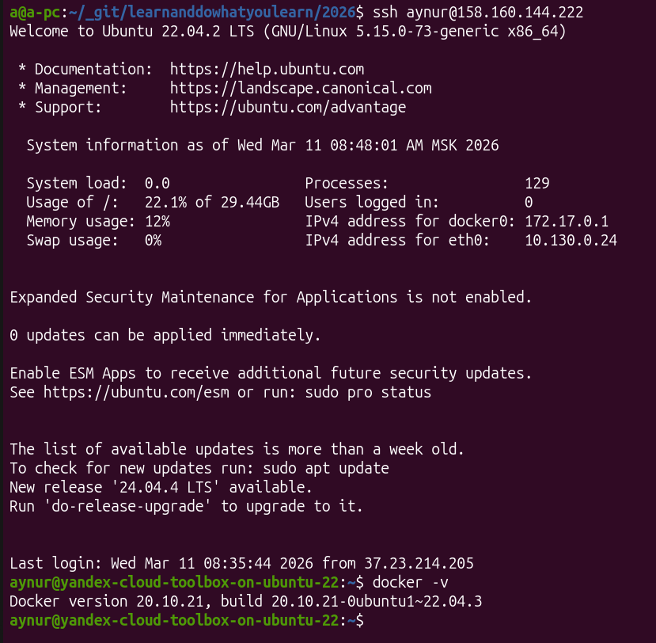
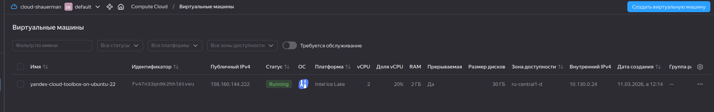

# Netology задания

## 1. «Введение в виртуализацию»

### Задача 1

## Задача 2

Выбрать тип платформы для:

1. высоконагруженная база данных MySql, критичная к отказу;

 - выделенный **физический сервер**, а не виртуальный (VPS/VDS).

    Так как в облаке у вас есть «соседи», которые могут забирать ресурсы ввода-вывода (I/O). Физический сервер дает предсказуемую производительность и прямой доступ к железу. И есть критерий выбор железа, но такого вопроса тут не было.
    .
2. различные web-приложения

    Я бы выбрала **виртуализация уровня ОС** - аждое приложение в своём контейнере, все приложения(кроме бд) могут находится на одном сервере VPS, например

3. Windows-системы для использования бухгалтерским отделом

    **Windows сервер с Hyper-V**, так как он обеспечивает:
    
      - Бэкапы («Снимки») - Перед каждым обновлением «1С» или внесением серьезных правок админ делает Snapshot (снимок системы).
      - Независимость от «железа». Если физический сервер сломается, виртуальную машину с Hyper-V можно просто скопировать на любой другой мощный компьютер или новый сервер.
      - Легкое масштабирование. Если база выросла и начала тормозить, в настройках Hyper-V можно просто «накинуть» серверу оперативной памяти или ядер процессора (если физически они есть).
      - Разделение задач (Безопасность). На одном физическом сервере через Hyper-V можно создать две разные «машины»: одну для базы данных, другую для удаленных рабочих столов (RDP), где работают люди.
      - Экономия на лицензиях. Лицензия Windows Server Standard позволяет запустить две виртуальные машины на одном физическом сервере бесплатно.Как бы получается два сервера по цене одного.
4. системы, выполняющие высокопроизводительные расчёты на GPU
  
    Выделенный **физический сервер**, для максимальной производительности одного расчета

## Задача 3

Выберите подходящую систему управления виртуализацией для сценариев:

1. 100 виртуальных машин на базе Linux и Windows, общие задачи, нет особых требований. Преимущественно Windows based-инфраструктура, требуется реализация программных балансировщиков нагрузки, репликации данных и автоматизированного механизма создания резервных копий.

Microsoft Hyper-V в связке с System Center Virtual Machine Manager (SCVMM)
- Интеграция с Windows-инфраструктурой. Управление учетными записями через Active Directory и использование привычных инструментов (PowerShell, Server Manager) упрощает администрирование 100 машин.
- Гетерогенная среда (Linux + Windows): Hyper-V отлично поддерживает Linux.
- 100 машин — это средний масштаб, с которым гипервизор справится без потери производительности.
- Репликация данных: Технология Hyper-V Replica включена в стоимость. Она позволяет асинхронно копировать виртуальные машины на резервный сервер или площадку для обеспечения катастрофоустойчивости без покупки дорогого софта.
- Балансировка нагрузки: При использовании Failover Clustering система будет автоматически перемещать виртуальные машины между узлами (Live Migration), если один из серверов перегружен или вышел из строя.
- Резервное копирование: В экосистеме Windows реализован механизм VSS (Volume Shadow Copy). Это позволяет делать «умные» бэкапы Windows-серверов (включая БД и почту) без их остановки
- Экономия на лицензиях: Лицензия Windows Server Datacenter позволяет запускать неограниченное количество виртуальных машин Windows на одном физическом узле, что при парке в 100 ВМ значительно выгоднее покупки отдельных лицензий.

2. Требуется наиболее производительное бесплатное open source-решение для виртуализации небольшой (20-30 серверов) инфраструктуры на базе Linux и Windows виртуальных машин.

Proxmox Virtual Environment (VE)
- Производительность «из коробки»:
        В основе лежит гипервизор KVM (Kernel-based Virtual Machine), который является частью ядра Linux. Это обеспечивает производительность виртуальных машин, практически равную физическому железу (особенно для Linux).
        Для Windows-машин используются драйверы VirtIO, которые позволяют системе работать с дисками и сетью на околофизических скоростях.
- Гибридность (KVM + LXC): Для Windows - KVM, Для Linux-серверов - LXC-контейнеры.
- Бесплатно
- Бэкапы: В систему уже встроена служба создания резервных копий и снимков (snapshots).
- Легкость управления через удобный веб-интерфейс

3. Необходимо бесплатное, максимально совместимое и производительное решение для виртуализации Windows-инфраструктуры.

  Hyper-V Server 2019 (с 2022 года не бесплатная) - специальная бесплатная редакция от Microsoft

4. Необходимо рабочее окружение для тестирования программного продукта на нескольких дистрибутивах Linux.

Для тестирования ПО на различных дистрибутивах Linux лучше всего подходит
виртуализация уровня ОС (Контейнеризация), а именно Docker.
Для этого в докер хабе выбираем изображения с тестируемыми истрибутивами Linux и пишем свой Dockerfile

## Задача 4

*Опишите возможные проблемы и недостатки гетерогенной среды виртуализации (использования нескольких систем управления виртуализацией одновременно) и что необходимо сделать для минимизации этих рисков и проблем. Если бы у вас был выбор, создавали бы вы гетерогенную среду или нет?*

Гомогенная (однородная) среда почти всегда лучше. Она дешевле в эксплуатации, понятнее в поддержке и надежнее при авариях. Требует меньше компетенции инженеров.

Основные проблемы и недостатки:

* Сложность управления: Администраторам нужно переключаться между разными консолями и разбираться во всех типах приложениях виртуализации.
* Разные форматы дисков: Перенос виртуальной машины (миграция) из одной среды в другую требует ещё и конвертацией форматов.
* Инженерам нужно быть экспертами сразу в нескольких технологиях.
* Приходитяс помнить, в каких местах требуется лицензия, а в каких нет, и всё это менеджить.