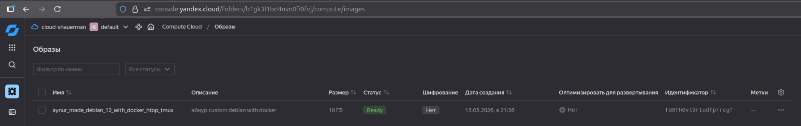
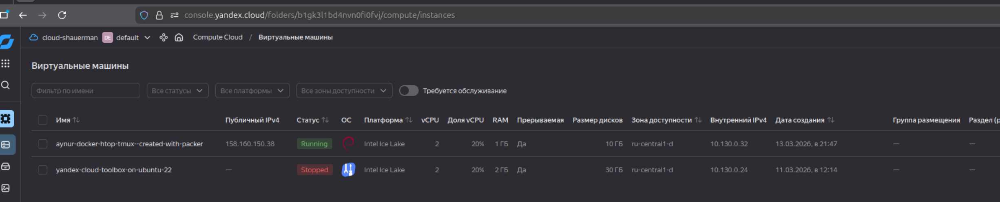

# Домашнее задание к занятию 2. «Применение принципов IaaC в работе с виртуальными машинами»

## Задача 2

* used ENV['VAGRANT_SERVER_URL'] = 'https://vagrant.elab.pro'

* `vagrant up`

* `vagrant ssh`


```
Welcome to Ubuntu 20.04.6 LTS (GNU/Linux 5.4.0-148-generic x86_64)

 * Documentation:  https://help.ubuntu.com
 * Management:     https://landscape.canonical.com
 * Support:        https://ubuntu.com/advantage

  System information as of Fri Mar 13 12:39:18 UTC 2026

  System load:              0.21
  Usage of /:               5.7% of 38.70GB
  Memory usage:             24%
  Swap usage:               0%
  Processes:                112
  Users logged in:          0
  IPv4 address for docker0: 172.17.0.1
  IPv4 address for enp0s3:  10.0.2.15
  IPv6 address for enp0s3:  fd17:625c:f037:2:a2:a1ff:fe70:a236
  IPv4 address for enp0s8:  192.168.56.11


Expanded Security Maintenance for Infrastructure is not enabled.

214 updates can be applied immediately.
148 of these updates are standard security updates.
To see these additional updates run: apt list --upgradable

89 additional security updates can be applied with ESM Infra.
Learn more about enabling ESM Infra service for Ubuntu 20.04 at
https://ubuntu.com/20-04

New release '22.04.5 LTS' available.
Run 'do-release-upgrade' to upgrade to it.


```

`vagrant@server1:~$  docker version`

```
Client: Docker Engine - Community
 Version:           28.1.1
 API version:       1.49
 Go version:        go1.23.8
 Git commit:        4eba377
 Built:             Fri Apr 18 09:52:18 2025
 OS/Arch:           linux/amd64
 Context:           default
permission denied while trying to connect to the Docker daemon socket at unix:///var/run/docker.sock: Get "http://%2Fvar%2Frun%2Fdocker.sock/v1.49/version": dial unix /var/run/docker.sock: connect: permission denied

```

`vagrant@server1:~$ docker compose version`

```
Docker Compose version v2.35.1
```

### Задача 3

`packer build -on-error=ask -debug debian_with_doker.json`

`yc compute image list`

```
+----------------------+--------------------------------------------+--------+----------------------+--------+
|          ID          |                    NAME                    | FAMILY |     PRODUCT IDS      | STATUS |
+----------------------+--------------------------------------------+--------+----------------------+--------+
| fd8fh0vl9rtudfprrcgf | aynur_made_debian_12_with_docker_htop_tmux |        | f2ed8nhicub2u3dv9tpd | READY  |
+----------------------+--------------------------------------------+--------+----------------------+--------+
```



`yc compute instance list`

```
+----------------------+---------------------------------------------+---------------+---------+----------------+-------------+
|          ID          |                    NAME                     |    ZONE ID    | STATUS  |  EXTERNAL IP   | INTERNAL IP |
+----------------------+---------------------------------------------+---------------+---------+----------------+-------------+
| fv46bbnuk853k28rbrfm | aynur-docker-htop-tmux--created-with-packer | ru-central1-d | RUNNING | 158.160.150.38 | 10.130.0.32 |
| fv47n33qn0k2hhl6tveu | yandex-cloud-toolbox-on-ubuntu-22           | ru-central1-d | STOPPED |                | 10.130.0.24 |
+----------------------+---------------------------------------------+---------------+---------+----------------+-------------+
```




`ssh aynur@158.160.150.38`

```
The authenticity of host '158.160.150.38 (158.160.150.38)' can't be established.
ED25519 key fingerprint is SHA256:v89PVzw8JKP9zMG8kJwHADenNyZBiBba4s0cgXhYw9o.
This key is not known by any other names.
Are you sure you want to continue connecting (yes/no/[fingerprint])? yes
Warning: Permanently added '158.160.150.38' (ED25519) to the list of known hosts.
Linux aynur-docker-htop-tmux--created-with-packer 6.1.0-43-amd64 #1 SMP PREEMPT_DYNAMIC Debian 6.1.162-1 (2026-02-08) x86_64

The programs included with the Debian GNU/Linux system are free software;
the exact distribution terms for each program are described in the
individual files in /usr/share/doc/*/copyright.

Debian GNU/Linux comes with ABSOLUTELY NO WARRANTY, to the extent
permitted by applicable law.

aynur@aynur-docker-htop-tmux--created-with-packer:~$ docker -v
Docker version 20.10.24+dfsg1, build 297e128

aynur@aynur-docker-htop-tmux--created-with-packer:~$ uname -a
Linux aynur-docker-htop-tmux--created-with-packer 6.1.0-43-amd64 #1 SMP PREEMPT_DYNAMIC Debian 6.1.162-1 (2026-02-08) x86_64 GNU/Linux

aynur@aynur-docker-htop-tmux--created-with-packer:~$ cat /etc/os-release 
PRETTY_NAME="Debian GNU/Linux 12 (bookworm)"
NAME="Debian GNU/Linux"
VERSION_ID="12"
VERSION="12 (bookworm)"
VERSION_CODENAME=bookworm
ID=debian
HOME_URL="https://www.debian.org/"
SUPPORT_URL="https://www.debian.org/support"
BUG_REPORT_URL="https://bugs.debian.org/"
```


