# Домашнее задание к занятию 4 «Оркестрация группой Docker контейнеров на примере Docker Compose»

## Задача 1

[https://hub.docker.com/repository/docker/aykuli/custom-nginx/general](https://hub.docker.com/repository/docker/aykuli/custom-nginx/general)


For unauthorized users: https://hub.docker.com/r/aykuli/custom-nginx

## Задача 2 Запуск контейнера с образом custom-nginx
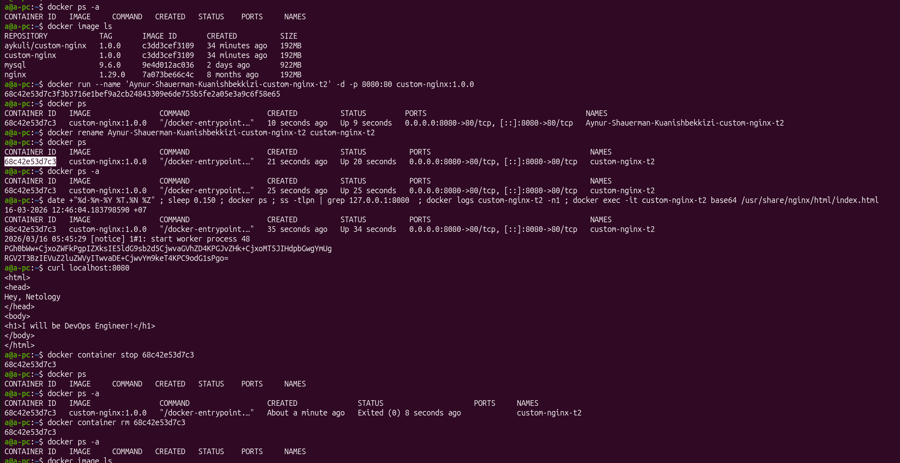

## Задача 3 Работа с изображением и контейнерами docker

3.1 подключиться к стандартному потоку ввода/вывода/ошибок контейнера "custom-nginx-t2"
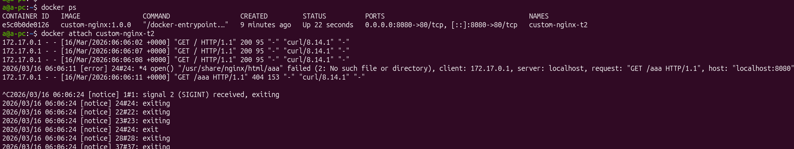
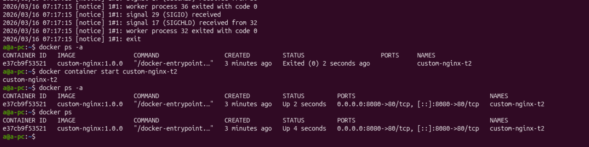

3.2 Подключилась к контейнеру в режиме `attach` и поэтому после нажатия комбинацию Ctrl-C контейнер остановился, так как в режиме `attach` команды из консоли передаются непосредственно в консоль контейнер, также как и вывод консоли контейнера мы видим непосредствеенно в консли хоста.

3.3 Установила nano внутри контейнера

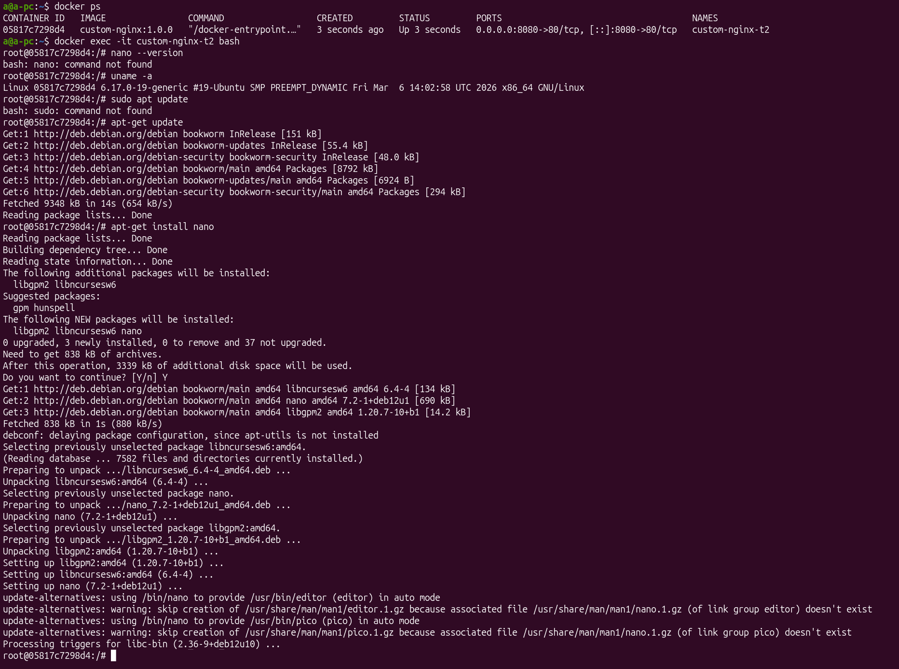

3.7 Отредактировала файл "/etc/nginx/conf.d/default.conf", заменив порт "listen 80" на "listen 81", перезагрузила `nginx` внутри контейнера, посмотрела внутри контейнера порты 80 и 81. Внутри контейнера `nginx` выдаёт на порт 81, как и следовало ожидать после изменения конфигруации `nginx`.
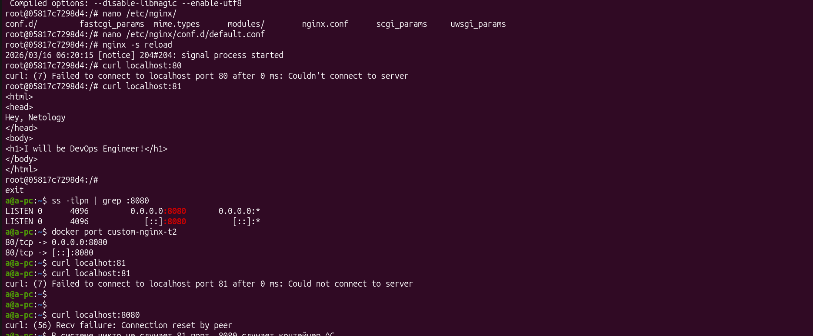

3.8 Но сам контейнер экспонирует порт 80 на 8080, но не 81. Поэтому снаружи мы не видим, что на порт 81 что-то отдаётся, а на порт 8080 отдаётся то, что контейнер отдаёт - ответ от `nginx`о том, что он не отдаёт ничего на порт 80.
Если мы сейчас пересоздадим контейнер, изменения внутри контейнера конфигурации nginx (слушание 81 порта) мы потеряем, поэтому нужно сохранить изменения в контейнере через снятие слепка его текущего состояния в новое изображение докер через команду `docker commit <container_name> <new_image_name>`

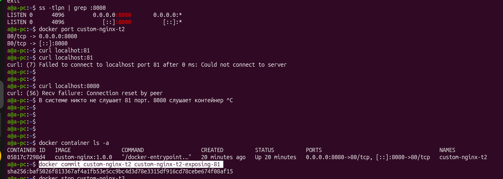

3.11 В списке изображении докера мы видим наш новый образ `c`ustom-nginx-t2-exposing-81`.

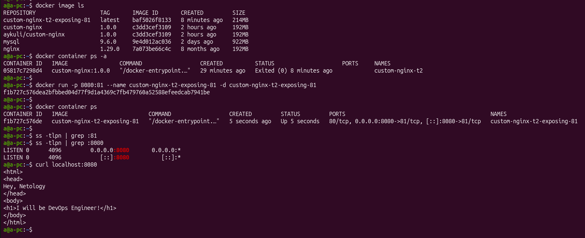

3.12 Удалить запущенный контейнер можно с ключом `forse`: `docker rm -f <container_name>`
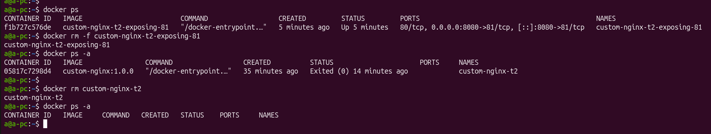

## Задача 4 volumes

Внимание: Контейнер живет ровно столько, сколько работает его основной процесс (PID 1). Если процессу нечего делать, он завершается, и контейнер переходит в статус Exited:
* Если запустить контейнер без дополнительных команд, Bash увидит, что ввода от пользователя нет (нет терминала), и мгновенно завершится.
* Контейнер остановится сразу после старта.

Поэтому:

* `tail -f /dev/null` команда бесконечно «читает» пустое устройство `/dev/null`. Эта команда никогда не завершается сама по себе и при этом практически не потребляет ресурсы процессора или памяти. Этот трюк не даёт контейнеру остановится.

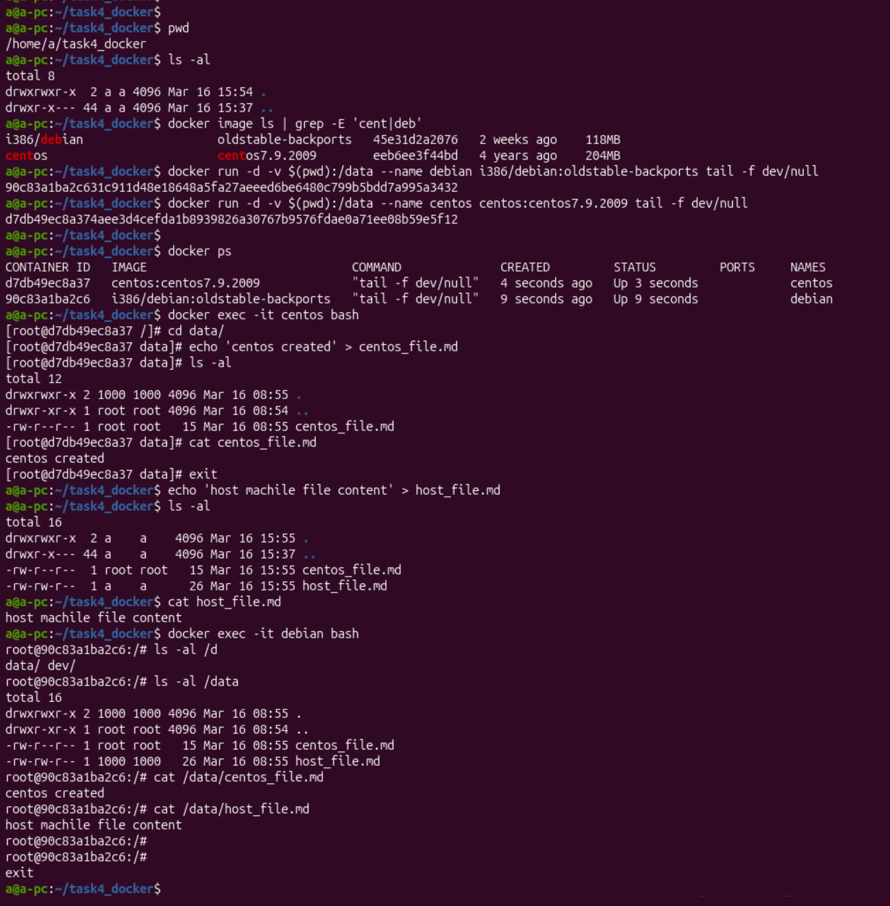

## Задача 5 docker compose

Warnings in console:

```
WARN[0000] Found multiple config files with supported names: /home/a/task4_docker/compose.yml, /home/a/task4_docker/docker-compose.yml
WARN[0000] Using /home/a/task4_docker/compose.yml
WARN[0000] /home/a/task4_docker/compose.yml: the attribute `version` is obsolete, it will be ignored, please remove it to avoid potential confusion
```

При запуске команды `docker compose up -d` запускается "compose.yaml", если не указано иначе через флаг `-f`, так как это дефолтное название файла. docker-compose.yml был дефолтным названием файла некоторое время назад, когда `docker-compose` был отдельной утилиткой, а не плагином докера, как сейчас.

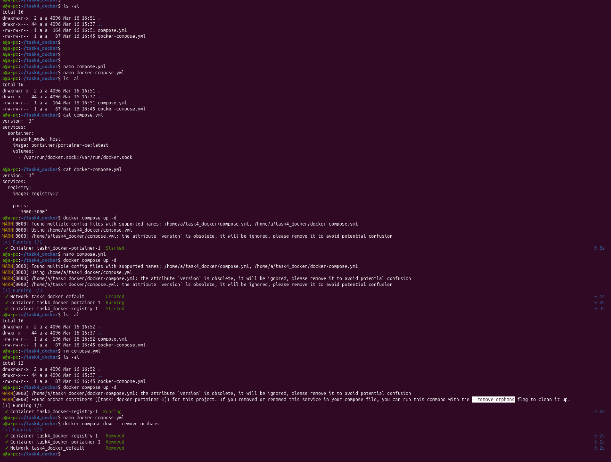
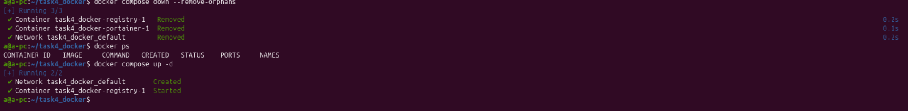
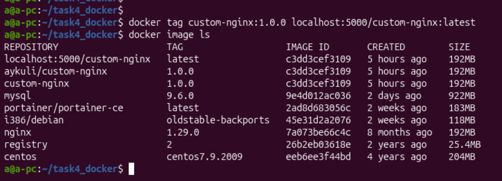

Screenshots about local registry:
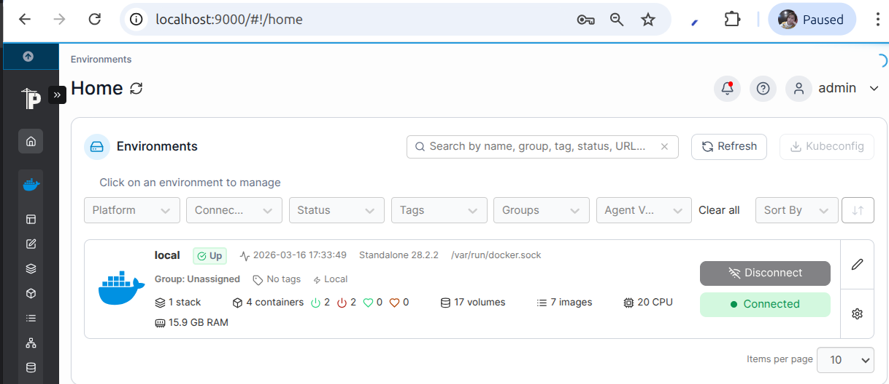
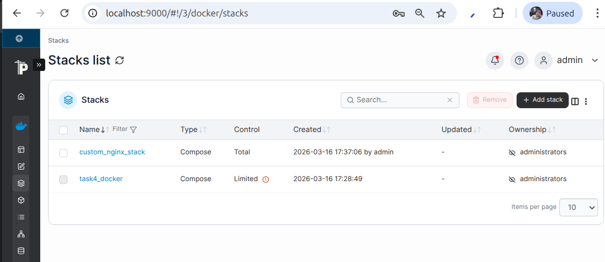
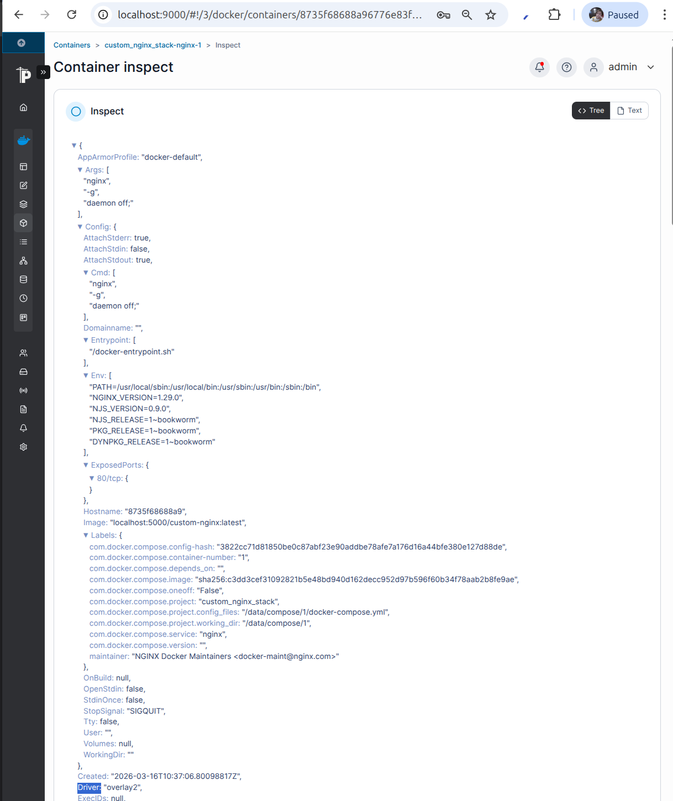
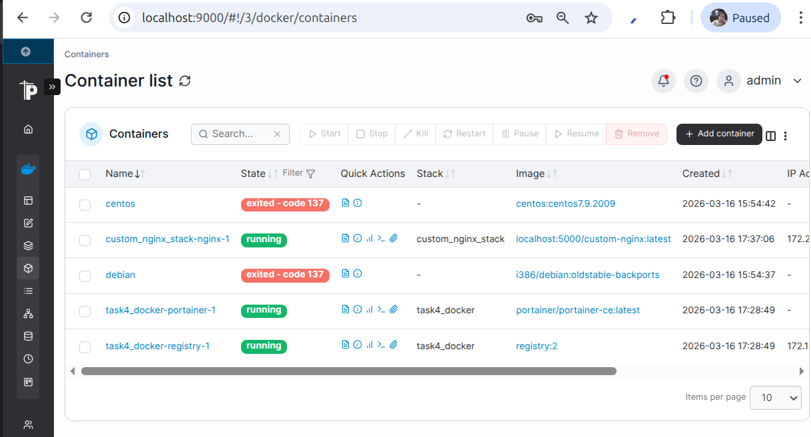


### Подробности
<details>
<summary># Задача 1: Create a docker image of custom-nginx</summary>


`$ docker build -t  custom-nginx:1.0.0 .`

`$ docker image ls`

```
REPOSITORY            TAG       IMAGE ID       CREATED          SIZE
aykuli/custom-nginx   1.0.0     c3dd3cef3109   12 minutes ago   192MB
custom-nginx          1.0.0     c3dd3cef3109   12 minutes ago   192MB
```

`$ docker run -p 8080:80 custom-nginx:1.0.0`

```
curl -v localhost:8080
* Uses proxy env variable no_proxy == 'localhost,127.0.0.0/8,::1'
* Host localhost:8080 was resolved.
* IPv6: ::1
* IPv4: 127.0.0.1
*   Trying [::1]:8080...
* Connected to localhost (::1) port 8080
* using HTTP/1.x
> GET / HTTP/1.1
> Host: localhost:8080
> User-Agent: curl/8.14.1
> Accept: */*
> 
* Request completely sent off
< HTTP/1.1 200 OK
< Server: nginx/1.29.0
< Date: Mon, 16 Mar 2026 05:16:44 GMT
< Content-Type: text/html
< Content-Length: 95
< Last-Modified: Mon, 16 Mar 2026 05:01:10 GMT
< Connection: keep-alive
< ETag: "69b78e96-5f"
< Accept-Ranges: bytes
< 
<html>
<head>
Hey, Netology
</head>
<body>
<h1>I will be DevOps Engineer!</h1>
</body>
</html>
```

`$ docker login -u aykuli`

`$ docker tag custom-nginx:1.0.0 aykuli/custom-nginx:1.0.0`

`$ docker push aykuli/custom-nginx:1.0.0`

```
The push refers to repository [docker.io/aykuli/custom-nginx]
57b49e380016: Pushed 
...
```

`$ docker image ls`

```
REPOSITORY            TAG       IMAGE ID       CREATED          SIZE
aykuli/custom-nginx   1.0.0     c3dd3cef3109   12 minutes ago   192MB
custom-nginx          1.0.0     c3dd3cef3109   12 minutes ago   192MB
```
</details>

<details>
<summary># Задача 2: Запуск моего образа</summary>

`$ docker ps -a`

```
CONTAINER ID   IMAGE     COMMAND   CREATED   STATUS    PORTS     NAMES
```

`$ docker image ls`

```
REPOSITORY            TAG       IMAGE ID       CREATED          SIZE
aykuli/custom-nginx   1.0.0     c3dd3cef3109   34 minutes ago   192MB
custom-nginx          1.0.0     c3dd3cef3109   34 minutes ago   192MB
mysql                 9.6.0     9e4d012ac036   2 days ago       922MB
nginx                 1.29.0    7a073be66c4c   8 months ago     192MB
```

`$ docker run --name 'Aynur-Shauerman-Kuanishbekkizi-custom-nginx-t2' -d -p 8080:80 custom-nginx:1.0.0`

`68c42e53d7c3f3b3716e1bef9a2cb24843309e6de755b5fe2a05e3a9c6f58e65`

`$ docker ps`

```
CONTAINER ID   IMAGE                COMMAND                  CREATED          STATUS         PORTS                                     NAMES
68c42e53d7c3   custom-nginx:1.0.0   "/docker-entrypoint.…"   10 seconds ago   Up 9 seconds   0.0.0.0:8080->80/tcp, [::]:8080->80/tcp   Aynur-Shauerman-Kuanishbekkizi-custom-nginx-t2
```

`$ docker rename Aynur-Shauerman-Kuanishbekkizi-custom-nginx-t2 custom-nginx-t2`

`$ docker ps`

```
CONTAINER ID   IMAGE                COMMAND                  CREATED          STATUS          PORTS                                     NAMES
68c42e53d7c3   custom-nginx:1.0.0   "/docker-entrypoint.…"   21 seconds ago   Up 20 seconds   0.0.0.0:8080->80/tcp, [::]:8080->80/tcp   custom-nginx-t2
```


`$ date +"%d-%m-%Y %T.%N %Z" ; sleep 0.150 ; docker ps ; ss -tlpn | grep 127.0.0.1:8080  ; docker logs custom-nginx-t2 -n1 ; docker exec -it custom-nginx-t2 base64 /usr/share/nginx/html/index.html`

```
16-03-2026 12:46:04.183798590 +07
CONTAINER ID   IMAGE                COMMAND                  CREATED          STATUS          PORTS                                     NAMES
68c42e53d7c3   custom-nginx:1.0.0   "/docker-entrypoint.…"   35 seconds ago   Up 34 seconds   0.0.0.0:8080->80/tcp, [::]:8080->80/tcp   custom-nginx-t2
2026/03/16 05:45:29 [notice] 1#1: start worker process 48
PGh0bWw+CjxoZWFkPgpIZXksIE5ldG9sb2d5CjwvaGVhZD4KPGJvZHk+CjxoMT5JIHdpbGwgYmUg
RGV2T3BzIEVuZ2luZWVyITwvaDE+CjwvYm9keT4KPC9odG1sPgo=
```


`$ curl localhost:8080`

```
<html>
<head>
Hey, Netology
</head>
<body>
<h1>I will be DevOps Engineer!</h1>
</body>
</html>
```
</details>


<details>
<summary># Задача 4: Volumes</summary>

`$ pwd`

`/home/a/task4_docker`

`$ ls -al`

```
total 8
drwxrwxr-x  2 a a 4096 Mar 16 15:54 .
drwxr-x--- 44 a a 4096 Mar 16 15:37 ..
```

`$ docker image ls | grep -E 'cent|deb'`

```
i386/debian                   oldstable-backports   45e31d2a2076   2 weeks ago    118MB
centos                        centos7.9.2009        eeb6ee3f44bd   4 years ago    204MB
```


`$ docker run -d -v $(pwd):/data --name debian i386/debian:oldstable-backports tail -f dev/null`

`90c83a1ba2c631c911d48e18648a5fa27aeeed6be6480c799b5bdd7a995a3432`

`$ docker run -d -v $(pwd):/data --name centos centos:centos7.9.2009 tail -f dev/null`

`d7db49ec8a374aee3d4cefda1b8939826a30767b9576fdae0a71ee08b59e5f12`

`$ docker ps`

```
CONTAINER ID   IMAGE                             COMMAND              CREATED         STATUS         PORTS     NAMES
d7db49ec8a37   centos:centos7.9.2009             "tail -f dev/null"   4 seconds ago   Up 3 seconds             centos
90c83a1ba2c6   i386/debian:oldstable-backports   "tail -f dev/null"   9 seconds ago   Up 9 seconds             debian
```

`$ docker exec -it centos bash`

```
[root@d7db49ec8a37 /]# cd data/
[root@d7db49ec8a37 data]# echo 'centos created' > centos_file.md
[root@d7db49ec8a37 data]# ls -al
total 12
drwxrwxr-x 2 1000 1000 4096 Mar 16 08:55 .
drwxr-xr-x 1 root root 4096 Mar 16 08:54 ..
-rw-r--r-- 1 root root   15 Mar 16 08:55 centos_file.md
[root@d7db49ec8a37 data]# cat centos_file.md 
centos created
[root@d7db49ec8a37 data]# exit
```

`$ echo 'host machile file content' > host_file.md`

`$ ls -al`

```
total 16
drwxrwxr-x  2 a    a    4096 Mar 16 15:55 .
drwxr-x--- 44 a    a    4096 Mar 16 15:37 ..
-rw-r--r--  1 root root   15 Mar 16 15:55 centos_file.md
-rw-rw-r--  1 a    a      26 Mar 16 15:55 host_file.md
```

`$ cat host_file.md`

`host machile file content`

`$ docker exec -it debian bash`

```
root@90c83a1ba2c6:/# ls -al /data
total 16
drwxrwxr-x 2 1000 1000 4096 Mar 16 08:55 .
drwxr-xr-x 1 root root 4096 Mar 16 08:54 ..
-rw-r--r-- 1 root root   15 Mar 16 08:55 centos_file.md
-rw-rw-r-- 1 1000 1000   26 Mar 16 08:55 host_file.md
root@90c83a1ba2c6:/# cat /data/centos_file.md 
centos created
root@90c83a1ba2c6:/# cat /data/host_file.md 
host machile file content
root@90c83a1ba2c6:/# 
root@90c83a1ba2c6:/# 
exit
```
</details>
