# [Домашнее задание к занятию 5. «Практическое применение Docker»](https://github.com/netology-code/virtd-homeworks/blob/shvirtd-1/05-virt-04-docker-in-practice/README.md)

## Задача 0

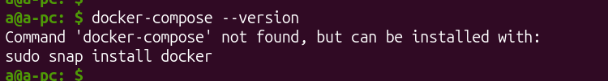

## Задача 1

[Dockerfile.python in shvirtd-example-python repository fork](https://github.com/aykuli/shvirtd-example-python/blob/main/Dockerfile.python)

```docker
# stage 1
FROM python:3.12-slim AS builder

#  Ваш код здесь #
WORKDIR /app
COPY . .
RUN pip install --no-cache-dir --prefix=/install -r requirements.txt

# stage 2
FROM python:3.12-slim
WORKDIR /app
COPY --from=builder /install /usr/local

EXPOSE 5000

# Запускаем приложение с помощью uvicorn, делая его доступным по сети
CMD ["uvicorn", "main:app", "--host", "0.0.0.0", "--port", "5000"] 
```
### Создание докер образа из файла Dockerfile.python

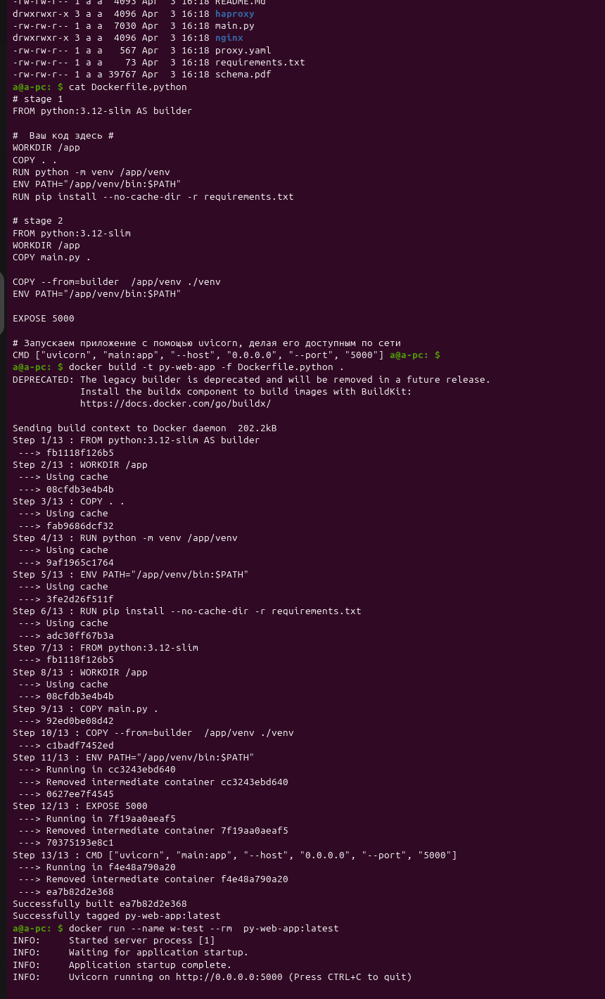

## Задача 2


Результат сканирования запуленного образа в консоли:

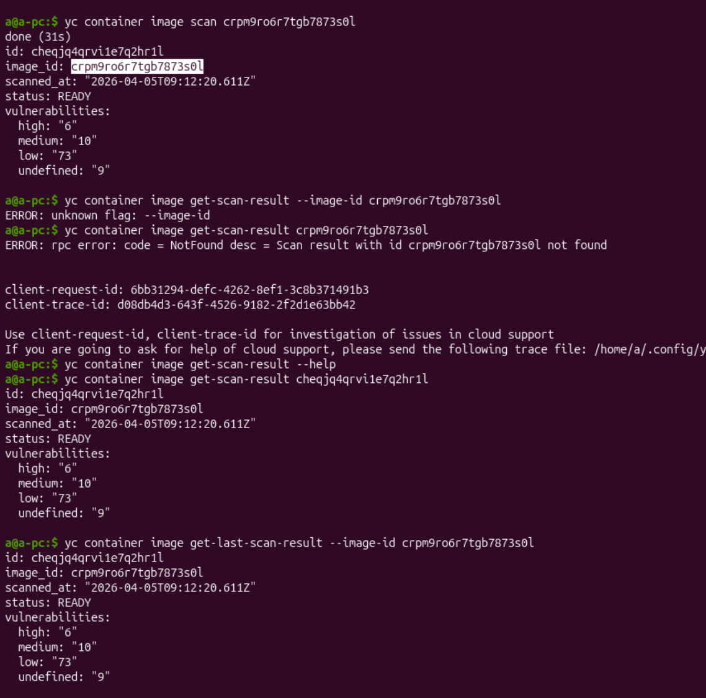

Посмотрла в web ui yandex cloud (моя таймзона сейчас UTC+7):

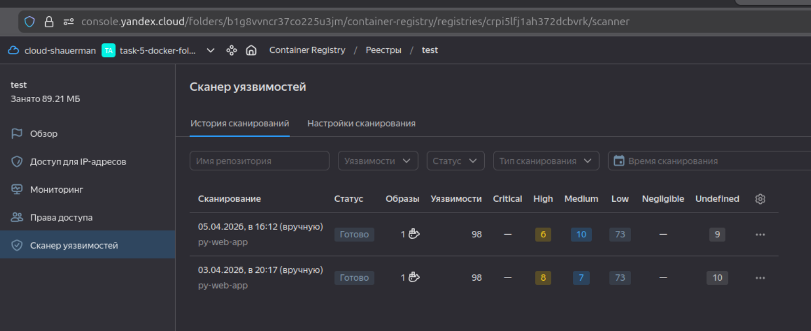

## Задача 3

1. [`compose.yml` в форкнутой репе `shvirtd-example-python`](https://github.com/aykuli/shvirtd-example-python/blob/main/compose.yml)

<details>
<summary>compose.yml</summary>

```yml

include:
  - proxy.yaml

services:
  web:
    image: cr.yandex/crpi5lfj1ah372dcbvrk/py-web-app:1.0.0
    build:
      context: .
      dockerfile: Dockerfile.python
    restart: always
    depends_on:
      - db
    ports:
      - 5000:5000
    environment:
      - DB_HOST=db
      - DB_USER=${MYSQL_USER}
      - DB_PASSWORD=${MYSQL_PASSWORD}
      - DB_NAME=${MYSQL_DATABASE}
    networks:
      backend:
        ipv4_address: 172.20.0.5

  db:
    image: mysql:8
    restart: always
    env_file:
      - .env
    networks:
      backend:
        ipv4_address: 172.20.0.10
```
</details>


`docker compose config`


2. Запуск сервисов


3. Подключение к локальной БД mysql

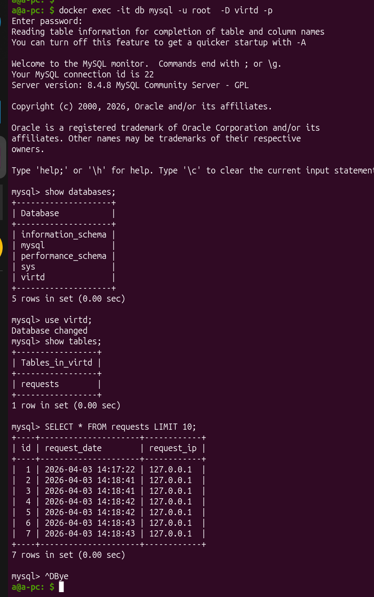

4. Остановка сервисов

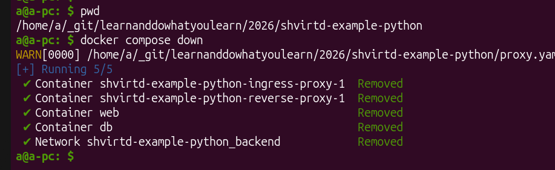


## Задача 4

1. Моя машинка

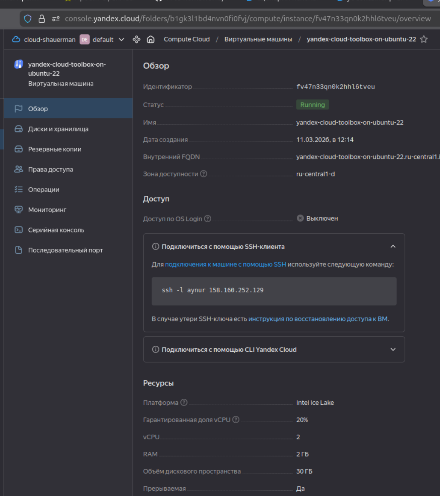

2. Docker, git, compose на месте:


Добавила адрес ВМ как разрешённый в test registry in yc:
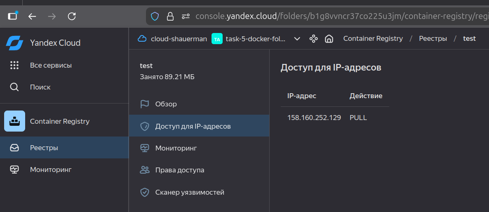

Пришлось делать ещё телодвижения, такие как:
* Docker compose не запускался. Оказалось root пользователь не знаeт про docker-compose плагин. Скопировала плагин от пользователя, под которым захожу в  `/usr/local/lib/`, и наконец заработало.

```bash
sudo mkdir -p /usr/local/lib/docker/cli-plugins
sudo cp ~/.docker/cli-plugins/docker-compose /usr/local/lib/docker/cli-plugins/
```

3. bash-скрипт запуска приложения:

Скрипт [deploy.sh находитсч в форкнутой репе `shvirtd-example-python`](https://github.com/aykuli/shvirtd-example-python/blob/main/deploy.sh)

<details>
<summary>deploy.sh content</summary>

```bash
#!/bin/bash

# Прекращаю выполнение при любой ошибке
set -e

REPO_URL="https://github.com/aykuli/shvirtd-example-python.git"
TARGET_DIR="/opt/web-py-app"

echo "1. Клонирование репозитория в $TARGET_DIR ---"

# Проверяю, существует ли папка. Если да — удаляю, чтобы скачать свежую версию
if [ -d "$TARGET_DIR" ]; then
    echo "Папка $TARGET_DIR уже существует. Обновляю содержимое..."
    sudo rm -rf "$TARGET_DIR"
fi

git clone $REPO_URL $TARGET_DIR

echo "2. Запуск Docker Compose ---"

# Переходим в папку проекта
cd $TARGET_DIR

# Запускаем сборку и контейнеры в фоновом режиме
docker compose up -d

echo "3. Проверка запущенных контейнеров ---"
docker compose ps
```
</details>

Запуск deploy.sh скрипта:


4. Проверка http подключений к приложению через https://check-host.net/check-http

Куча запросов отовсюду - проверяю работу приложения и инфраструктуры:


Записи об этом в бд в табличке:


5. Docker remote ssh context


Можно даже внутрь контейнеров заходить на удалённом сервере, просто восторг!:
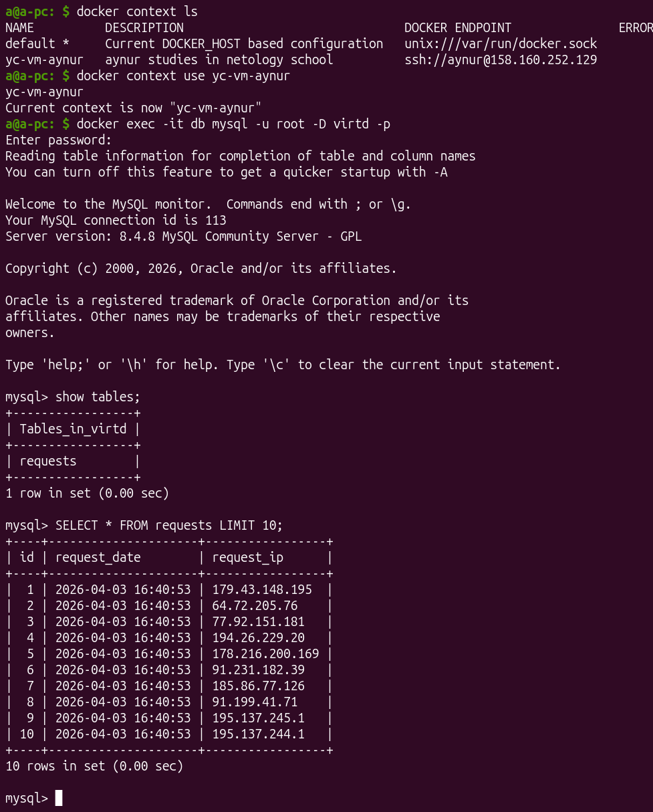

## Задача 5

1. Написала скрипт резервного копирования [backup.sh (сохранила в форкнутую репу `shvirtd-example-python`)](https://github.com/aykuli/shvirtd-example-python/blob/main/backup.sh)

<details>
<summary>backup.sh</summary>

```bash
#!/bin/bash

# 1. Определяю нужные переменные
DOCKER_BIN="/usr/bin/docker"
NETWORK_NAME='web-py-app_backend'
DEST_DIR='/opt/backup'
BACKUP_HOST='db'
DB_USER='root'

TARGET_DIR="/opt/web-py-app"

# 2. Перехожу в папку проекта, где лежит .env файл
cd $TARGET_DIR || exit 1

# 3.Загружу переменные из .env файла
set -a
. "${TARGET_DIR}/.env"
set +a

if [ -f "${DEST_DIR}/dump.sql" ]; then
  if [ -f "${DEST_DIR}/dump.sql.old" ]; then
      rm "${DEST_DIR}/dump.sql.old"
  fi
  mv "${DEST_DIR}/dump.sql" "${DEST_DIR}/dump.sql.old"
fi

echo "$(date): Начало резервного копирования..."

# note schnitzler/mysqldump образ использует MariaDB. С MySQL 8.0+, аутентификация по умолчанию -  caching_sha2_password.
# Базовый MariaDB клиент в schnitzler/mysqldump не включает в себя специфический файл для включения этой функциональности. 
# mariadb-connector-c добавляет этот файл.
$DOCKER_BIN run --rm   --entrypoint "/bin/sh" -v "${DEST_DIR}":/backup --network="${NETWORK_NAME}" schnitzler/mysqldump:3.18 -c "apk add --no-cache mariadb-connector-c && mysqldump -h "${BACKUP_HOST}" -u "${DB_USER}" -p"${MYSQL_ROOT_PASSWORD}" "${MYSQL_DATABASE}" > /backup/dump.sql"

# 3. Радуюсь полученному результату:
if [ $? -eq 0 ]; then
  echo "$(date): Завершено успешно!"
  echo '---------------------'
  echo 'Результирующие файлы:'
  ls -al ${DEST_DIR}
else
    echo "$(date): ОШИБКА!"
fi

echo "--------------------------------------"
```


</details>

2. Рукопашный запуск скрипта резервного копирования

Я сохранила `backup.sh` файл в форкнутом репозиторий `shvirtd-example-python`, который склонировала в свой ВМ в папку `/opt/web-py-app` в предыдущем шаге создания скрипта `deploy.sh`.
Креды берутся из .env файла в папке с pyhton приложением.

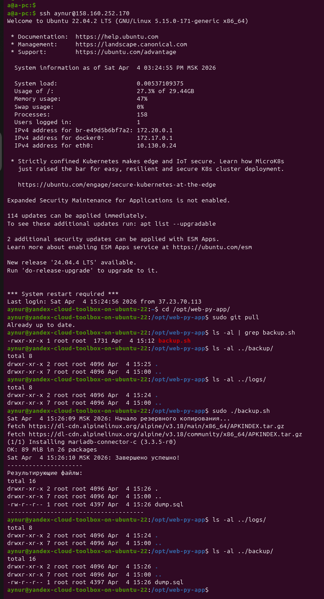

3. crontab

Записываю в контаб строку:

```bash
* * * * * /bin/bash /opt/web-py-app/backup.sh >> /opt/logs/backup.log 2>&1
```

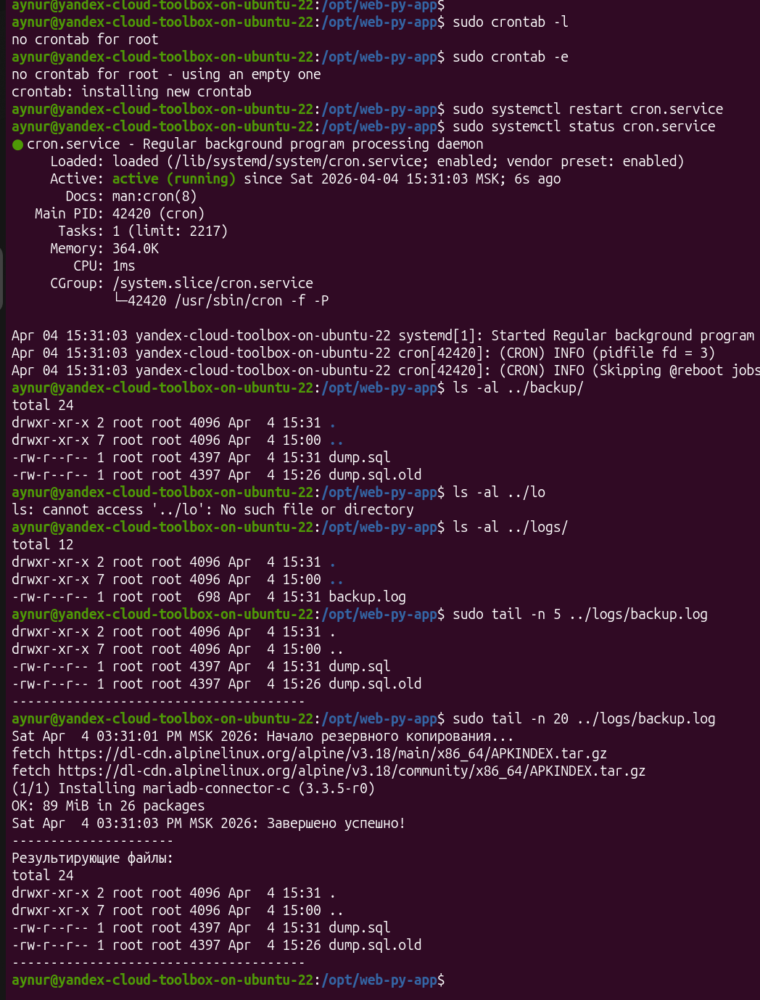

## Задача 6

Спулила образ hashicorp/terraform:latest и открыла его через `dive`:

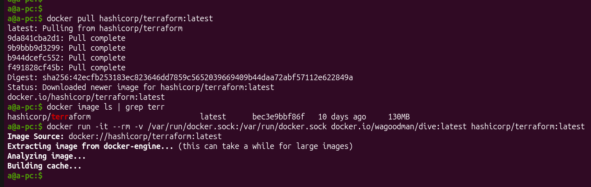

Так выглядит в `dive`:
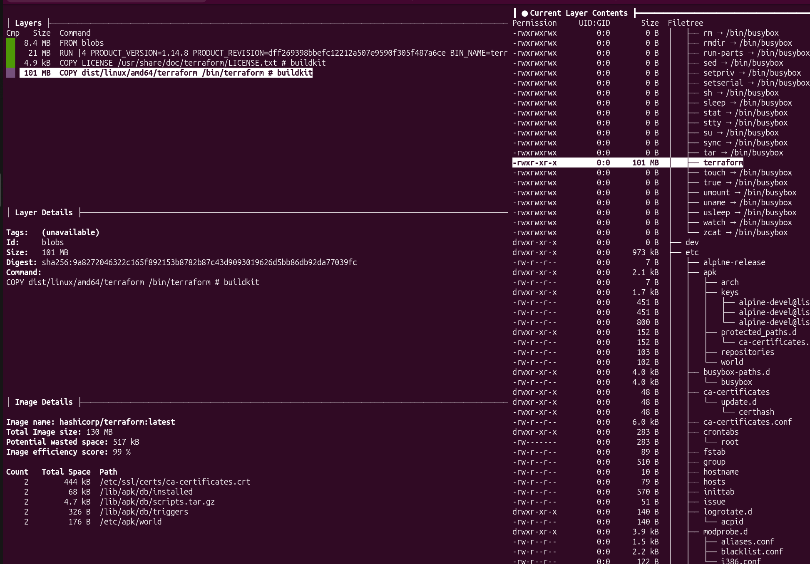

Сохраняю слой, разархивировываю и нахожу нужный файл `/bin/terraform`:
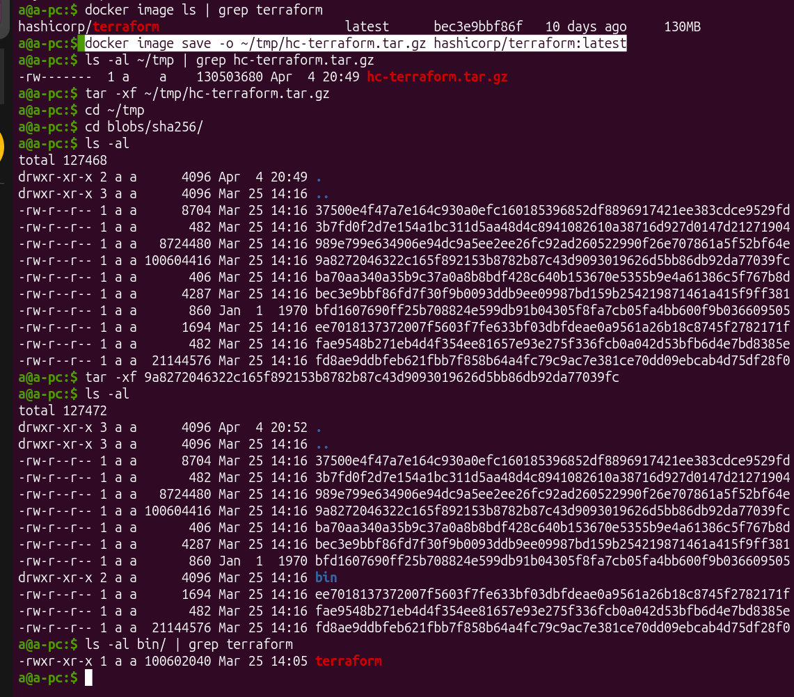

## Задача 6.1

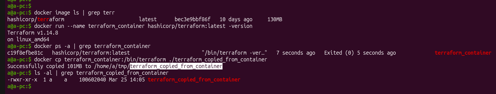

## Задача 6.2 (**)

1. Написала Dockerfile простой 2-стейжовый:
```
FROM hashicorp/terraform:latest AS builder

FROM scratch
COPY --from=builder /bin/terraform /terraform-binary
```

2. Использовала docker build --output:

```
DOCKER_BUILDKIT=1 docker build --output type=local,dest=./out .
```

* `DOCKER_BUILDKIT=1` даёт команду использовать тот engine докера, который умеет `--output` - флаг, который работает только в BuildKit (docker v23.0+)

* `--output type=local,dest=./out` - говорит - `type=local` - не архивируй файлы, положи как есть в папку `out`
* `.` - это контекст текущей папки - докер будет искать Dockerfile в текущем каталоге. 

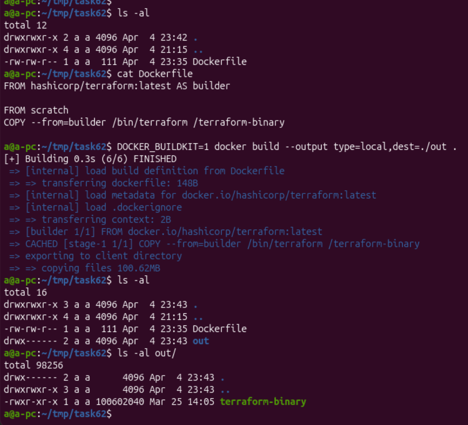

## Задача 7 (***)

1. Надо сгенерировать конфигурационный файл командой `runc spec` в папке монтирования (папка, в которой будет `rootfs`).

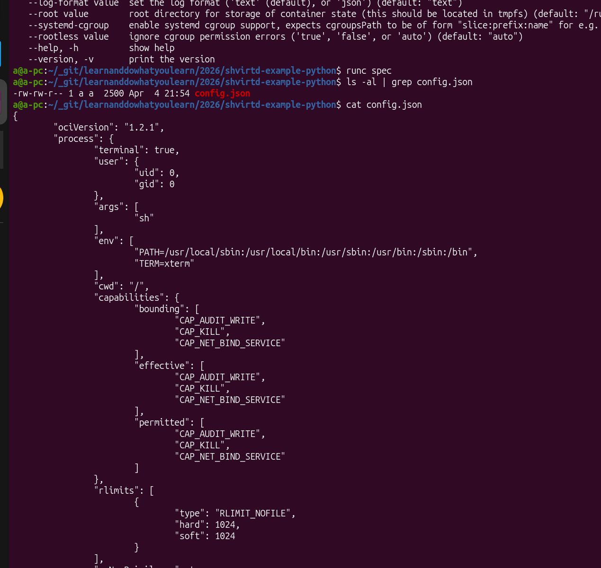
 
Появился файл [`config.json` - сохранила в форкнутой репе `shvirtd-example-python`](https://github.com/aykuli/shvirtd-example-python/blob/main/config.json)

Изменила некотые поля:

* в `args` пишу команды запуска приложения (скопировала из Dockerfile.python)
```
"args": [
  "uvicorn", "main:app", "--host", "0.0.0.0", "--port", "5000"
],
```

и переменные окружения соотвественно

```
"env": [
			"PATH=/usr/local/sbin:/usr/local/bin:/usr/sbin:/usr/bin:/sbin:/bin:/app/venv/bin",
			"PYTHONPATH=/usr/local/lib/python3.10/site-packages",
			"DB_HOST=172.20.0.10",
			"DB_USER=app",
			"DB_PASSWORD=QwErTy1234",
			"DB_NAME=virtd"
],
```

Для упрощения удалила из namespaces

```
"namespaces": [
  ...
  {
    "type": "network"
  },
```
так, что контейнер будет использовать `network` хостовой машины и будет отдавать в 5000 порт локальной моей машины.

В compose.yml закомментила сервис web, и запустила остальные контейнеры

2. Приготовила `rootfs` системы будущего контейнера.

Скорее скопировала, чем создала: у меня уже есть контейнер с `web` приложением, решила не заморачиваться и скопировала файловую систему этого контейнера в создаваемый через `runC` - там ест всё уже, и система, и библиотеки, и само приложение:

```
docker export web | tar -C ./rootfs/ -xf -
```

3. Запустила контейнер через `runc`:

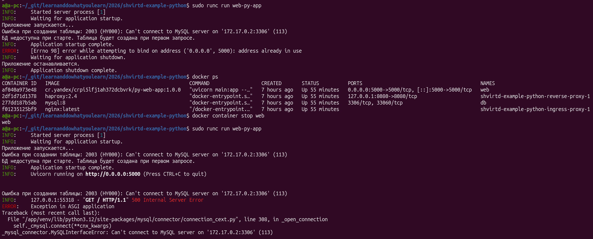

Попробовала сделать `curl -L http://127.0.0.0:5000` из другого терминала, приложение говорит, что связи с бд нету. Прописала правильный IP бд, и связь с бд появилась.

Посмотрела `docker inspect db` - совпадает с прописанным в `compose.yml`.
```
"Networks": {
  "shvirtd-example-python_default": {
    ...
      "IPAddress": "172.20.0.10",
    ...
  }
}
```

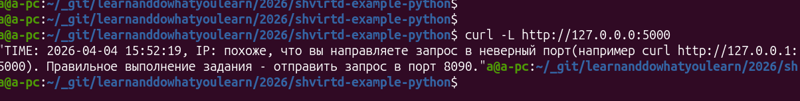
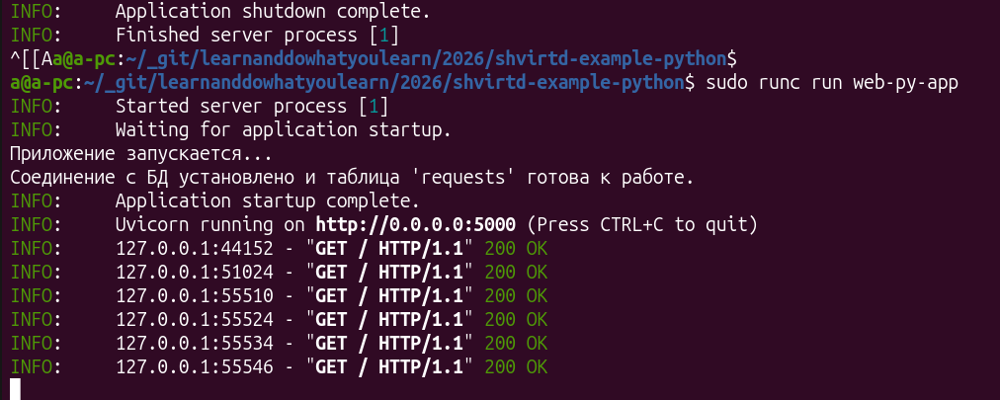

Запросы идут, приложение получает запросы, но нет связи с прокси сервером, поэтому в таблице `requests` колонка `request_ip` имеет значение `NULL`:
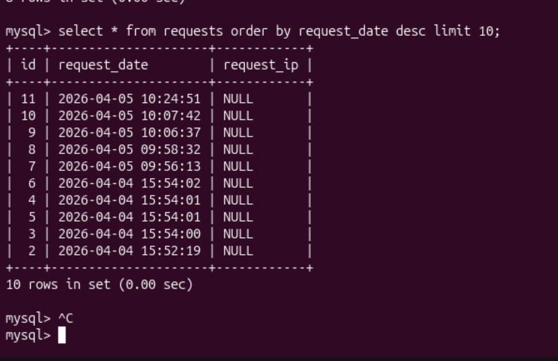

Я пыталась настроить `network`, где `path` - это `"NetworkSettings": { ..."SandboxKey": "/var/run/docker/netns/bfb47333b56d",...}` из `docker inspect shvirtd-example-python-reverse-proxy-1`

```
{
  "namespaces": [
  ...
  {
    "type": "network",
    "path": "/var/run/docker/netns/bfb47333b56d"
  }
}
```
Но у меня не получилось пока настроить связь с `reverse-proxy`.

