# [Домашнее задание к занятию 6. «Оркестрация кластером Docker контейнеров на примере Docker Swarm»](https://github.com/netology-code/virtd-homeworks/tree/shvirtd-1/05-virt-05-docker-swarm)

## Задача 1

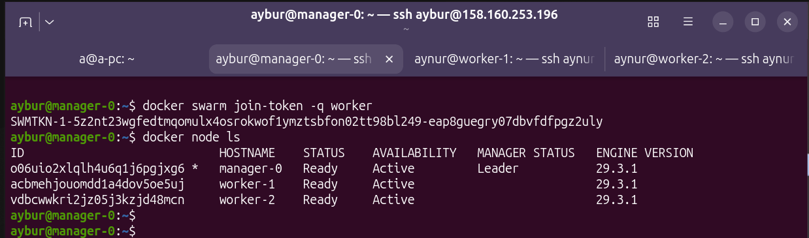
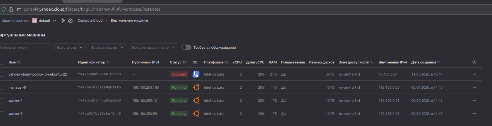

## Задача 2
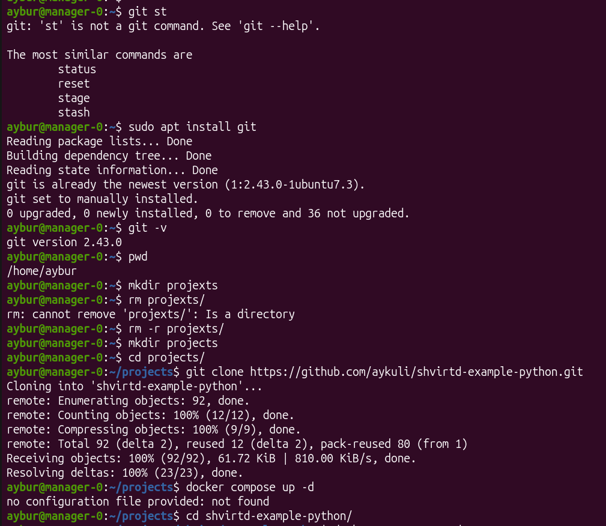
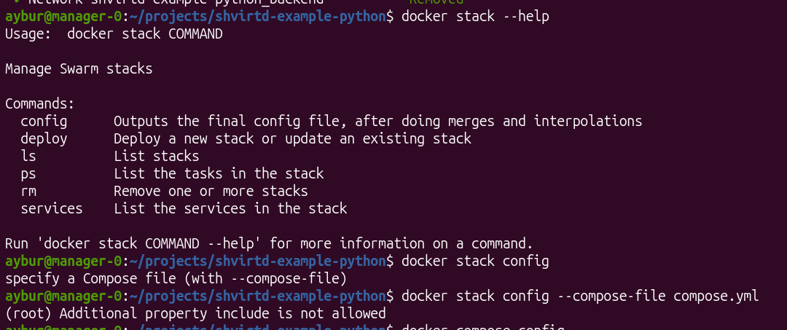
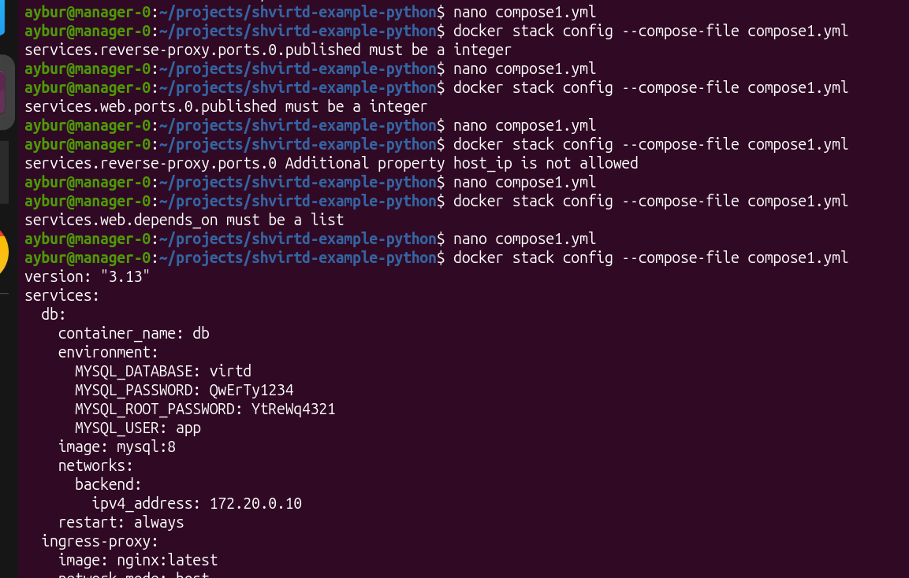
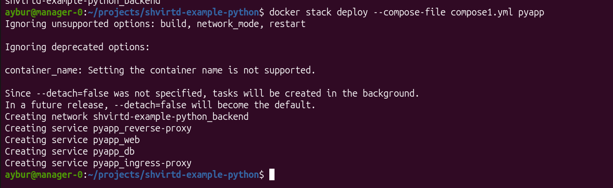
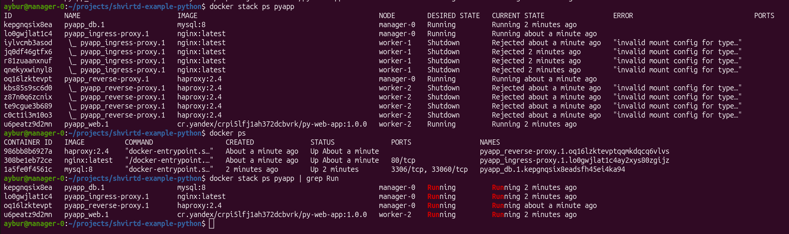
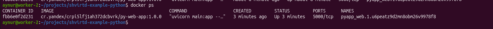

Останавливаю один из воркеров - стресс тестирование:

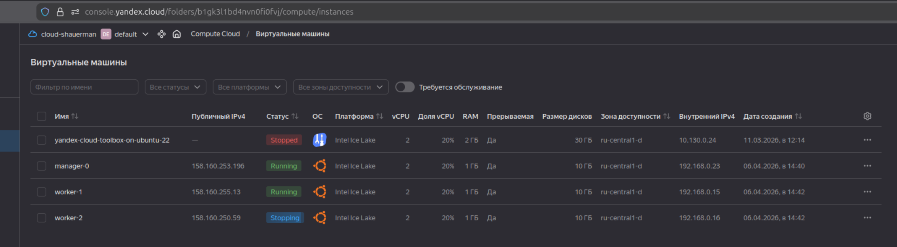
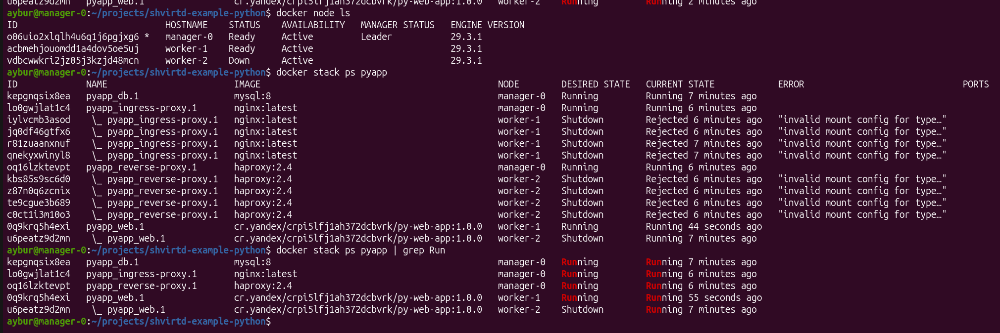
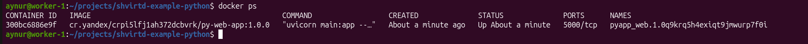

