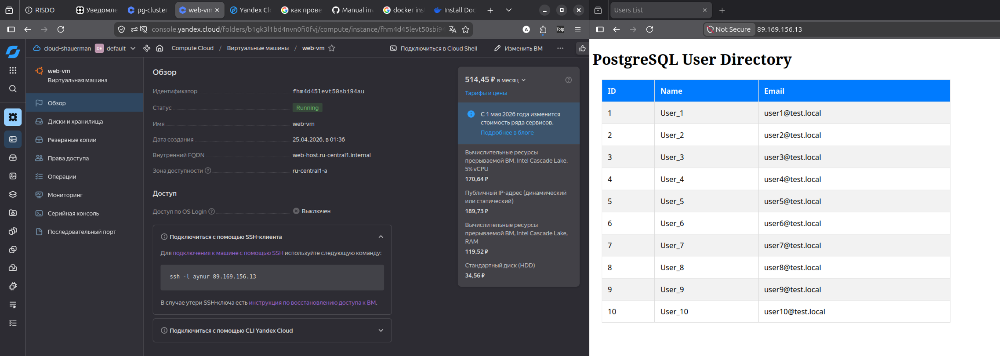

# Итоговый проект модуля «Облачная инфраструктура. Terraform»

## Задание 1. Развертывание инфраструктуры в Yandex Cloud

* Создание Virtual Private Cloud (VPC)

Вот такая схема нарисовала с `Terraform Graph` расширением `VSCode`:


В первый раз получилось поднять систему (режистри был ещё впереди):


Настроила ДНС - доменное имя ссылается на мой стаический IP адрес в Яндекс Облаке.


Создайте подсети.
Создайте виртуальные машины (VM):

    Настройте группы безопасности (порты 22, 80, 443).
    Привяжите группу безопасности к VM.

Опишите создание БД MySQL в Yandex Cloud.
Опишите создание Container Registry.

Я испытывала трудности с понимаеием сетей, сидра
последовательностью создаваемых ресурсов
Я перепутала в dynamic переменные ingress/egress и страдала из-за этого.

```bash
# Проверка самого файла на ошибки форматирования
cloud-init schema --config-file cloud-init.yml
```

проверка того, как прошёл клауд-инит:
```
sudo cat /var/log/cloud-init-output.log
```

С сертификатами я боролась врукопашную, еле настроила. Боюсь, сейчас уберу и опять буду столько мучиться. Раз получилось, пусть лежит красиво.

 docker run -it --rm --name certbot \
 -v "/etc/letsencrypt:/etc/letsencrypt" \
 -v "/var/lib/letsencrypt:/var/lib/letsencrypt" \
 -p 80:80 \
 certbot/certbot certonly --standalone -d mymeddata.ru -d www.mymeddata.ru

Сначала валидирую с флагом --dry-run, а затем без этого флага запускаю и уже генериуютс сертификаты.

Regisrty:
* на ВМ установила и настроила yc к папке,  кторой ведётся работа:
```bash
$ curl -sSL https://storage.yandexcloud.net/yandexcloud-yc/install.sh | bash
$ yc init # и мнипуляции с OAuth token и настройка
$ yc container registry configure-docker
docker configured to use yc --profile "default" for authenticating "cr.yandex" container registries
Credential helper is configured in '/home/aynur/.docker/config.json'

$ cat ~/.docker/config.json 
{
  "credHelpers": {
    "container-registry.cloud.yandex.net": "yc",
    "cr.cloud.yandex.net": "yc",
    "cr.yandex": "yc"
  }
}
```

2. Сборка образа (Build)
Чтобы Docker знал, куда отправлять образ, при сборке нужно указать полный путь к репозиторию в качестве тега: 
bash

# Формат: cr.yandex/<ID_реестра>/<имя_образа>:<тег>
docker build -t cr.yandex/crp123abc456.../my-app:v1 .

Use code with caution.

    ID реестра можно узнать командой yc container registry list.
    Точка (.) в конце указывает на текущую директорию, где лежит ваш Dockerfile. 

3. Отправка в Registry (Push)
После успешной сборки используйте команду push: 
bash

docker push cr.yandex/crp123abc456.../my-app:v1
### Источники
* [ЯО VPC понимается сеть ...](https://habr.com/ru/companies/yandex/articles/487694/)
* [Cетевые сервисы](https://yandex.cloud/ru/docs/vpc/concepts/)
* [Сертификат от Let's Encrypt](https://yandex.cloud/ru/docs/certificate-manager/concepts/managed-certificate)