# Итоговый проект модуля «Облачная инфраструктура. Terraform»


## 0. Репозиторий

1. [Репозиторий(папка) с кодом инфраструктуры](https://github.com/aykuli/learn-and-do-what-you-learn/tree/terraform-final/2-module-terraform/final_task/src)
2. [Репозиторий с кодом веб-приложения](https://github.com/aykuli/terr-final-web-app/blob/master/app.rb)
3. [Приложение mymeddata.ru - просто список пользователей отдаёт](https://mymeddata.ru/)

## Содержание

[Задание 1. . Развертывание инфраструктуры в Yandex Cloud](#задание-1-развертывание-инфраструктуры-в-yandex-cloud)

  |--- [1.1 Ресурсы в VPC](#11-ресурсы-создаваемые-в-virtual-private-cloud-vpc)

  |--- [1.2 Ресурсы в Cloud DNS](#12-cloud-dns)
  
  |--- [1.3 Создание виртуальной машины в Compute Cloud](#13-создание-виртуальной-машины-в-compute-cloud)

  |--- [1.4 Создание кластера PostgreSQL](#14-создание-кластера-postgresql)

  |--- [1.5 Создание Container Registry](#15-создание-container-registry)

[Задание 2 Установка Docker при первичной загрузке ВМ через cloud-init.yaml](#задание-2-установка-docker-при-первичной-загрузке-вм-через-cloud-inityaml)

[Задача 3. Dockerfile и сохранение его образа в Container Registry](#задача-3-dockerfile-и-сохранение-его-образа-в-container-registry)

[ Задание 4. Веб приложение работает с БД в Yandex Cloud.](#задание-4-веб-приложение-работает-с-бд-в-yandex-cloud)

[Задание 5*. LockBox](#задание-5-lockbox)

[Трудности](#трудности) 

[Источники](#источники)

## Задание 1. Развертывание инфраструктуры в Yandex Cloud

Схема базовых частей инфраструктуры, сгенерированная с помощью расширения Terraformer для VSCode IDE. Схема урезанная, почему-то всё рисовать не хочет.
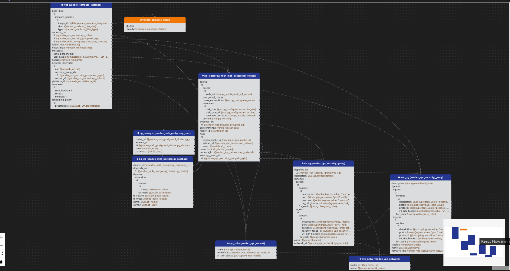

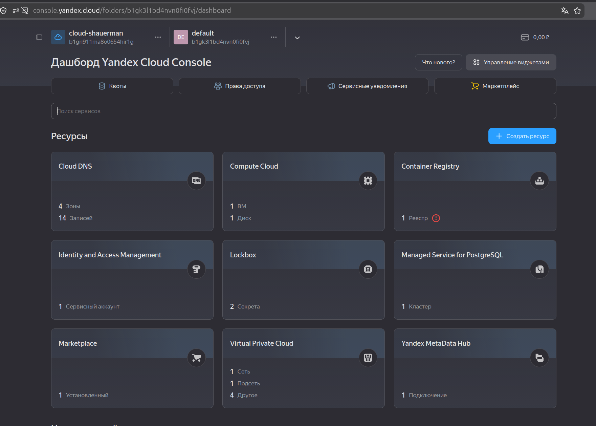

Рисунок 1 - Схема. сгенерироанная с расширением `Terraform Graph` в IDE `VSCode`:

### 1.1. Ресурсы, создаваемые в Virtual Private Cloud (VPC)

Находятся в файле [vpc.tf](./src/vpc.tf)

Структуру я создавала по иерархии зависимостей и вложенности.
* [vpc_network](https://vscode.dev/github/aykuli/learn-and-do-what-you-learn/blob/terraform-final/2-module-terraform/final_task/src/vpc.tf#L8) - сеть, она ни от чего не зависит и ни во что не вложена.
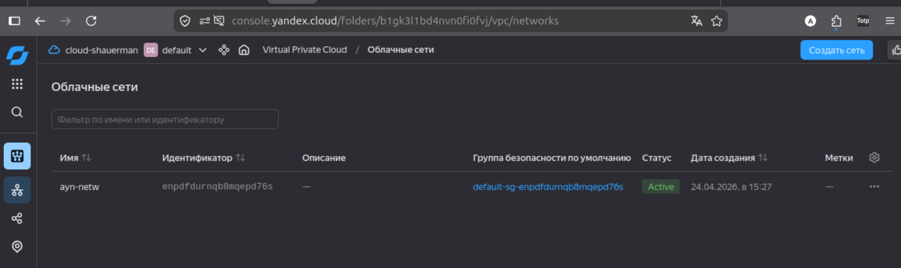

* [vpc_subnet](https://vscode.dev/github/aykuli/learn-and-do-what-you-learn/blob/terraform-final/2-module-terraform/final_task/src/vpc.tf#L13)  - дочерняя сущность от `vpc_network`, подсеть вложена в сеть.
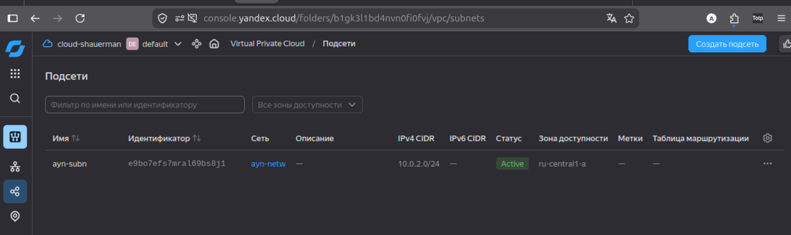

* [vpc_security_group](https://vscode.dev/github/aykuli/learn-and-do-what-you-learn/blob/terraform-final/2-module-terraform/final_task/src/vpc.tf#L19)
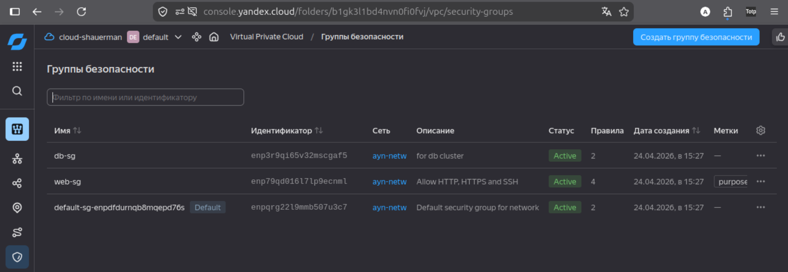

Группы безопасности я решила создать отдельно для web приложения (`web_sg`) и кластера базы данных (`db_sg`), так как поведение этиъ двух машин разное в сети должно быть:

  * `web` - принимает запросы хоть откуда по портам 80, 443- должен иметь публичный адрес, должна быть возможность зайти под SSH по порту 22
  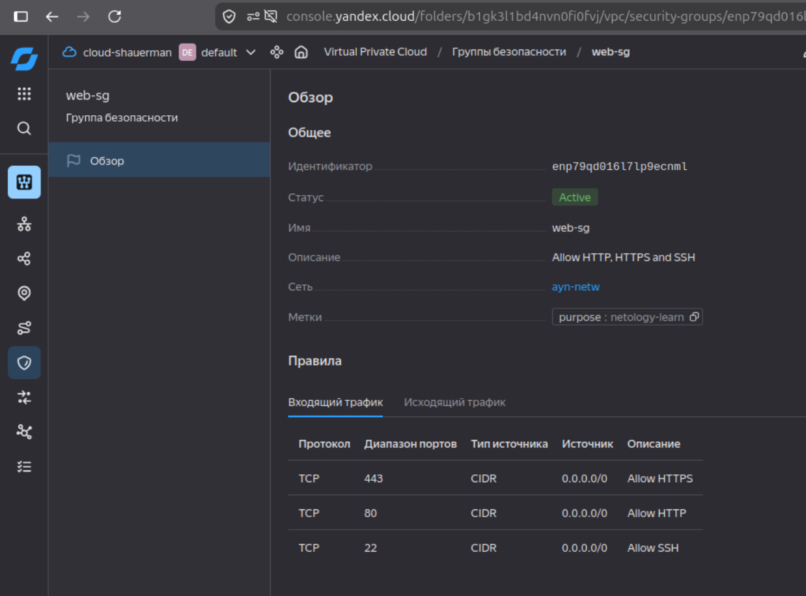

  * `db` - должен быть максимально защищён, принимает запросы только от веб приложения по порту для БД.
  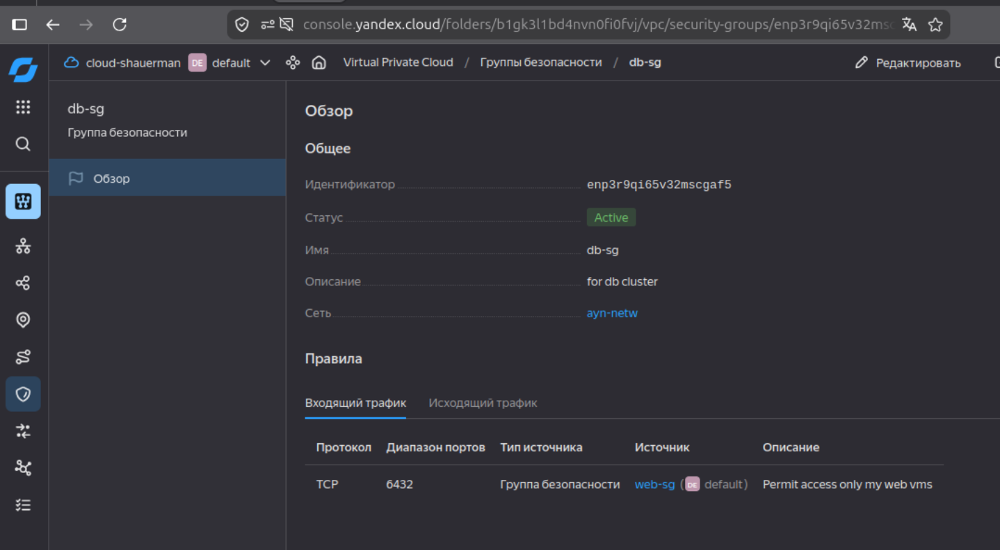

* [vpc_address](https://vscode.dev/github/aykuli/learn-and-do-what-you-learn/blob/terraform-final/2-module-terraform/final_task/src/vpc.tf#L1). Решила взять статический адрес, позже привязываю его к доменному имени mymeddata.ru.

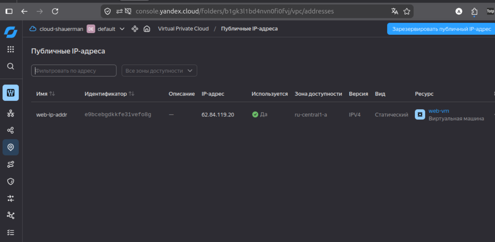

### 1.2 Ресурсы в Cloud DNS

Ресурсы DNS находятся в файле [dns.tf](./src/dns.tf)

Здесь я сделала привязку моего доменного имени [https://mymeddata.ru/)](https://mymeddata.ru/) к зарезервированному IP адресу.

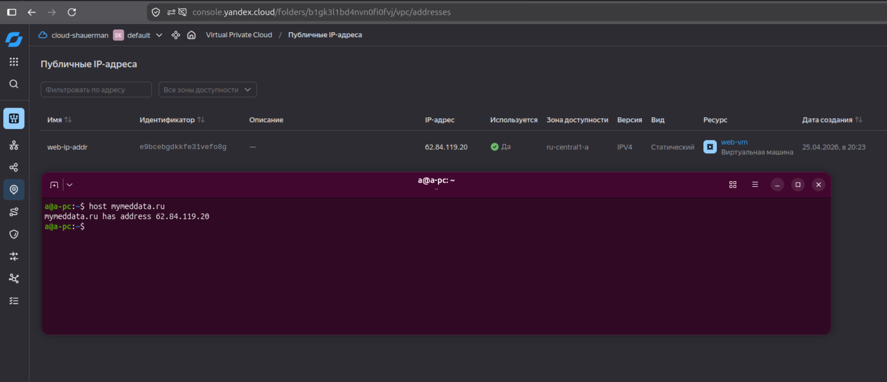
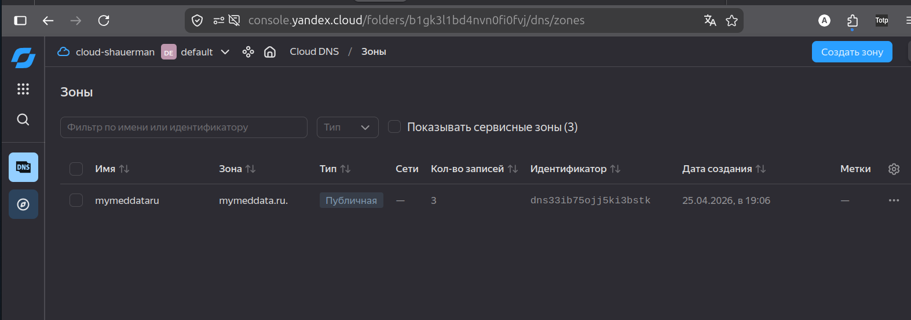
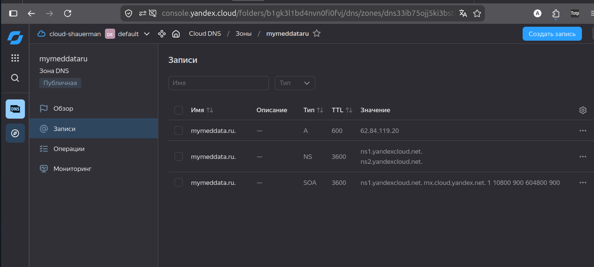


DNS я создала из веб интерфейса, только изучив, нашла, как можно было бы создать в `terraform`.

Однако в state проекта хотелось добавить `yandex_dns_zone` и его `recordsets`, поэтому я их импортировала командой:

```
terraform import <resourse_type> <resource_id> -o generated.tf
```

и получилось что-то такое:
<details>
<summary> imported dns resorces terraform generated code </summary>

Это я потом их пересоздала, чтобы в коде [dns.tf](./src/dns.tf) красиво было.


```bash
# __generated__ by Terraform
# Please review these resources and move them into your main configuration files.

# __generated__ by Terraform from "dns33ib75ojj5ki3bstk/mymeddata.ru./SOA"
resource "yandex_dns_recordset" "rs_soa" {
  data        = ["ns1.yandexcloud.net. mx.cloud.yandex.net. 1 10800 900 604800 900"]
  description = null
  name        = "mymeddata.ru."
  ttl         = 3600
  type        = "SOA"
  zone_id     = "dns33ib75ojj5ki3bstk"
}

# __generated__ by Terraform from "dns33ib75ojj5ki3bstk/mymeddata.ru./NS"
resource "yandex_dns_recordset" "rs_ns" {
  data        = ["ns1.yandexcloud.net.", "ns2.yandexcloud.net."]
  description = null
  name        = "mymeddata.ru."
  ttl         = 3600
  type        = "NS"
  zone_id     = "dns33ib75ojj5ki3bstk"
}

# __generated__ by Terraform from "dns33ib75ojj5ki3bstk/mymeddata.ru./A"
resource "yandex_dns_recordset" "rs_a" {
  data        = ["62.84.119.20"]
  description = "итоговое задание 2го модуля Дувопс"
  name        = "mymeddata.ru."
  ttl         = 600
  type        = "A"
  zone_id     = "dns33ib75ojj5ki3bstk"
}

# __generated__ by Terraform from "dns33ib75ojj5ki3bstk"
resource "yandex_dns_zone" "mymeddataru" {
  deletion_protection = false
  description         = "для целей финального задания юзаю какой-то своё доменное имя, оно ничего не означает"
  folder_id           = "b1gk3l1bd4nvn0fi0fvj"
  labels              = {}
  name                = "mymeddataru"
  public              = true
  zone                = "mymeddata.ru."
}
```
</details>

### 1.3 Создание виртуальной машины в Compute Cloud

Ресурсы `compute_image` & `yandex_compute_instance` находятся в файле [vms.tf](./src/vms.tf)

Созданная ВМ от созданных ВМ в предыдущих в домашних заданиях отличается:
* передаваемой `cloud-init.yml`. Много разных аргументов, которые я посчитала нужными при первичной инициализации ОС.
* есть публичный адрес, куда надо настроить сеть выхода ВМ - `yandex_vpc_address.addr.external_ipv4_address[0].address`.
* есть группа безопасности, в рамках которой создаётся ВМ - `yandex_vpc_security_group.web_sg`.
* пришлось написать `depends_on = [ yandex_mdb_postgresql_cluster.pg_cluster ]`. Если другой ресурс встречается в создании ВМ, например как `yandex_vpc_security_group.web_sg.id`, то `terraform` автоматичсеки понимает последовательность создания ресурсов. Но `fqdn` от `yandex_mdb_postgresql_cluster.pg_cluster` почему-то так не срабатывал. Может это был мой местный глюк, а может дело в том, что в аргументах `templatefile` `terraform` не считывает так, как в непосредственном присвоении значения атрибуту.


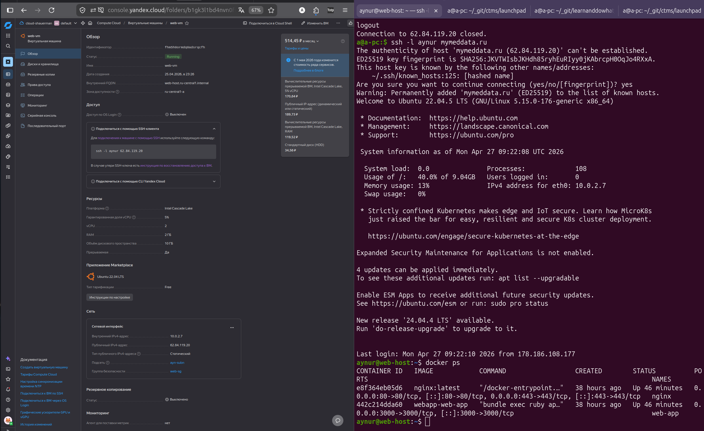


### 1.4 Создание кластера PostgreSQL

Ресурсы `yandex_mdb_postgresql_cluster`, `yandex_mdb_postgresql_user` & `yandex_mdb_postgresql_database` находятся в файле [mdb.tf](./src/mdb.tf)

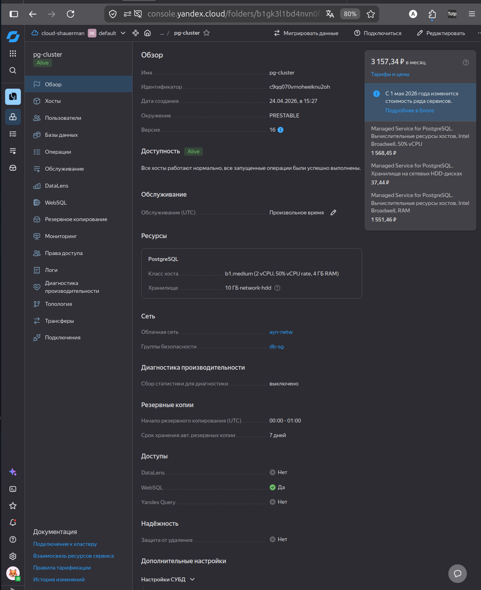

Публичного достпуа к кластеру нет:

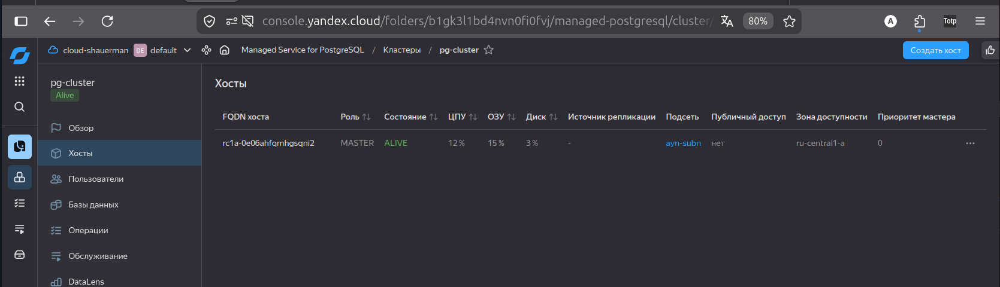

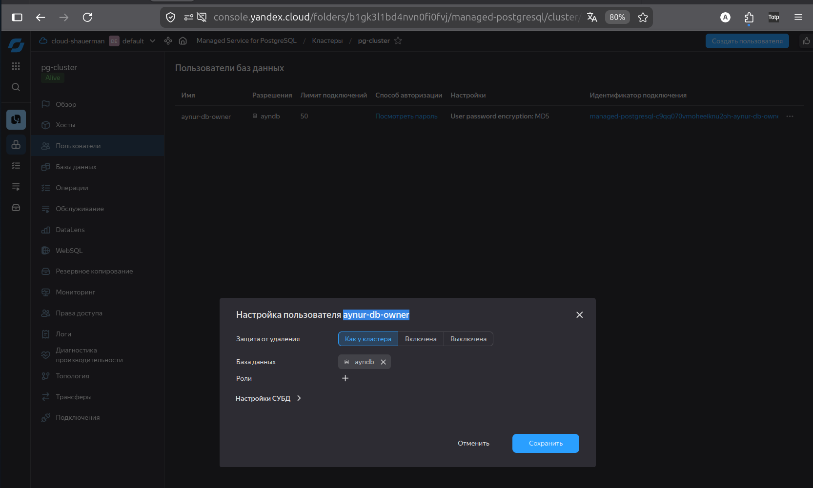

Для подключения к БД нужен сертификат ЯО. Для этих нужд я в ВМ прокидываю данные кластера и БД - при запуске docker compose у веб приложения должны быть креды доступа к БД.

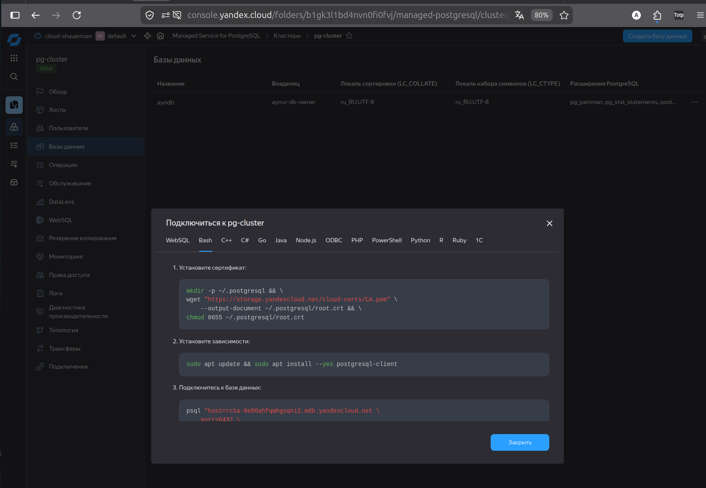

### 1.5 Создание Container Registry

Код создания ресурса `yandex_container_registry` находится в файле [mdb.tf](./src/mdb.tf)

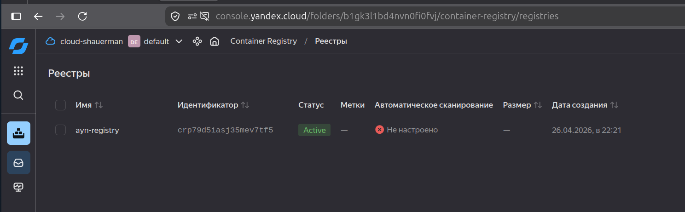

## Задание 2 Установка Docker при первичной загрузке ВМ через cloud-init.yaml

### cloud-init.yml

Файл [cloud-init.yaml](./src/cloud-init.yml) делает при инициализации ВМ:

* **write_files:**

    * создаю файл ` /tmp/.env`, записываю в него креды БД, которые пришли с аргументами  `templatefile("cloud-init.yml", ...` при создании ВМ.
    * создаю файл ` /tmp/id_ed25519`, записываю в него приватный ключ, созданный специально для приватного `git` репозитория, в котром лежит веб-приложения. В свою очередь, в репозиторий в секретах прописан публичный ключ, соотвествующий этому приватному ключу.

В момент запуска шагов `write_files` пользователь, указанный в `users` ещё не создан и нет соответственно его домашней папки. Файлы на этом этапе создаются с правами `root` и создаю пока в директорий `tmp`, чтобы позже в `runcmd` пробросить в нужную папку и поставить нужные права на эти файлы.

* `users`: создаёт пользователя ВМ - aynur, записывает его публичный ключ в `/home/aynur/.ssh/authorized_keys`
* apt: добавляю сторонний ресурс, в котором есть `docker`. `Docker` там уже лежит готовый бинарник (`deb`), архитектуру процесоора я указываю сразу, так как я это уже выбрала  на стадии описания ресурса ЯО  `yandex_compute_instance`. В строке `signed-by=/etc/apt/keyrings/docker.asc` есть также информация о том, где лежит ключ подписи пакетов Docker, который позже будет скачан в `runcmd`.
* `packages`: устаналивает пакеты их списка:
    * `nano` - мой любимый редактор
    * `bastet` - тетрис
    * `apt-transport-https` - для установки пакетов apt через https
    * `ca-certificates` - вроде без него команды вроде curl или wget будут выдавать ошибки о «недоверенном соединении» при попытке скачать что-то из интернета.
    * `curl` - для скачивания docker
    * `gnupg` - для GPG-подписей, чтобы убедиться, что скачанная программа пришла от разработчиков дистрибутива, а не от хакера.
    * `git` - скачать репозиторий с вёб-приложением.
* `runcmd`: этот блок запускается последним. Все команды выполняются от `root`.
    * устанавливаю `docker`
    * создаю папку проекта от имени сервисного пользователя
    * копирую созданные на шаге write_files файлы в нужныеместа и меняю права на сервисного пользователя.
    * клонирую репозиторий с проектом в рабочую папку. Важное замечание! В момент разработки репозиторий был приватным, поэтому я делала эти шаги с приватным ключом для скачивания проекта.
    * скачиваю сертификат  ЯО для работы с кластером Постгреса, который я подняла ранее и кладу в папку, которую указала в [compose.yml](https://github.com/aykuli/terr-final-web-app/blob/master/compose.yml#L8) проекта с веб-приложением.
    * Вот тут пришлось немножко пошаманить. Такое вот странное сочетание, что `certbot`-у нужно веб приложение, чтобы для него выпустить сертификат, а nginx-у нужен сертификат, чтобы показывать веб приложение. Я выпускала потом уже в запущенной ВМ сертификаты через openssl:
  
```
sudo openssl req -x509 -nodes -newkey rsa:4096   -keyout "./certbot/conf/live/mymeddata.ru/privkey.pem"   -out "./certbot/conf/live/mymeddata.ru/fullchain.pem"   -subj "/CN=localhost"
```
а потом запускала команду из `cloud-init`:
```
docker run -it --rm --name certbot -v "certbot/conf:/etc/letsencrypt" -v "/var/lib/letsencrypt:/var/lib/letsencrypt" -p 80:80 certbot/certbot certonly --standalone -d mymeddata.ru -d mymeddata.ru
```
Сначала валидирую с флагом --dry-run, а затем без этого флага запускаю и уже генериуютс сертификаты.
После этого перезагружать `nginx`, чтобы нстройки принялись.
В итоге, еле как справилась.


**Проверка самого файла на ошибки форматирования**

```bash
cloud-init schema --config-file cloud-init.yml
```
Смотрела,как прошёл клауд-инит:
```
sudo cat /var/log/cloud-init-output.log
```

## Задача 3. Dockerfile и сохранение его образа в Container Registry

[Multistage Dockerfile в репозиторийй веб-приложения](https://github.com/aykuli/terr-final-web-app/blob/master/Dockerfile):
<details>
<summary>Содержимое Dockerfile</summary>

```Dockerfile
# stage 0
FROM ruby:3.2-slim AS builder

RUN apt-get update -qq && apt-get install -y \
    build-essential \
    libpq-dev \
    curl

WORKDIR /app

COPY Gemfile Gemfile.lock ./
RUN bundle install

# stage 1
FROM ruby:3.2-slim
# libpq5 для работы гема pg
RUN apt-get update -qq && apt-get install -y \
    libpq5 \
    && rm -rf /var/lib/apt/lists/*

WORKDIR /app
# Копируем только установленные гемы из слоя builder
COPY --from=builder /usr/local/bundle/ /usr/local/bundle/
COPY . .

EXPOSE 3000

# Запускаем приложение. -o 0.0.0.0 обязательно для Docker
CMD ["bundle", "exec", "ruby", "app.rb", "-o", "0.0.0.0", "-p", "3000"]
```
</details>

На ВМ установила и настроила `yc` к папке ЯО, в которой ведётся работа:
```bash
$ curl -sSL https://storage.yandexcloud.net/yandexcloud-yc/install.sh | bash
$ yc init # и мнипуляции с OAuth token и настройка
$ yc container registry configure-docker
docker configured to use yc --profile "default" for authenticating "cr.yandex" container registries
Credential helper is configured in '/home/aynur/.docker/config.json'

$ cat ~/.docker/config.json 
{
  "credHelpers": {
    "container-registry.cloud.yandex.net": "yc",
    "cr.cloud.yandex.net": "yc",
    "cr.yandex": "yc"
  }
}
```

Чтобы Docker знал, куда отправлять образ, при сборке нужно указать полный путь к репозиторию в качестве тега: 
```bash
# Формат: cr.yandex/<ID_реестра>/<имя_образа>:<тег>
docker build -t cr.yandex/crp123abc456.../web-app:v1 .
```

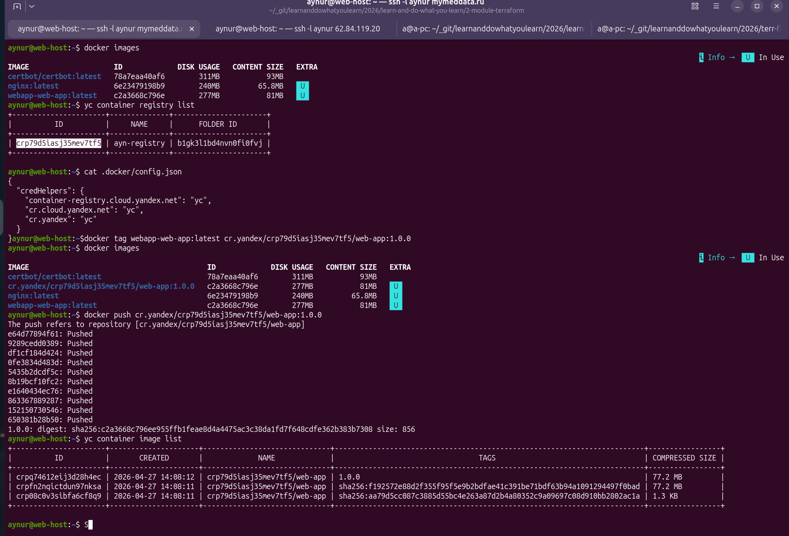
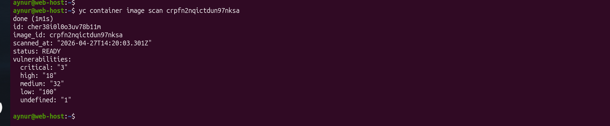
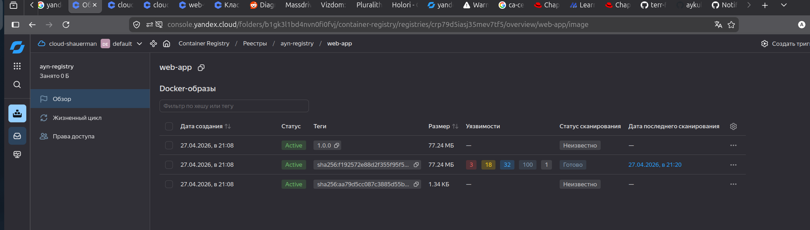


## Задание 4. Веб приложение работает с БД в Yandex Cloud.

[Код веб приложения на `ruby` простой](https://github.com/aykuli/terr-final-web-app/blob/master/app.rb):
* соединяется с базой данных
* если нет таблицы users, создаёт его.
* генерирует 100 случайных записей в эту таблицу по шаблону:
```sql
INSERT INTO users (name, email) SELECT 
                'User_' || seq, 
                'user' || seq || '@test.local'
            FROM generate_series(1, 100) AS seq
```
* при запросе отдаёт пользователей по умолчанию 10 штук, по запросу до максимального числа через квери параметр `count` и отдаёт простую таблицу разметкой `html`. Честно скажу, сильно я над красотой веб приложения не заморачивалась, и сейчас уже вижу, что заголовок написала странный, но это не имеет сильно ажного значения, поэтому суетиться по этому поводу не буду.

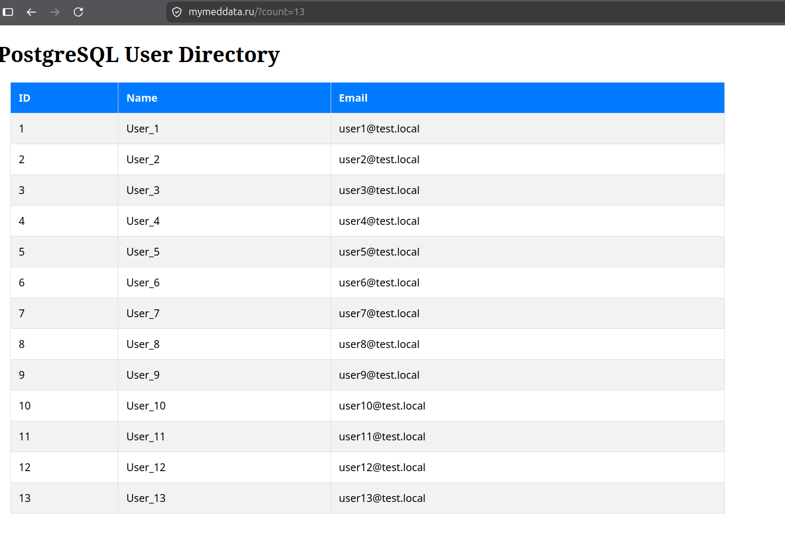


Некоторые ресурсы я создавала после создания инфраструктуры, некоторые создала в UI в силу незнания, как оно вообще работает, пощупала, настроила, а потом решала импортировать их в `state` командой:
* в коде:

```
import {
  to = <resource_type>.<resource_name>
  id = <already_created_resource_entity_id_got_from_ui_or_yc_cli>
}
```

Для того, чтобы приложение соединялось с созданной БД в кластере `Managed Service for PostgreSQL`, я в `cloud-init.yml` передаю аргуменами данные БД - пользоателя, пароля, `fqdn` ресурса `yandex_mdb_postgresql_cluster`, создаю `.env` файл, потом кладу этот файл в папку, где поднимается приложение в докер контейнере через compose.yml.

Для того, чтобы приложение проксировалось на порты 80 (http) и 443(https) я подняла nginx сервер с [настройками в репозиторий веб-приложения](https://github.com/aykuli/terr-final-web-app/blob/master/nginx/nginx.conf). 

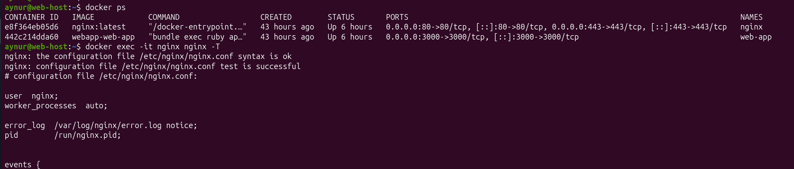
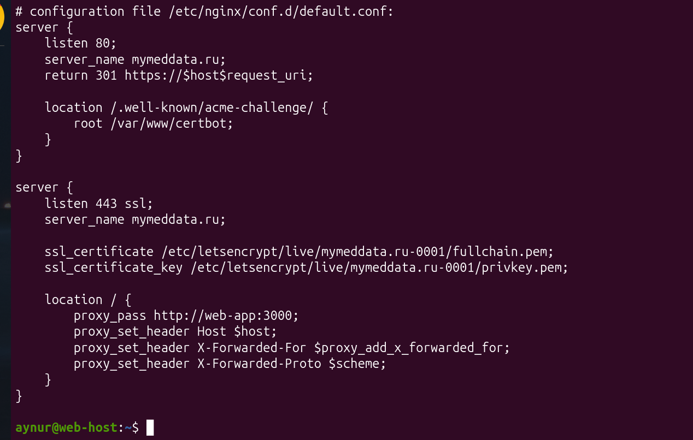


## Задание 5*. LockBox

[Код с ресурсом LockBox в проекте](./src/lockbox.tf)

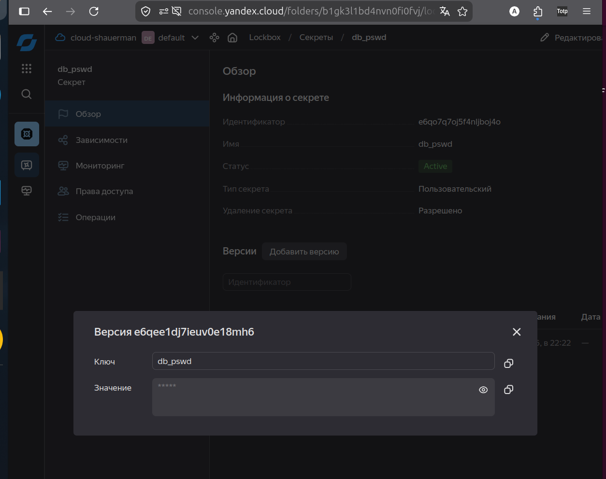

В веб интерфейсе ресурса кластера во вкладке Пользователь навести на синие слова `Посмотреть пароль` и внизу в браузере видно, что ссылка едёт на `lockbox`:

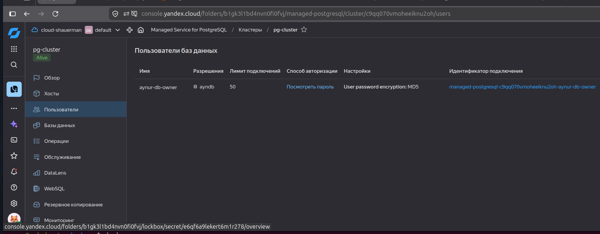

## Трудности

* выпуск сертификатов - непонятно, кто должен быть раньше запущенное приложение или сертификат
* долго разбиралась с `cloud-init` - много нюансов оказывается, такие как последовательность выполнения блоков, поэтому некотрые сущности вовсе не сущетсвуют в некоторых шагах, все команды в `runcmd` выполняются от `root`.
* были нюансы с самим приложением, с ruby `sinatra` гемом.
* много ошибалась в сопоставлении egress/ingress правил в группах безопасности. Просто допускала глупые ошибки.
* делала инфраструктуру последовательно, создавая сущности шаг за шагом.
* В конце для проверки скопировала проект в другую папку и воссоздала в другой папке ЯО с другим сервисным аккаунтом, и всё получилось! Кроме DNS - там нужен же другое доменное имя, которого у меня нет, второе не хотелось регистрировать. Но думаю, сработало бы. И в веб приложении в настройках nginx надо было бы прописать и опять выпускать под это сертификат.

Если бы нужно было бы долгосроное приложение, то я видела варианты, что в compose.yml добавляют certbot в контейнере, крон шедулером запускают каждые 3 месяца(срок действия сертификата на доменное имя). Контейнер запускают, контейнер останавливается после выпуска сертификата и так каждые 3 месяца.

### Источники
* [ЯО VPC понимается сеть ...](https://habr.com/ru/companies/yandex/articles/487694/)
* [Сертификат от Let's Encrypt](https://yandex.cloud/ru/docs/certificate-manager/concepts/managed-certificate)