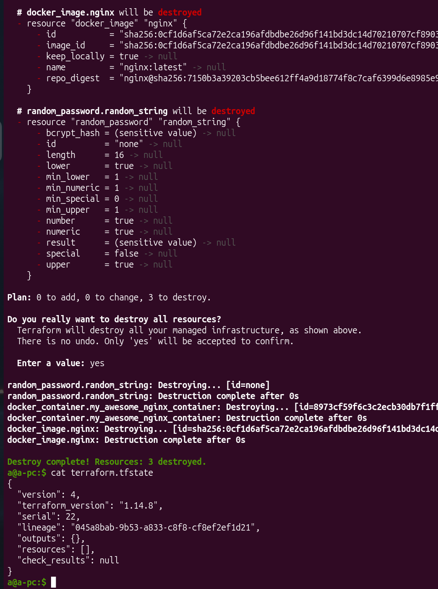
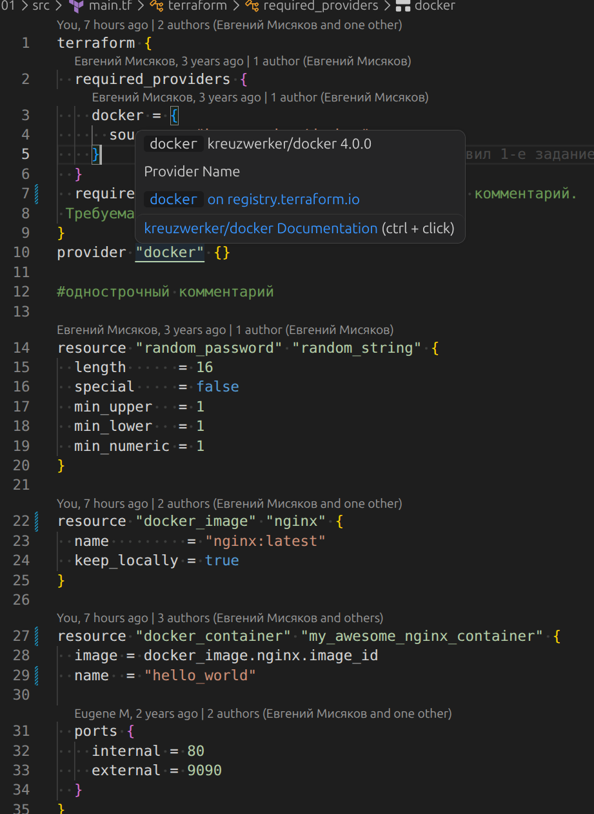
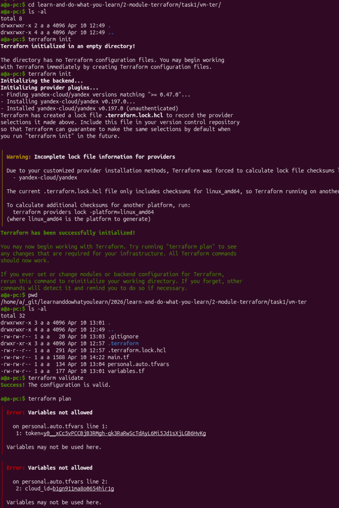
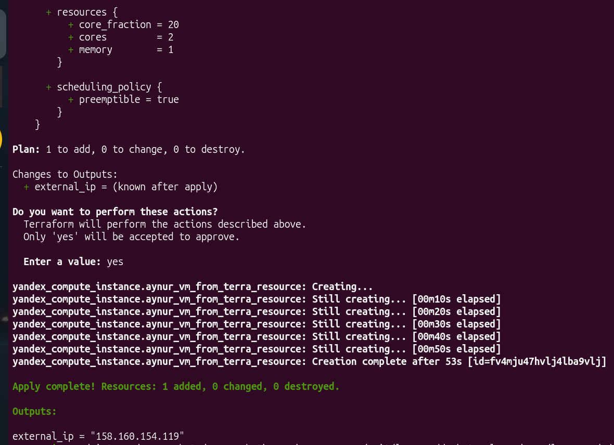
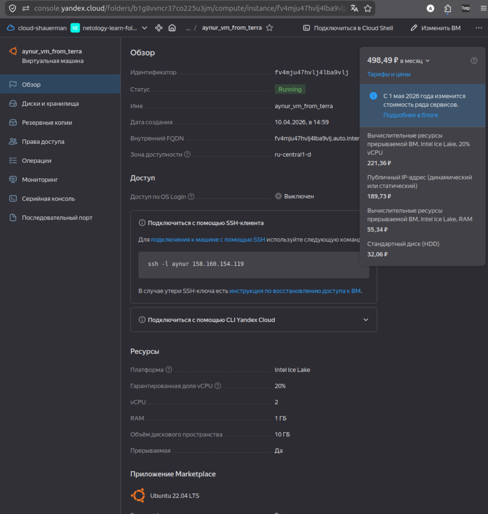

# [Домашнее задание к занятию «Введение в Terraform»](https://github.com/netology-code/ter-homeworks/blob/main/01/hw-01.md)

## Чек-лист готовности


## Задание 1

1. terrafrom installed
2. В `personal.auto.tfvars` согласно .gitignore и наименованию файла, допустимо хранить секретную информацию
3. Конкретные ключ и его значения - это же `sensitive_attributes`?

4. Ошибки:


* Ресурс должен иметь имя, сразу после его типа. Необходимо `resource "docker_image" "docker image name"{`
* Имя ресурса с типом `docker_container` начинается с числа. Допустимо начинать название ресурса с нижнего подчёркивания или буквы.
* ресурс docker_container обращался к ресурсу random_password по неправильному имени. Корректно 
* опечатка в названии атрибута `random_password.random_string_FAKE.result`

4. Исправленная версия `main.tf`:

<details>
<summary>main.tf</summary>

```bash
terraform {
  required_providers {
    docker = {
      source  = "kreuzwerker/docker"
    }
  }
  required_version = ">=1.12.0" /*Многострочный комментарий.
 Требуемая версия terraform */
}
provider "docker" {}

#однострочный комментарий

resource "random_password" "random_string" {
  length      = 16
  special     = false
  min_upper   = 1
  min_lower   = 1
  min_numeric = 1
}

resource "docker_image" "nginx" {
  name         = "nginx:latest"
  keep_locally = true
}

resource "docker_container" "my_awesome_nginx_container" {
  image = docker_image.nginx.image_id
  name  = "example_${random_password.random_string.result}"

  ports {
    internal = 80
    external = 9090
  }
}
```
</details>

5. `docker ps`


6. `terraform apply -auto-approve` судя по выводу в консоли удаляет контейнер и пересоздаёт его. А если бы это был не контейнер, а БД, то мы могли бы потерять важные данные.

Используют с CI/CD, где идёт автоматизация (типа как при использовании флага -y для apt), чтобы процесс не завис в месте ожидания ответа. Предполагается, что в этом случае просмотрен `plan`, точно также как код отревьюен.


7. Уничтожение сохданных ресурсов

<details>
<summary>Текущее содержание terraform.tfstate</summary>

```json
{
  "version": 4,
  "terraform_version": "1.14.8",
  "serial": 22,
  "lineage": "045a8bab-9b53-a833-c8f8-cf8ef2ef1d21",
  "outputs": {},
  "resources": [],
  "check_results": null
}
```
</details>

Console:


8. docker-образ nginx:latest остался локально из-за строки в `main.tf` `keep_locally = true` в ресурсе его образа:

resource "docker_image" "nginx" {
  name         = "nginx:latest"
<font color="#147c14">  keep_locally = true</font>
}

У каждого провайдера есть своя документация. В VScode показывающаяся ссылка открывается только под впн.
У провайдера docker есть опциональные параметры [здесь](https://library.tf/providers/kreuzwerker/docker/latest/docs/resources/image#optional) или [здесь](https://registry.terraform.io/providers/kreuzwerker/docker/latest/docs/resources/image#keep_locally-1)


Суть задания я поняла, чтоб узнать, что кроме registry.terraform.io есть  ещё library.tf, где можно смотреть документацию без впн. Спасибо!

## Задание 2

1.


После некоторого времени мучений и соспотавлений наименований ресурсов и их значений. После множества не получившихся `terraform apply`, хотя `terraform validate` и `terraform plan` показывали всё зелёненьким, наконец, получилось создать ВМ в Yandex-cloud:



Виды ошибок, на которые натыкался нуб, как я:
* начала я ошибаться с синтаксиса описания кредов в personal.auto.tfvars и разных опечатков
* образ из примера яндекса не находился, и пришлось искать подходящий образ через `yc compute image list --folder-id standard-images`
* хорошо бы им в документцию добавить опции `boot_disk`, написала наугад, и вышли варианты в тексте ошибки `type: must be one of network-hdd, network-ssd, network-ssd-io-m3, network-ssd-nonreplicated`
* c `platform_id` такое не проканало, пришлось искать. Оказывается  для `ru-central1-d` доступен только `standard-v3` с мин 20% долей ЦПУ Intel Ice Lake:
Хотела минимизировать траты, получилось:


* 


