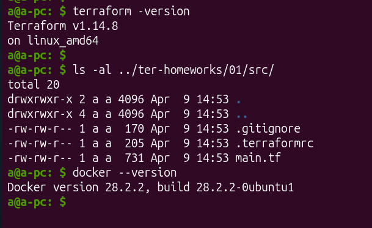
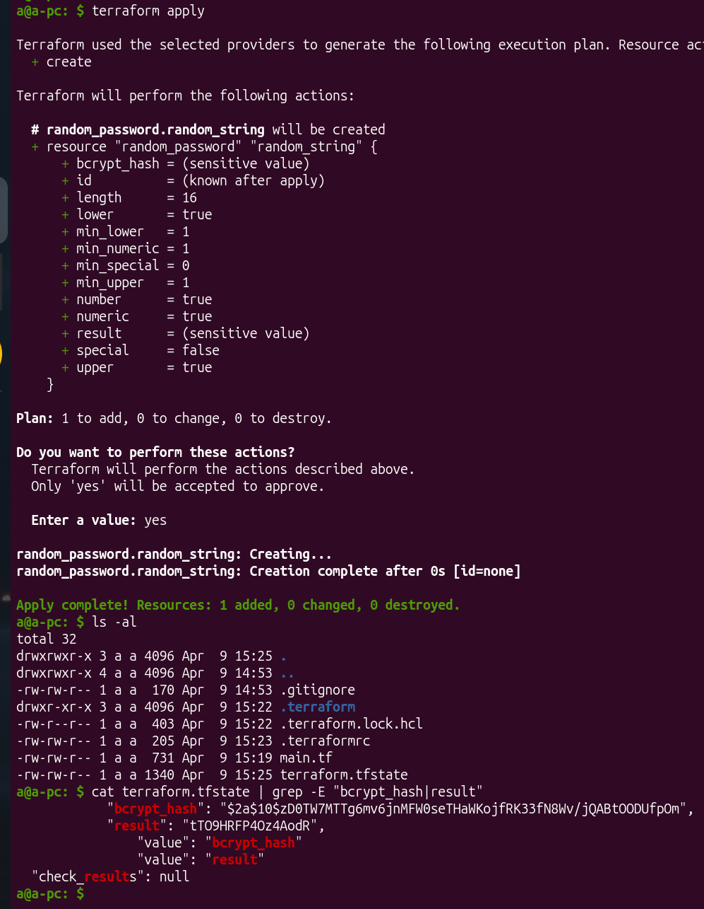
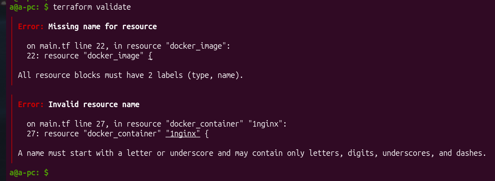
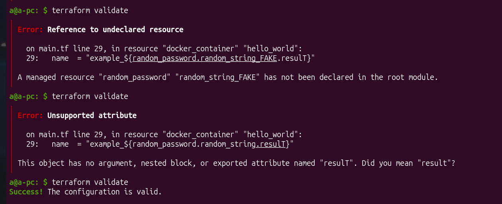
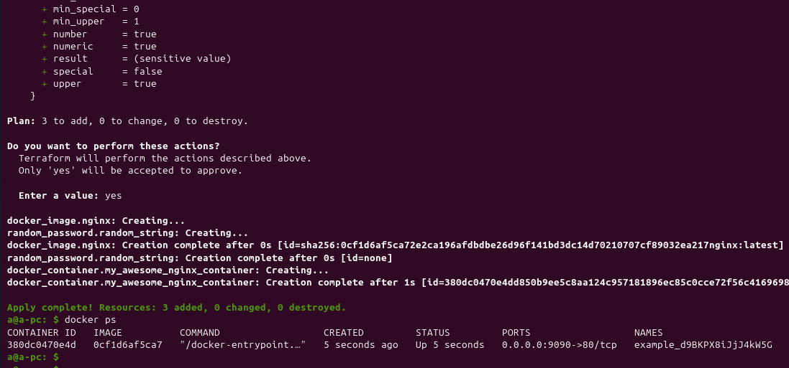
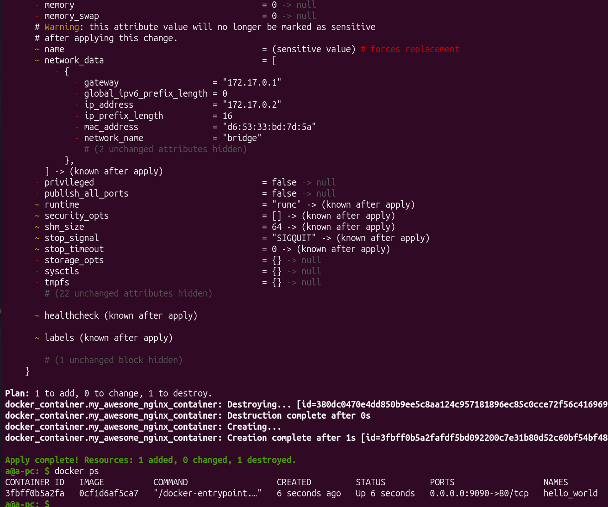

# [Домашнее задание к занятию «Введение в Terraform»](https://github.com/netology-code/ter-homeworks/blob/main/01/hw-01.md)

## Чек-лист готовности



## Задание 1

1. terrafrom installed
2. В personal.auto.tfvars согласно .gitignore и наименованию файла, допустимо хранить секретную информацию
3. Конкретные ключ и его значения - это же `sensitive_attributes`?

4. Ошибки:



* Ресурс должен иметь имя, сразу после его типа. Необходимо `resource "docker_image" "docker image name"{`
* Имя ресурса с типом `docker_container` начинается с числа. Допустимо начинать название ресурса с нижнего подчёркивания или буквы.
* ресурс docker_container обращался к ресурсу random_password по неправильному имени. Корректно 
* опечатка в названии атрибута `random_password.random_string_FAKE.result`

4. Исправленная версия `main.tf`:

<details>
<summary>main.tf</summary>

```bash
terraform {
  required_providers {
    docker = {
      source  = "kreuzwerker/docker"
    }
  }
  required_version = ">=1.12.0" /*Многострочный комментарий.
 Требуемая версия terraform */
}
provider "docker" {}

#однострочный комментарий

resource "random_password" "random_string" {
  length      = 16
  special     = false
  min_upper   = 1
  min_lower   = 1
  min_numeric = 1
}

resource "docker_image" "nginx" {
  name         = "nginx:latest"
  keep_locally = true
}

resource "docker_container" "my_awesome_nginx_container" {
  image = docker_image.nginx.image_id
  name  = "example_${random_password.random_string.result}"

  ports {
    internal = 80
    external = 9090
  }
}
```
</details>

5. `docker ps`


6. `terraform apply -auto-approve` судя по выводу в консоли удаляет контейнер и пересоздаёт его. А если бы это был не контейнер, а БД, то мы могли бы потерять важные данные.

Используют с CI/CD, где идёт автоматизация (аналог флага -y для apt), чтобы процесс не завис в месте ожидания ответа. Предполагается, что в этом случае просмотрен `plan`, точно также как код отверьюен.

