# [Домашнее задание к занятию «Основы Terraform. Yandex Cloud»](https://github.com/netology-code/ter-homeworks/blob/main/02/hw-02.md)

## Задание 1

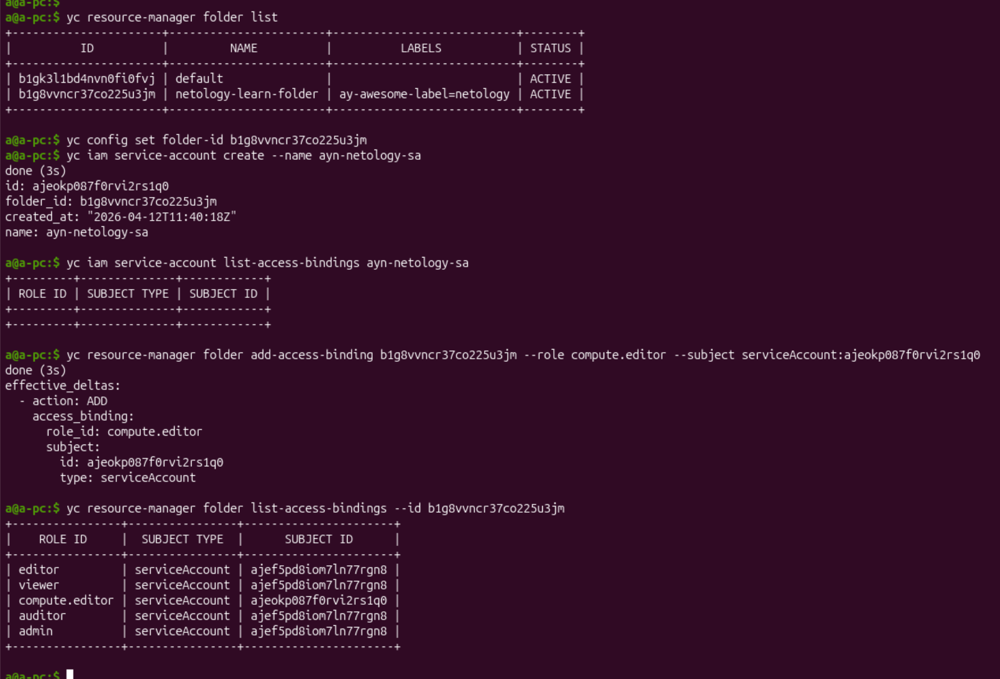
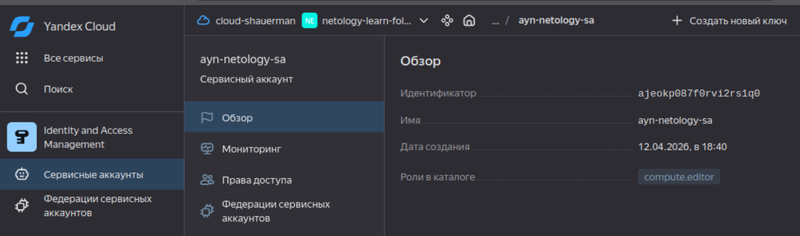

Создала новый ключ и сохранила.
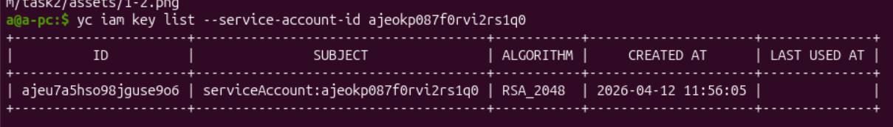

4. Запускаю проект
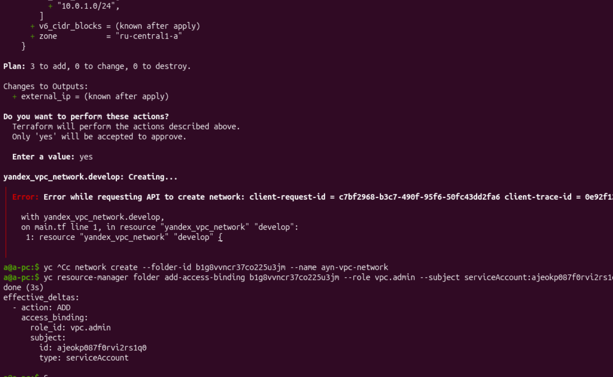

Были ошибки:
* с корреляцией версий терраформа локально и указанной версии в проекте 
* не добавила достаточной роли для сервисного аккаунта, чтобы создавать сеть и подсети
* создаваемая сеть необходима, чтобы была доступна в рамках рабочей папки

* версия провайдера не была указана
* Платформа v4 недоступна в зоне ru-central1-a, доступны v1, v2, v3:
```shell
Availability Zone	Platform ID	CPU Architecture	Notes
ru-central1-a	standard-v1, standard-v2, standard-v3	Intel Broadwell, Cascade Lake, Ice Lake	Most versatile zone.
ru-central1-b	standard-v1, standard-v2, standard-v3	Intel Broadwell, Cascade Lake, Ice Lake	High availability backup for -a.
ru-central1-c	standard-v2	Intel Cascade Lake	Limited platform support (No v1 or v3 in some regions).
ru-central1-d	standard-v3	Intel Ice Lake	Newest zone, focuses on high-performance v3.
```

* да емаё, ещё и опечатка в слове стандарт, как по русски
* была несогласованность в уровне производительности с платформой. [Посмoтрела здесь](https://yandex.cloud/ru/docs/compute/concepts/performance-levels) и перевыбрала платформу standard-v1 и количество vCPU = 2.

и наконец получилось:
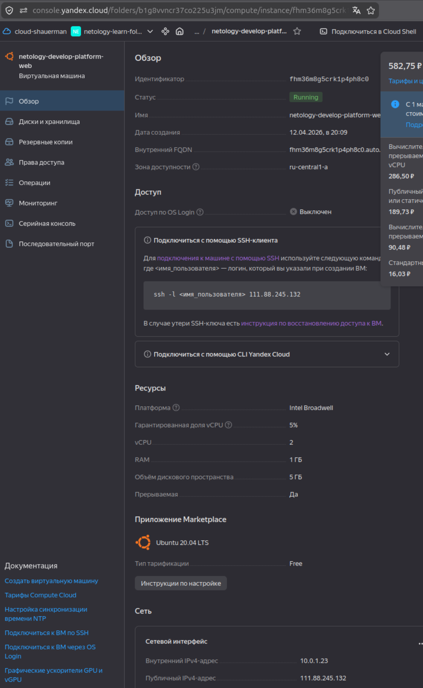

5. Подключение через ssh:
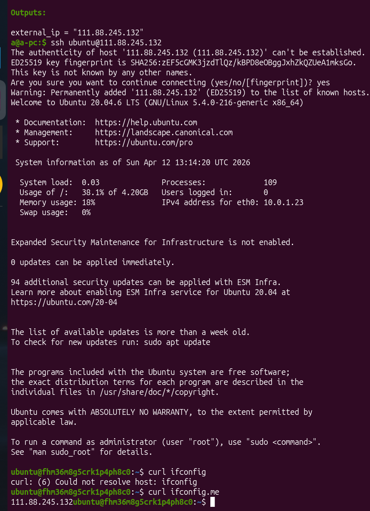

6. Параметры `preemptible = true` и `core_fraction=5` в учёбе нужны для экономии средств на учебнос счету. Так как пока мы тренируемся только создавать/удалять ВМ, а не нагружать.

## Задание 2

1. Использование перменных

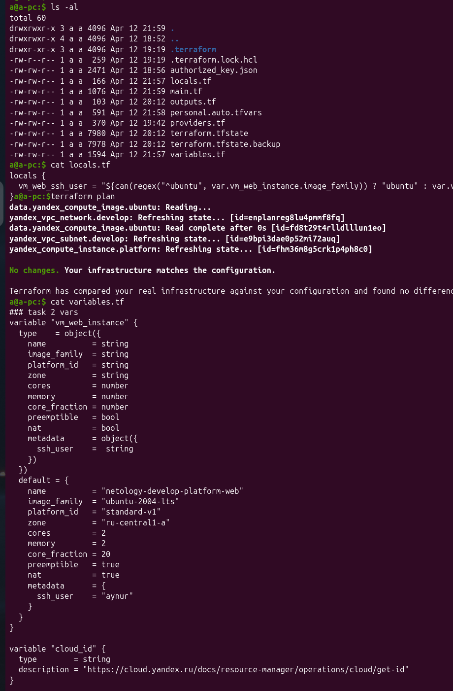

## Задание 3

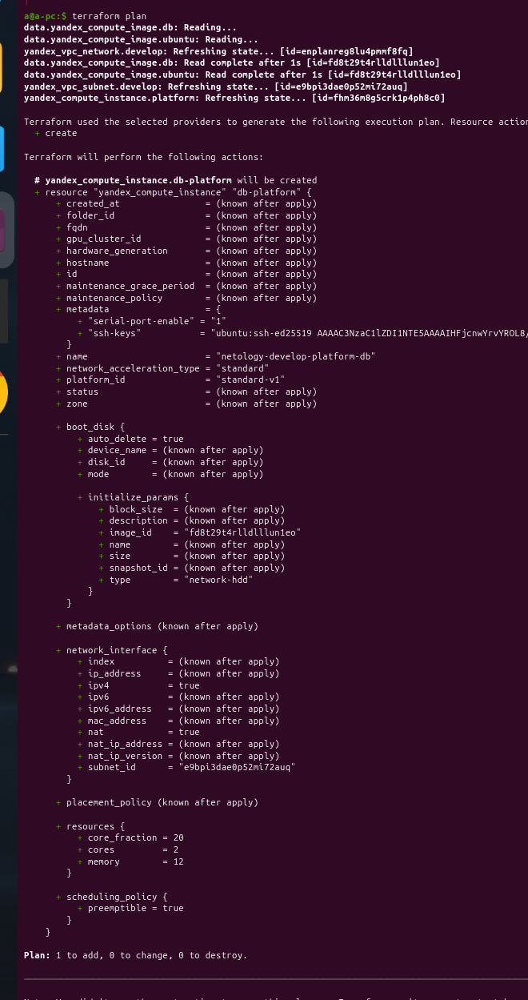
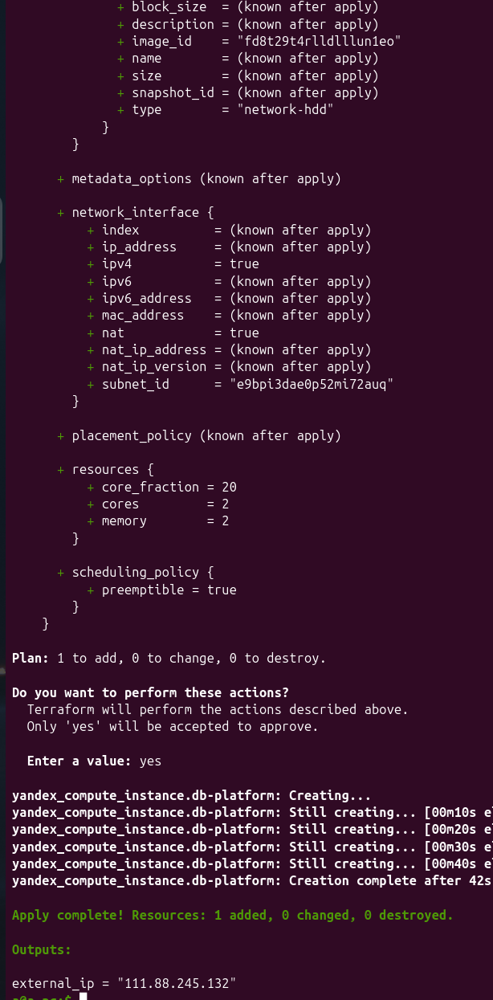
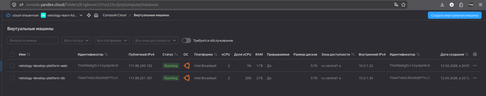
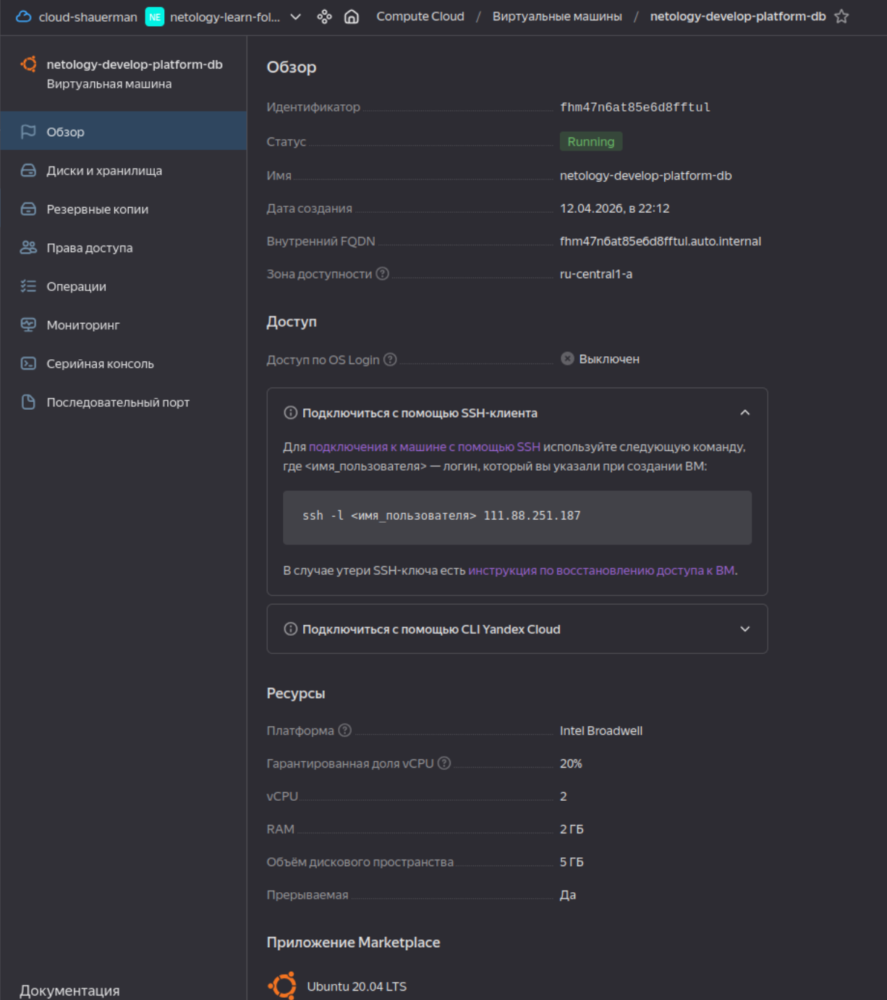

## Задание 4

[output.tf](./src/outputs.tf)

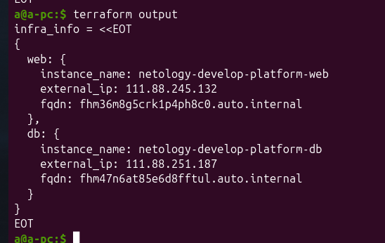

## Задание 5


