# [Домашнее задание к занятию «Управляющие конструкции в коде Terraform»](https://github.com/netology-code/ter-homeworks/blob/main/03/hw-03.md)

## Задание 1

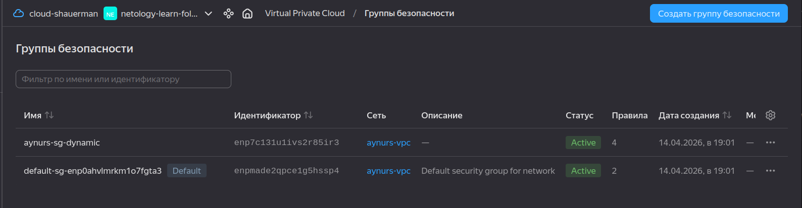
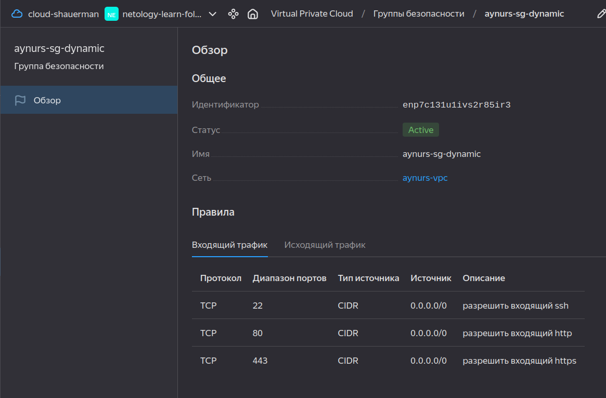

## Задание 2

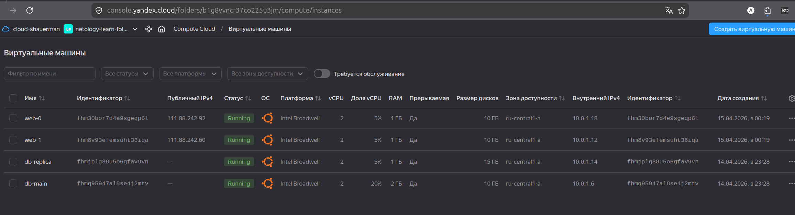

Files:

* [count_vm.tf](./src/count-vm.tf)
* [for_each-vm.tf](./src/for_each-vm.tf)


## Задание 3

[disk_vm.tf](./src/disk_vm.tf)

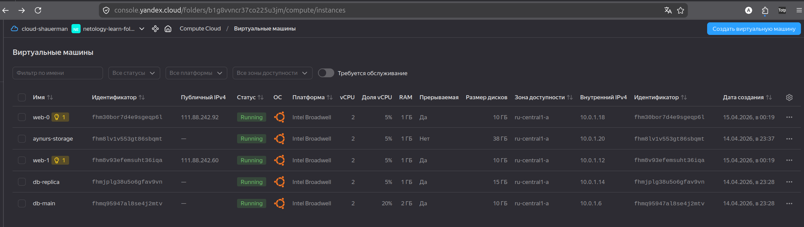
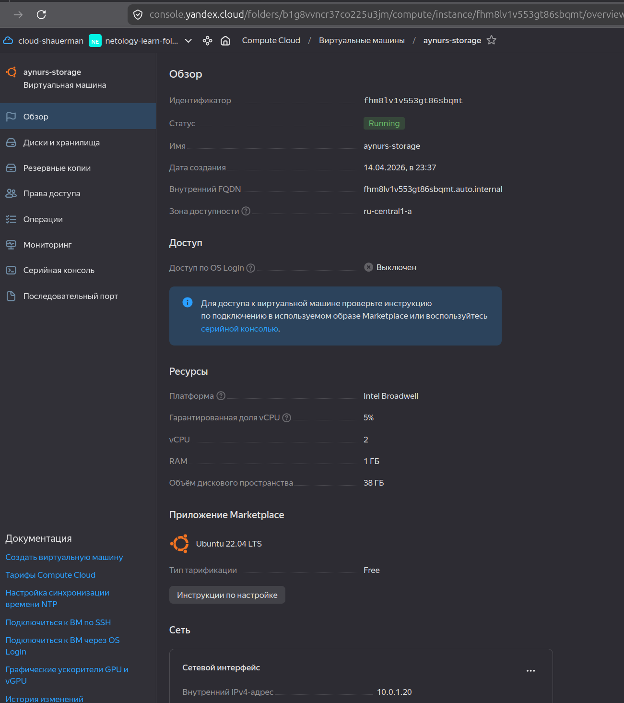
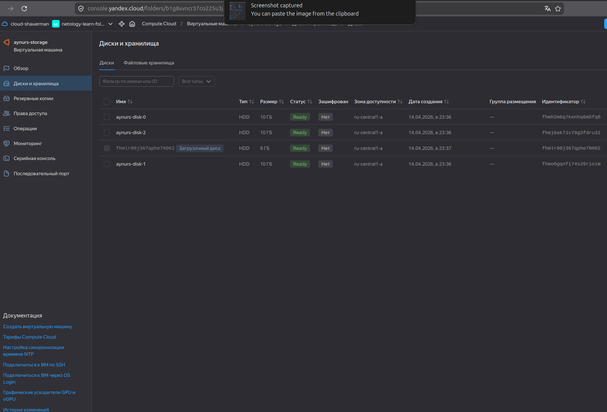

## Задание 4

[inventory.tf](./src/inventory.tf)
[hosts.tftpl](./src/hosts.tftpl)

* на скрине файл называется ansible.tf, я его потом переименовала в inventory.tf. Позже, наткнувшись на задачу 6, поняла, что в описании задачи опечатка наверное.
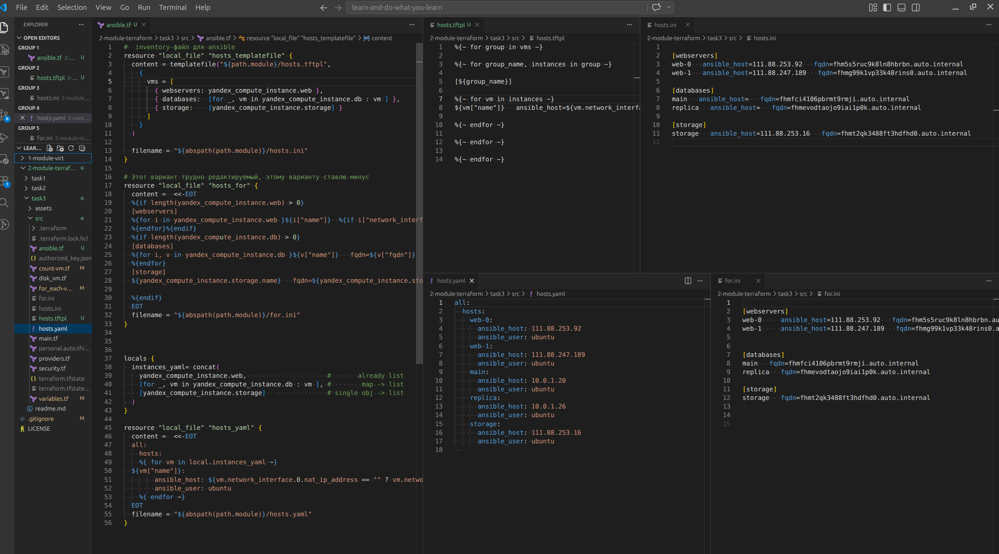

## Задание 5*

[outputs.tf](./src/outputs.tf)

* Before do `terraform refresh` for new output to become available.

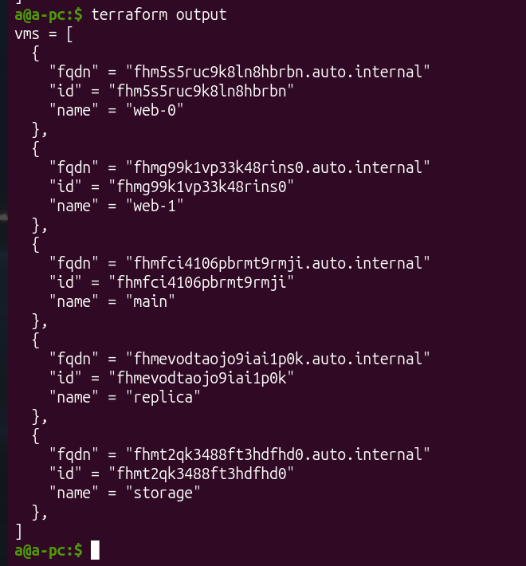

## Задание 6*

* c бастионом (nat=false for web vms)

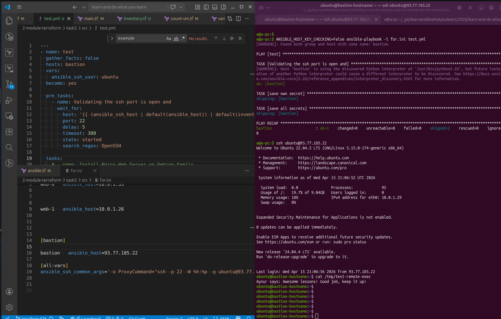

* без бастиона, web-0 & web-1 имеют nat адреса

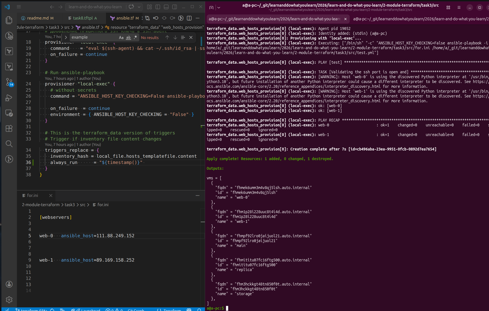


## Задание 7*

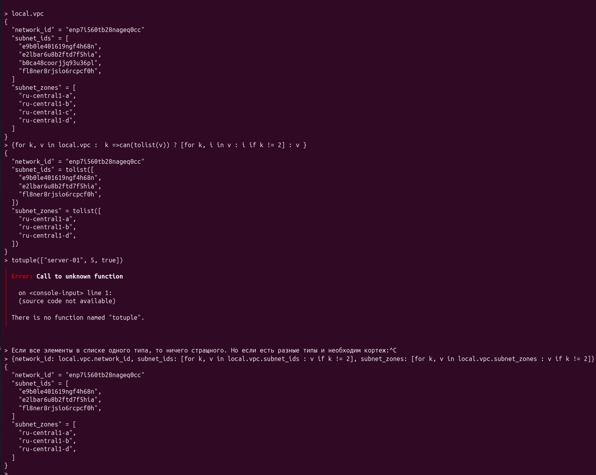

<details>
<summary>expression</summary>

```
{for k, v in local.vpc :  k => can(tolist(v)) ? [for k, i in v : i if k != 2] : v }
{
  "network_id" = "enp7i560tb28nageq0cc"
  "subnet_ids" = tolist([
    "e9b0le401619ngf4h68n",
    "e2lbar6u8b2ftd7f5hia",
    "fl8ner8rjsio6rcpcf0h",
  ])
  "subnet_zones" = tolist([
    "ru-central1-a",
    "ru-central1-b",
    "ru-central1-d",
  ])
}

> Если все элементы в списке одного типа, то ничего страшного, что кортеж стал списком. Но если есть разные типы и необходим кортеж:
> {network_id: local.vpc.network_id, subnet_ids: [for k, v in local.vpc.subnet_ids : v if k != 2], subnet_zones: [for k, v in local.vpc.subnet_zones : v if k != 2]}
{
  "network_id" = "enp7i560tb28nageq0cc"
  "subnet_ids" = [
    "e9b0le401619ngf4h68n",
    "e2lbar6u8b2ftd7f5hia",
    "fl8ner8rjsio6rcpcf0h",
  ]
  "subnet_zones" = [
    "ru-central1-a",
    "ru-central1-b",
    "ru-central1-d",
  ]
}

```
</details>

## Задание 8*

Как видно на рисунке ниже, в консоли ошибка указывает на файл ./task8.tftpl на 3-ей строке, 85-86 колонке, что сущность не имеет такого атрибута. Посмотрев эту точку в IDE сначала вижу лишний пробел в `platform_id` указана с лишним пробелом. Проверяю - всё равно ошибка там же. Там фигурная скобка не так стояла.
Теперь всё работает - созадстся файл task8.ini c содержимым (я добавила перенос строк кое-где):

```
[webservers]
  web-0 ansible_host=111.88.253.92 platform_id=standard-v1
  web-1 ansible_host=111.88.247.189 platform_id=standard-v1
```

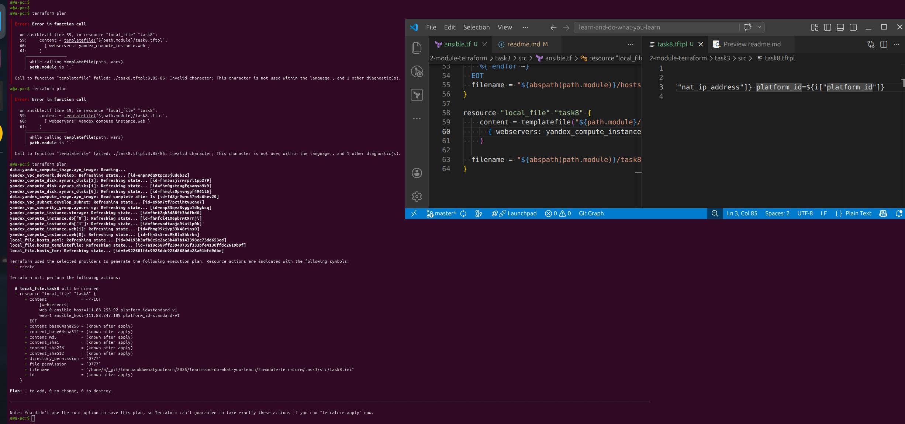

## Задание 9*

1.
```
> [for i in range(99) : i < 9 ? "rc0${i+1}" : "rc${i+1}"]
[
  "rc01",
  "rc02",
  "rc03",
  "rc04",
  "rc05",
  "rc06",
  "rc07",
  "rc08",
  "rc09",
  "rc10",
  "rc11",
  "rc12",
  "rc13",
  "rc14",
  "rc15",
  "rc16",
  "rc17",
  "rc18",
  "rc19",
  "rc20",
  "rc21",
  "rc22",
  "rc23",
  "rc24",
  "rc25",
  "rc26",
  "rc27",
  "rc28",
  "rc29",
  "rc30",
  "rc31",
  "rc32",
  "rc33",
  "rc34",
  "rc35",
  "rc36",
  "rc37",
  "rc38",
  "rc39",
  "rc40",
  "rc41",
  "rc42",
  "rc43",
  "rc44",
  "rc45",
  "rc46",
  "rc47",
  "rc48",
  "rc49",
  "rc50",
  "rc51",
  "rc52",
  "rc53",
  "rc54",
  "rc55",
  "rc56",
  "rc57",
  "rc58",
  "rc59",
  "rc60",
  "rc61",
  "rc62",
  "rc63",
  "rc64",
  "rc65",
  "rc66",
  "rc67",
  "rc68",
  "rc69",
  "rc70",
  "rc71",
  "rc72",
  "rc73",
  "rc74",
  "rc75",
  "rc76",
  "rc77",
  "rc78",
  "rc79",
  "rc80",
  "rc81",
  "rc82",
  "rc83",
  "rc84",
  "rc85",
  "rc86",
  "rc87",
  "rc88",
  "rc89",
  "rc90",
  "rc91",
  "rc92",
  "rc93",
  "rc94",
  "rc95",
  "rc96",
  "rc97",
  "rc98",
  "rc99",
]

```

2. 
```
> [for i in range(96) : i < 9 ? "rc0${i+1}" : "rc${i+1}" if !(endswith(tostring(i+1), "0") || endswith(tostring(i+1), "7") || endswith(tostring(i+1), "8") || endswith(tostring(i+1), "9")) || i+1 == 19]
[
  "rc01",
  "rc02",
  "rc03",
  "rc04",
  "rc05",
  "rc06",
  "rc11",
  "rc12",
  "rc13",
  "rc14",
  "rc15",
  "rc16",
  "rc19",
  "rc21",
  "rc22",
  "rc23",
  "rc24",
  "rc25",
  "rc26",
  "rc31",
  "rc32",
  "rc33",
  "rc34",
  "rc35",
  "rc36",
  "rc41",
  "rc42",
  "rc43",
  "rc44",
  "rc45",
  "rc46",
  "rc51",
  "rc52",
  "rc53",
  "rc54",
  "rc55",
  "rc56",
  "rc61",
  "rc62",
  "rc63",
  "rc64",
  "rc65",
  "rc66",
  "rc71",
  "rc72",
  "rc73",
  "rc74",
  "rc75",
  "rc76",
  "rc81",
  "rc82",
  "rc83",
  "rc84",
  "rc85",
  "rc86",
  "rc91",
  "rc92",
  "rc93",
  "rc94",
  "rc95",
  "rc96",
]
```
