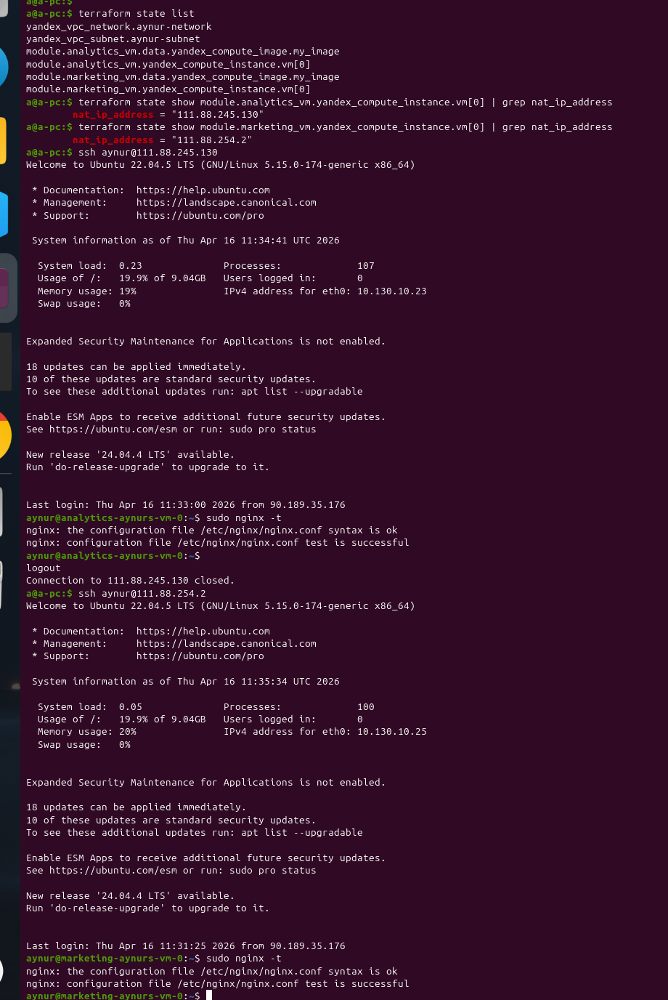
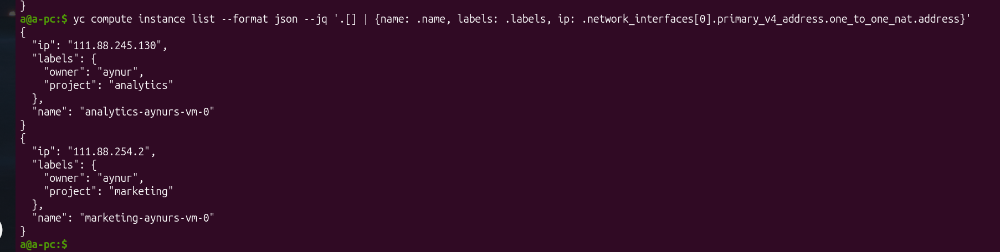
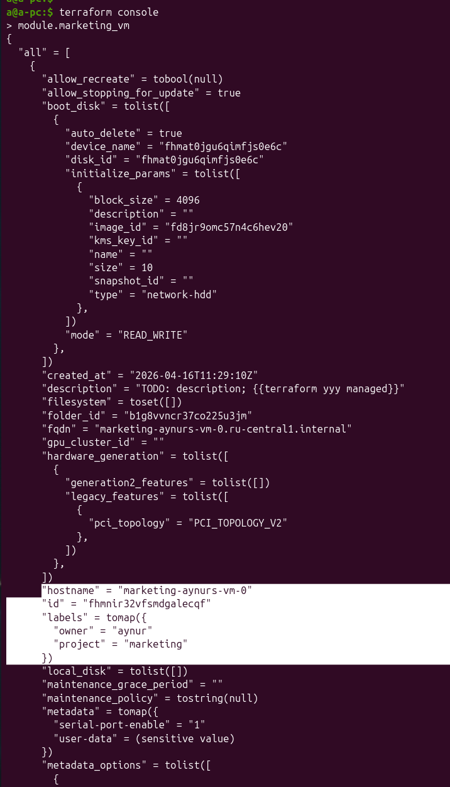
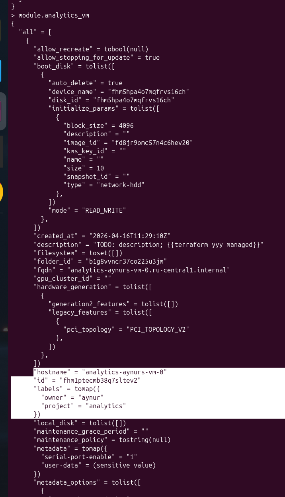

# [Домашнее задание к занятию «Продвинутые методы работы с Terraform»](https://github.com/netology-code/ter-homeworks/blob/main/04/hw-04.md)

## Задание 1

* Список созданных ресурсов с помощью удаленного модуля от udjin10,
* Получение IP адресов,
* Вход по этим адресам на 2 машины - маркетинг и аналитика,
* Проверка в каждой установленного прокси-сервера c командой `sudo nginx -t`.



Вывод консоли ВМ yandex cloud с их метками:


<details>
<summary>bash</summary>

```bash
$ yc compute instance list --format json --jq '.[] | {name: .name, labels: .labels, ip: .network_interfaces[0].primary_v4_address.one_to_one_nat.address}'
{
  "ip": "111.88.245.130",
  "labels": {
    "owner": "aynur",
    "project": "analytics"
  },
  "name": "analytics-aynurs-vm-0"
}
{
  "ip": "111.88.254.2",
  "labels": {
    "owner": "aynur",
    "project": "marketing"
  },
  "name": "marketing-aynurs-vm-0"
}
```
</details>

`terraform console` ->  `module.marketing_vm`


`terraform console` ->  `module.analytics_vm`


## Задание 2


