# [Домашнее задание к занятию «Продвинутые методы работы с Terraform»](https://github.com/netology-code/ter-homeworks/blob/main/04/hw-04.md)

## Задание 1

* Список созданных ресурсов с помощью удаленного модуля от udjin10,
* Получение IP адресов,
* Вход по этим адресам на 2 машины - маркетинг и аналитика,
* Проверка в каждой установленного прокси-сервера c командой `sudo nginx -t`.


Вывод консоли ВМ yandex cloud с их метками:


<details>
<summary>bash</summary>

```bash
$ yc compute instance list --format json --jq '.[] | {name: .name, labels: .labels, ip: .network_interfaces[0].primary_v4_address.one_to_one_nat.address}'
{
  "ip": "111.88.245.130",
  "labels": {
    "owner": "aynur",
    "project": "analytics"
  },
  "name": "analytics-aynurs-vm-0"
}
{
  "ip": "111.88.254.2",
  "labels": {
    "owner": "aynur",
    "project": "marketing"
  },
  "name": "marketing-aynurs-vm-0"
}
```
</details>

`terraform console` ->  `module.marketing_vm`


`terraform console` ->  `module.analytics_vm`


## Задание 2

1. [Локальный модуль vpc](./modules/vpc/main.tf)


2. [Использоание модуля в основном проекте](./src/main.tf#L1)

3. Посмотрим в `terraform console` о модуле информацию:


Соотвестствует [outputs.tf](./modules/vpc/outputs.tf)

4. В [модули ВМ для маркетинга](./src/main.tf#L11) и [ВМ для аналитиков](./src/main.tf#L43) передаю параметры на выходе модуля `vpc`.

5. [Документация, сгенерированная с `terraform-docs`](./modules/vpc/readme.md)


## Задание 3

* список ресурсов в стейте.
* удаление из стейта модуль vpc.
* удаление из стейта модуль vm.


Импортируйте всё обратно:

* импортирование ВМ


* импортирование сети и подсети


* `terraform plan`


## Задание 4

Скриншот кода ( а то вдруг опять изменить надо будет, а я их по коммитам не делаю):
* модуль vpc


* использоание модуля. Правда, vpc_prod я нигде не использую, просто создала для тестов.


* посмотреть список созданных сущностей в yc cli - я в подсетях ВМ не создавала


* кусок `terraform plan` простыни


## Задание 5*

Созданные сущности:

* [Module `db_cluster`](./modules/db_cluster/main.tf)
* [Module `db_database`](./modules/db_database/main.tf)
* [Папка с проектом создания кластера и бд](./db_cluster/main.tf)

Таки у меня получилось сделать 3,3 ~~тыщ мильон до неба~~ тысяч рублей кластер, методом перебора в UI веб консоли среди их пресетов ресурсов. Но это для кластера с одним хостом (HA=false).


<details>
<summary>terraform plan</summary>

```
Terraform used the selected providers to generate the following execution plan. Resource actions are indicated with the following symbols:
  + create

Terraform will perform the following actions:

  # yandex_vpc_network.vpc_network will be created
  + resource "yandex_vpc_network" "vpc_network" {
      + created_at                = (known after apply)
      + default_security_group_id = (known after apply)
      + folder_id                 = (known after apply)
      + id                        = (known after apply)
      + labels                    = (known after apply)
      + name                      = "clusters_network"
      + subnet_ids                = (known after apply)
    }

  # module.example.yandex_mdb_mysql_cluster.ayn_db_cluster will be created
  + resource "yandex_mdb_mysql_cluster" "ayn_db_cluster" {
      + allow_regeneration_host   = false
      + backup_retain_period_days = (known after apply)
      + created_at                = (known after apply)
      + deletion_protection       = (known after apply)
      + description               = "Mysql DB cluster"
      + disk_encryption_key_id    = (known after apply)
      + environment               = "PRESTABLE"
      + folder_id                 = "b1gt5btpj16uq33j8643"
      + health                    = (known after apply)
      + host_group_ids            = (known after apply)
      + id                        = (known after apply)
      + mysql_config              = {
          + "default_authentication_plugin" = "MYSQL_NATIVE_PASSWORD"
          + "max_connections"               = "10"
          + "sql_mode"                      = "ONLY_FULL_GROUP_BY,STRICT_TRANS_TABLES,NO_ZERO_IN_DATE,NO_ZERO_DATE,ERROR_FOR_DIVISION_BY_ZERO,NO_ENGINE_SUBSTITUTION"
        }
      + name                      = "aynurs-awesome-db-cluster"
      + network_id                = (known after apply)
      + status                    = (known after apply)
      + version                   = "8.0"

      + access (known after apply)

      + backup_window_start (known after apply)

      + disk_size_autoscaling (known after apply)

      + host {
          + assign_public_ip   = true
          + fqdn               = (known after apply)
          + replication_source = (known after apply)
          + subnet_id          = (known after apply)
          + zone               = "ru-central1-a"
        }

      + maintenance_window (known after apply)

      + performance_diagnostics (known after apply)

      + resources {
          + disk_size          = 10
          + disk_type_id       = "network-hdd"
          + resource_preset_id = "b1.medium"
        }
    }

  # module.example.yandex_vpc_subnet.cluster_subnet will be created
  + resource "yandex_vpc_subnet" "cluster_subnet" {
      + created_at     = (known after apply)
      + folder_id      = "b1gt5btpj16uq33j8643"
      + id             = (known after apply)
      + labels         = (known after apply)
      + name           = (known after apply)
      + network_id     = (known after apply)
      + v4_cidr_blocks = [
          + "10.0.1.0/24",
          + "10.0.2.0/24",
        ]
      + v6_cidr_blocks = (known after apply)
      + zone           = (known after apply)
    }

  # module.mysql_db.yandex_mdb_mysql_database_v2.db will be created
  + resource "yandex_mdb_mysql_database_v2" "db" {
      + cluster_id               = (known after apply)
      + deletion_protection_mode = "DELETION_PROTECTION_MODE_DISABLED"
      + id                       = (known after apply)
      + name                     = "test"
    }

  # module.mysql_db.yandex_mdb_mysql_user.user will be created
  + resource "yandex_mdb_mysql_user" "user" {
      + authentication_plugin = "MYSQL_NATIVE_PASSWORD"
      + cluster_id            = (known after apply)
      + connection_manager    = (known after apply)
      + generate_password     = false
      + global_permissions    = [
          + "PROCESS",
        ]
      + id                    = (known after apply)
      + name                  = "aynur"
      + password              = (sensitive value)

      + connection_limits (known after apply)

      + permission {
          + database_name = "test"
          + roles         = [
              + "ALL",
            ]
        }
    }

Plan: 5 to add, 0 to change, 0 to destroy.

Changes to Outputs:
  + db_info = {
      + cluster = {
          + cluster = {
              + id        = (known after apply)
              + labels    = null
              + name      = "aynurs-awesome-db-cluster"
              + resources = [
                  + {
                      + disk_size          = 10
                      + disk_type_id       = "network-hdd"
                      + resource_preset_id = "b1.medium"
                    },
                ]
              + status    = (known after apply)
              + version   = "8.0"
            }
        }
      + db      = {
          + database = {
              + cluster_id  = (known after apply)
              + db_id       = (known after apply)
              + db_name     = "test"
              + db_username = "aynur"
            }
        }
    }

```
</details>

Выполнился `terraform apply`:
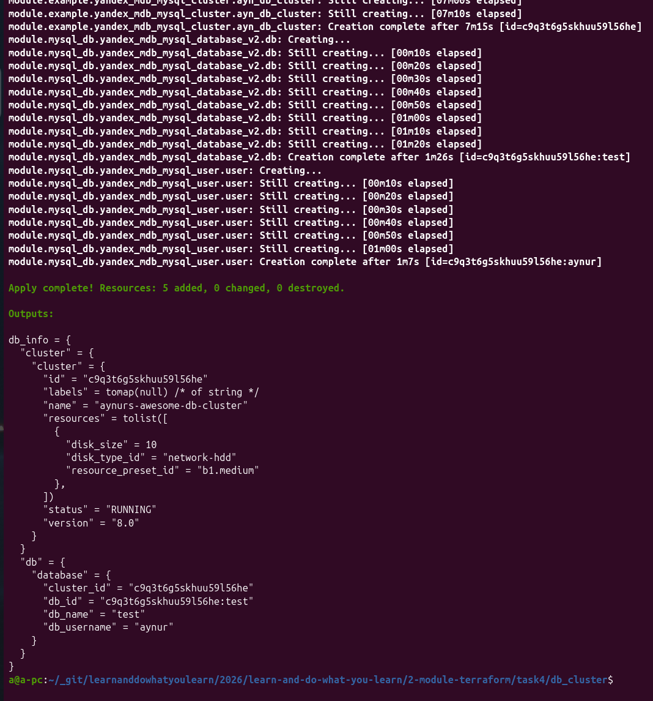

Информация о кластере в веб консоли ЯО:
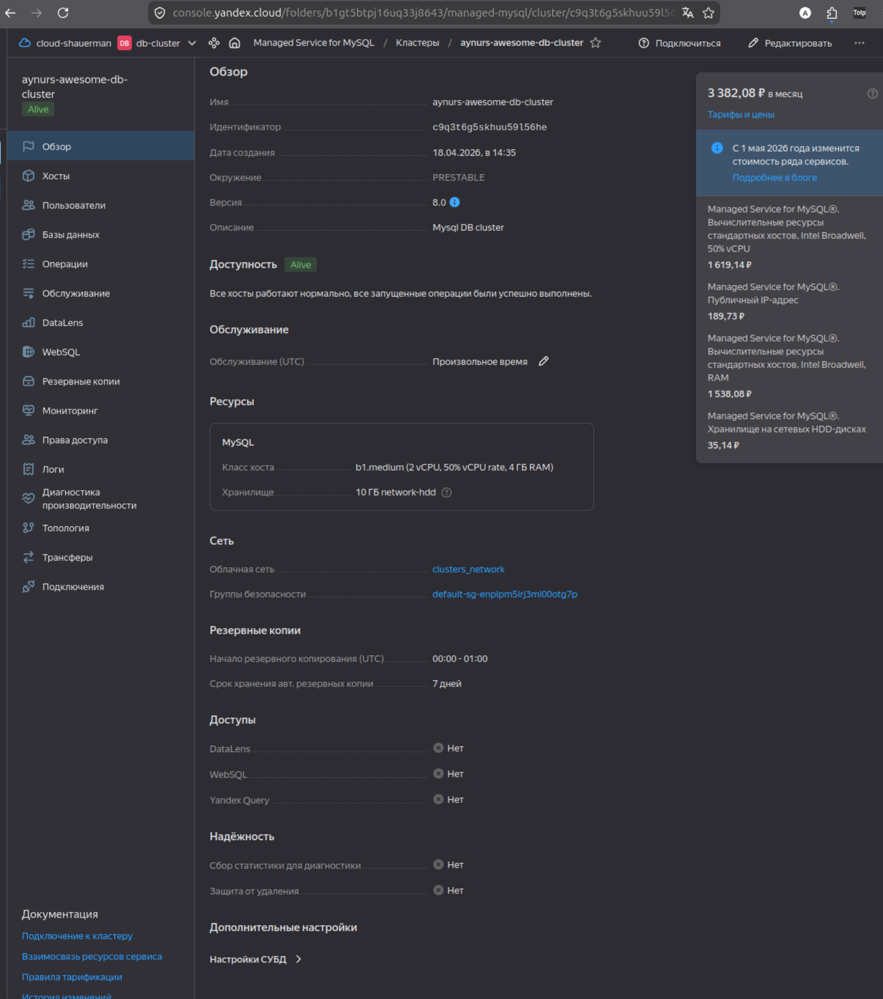

Информация о хосте в веб консоли ЯО:
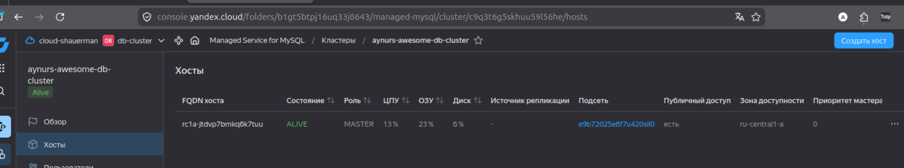

Информация о бд:
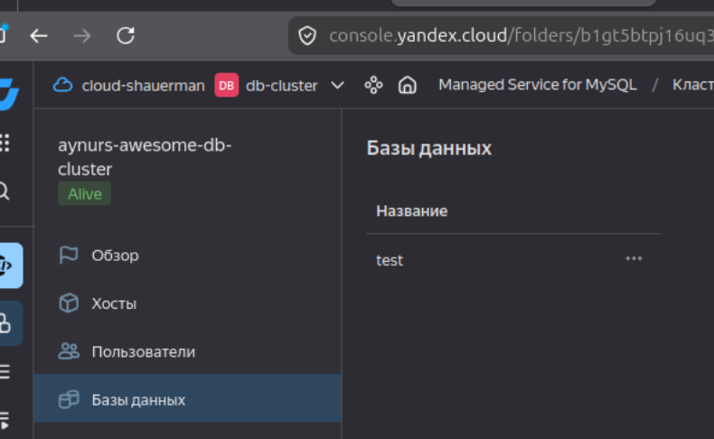

Тут есть подсказка, как подключиться к бд, коей я воспользовалась:
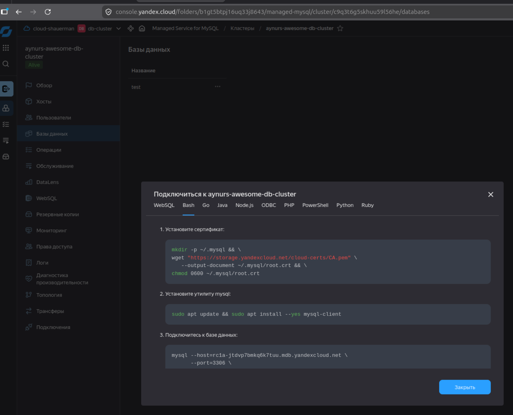

Моей воспользование - зашла в mysql, потыкала, работает.
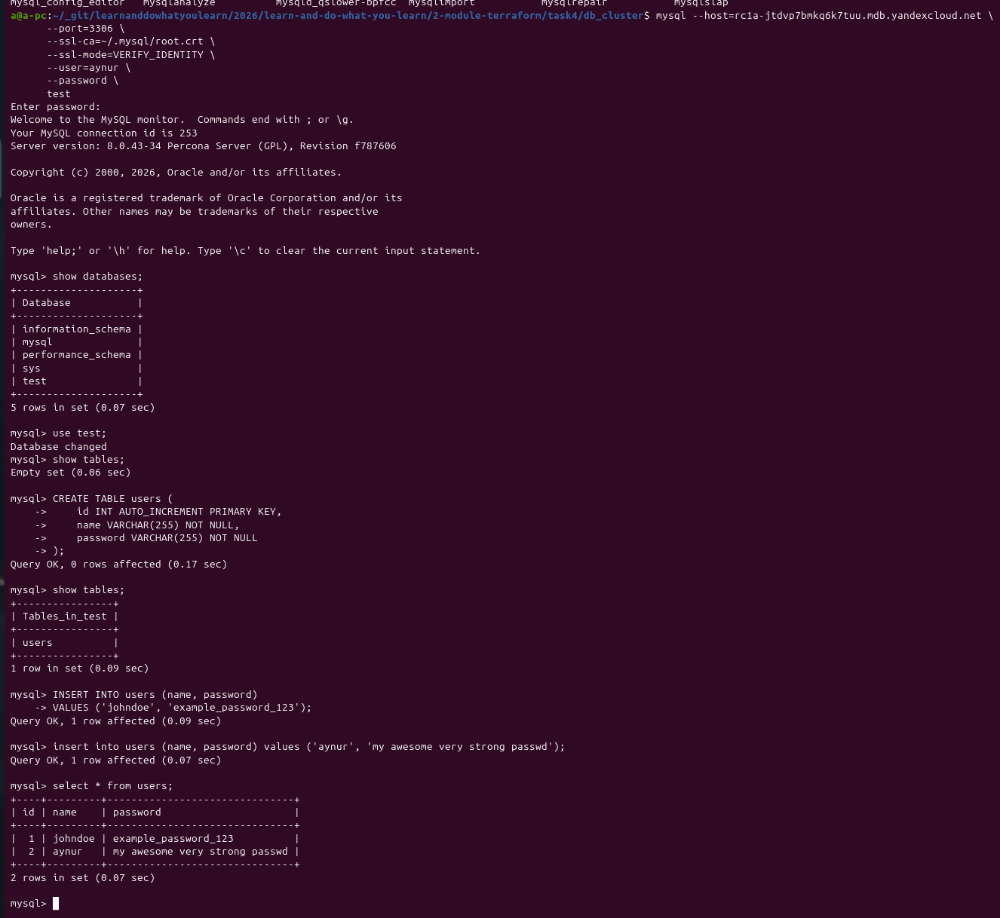

Это я в personal.auto.tfvars добавила информцию об ещё одном хосте - каждый хост должен быть в отдельном subnet:

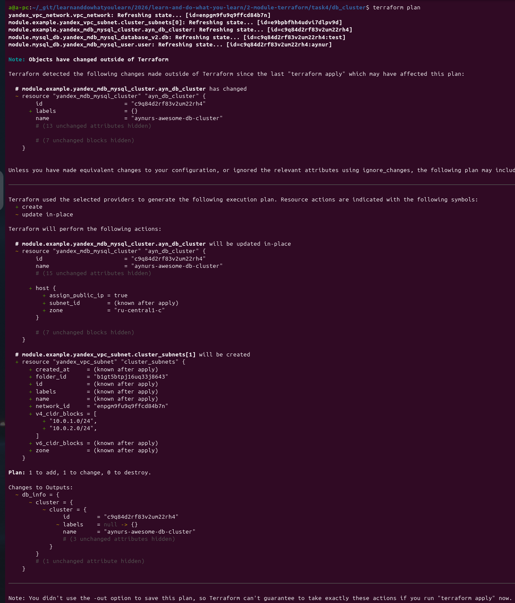

Изменения применились:
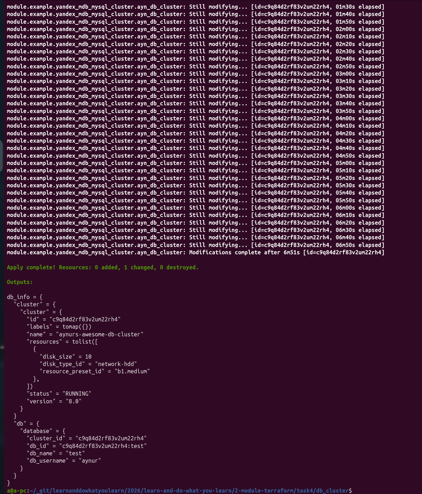
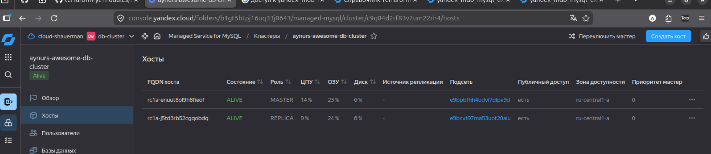

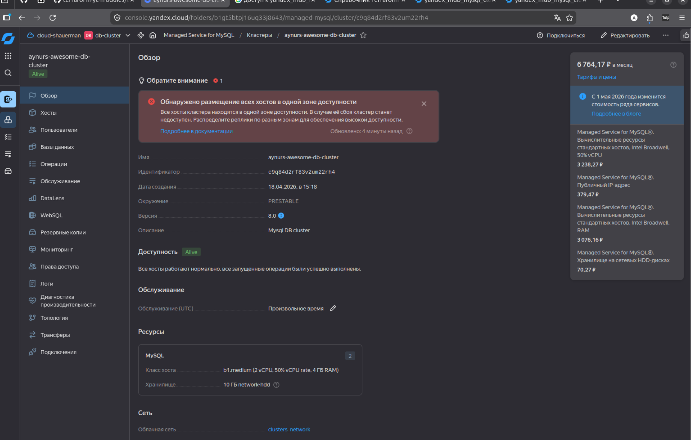


## Задание 6*

[Code of using module simple s3](./s3yc/main.tf)

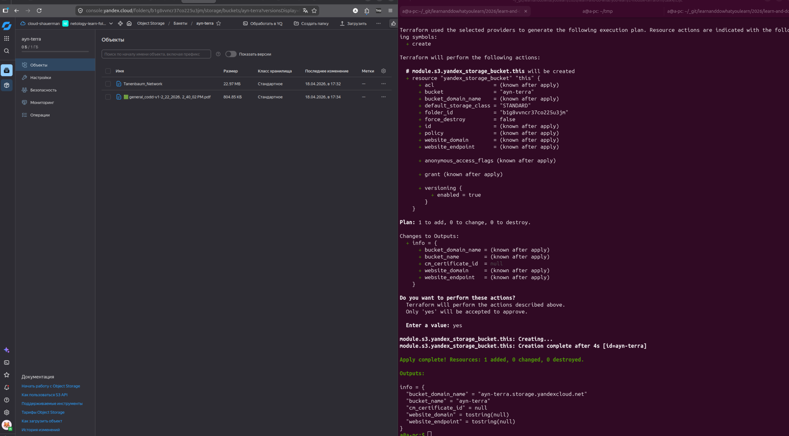

## Задание 7*


[Проект terraform with vault](./vault/)

Vault локально из компоуза:

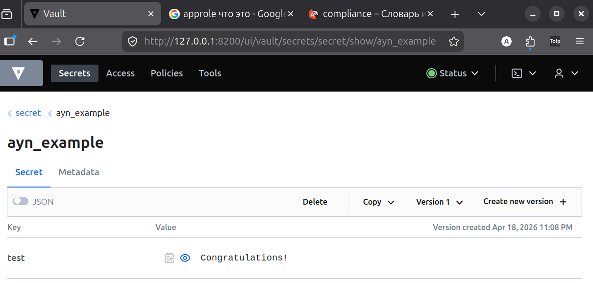

`Terraform plan`, then `apply`:
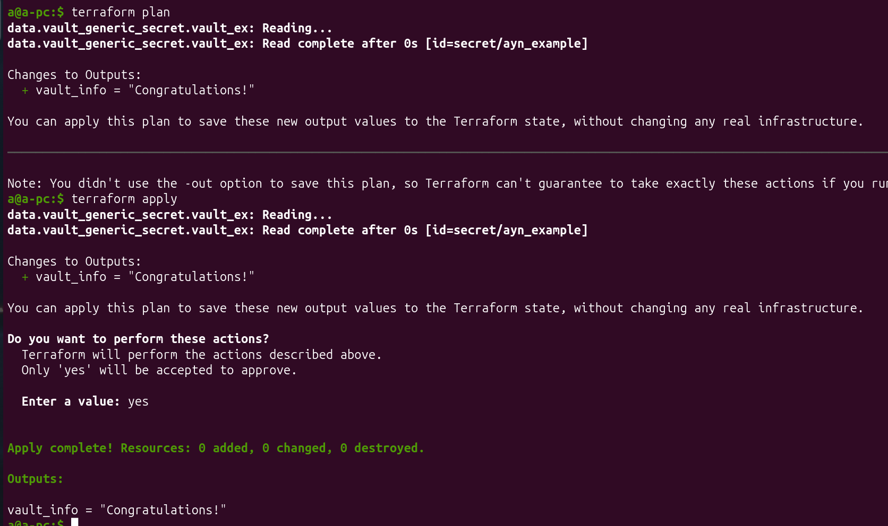

`Terraform console`:

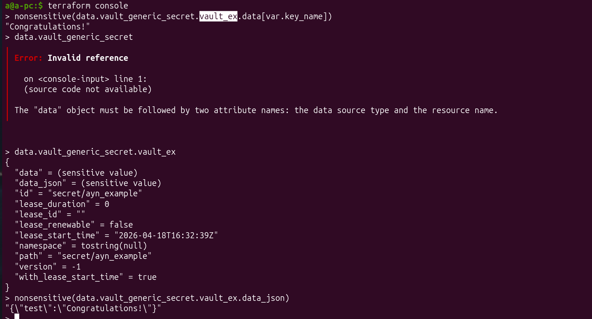

## Задание 8*

Ура! Получилось таки настроить s3. Решила заюзать `terramate` - очень понравился инструмент, люблю оптимизацию.

`terramate.tm.hcl` хранит общие блоки для `vpc` & `vms`. Конечно, `terramate list` показывает папочку `vault` тоже, но там уже сгенерено, и не мешает.

File: [terramate.tm.hcl](./terramate.tm.hcl)

`terramate` файлы [vpc](./vpc/) & [vms](./vms/) в соотвествующих папках:
```
|- terramate.tm.hcl
|- vpc
   |-- vpc.tm.hcl
   |-- personal.auto.tfvars
|- vms
   |-- vms.tm.hcl
   |-- personal.auto.tfvars
   |-- cloud-init.yml
```

Сгенерированные файлы добавила в гитигнор для чистоты и сохранения глазов ваших.
Бакет использовала из предыдущего задания. Стейт каждого модуля в своей папке:
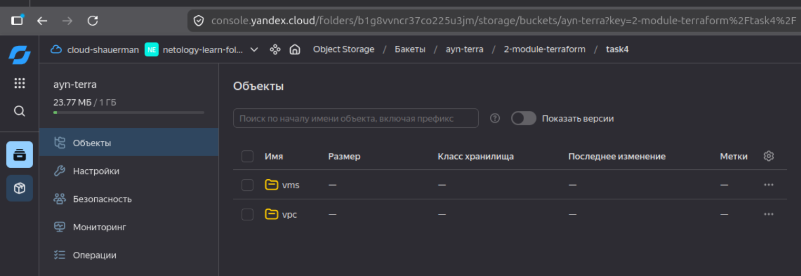


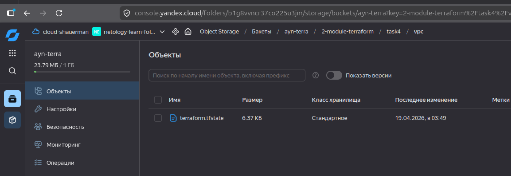


