# [Домашнее задание к занятию «Продвинутые методы работы с Terraform»](https://github.com/netology-code/ter-homeworks/blob/main/04/hw-04.md)

## Задание 1

* Список созданных ресурсов с помощью удаленного модуля от udjin10,
* Получение IP адресов,
* Вход по этим адресам на 2 машины - маркетинг и аналитика,
* Проверка в каждой установленного прокси-сервера c командой `sudo nginx -t`.


Вывод консоли ВМ yandex cloud с их метками:


<details>
<summary>bash</summary>

```bash
$ yc compute instance list --format json --jq '.[] | {name: .name, labels: .labels, ip: .network_interfaces[0].primary_v4_address.one_to_one_nat.address}'
{
  "ip": "111.88.245.130",
  "labels": {
    "owner": "aynur",
    "project": "analytics"
  },
  "name": "analytics-aynurs-vm-0"
}
{
  "ip": "111.88.254.2",
  "labels": {
    "owner": "aynur",
    "project": "marketing"
  },
  "name": "marketing-aynurs-vm-0"
}
```
</details>

`terraform console` ->  `module.marketing_vm`


`terraform console` ->  `module.analytics_vm`


## Задание 2

1. [Локальный модуль vpc](./src/modules/vpc/main.tf)

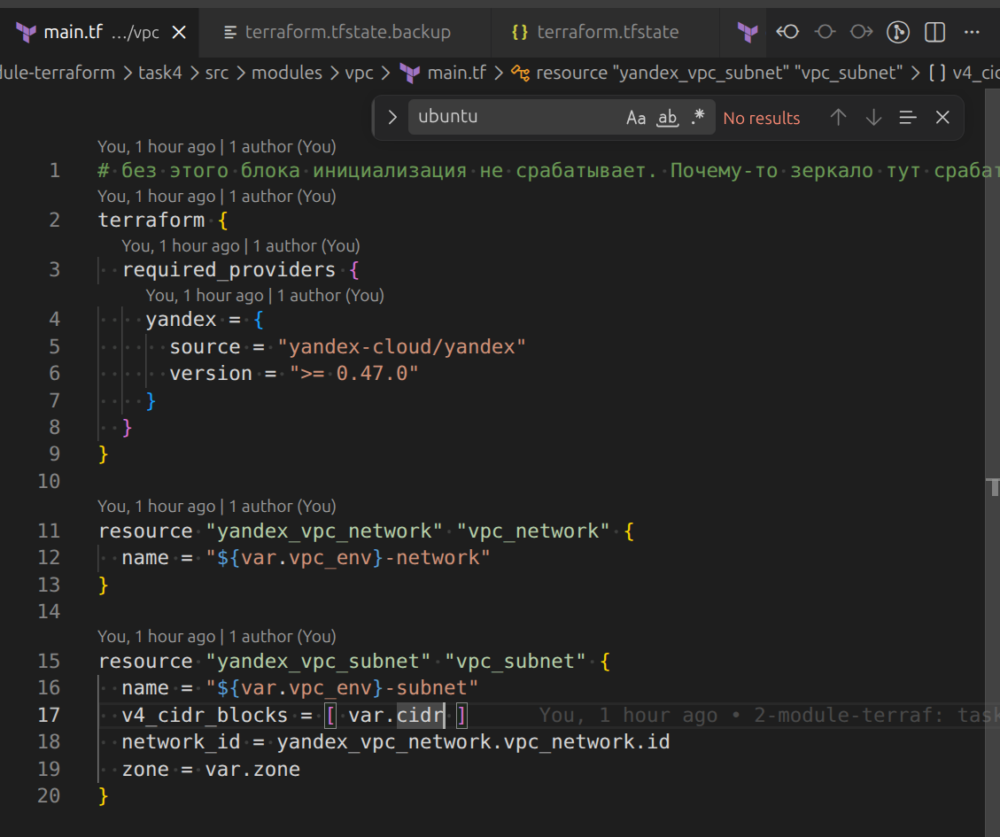


2. [Использоание модуля в основном проекте](./src/main.tf#L1)

3. Посмотрим в `terraform console` о модуле информацию:
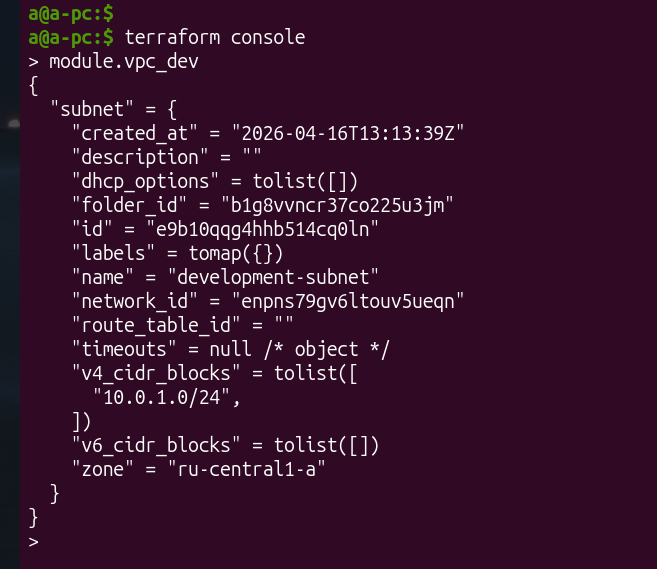

Соотвестствует [outputs.tf](./src/modules/vpc/outputs.tf)

4. В [модули ВМ для маркетинга](./src/main.tf#L11) и [ВМ для аналитиков](./src/main.tf#L43) передаю параметры на выходе модуля `vpc`.

5. [Документация, сгенерированная с `terraform-docs`](./src/modules/vpc/readme.md)

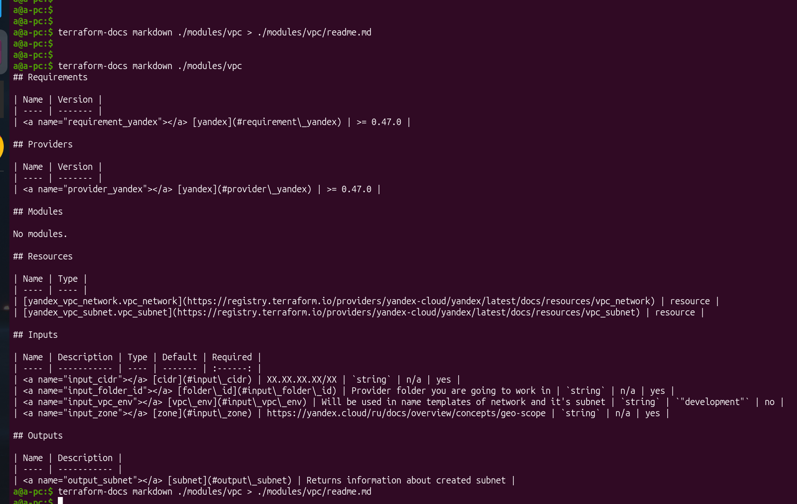
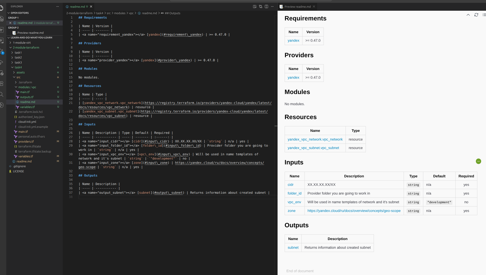

## Задание 3

* список ресурсов в стейте.
* удаление из стейта модуль vpc.
* удаление из стейта модуль vm.

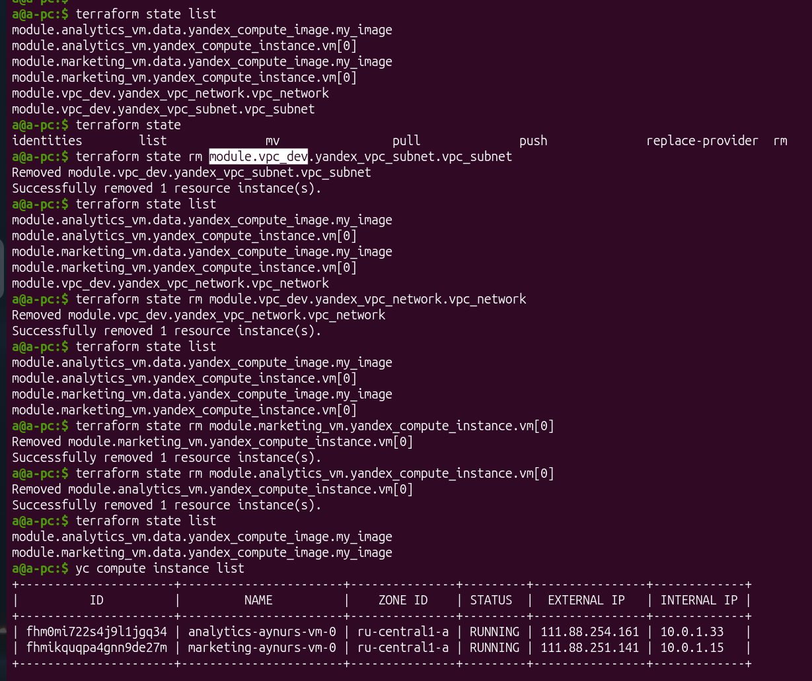

Импортируйте всё обратно:

* импортирование ВМ

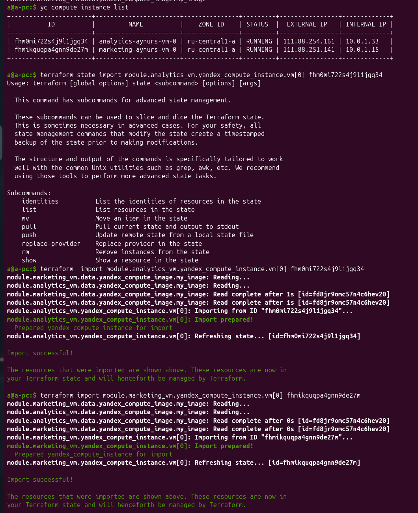

* импортирование сети и подсети

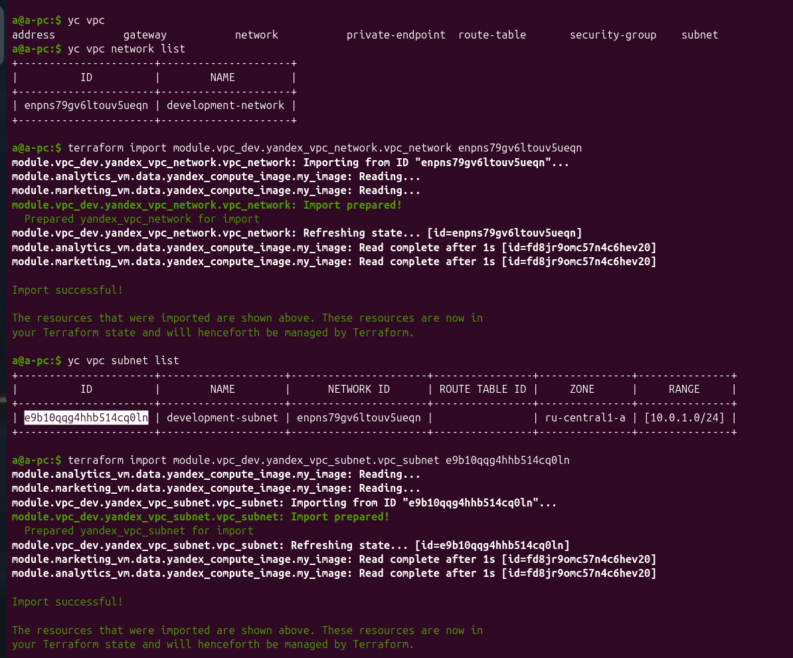

* `terraform plan`

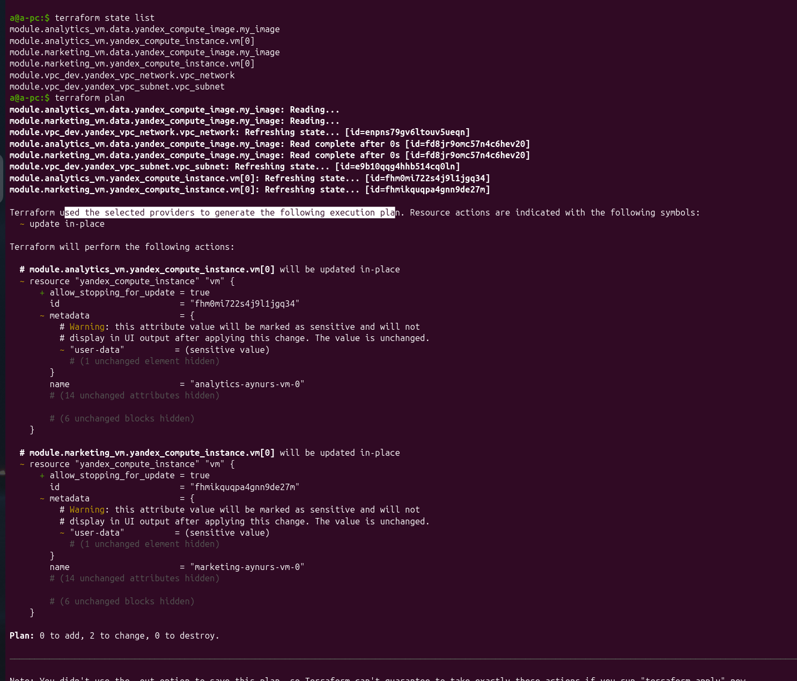

## Задание 4

Скриншот кода ( а то вдруг опять изменить надо будет, а я их по коммитам не делаю):
* модуль vpc
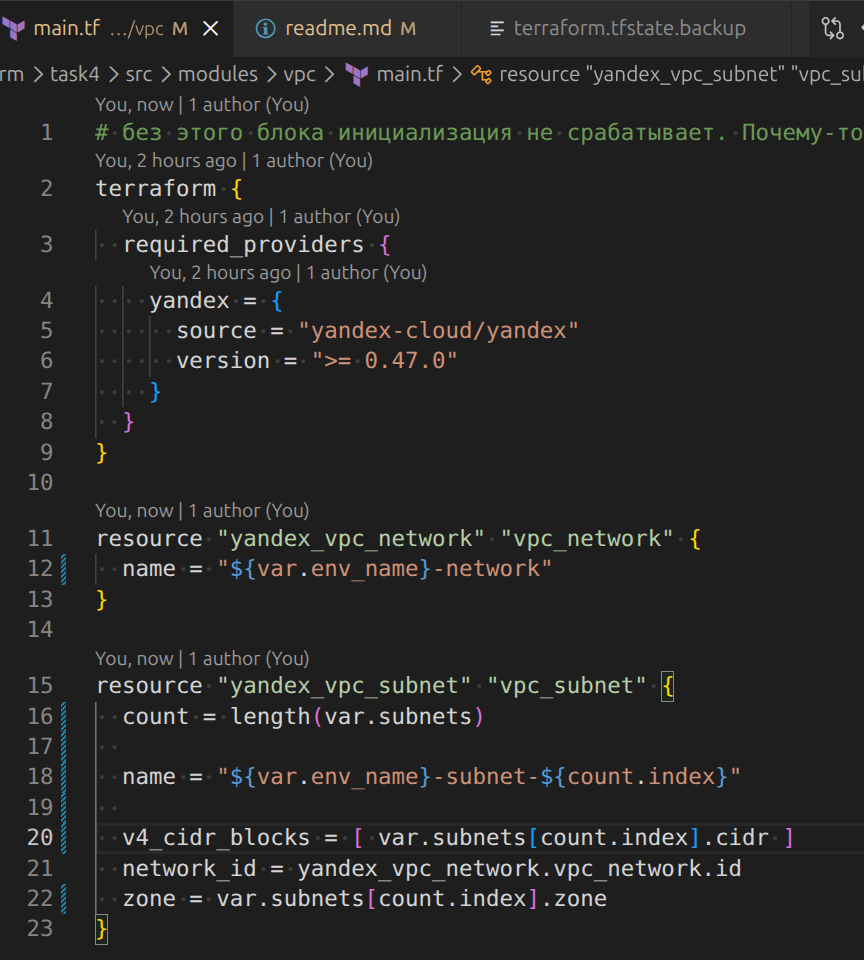
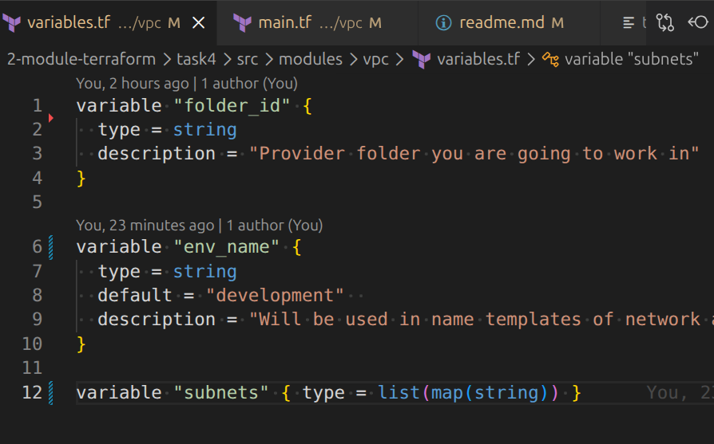
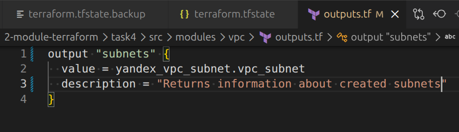

* использоание модуля. Правда, vpc_prod я нигде не использую, просто создала для тестов.

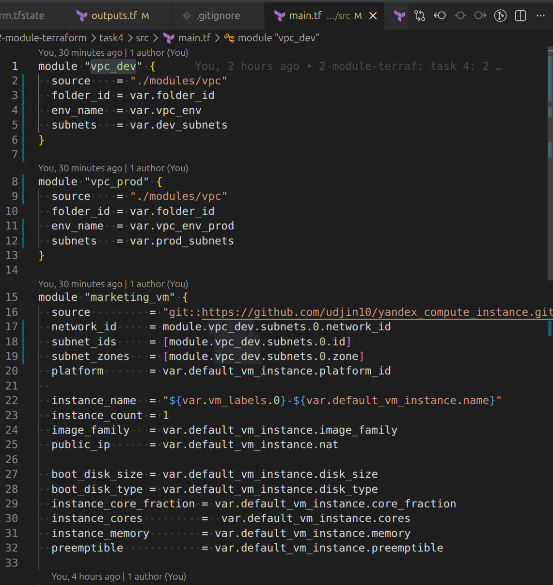

* посмотреть список созданных сущностей в yc cli - я в подсетях ВМ не создавала
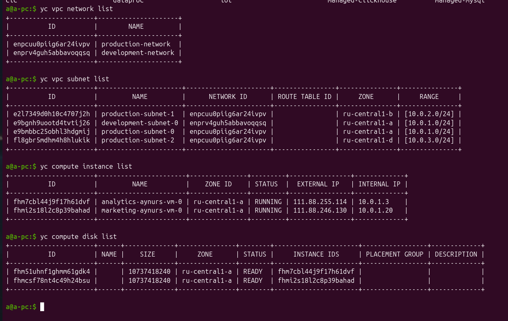

* кусок `terraform plan` простыни
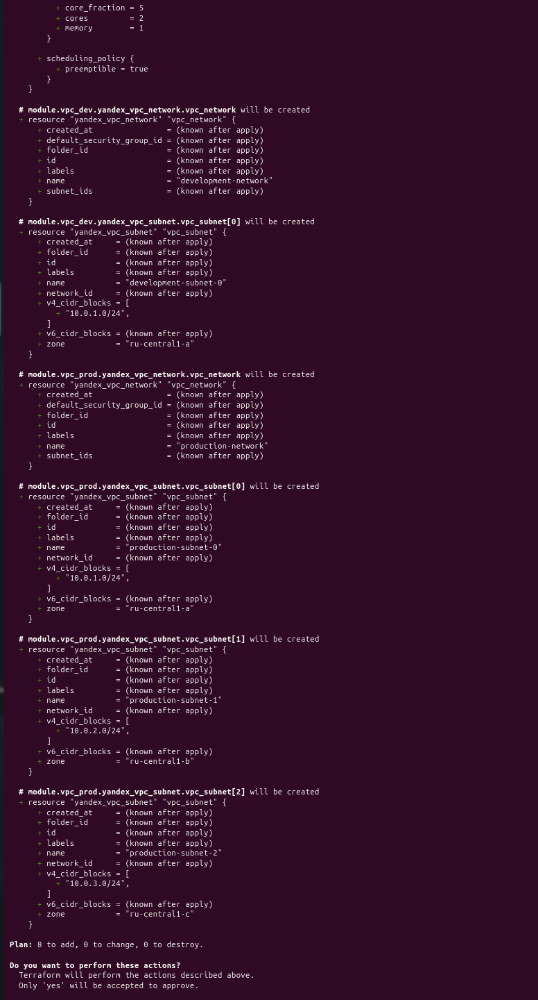

## Задание 5*
## Задание 6*
## Задание 7*
## Задание 8*

