# [Домашнее задание к занятию 1 «Введение в Ansible»](https://github.com/netology-code/08-ansible-01-base_02.25)

## 1 localhost чтение переменной

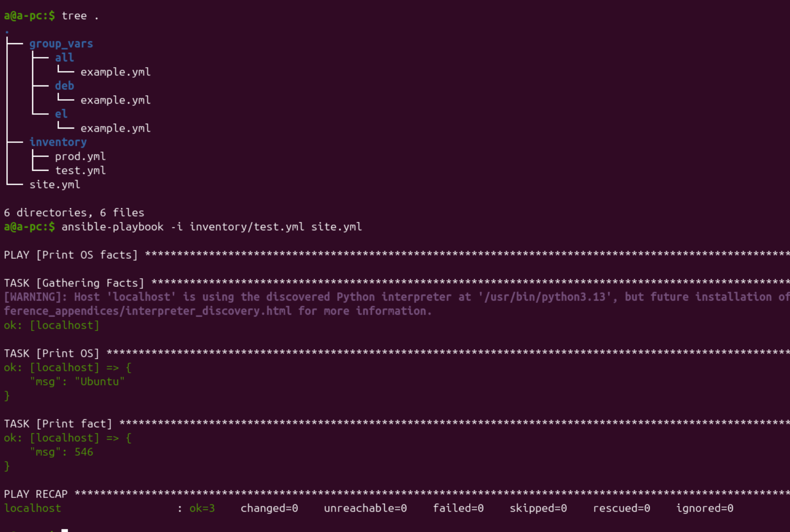

## 2 localhost чтение измененённой переменной

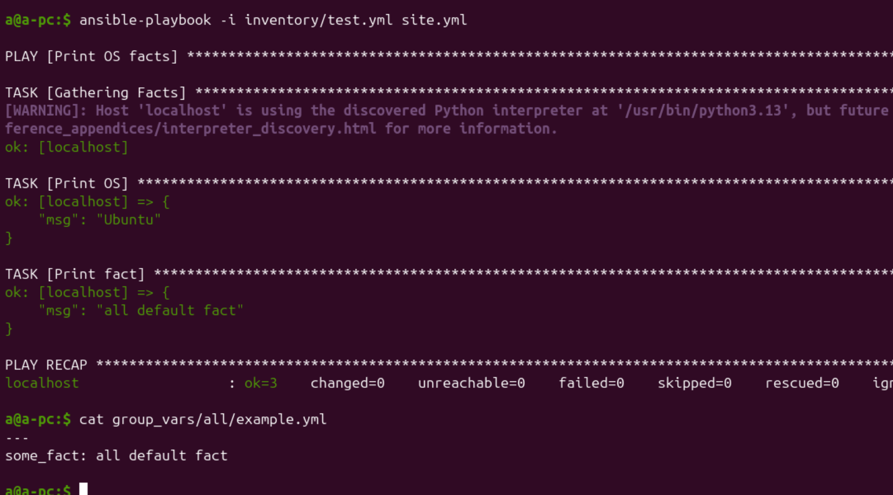

## 3 Подготовка окружения

Подняла 2 контейнера с `centos7` и `ubuntu`, установила в каждый `python3`

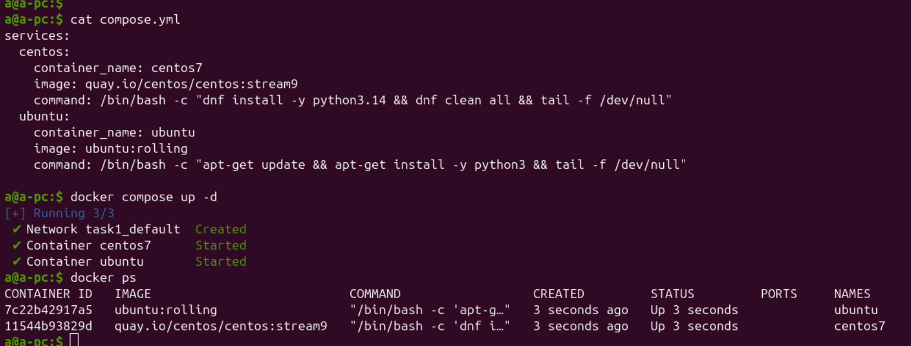

## 4 Запуск `playbook` на окружении `prod.yml`

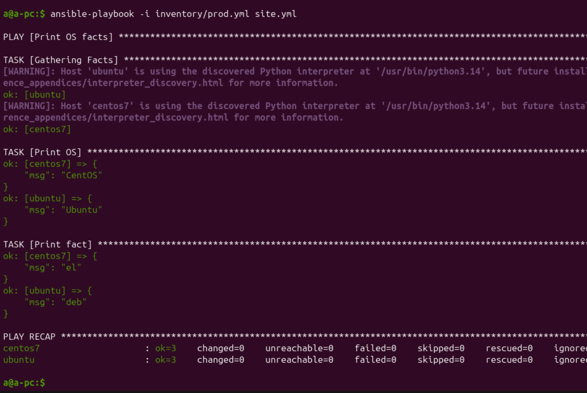

## 6 Запуск `playbook` повтор

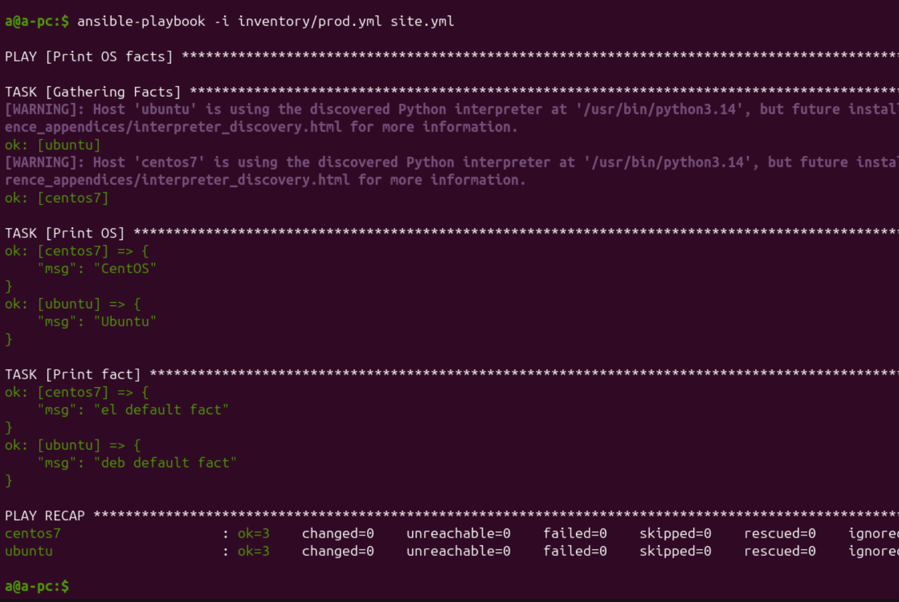

## 7 Зашифровала факты в `group_vars/deb` и `group_vars/el`

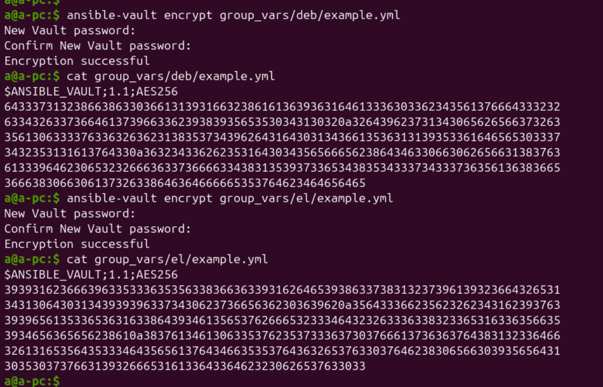

## 8 Запуск `playbook`

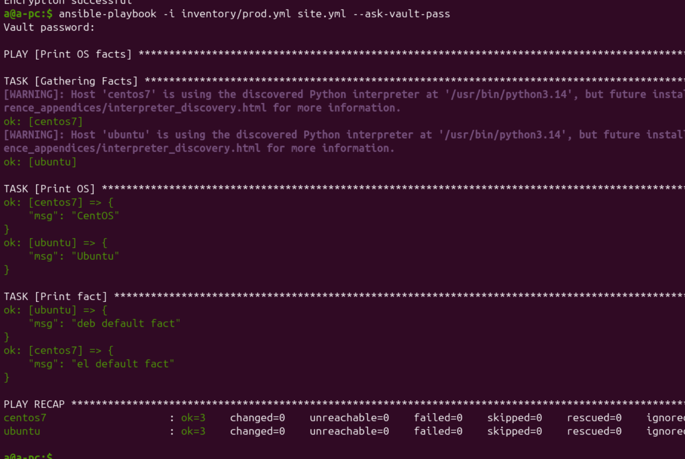

## 9 Cписок плагинов для подключения (`--type connection`)

В задании использован `local`

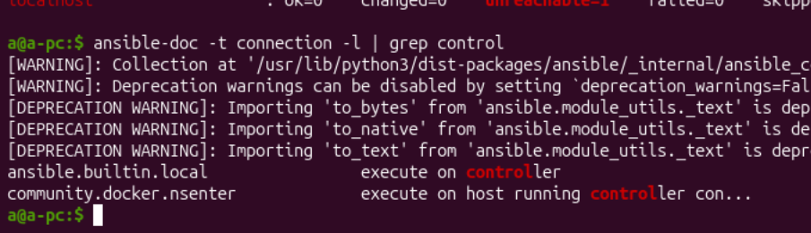

## 10 Добавила в группу хостов `local`

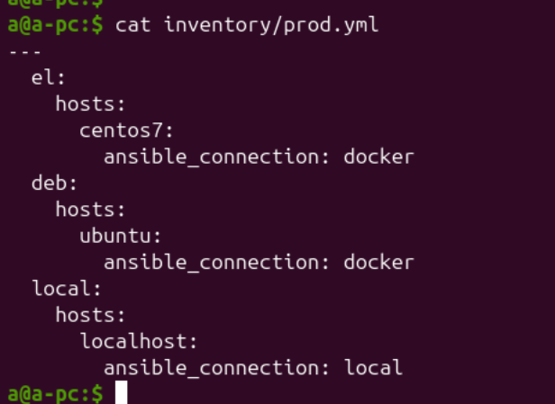

## 11 Запуск `playbook`

Для `local` нет своей директории определения перемнной `some_fact`, поэтому берётся значение из файлы переменных `all`.

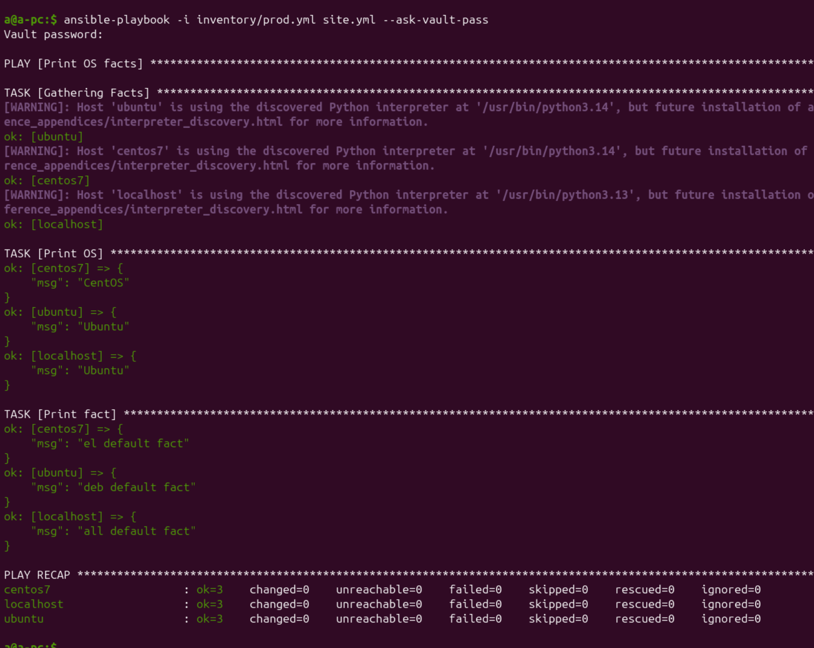

## Необязательная часть

## 1 ansible-vault decrypt

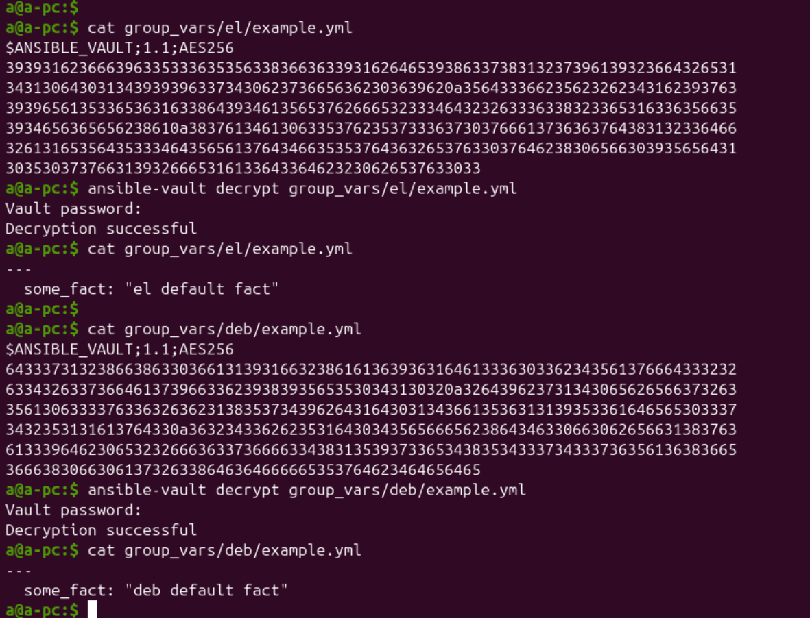

## 2 encrypt all some_fact

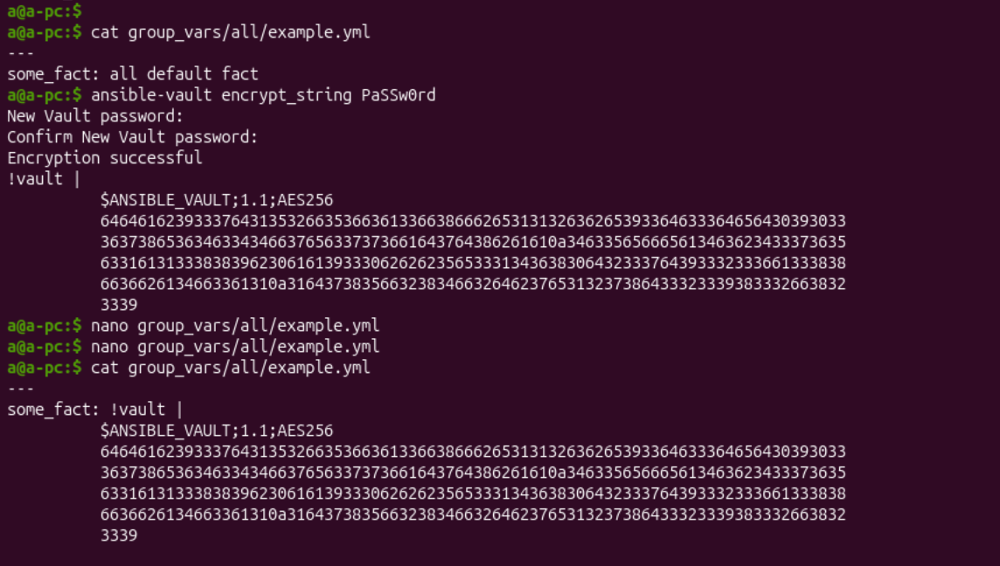

## 3 Запуск `playbook`

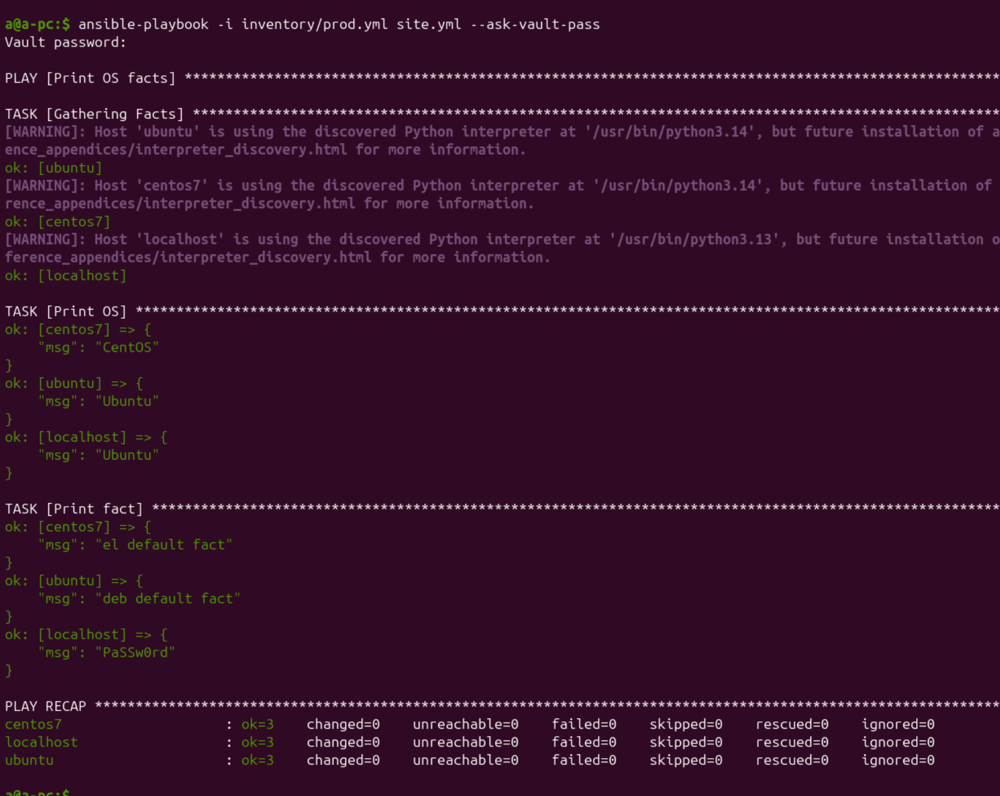

## 4 fedora

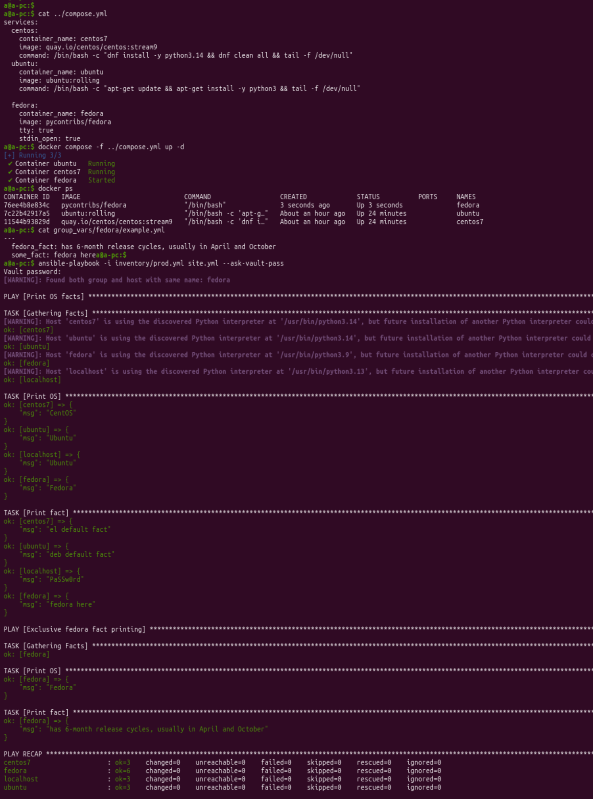

## 5 bash script

Доработаю компоуз файл так, чтобы контейнеры запустились только в случае полного установления питона. Для этого добавляю блок healthcheck к каждому сервису в compose.yml.


<details>
<summary>compose.yml</summary>

```yaml
services:
  centos:
    container_name: centos7
    image: quay.io/centos/centos:stream9
    command: /bin/bash -c "dnf install -y python3.14 && dnf clean all && tail -f /dev/null"
    healthcheck:
      test: ["CMD", "python3", "--version"]
      interval: 10s
      timeout: 5s
      retries: 3
  ubuntu:
    container_name: ubuntu
    image: ubuntu:rolling
    command: /bin/bash -c "apt-get update && apt-get install -y python3 && tail -f /dev/null"
    healthcheck:
      test: ["CMD", "python3", "--version"]
      interval: 10s
      timeout: 5s
      retries: 3
  fedora:
    container_name: fedora
    image: pycontribs/fedora
    tty: true
    stdin_open: true
    healthcheck:
      test: ["CMD", "python3", "--version"]
      interval: 10s
      timeout: 5s
      retries: 3
```
</details>

<details>
<summary>Bash script</summary>

```bash
#!/bin/bash
echo "--- 1. Running docker containers"
docker compose up -d

while [ "$(docker inspect -f '{{.State.Health.Status}}' ubuntu centos7 fedora | grep -c "healthy")" -ne 3 ]; do
    echo "...waiting for all containers to be healthy"
    sleep 2
done


echo
echo "--- 2. See docker container's list"
docker compose ps

echo
echo "--- 3. Run playbook"
cd playbook
ansible-playbook -i inventory/prod.yml site.yml --ask-vault-pass

echo
echo "--- 4. Stop docker containers"
cd ../
docker compose down

echo
echo "--- 2. See docker container's list"
docker compose ps
```

</details>


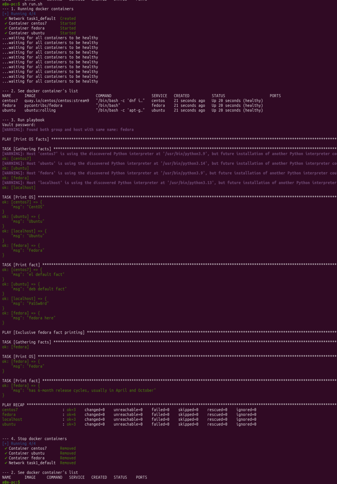
