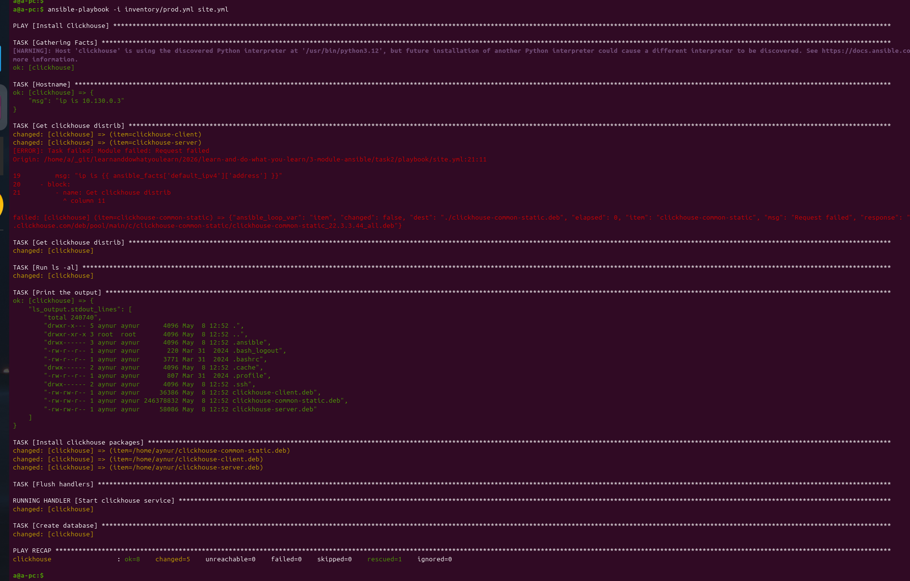
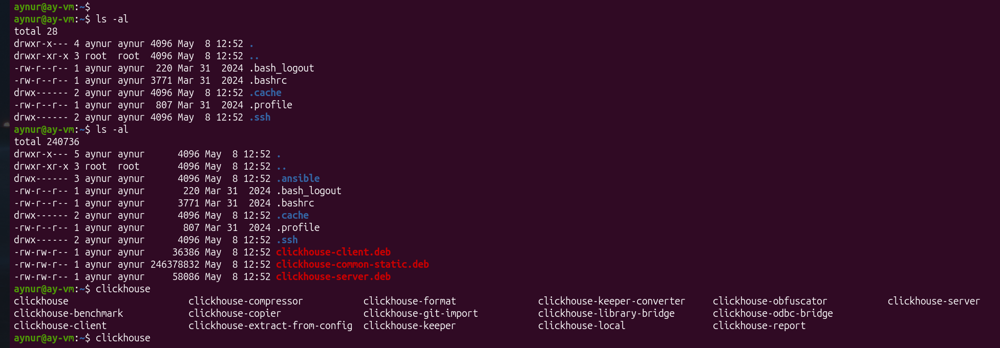
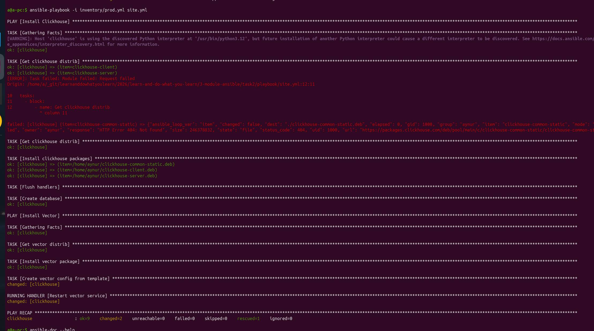
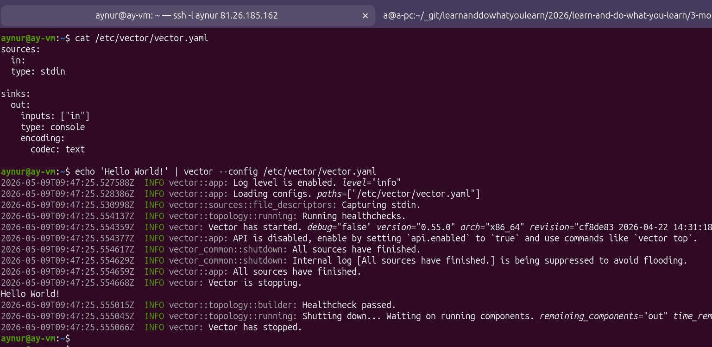
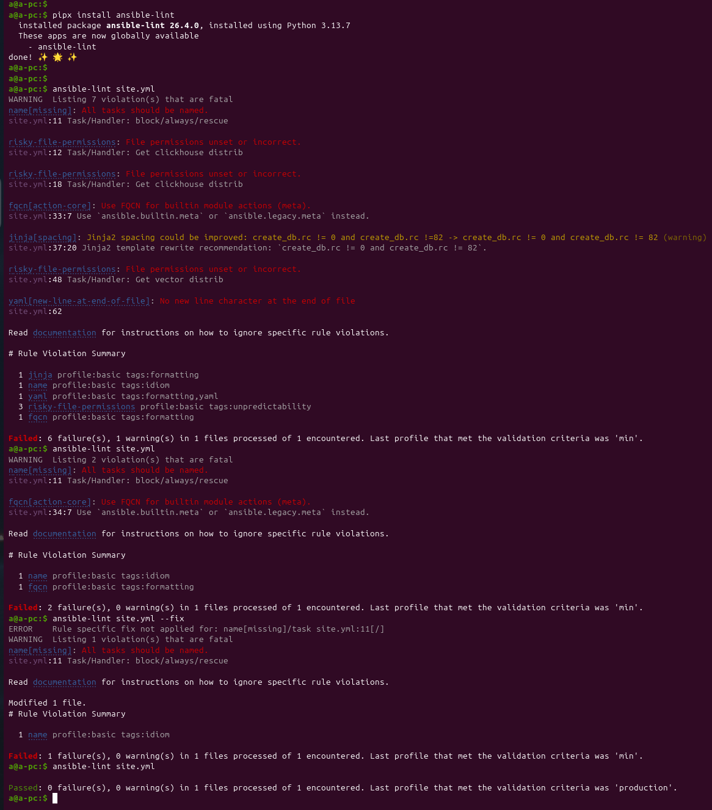
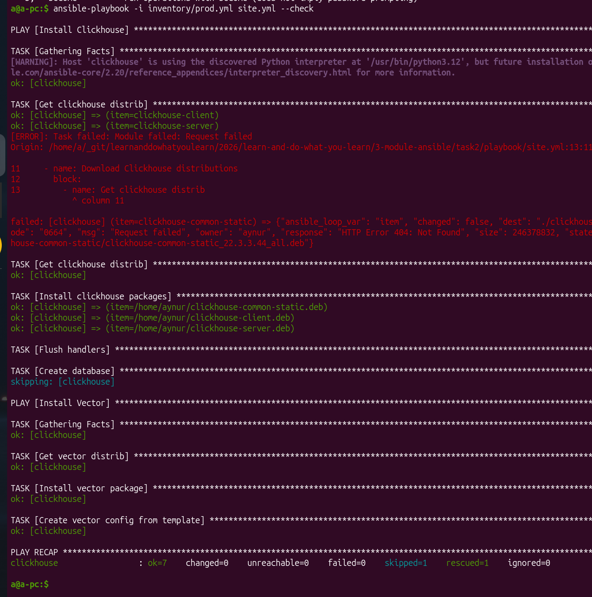
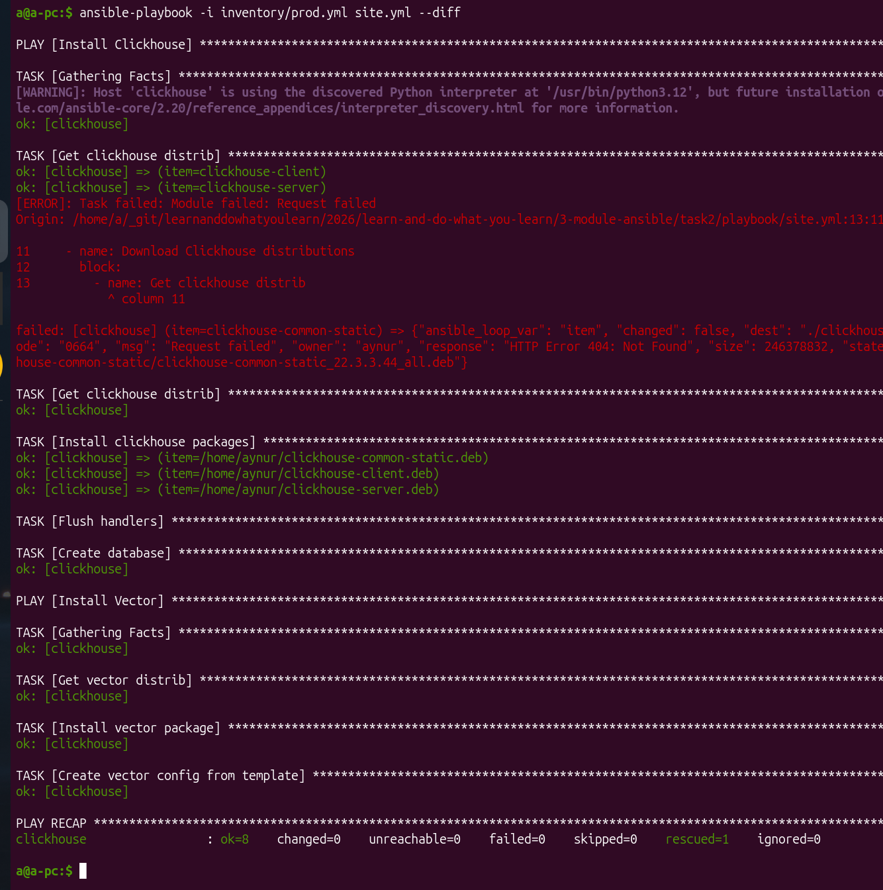

# [Домашнее задание к занятию 2 «Работа с Playbook»](https://github.com/netology-code/08-ansible-02-playbook_02.25)

## 1 Установила Clickhouse на удалённую ВМ в ЯО

На удалённоё ВМ установлен Убунту, так что пришлось поменять ссылки для загрузки Кликхауса и найти модуль `apt` для установки пакетов загруженных.




## 2 Install Vector `play`

```yaml
- name: Install Vector
  hosts: clickhouse
  handlers:
    - name: Restart vector service
      ansible.builtin.service:
        name: vector
        state: restarted
  tasks:
    - name: Get vector distrib
      ansible.builtin.get_url:
        url: "https://packages.timber.io/vector/{{ vector_version }}/vector_{{ vector_version }}-1_amd64.deb"
        dest: "./vector.deb"
    - name: Install vector package
      ansible.builtin.apt:
        deb: "./vector.deb"
    - name: Create vector config from template
      ansible.builtin.template:
        src: "vector.yml.j2"
        dest: "/etc/vector/vector.yaml"
        mode: "0644"
        owner: vector
        group: vector
      notify: Restart vector service
```



Проба конфигурационного файла с простейшим примером с сайта `vector` на виртуальной машине:



## 5 `ansible-lint site.yml`

Все ошибки, предупреждения были исправлены:



## 6 Check прошёл успешно после линта




## 7 Флаг --dDiff



## 8 [Playbook readme is in the playbook folder](./playbook/readme.md)