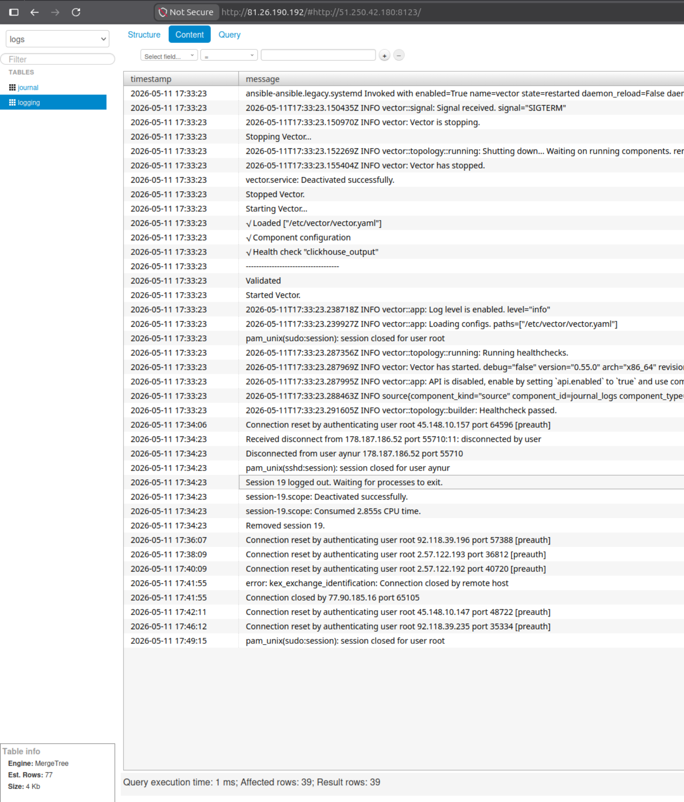

# Proxmox Log Management Pipeline (Lighthouse, ClickHouse, Vector)

Этот проект автоматизирует развертывание системы сбора и визуализации логов.
* Terraform: Создает виртуальные машины в YandexCloud.
* Ansible: Устанавливает и связывает компоненты системы.

## Архитектура

* **Vector**: Собирает системные логи (journald) и отправляет их в ClickHouse.
* **ClickHouse**: Высокопроизводительная БД для хранения логов.
* **Lighthouse**: Веб-интерфейс для выполнения SQL-запросов к ClickHouse.

Структура проекта
```
$ tree .
.
├── host_vars
│   ├── clickhouse
│   │   └── vars.yaml
│   ├── lighthouse
│   │   └── vars.yml
│   └── vector
│       └── vars.yml
├── inventory
│   └── prod.yml
├── play.yml
├── readme.md
└── roles
    ├── clickhouse
    │   ├── handlers
    │   │   └── main.yml
    │   └── tasks
    │       └── main.yml
    ├── lighthouse
    │   ├── handlers
    │   │   └── main.yml
    │   ├── tasks
    │   │   └── main.yml
    │   └── templates
    │       ├── lighthouse.conf.j2
    │       └── lighthouse_config.js.j2
    └── vector
        ├── handlers
        │   └── main.yml
        ├── tasks
        │   └── main.yml
        └── templates
            └── vector.yml.j2

18 directories, 15 files
```

## Требования
* Установленный Terraform и Ansible.
* Аккаунт в YandexCloud

## Быстрый старт
### 1. Инфраструктура (Terraform)
Перейдите в папку terraform и запустите:
```bash
cd vms
terraform init
terraform plan
terraform apply
```

После завершения вы увидите, что в папке `inventory` появился файл `prod.yml` c хостами для `Ansible playbook`.

2. Запуск `ansible-playbook`

```bash
ansible-playbook -i inventory/prod.yml play.yml
```

### Как пользоваться системой

#### Доступ к UI

Откройте в браузере IP машины Lighthouse.
Если данные не подтянулись автоматически, введите в настройках подключения IP сервера ClickHouse и порт 8123.

Если всё прошло успешно, вы можете видеть логи в браузере по адресу:

    http://<LIGHTHOUSE-IP>/#http://<CLICKHOUSE-IP>:8123/

что-то похожее на это:


### Проверка данных в ClickHouse
Зайдите на сервер ClickHouse и проверьте поступление логов:

```
clickhouse-client -q "SELECT count() FROM logs.logging"
```


Разработчик: Aynur Shauerman
Лицензия: MIT