# [Домашнее задание к занятию 3 «Использование Ansible»](https://github.com/netology-code/mnt-homeworks/tree/MNT-video/08-ansible-03-yandex)

## 1 Terraform проект для создания ВМ и автогенерации `inventory` файла

1. Написала создание ВМ-ов и генерацию `inventory` файла по шаблону в [vms/inventory.tf](./vms/inventory.tf) с помощью `terraform`. Проект находится в папке [vms](./vms/).
Это помогает мне не копировать вручную IP адреса ВМ.
Но после создания ВМ приходится зайти в каждую машину, чтобы они записались в `known_hosts` моего локального ПК

## 2 Отладка (читай мучения)

После этого я создавала [playbook](./playbook/play.yml). По мере написания и отладки, количество кода росло соответсвенно нюансам, поэтому роли я засунула по папкам.

Плейбук не срабатывал сразу, гранит грызся постепенно.

**2.1**
В попытке ниже я допустила опечатку в ключевом слове `sql` `EXISTS`:
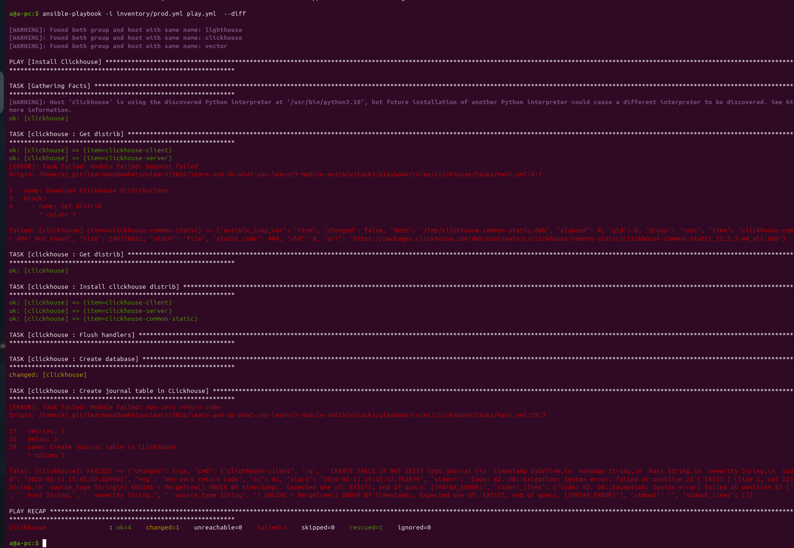

Ниже я успешно закончил с кликзаусом:
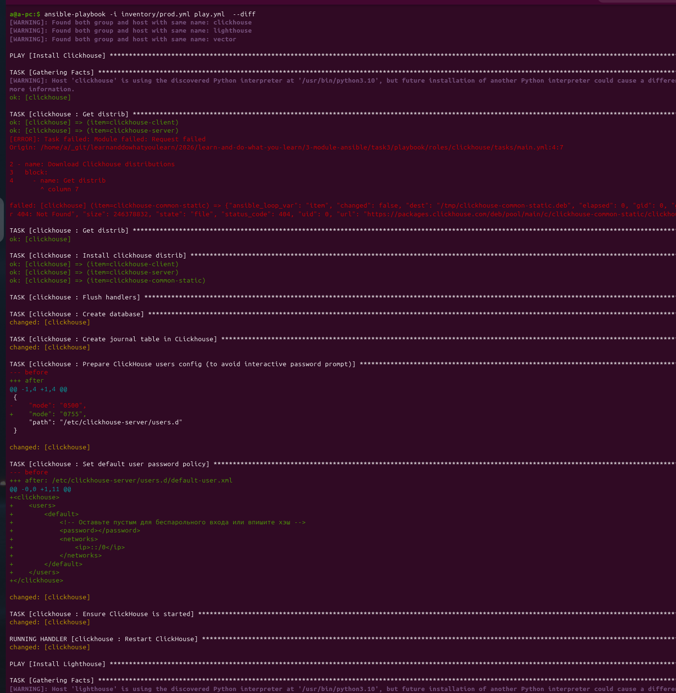

**2.2**
и приступаю к лайтхаусу:
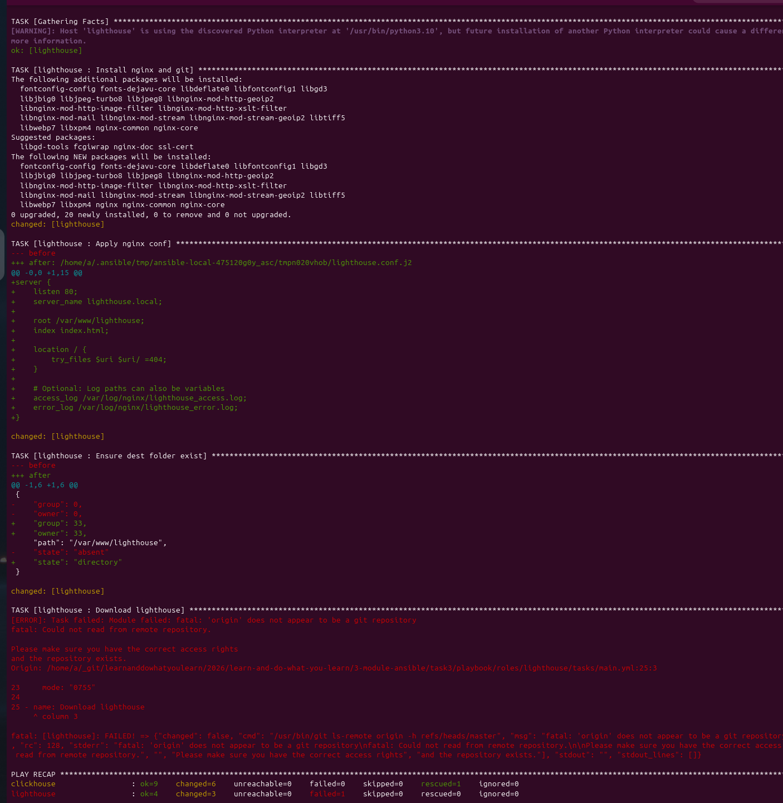
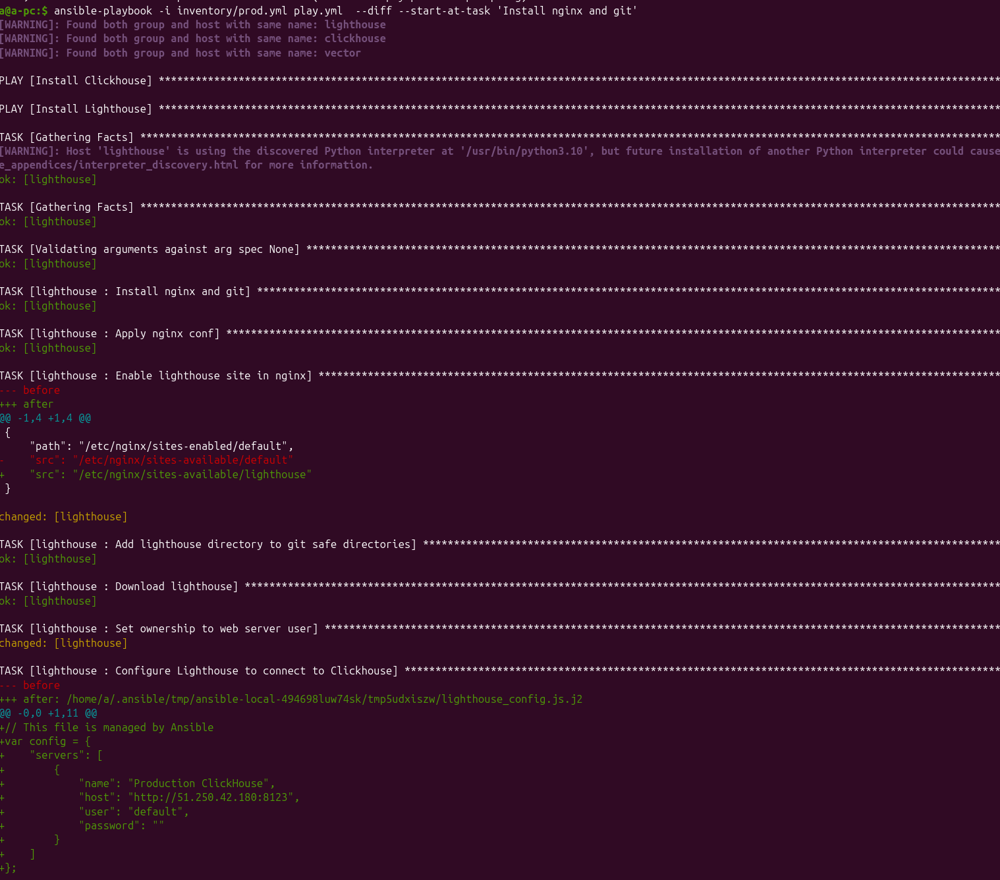

**2.3** Отладка с `vector`
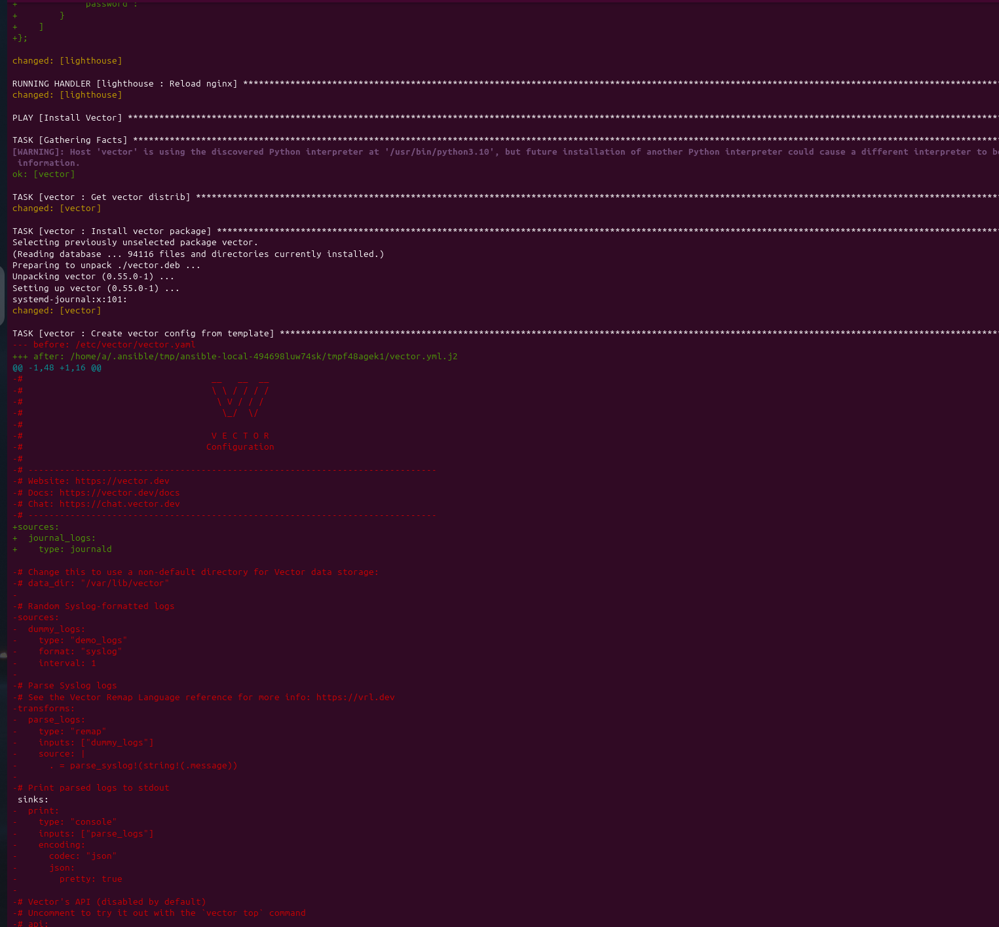
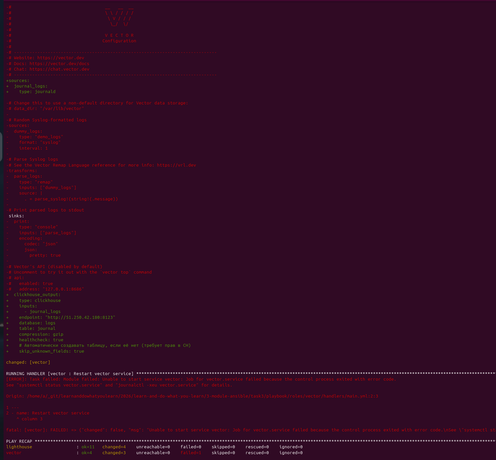

Вроде что-то оживает:
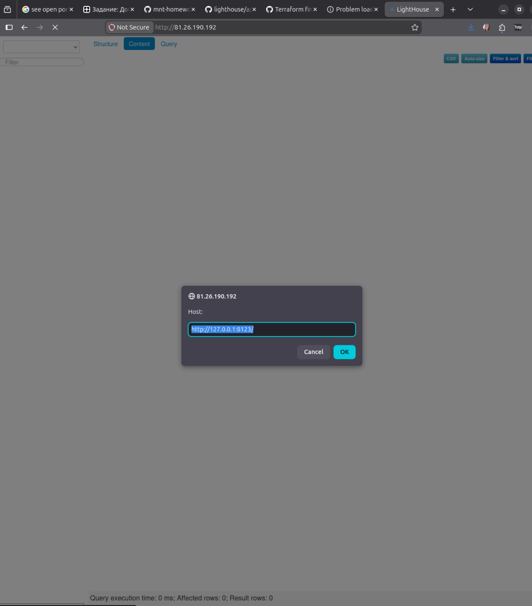
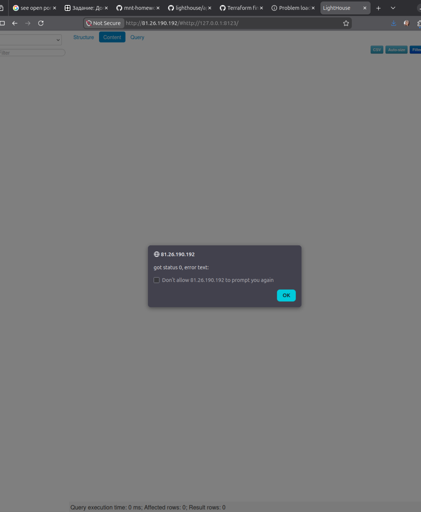

Были проблемы с отправкой с `vector` сообщений к `clickhouse`. Переписав несколько раз [vector.yml.j2](./playbook/roles/vector/templates/vector.yml.j2) я наконец начала получать данные в `clickhouse`
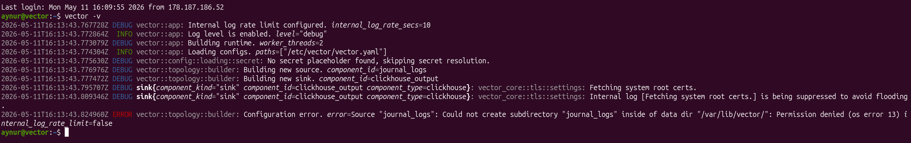
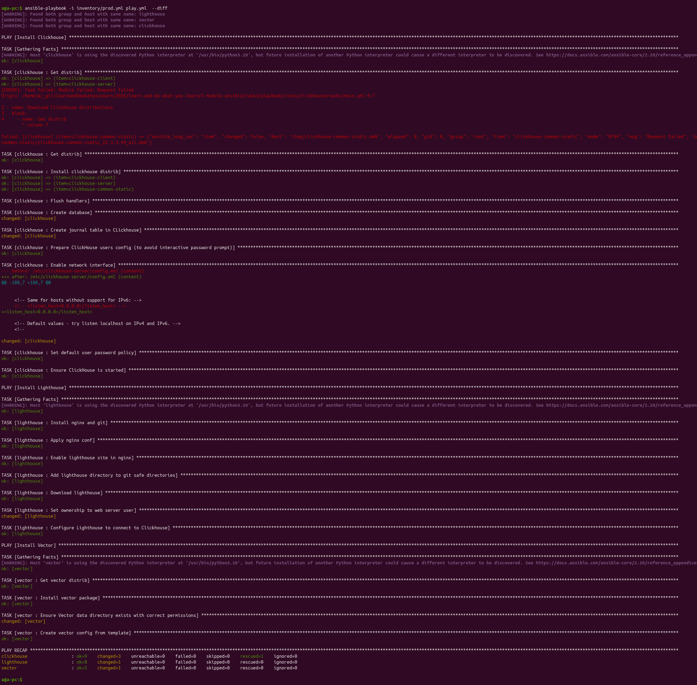
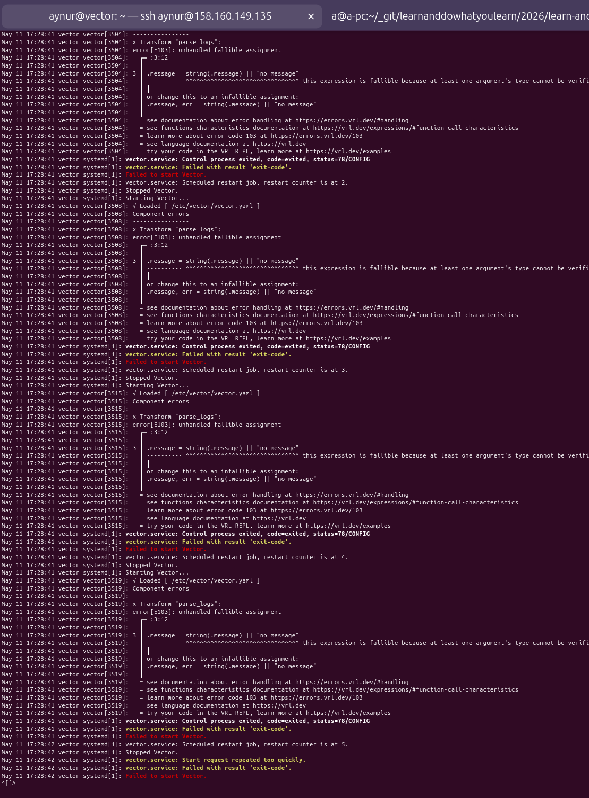
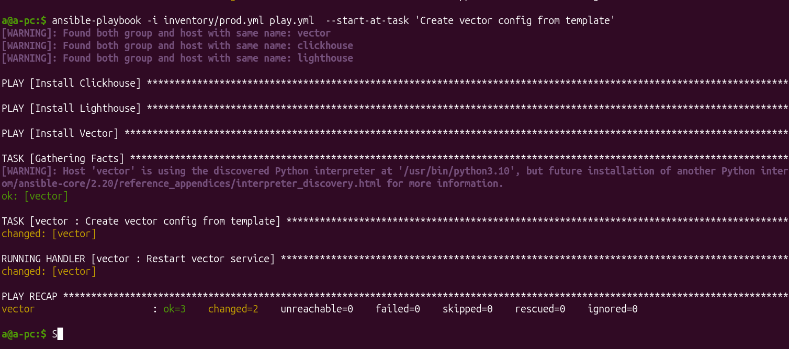

Результат в lighthouse выглядит таким образом:

