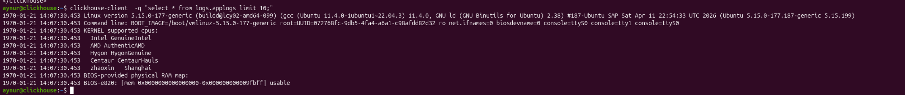
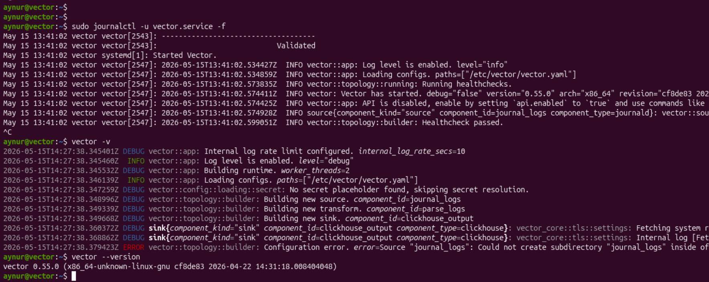
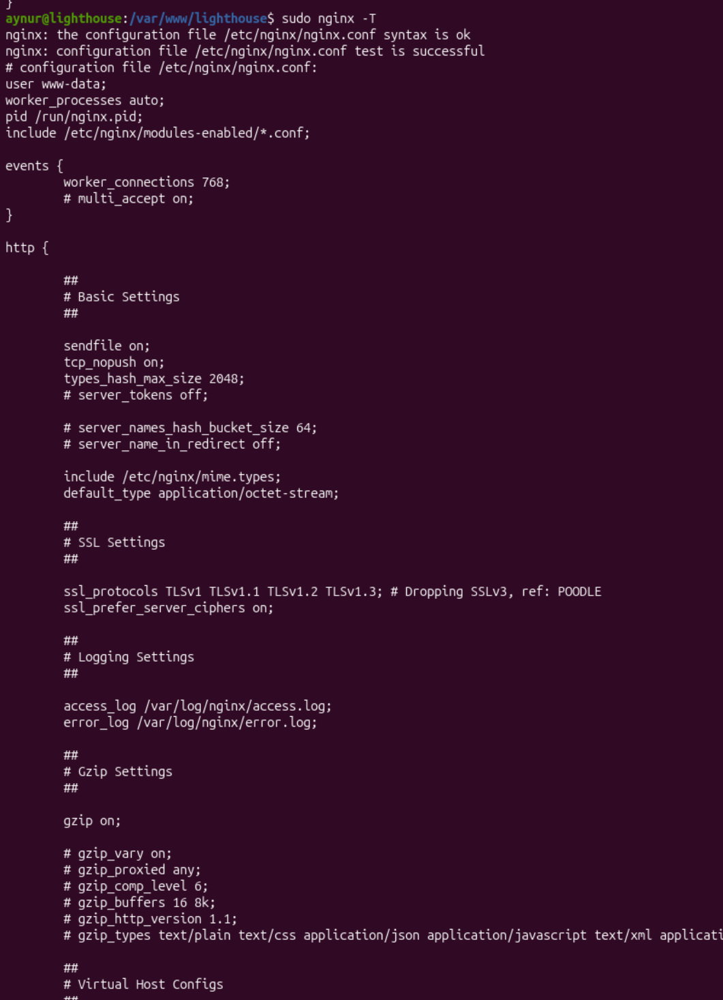
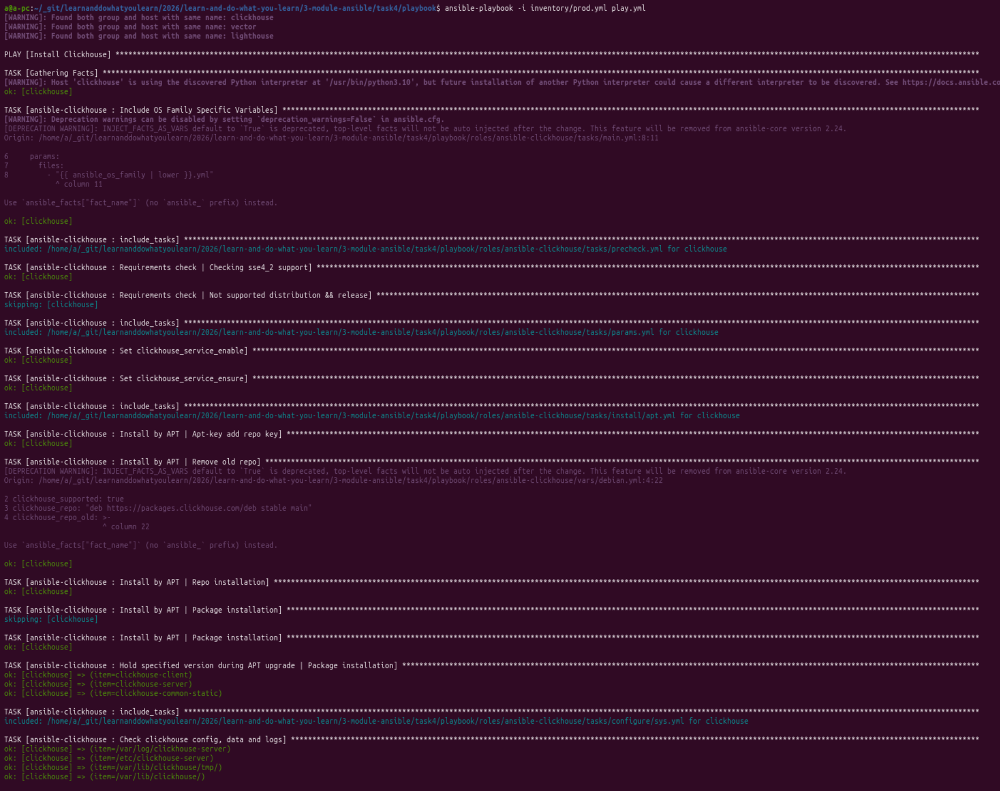
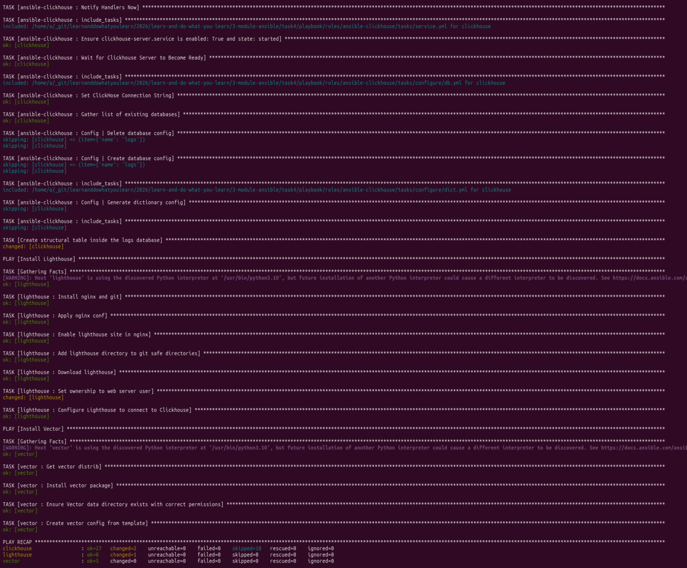
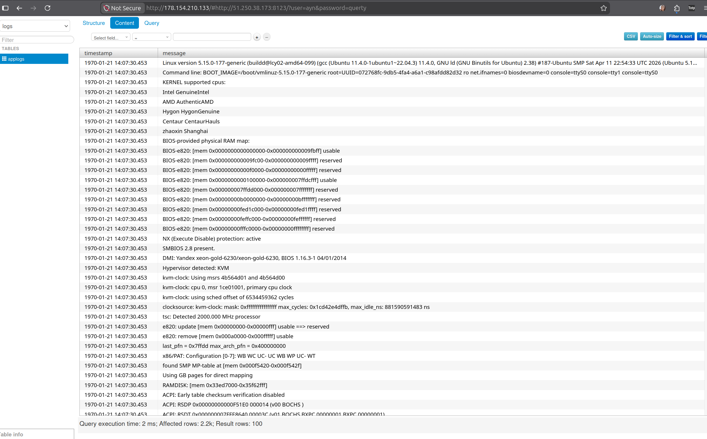

# [Домашнее задание к занятию 4 «Работа с roles»](https://github.com/netology-code/mnt-homeworks/blob/MNT-video/08-ansible-04-role/README.md)

1. Создала роли vector-role и lighthouse-role с помошью команды:

```shell
ansible-galaxy role init vector-role/lighthouse-role
```

Для роли clickhouse я пошарившись, решила взять готовый [https://github.com/AlexeySetevoi/ansible-clickhouse](https://github.com/AlexeySetevoi/ansible-clickhouse)

Итого я использовала роли:

* [vector-role](https://github.com/aykuli/vector-role)
* [lighthouse-role](https://github.com/aykuli/lighthouse-role)
* [ansible-clickhouse](https://github.com/AlexeySetevoi/ansible-clickhouse)

Хосты:

1) Clickhouse


2) Vector


3) Lighthouse


Ход работ:




