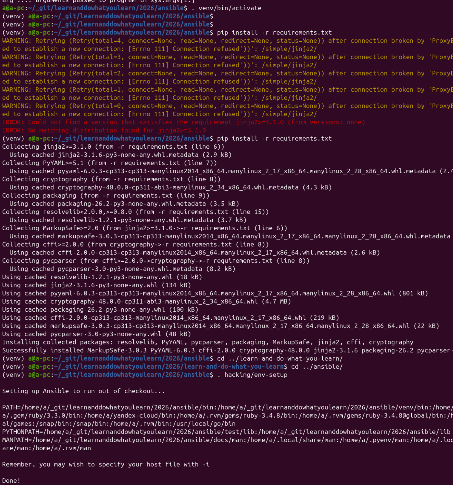
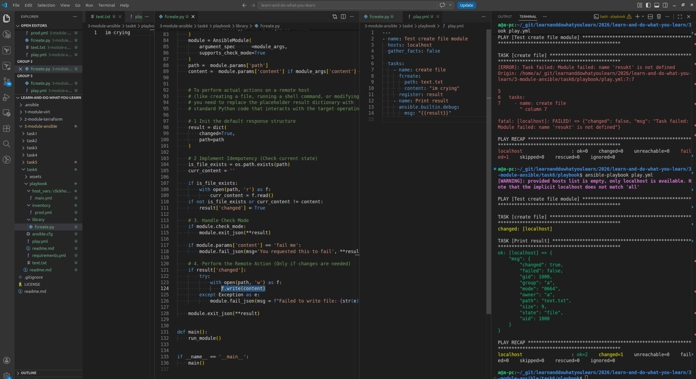

# [Домашнее задание к занятию 6 «Создание собственных модулей»](https://github.com/netology-code/mnt-homeworks/tree/MNT-video/08-ansible-06-module)

prep

сохраню для себя:
1. `git clone git@github.com:ansible/ansible.git`
2. `cd ansible.`
3. Создайте виртуальное окружение: `python3 -m venv venv`.
4. Активируйте виртуальное окружение: `. venv/bin/activate`. Дальнейшие действия производятся только в виртуальном окружении.
5. Установите зависимости `pip install -r requirements.txt`.
6. Запустите настройку окружения `. hacking/env-setup`.
7. Если все шаги прошли успешно — выйдите из виртуального окружения `deactivate`.
8. Ваше окружение настроено. Чтобы запустить его, нужно находиться в директории `ansible` и выполнить конструкцию `. venv/bin/activate && . hacking/env-setup.`

Первый успешный запуск модуля локально. 

