# [Домашнее задание к занятию "13.Системы мониторинга"](https://github.com/netology-code/mnt-homeworks/blob/MNT-video/10-monitoring-02-systems/README.md)


## Обязательные задания

1. Вас пригласили настроить мониторинг на проект. На онбординге вам рассказали, что проект представляет из себя платформу для вычислений с выдачей текстовых отчетов, которые сохраняются на диск. Взаимодействие с платформой осуществляется по протоколу http. Также вам отметили, что вычисления загружают ЦПУ. Какой минимальный набор метрик вы выведите в мониторинг и почему?

**Ответ**:

В описании проблемы есть словосочетания - загружают ЦПУ. 
Проблема может быть из-за некоторых причин:
* дело в коде, 
* нехватке железа
* проблемах с диском.

Я бы посмотрела на метрики 
1. `cpu` (`cat /proc/stat | head -n 1`):

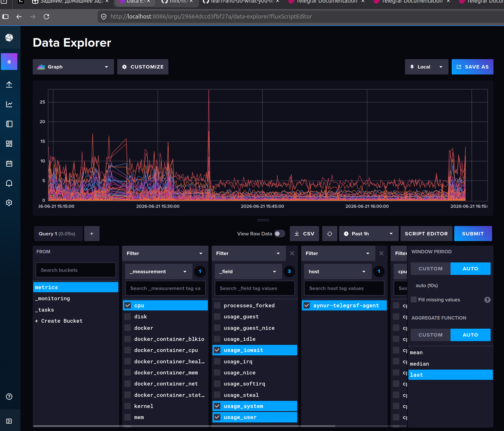

Высокий `usage_user` подтверждает, что идут вычисления. 
Высокий `usage_system` укажет на проблемы с системными вызовами. 
Высокий `usage_iowait` — главный маркер того, что процессор простаивает, ожидая медленной записи отчетов на диск.

2. `inodes_used_percent` - если кончаются свободные `Inodes`, платформа полностью перестанет работать.
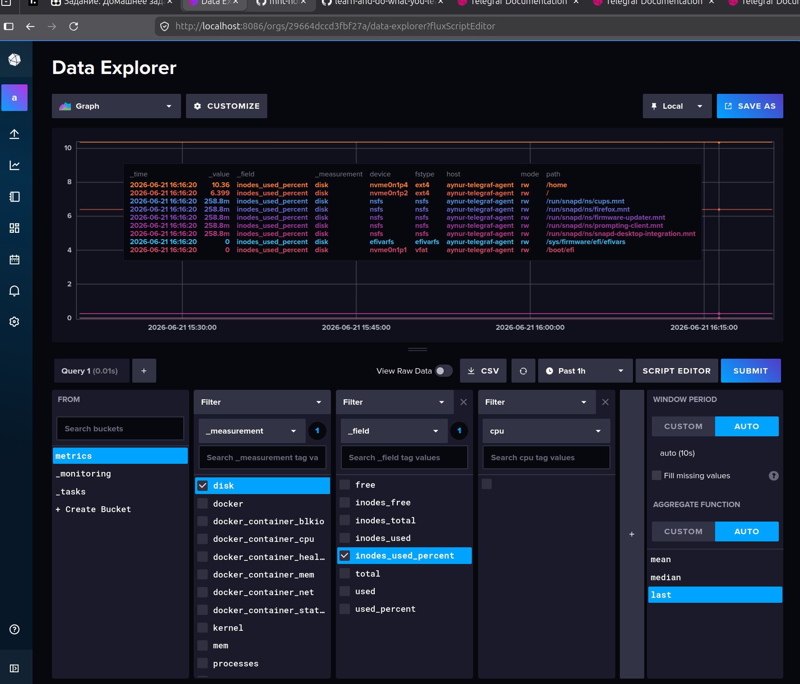

3. `memory_used_percent` - Тяжелые вычисления часто сопровождаются утечками памяти.
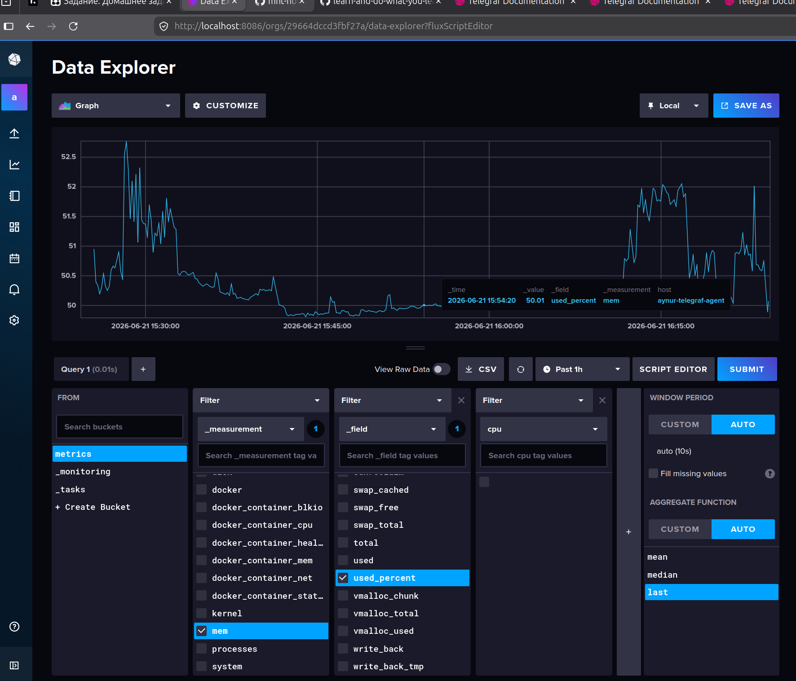


2. Менеджер продукта посмотрев на ваши метрики сказал, что ему непонятно что такое RAM/inodes/CPUla. Также он сказал, что хочет понимать, насколько мы выполняем свои обязанности перед клиентами и какое качество обслуживания. Что вы можете ему предложить?

**Ответ**:
Требуемые значения для мониторинга следует посмотреть в «Соглашения об уровне обслуживания» (SLA).

Упомянутые в задаче метрики `RAM/inodes/CPUla` относятся скорее к SLI (Service Level Indicators) — внутренними техническими индикаторами, которые напрямую вызывают деградацию или полную недоступность сервиса.

Следует прочитать SLA, и выбрать самые информативные показатели для показа менеджеру и создать окошко в дашборде.
Например, если в SLA написано, что SLI должно быть 99%, то в дашборде я бы рассчитывала и показывала этот параметр в процентах по формуле:

$\text{SLI \%} = \frac{\text{summ-2xx-requests + summ-3xx-request}}{\text{summ-all-requests}} \times 100\%$

Однако, количество запросов может быть и много и считать этот параметр с каждым запросом было бы расточительно, поэтому я бы поставила определнный интервал обновления этого параметра. Этот интервал думаю можно было бы выбрать опытным путем. Например, начать с частоты 4 раза в сутки в 8 утра, час дня и 6 часов вечера т 10 часов ночи по Мск. И уже на основе полученных данных и удовлетворенности менеджера уменьшать/увеличивать частоту обновления графика.
Затем следует договориться с менеджером, при каких значениях должно приходить уведоление, что мы приближаемся к отметке неудовлетворенности, или риска выхода на штрафы.
Например, при SLI >= 99%, алерт бы приходит на отметке 80%.

3. Вашей DevOps команде в этом году не выделили финансирование на построение системы сбора логов. Разработчики в свою очередь хотят видеть все ошибки, которые выдают их приложения. Какое решение вы можете предпринять в этой ситуации, чтобы разработчики получали ошибки приложения?

**Ответ**:
Если денег не выделили, то надо думать в направлении использования тех ресурсов, которые уже есть.
Варианты:
* Если есть возможность, то можно использовать self-hosted Sentry / GlitchTip (более легковесный вариант Sentry).

* Ещё более дешевый вариант - можно настроить отдельный канал для отправки ошибок, в Slack или Телеграм.
Для этого в коде приложения в месте вероятных ошибок с `Exception` надо будет прописать `POST` запрос в вебхук Telegram-бота или Slack.


4. Вы, как опытный SRE, сделали мониторинг, куда вывели отображения выполнения SLA=99% по http кодам ответов. Вычисляете этот параметр по следующей формуле: summ_2xx_requests/summ_all_requests. Данный параметр не поднимается выше 70%, но при этом в вашей системе нет кодов ответа 5xx и 4xx. Где у вас ошибка?

**Ответ**:
Дело в неправильном расчёте значения `SLI`. Правильная формула:

$\text{SLI \%} = \frac{\text{summ-2xx-requests + summ-3xx-request}}{\text{summ-all-requests}} \times 100\%$

Например, если:

$\frac{\text{summ-2xx-requests}}{\text{summ-all-requests}} \times 100\% = 70\%$, то

$\text{SLI \%} = \frac{\text{summ-2xx-requests + summ-3xx-request}}{\text{summ-all-requests}} \times 100\% = \frac{\text{summ-2xx-requests}}{\text{summ-all-requests}} \times 100\% + \frac{\text{summ-3xx-requests}}{\text{summ-all-requests}} \times 100\%  = 70\% + \frac{\text{summ-3xx-requests}}{\text{summ-all-requests}} \times 100\%  = 99\%$, то

$\frac{\text{summ-3xx-requests}}{\text{summ-all-requests}} \times 100\%  = 99\% - 70\% = 29\%$

**Значит** треть или больше ответов составляют коды `3хх`

5. Опишите основные плюсы и минусы pull и push систем мониторинга.

**Ответ**:

| Тип | Плюсы | Недостатки |
| --- | --- | --- |
| Push | Можно получать информацию об ошибке сразу же, когда она возникла. | Есть вероятность получить слишком много запросов в единицу времени от агента, и заддосить сервер |
| | Сервер не опрашивает - экономит ресурсы | --- |
| Pull| Сервер контролирует свою загруженность | При возникновении ошибки агенту надо ждать опроса, чтобы оповестить сервер об ошибке. |

6. Какие из ниже перечисленных систем относятся к push модели, а какие к pull? А может есть гибридные?

**Ответ**:

| Система мониторинга | Тип | Примечание | 
| --- | --- | --- |
|    Prometheus | Pull |
|    TICK | Push |
|     Zabbix | Push, Pull |
|    VictoriaMetrics | Push, Pull  |
|    Nagios | Pull |

7. Офигеть! Ссылка на репу в задании 8 летней давности.
Поэтому я написала свой [`compose.yml`](./compose.yml)  - находится в текущей лиректории, [./telegraf/telegraf.conf](./telegraf/telegraf.conf) синхронизировала с тем древним примером:

    * [agent configuration](https://docs.influxdata.com/telegraf/v1/configuration/#agent-configuration)
    * [input configuration](https://docs.influxdata.com/telegraf/v1/configuration/#input-configuration)
    * [cpu plugin](https://docs.influxdata.com/telegraf/v1/input-plugins/cpu/)
    * [mem plugin](https://docs.influxdata.com/telegraf/v1/input-plugins/mem/)
    * [docker plugin](https://docs.influxdata.com/telegraf/v1/input-plugins/docker/)

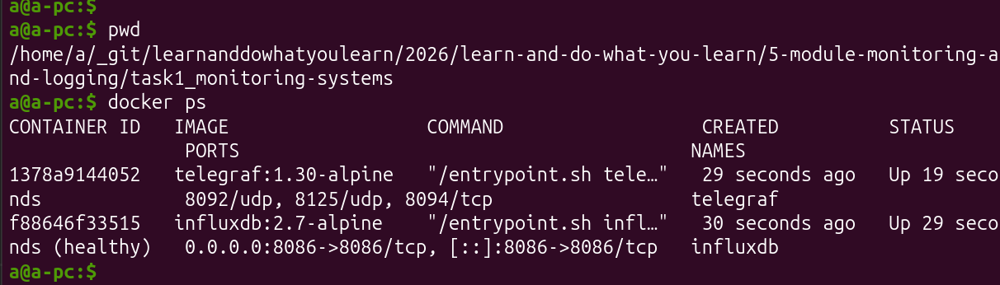
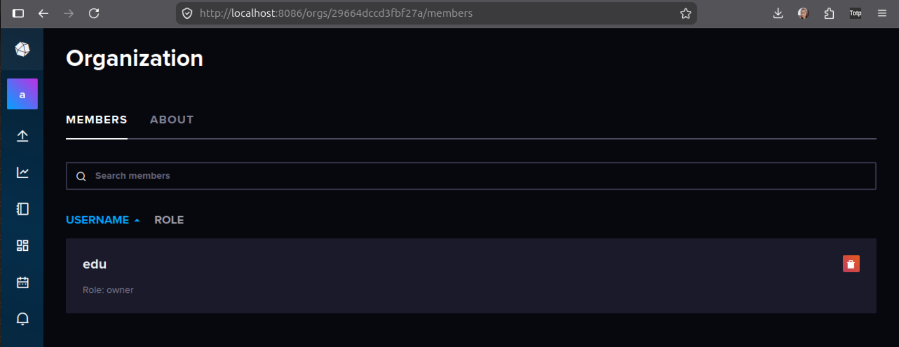
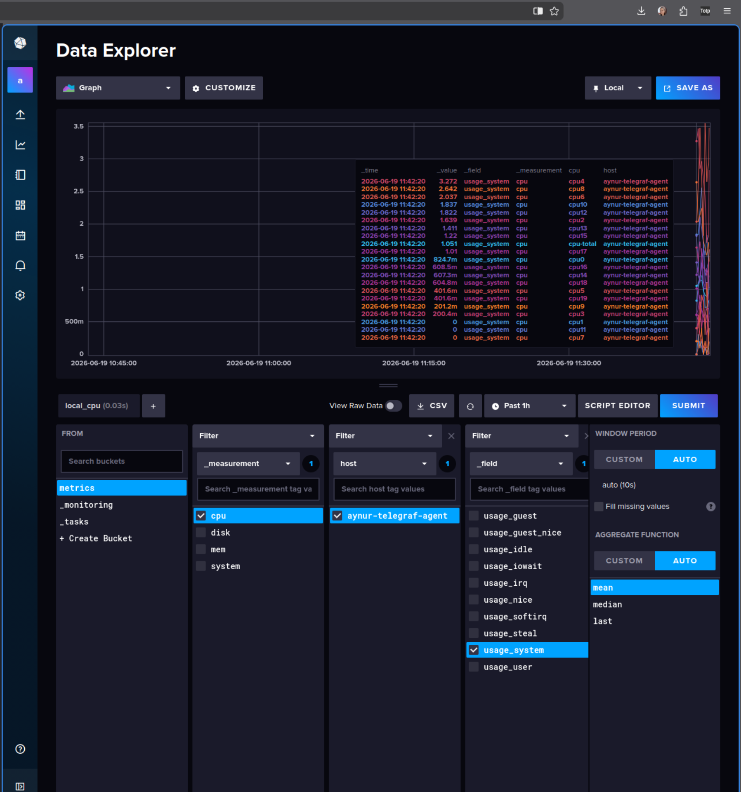

Для того,чтобы измерения `docker` появились в списке бакета `metrics`, я в `compose.yml` добавила поле [`user: "999:123"`](./compose.yml#L37), где 
* `999` -  default telegraf user ID, 
* `123` - docker user ID моего ПК (хоста, на котором запущены контейнеры):

```bash
$ grep docker /etc/group
docker:x:123:a
```
И после этих манипуляции считывание данных про` docker container`-ы хостовой машины повяилось в `TICK`.
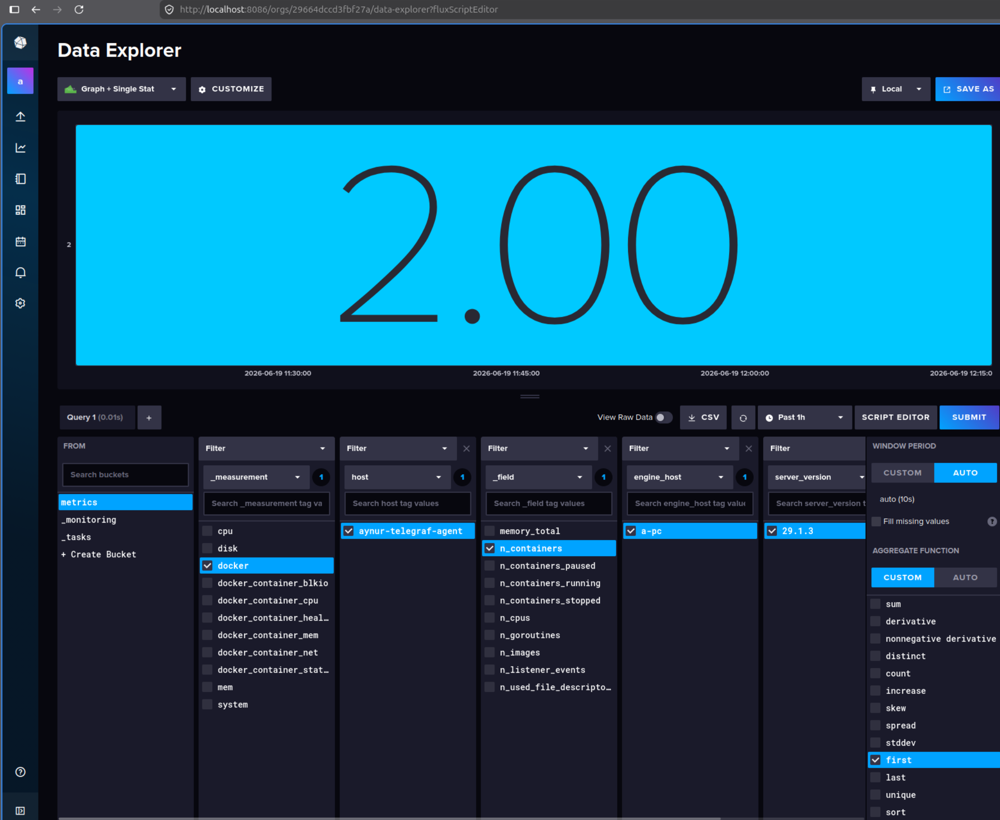
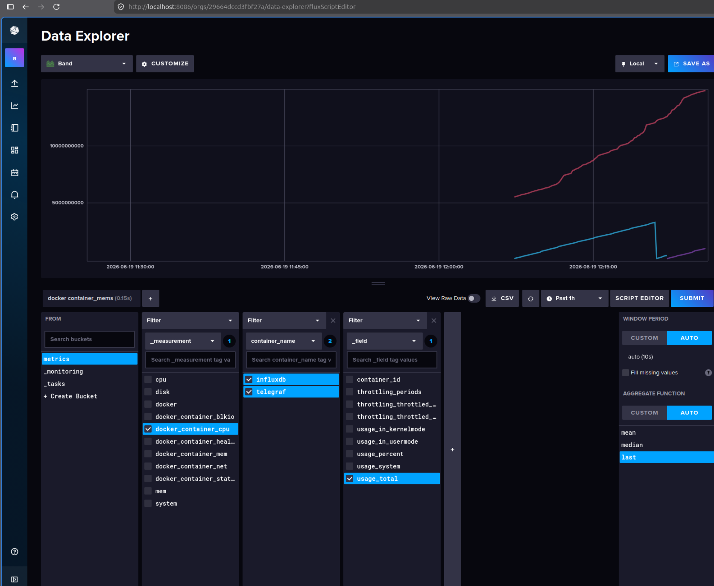

Нужные метрики можно собрать в один дашборд.

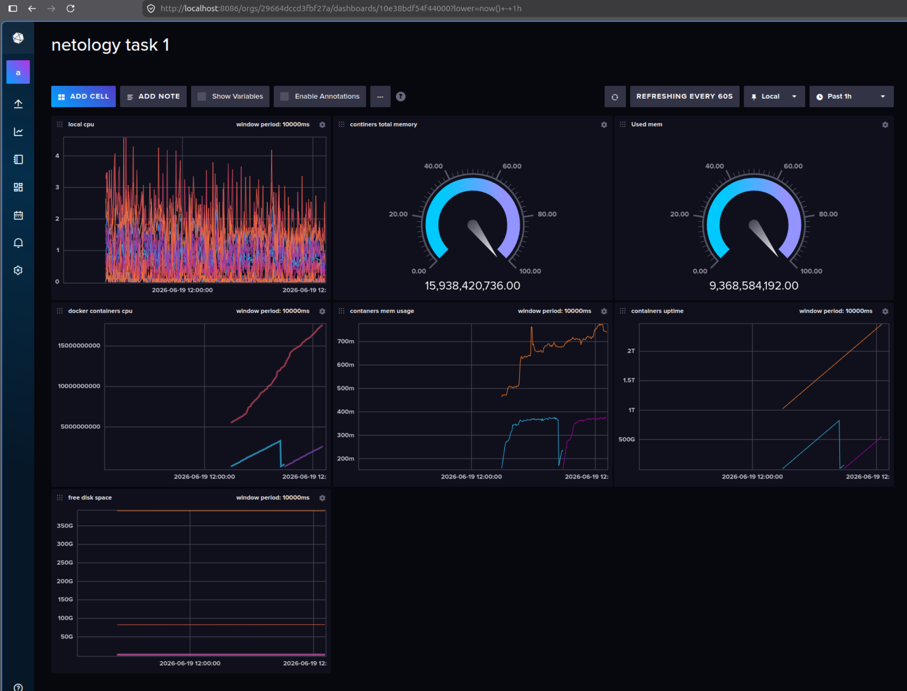


# *Дополнительное задание - pyhthon metrics observer

Я написала [питон-скрипт](./observer/main.py) сбoра метрик лeжащий в [./observer/main.py](./observer/main.py)
Как видно из скрипта, собирается информация в процентном выражении об использовании ЦПУ из `/proc/stat`, памяти из `/proc/meminfo`, корневого диска с помощью `os.statvfs` и татистику сети по байтам из `/proc/net/dev`.
Статистику собираю здесь же в папку [`logs`](./observer/logs/2026-06-21-aynurs-awesome.log) что-то типа:


Не стала заосрять себе систему, записывая в папки рута.

Скрипт запускается `crontab`-ом ежеминутно:

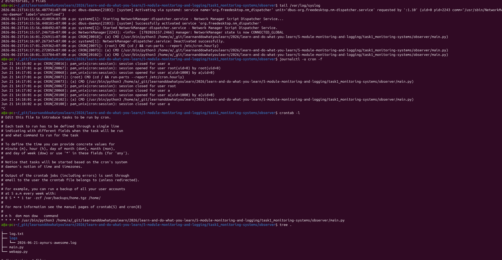

Показатели можно посмотретьв простом табличном интерфейсе в браузере, который запускается на машине командой из папке проекта [./observer/webapp.py](./observer/webapp.py):

```bash
sudo apt update && sudo apt install python3-venv -y

python3 -m venv venv
source venv/bin/activate

pip install flask
python webapp.py
```


Скрипт читает полученный лог файл и показывает в браузере:
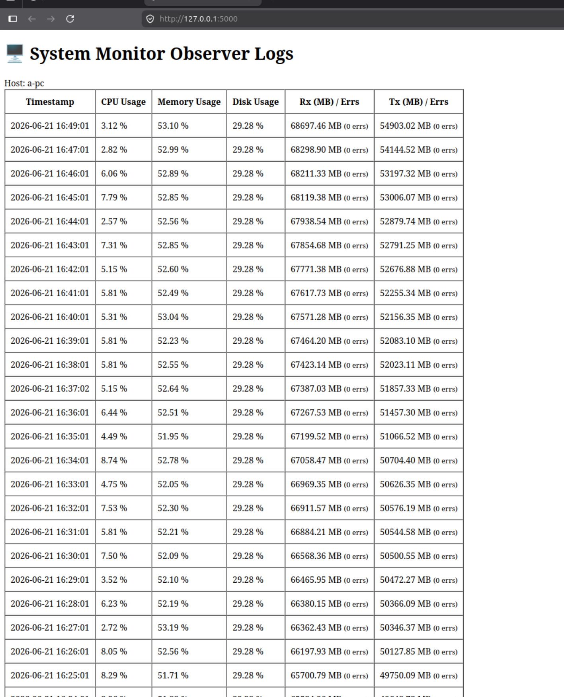


За время более, чем 2 часа собрались логи:

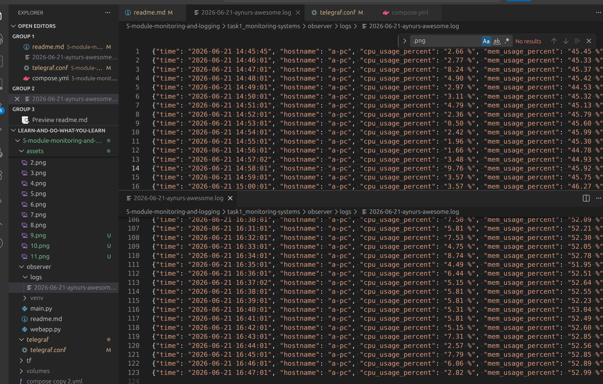
