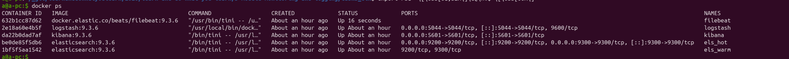
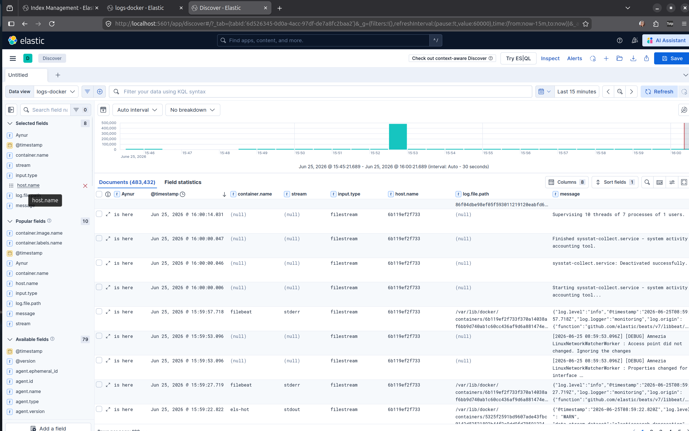
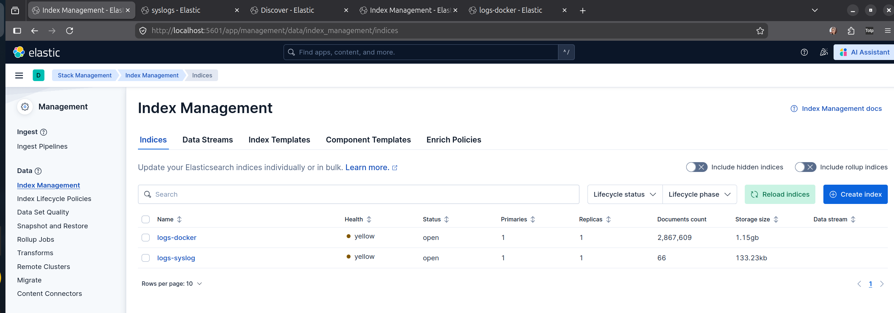
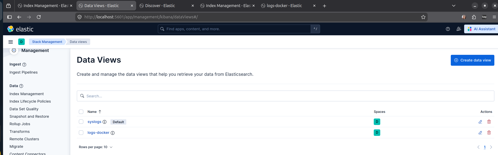
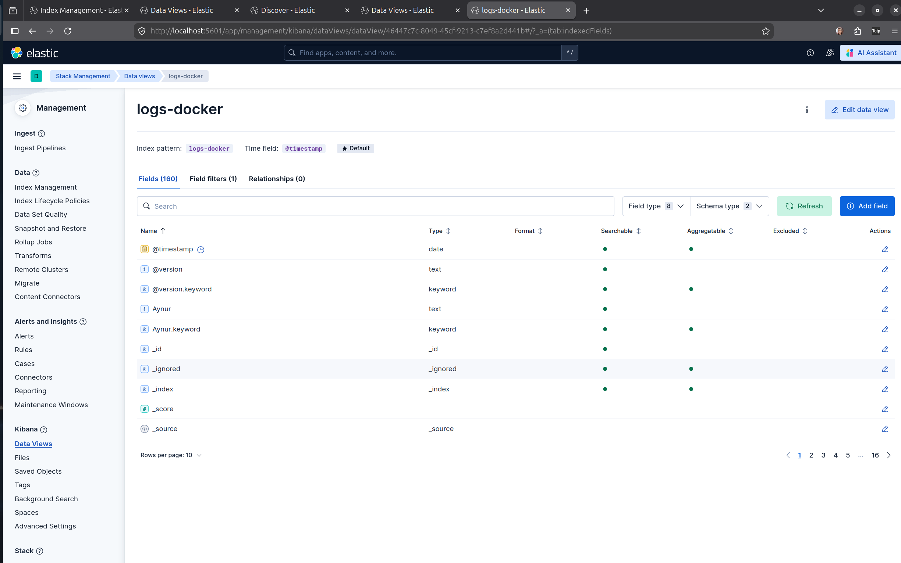
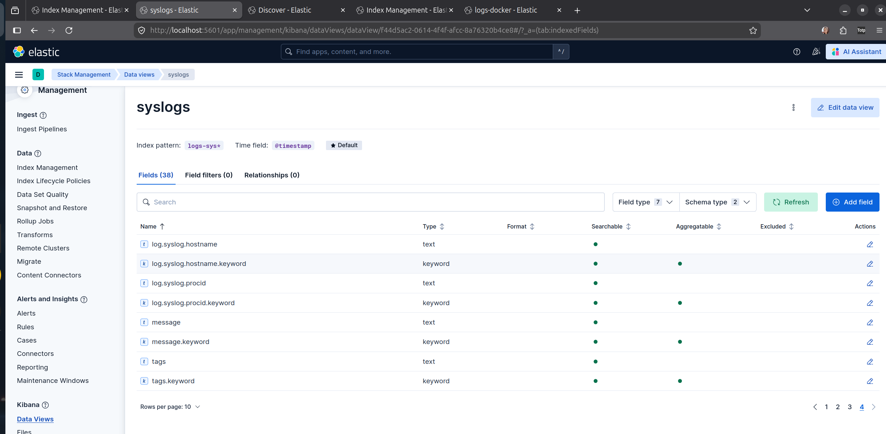
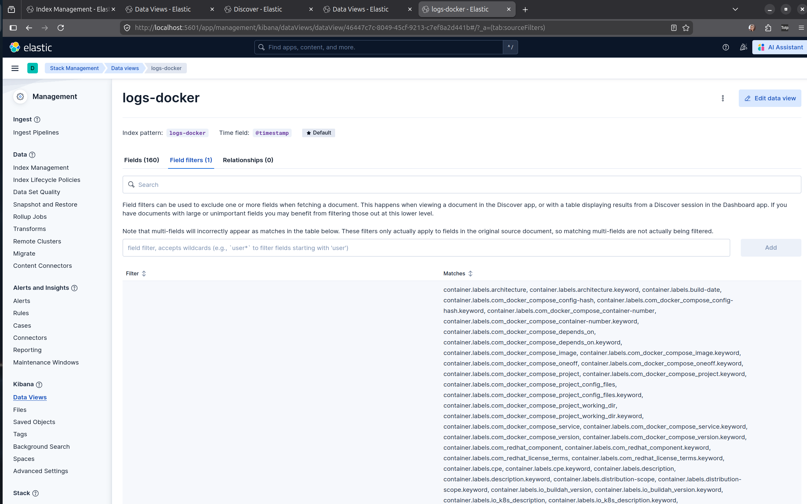
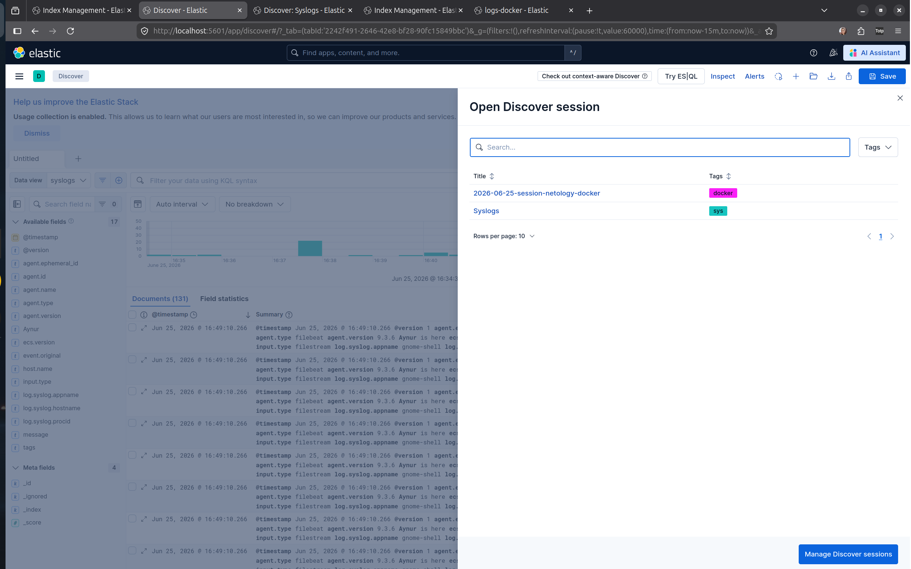
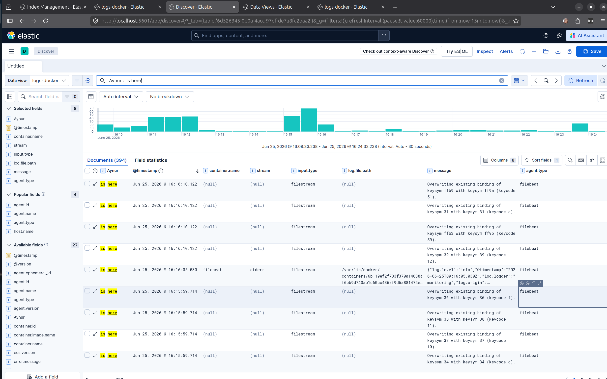
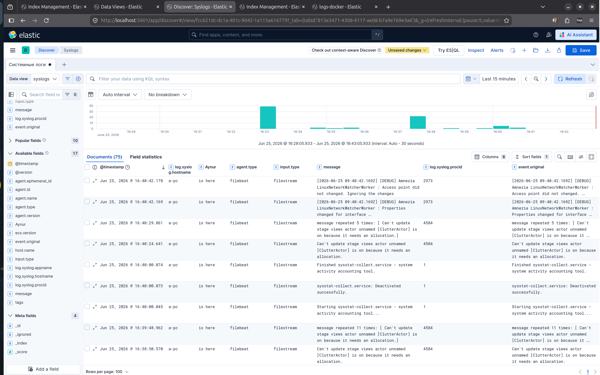

## compose.yml
docker compose манифест [лежит в корне этой папки](./compose.yml):

Нюансы:

* `xpack.security.enabled=false` со значением `false`, иначе понадобятся сертификаты, как в официальном примере [здесь](https://github.com/elastic/elasticsearch/blob/main/docs/reference/setup/install/docker/docker-compose.yml).
* `bootstrap.memory_lock=true` заблокировать свою оперативную память (RAM) в адресном пространстве процесса и запретить операционной системе сбрасывать её в своп (swap) на жесткий диск.
Если просто включить этот параметр в c`ompose.yml`, контейнер Elasticsearch может упасть при старте с ошибкой Cannot allocate memory, так как у Docker-контейнера по умолчанию нет прав блокировать память.Чтобы всё завелось, в файле `compose.yml` (в блоке каждой ноды ES) уже добавлены необходимые инструкции `ulimits`, которые выставляют неограниченные лимиты на блокировку памяти:
```yaml
ulimits:
  memlock:
    soft: -1
    hard: -1
```

* `"ES_JAVA_OPTS=-Xms1g -Xmx1g"` - Выделяемая память

Посмотрела утиликтой `top`, хватит ли у меня памяти на локальной машине. Выбрала экономный ражим по оперативке:
по 1 ГБ для горячей и холодной нод, их контейнеры ограничу памяти 1.5 ГБ настройками:
```yaml
resourses:
  limits:
    memory: 1500M
```

*
```yaml
services:
  els_hot:
    ...
    environment:
      - node.roles=master,data_content
```

Роль `data_content` — это специальный тип роли узла (ноды) в ELK, который отвечает за хранение и обработку пользовательского контента со статическим жизненным циклом.Начиная с версии 7.10, Elastic разделил обычную общую роль `data` на специализированные подроли (`data_hot`, `data_warm`, `data_cold`, `data_frozen` и `data_content`), чтобы эффективнее управлять данными. Это могут быть документы, которые не привязаны к шкале времени, редко меняются, но по ним нужен постоянный поиск (например: каталог товаров интернет-магазина, справочники, профили пользователей, статьи базы знаний).

Так как тут всего 2 ноды, то горячая нода берёт на себя 2 задачи:  принимает свежие системные логи (`data_hot`) и хранит служебные статические данные кластера (`data_content`).

* ./filebeat/filebeat.yml
```bash
chmod go-w ./filebeat/filebeat.yml
sudo chown root ./filebeat/filebeat.yml
```

Утилиты от компании Elastic (включая Filebeat и Logstash) имеют встроенный строгий механизм безопасности. Они отказываются запускаться, если их конфигурационные файлы (например, filebeat.yml) доступны для редактирования кому-либо, кроме владельца (root или пользователя, от которого запускается процесс).

* решила брать логи контейнером и лоакльные системные.

Поэтому для ./filebeat/filebeat.yml инпутами будут:
* `/var/log/syslog`
* `'/var/lib/docker/containers/*/*.log'`

К ним необходимо было подобрать соответствующие парсеры по ссылке:
https://www.elastic.co/docs/reference/beats/filebeat/filebeat-input-filestream#_parsers

Итак, контейнеры запустились.


Но на этом мучения не кончились. Долго конфигурацию подбирала для `logstash`, разбиралась с `pipeline`.
ошибки:

```
logstash  | [2026-06-25T07:48:21,437][ERROR][logstash.outputs.elasticsearch][main][c3f17f7fd77907511e9c9eb57e7f3928a5e5a35612e1c2141952c39afbf739ba] Encountered a retryable error (will retry with exponential backoff) {:code=>500, :url=>"http://els-hot:9200/_bulk?filter_path=errors,items.*.error,items.*.status", :content_length=>7875, :body=>"{\"error\":{\"root_cause\":[{\"type\":\"illegal_state_exception\",\"reason\":\"There are no ingest nodes in this cluster, unable to forward request to an ingest node.\"}],\"type\":\"illegal_state_exception\",\"reason\":\"There are no ingest nodes in this cluster, unable to forward request to an ingest node.\"},\"status\":500}"}
```

Для исправления этой ошибки необходимо было добавить в роли `ingest` one в `compose.yml`:
```yml
environment:
  ...
  - node.roles=master,data_hot,data_content,ingest
```


## Задача 1

Результаты выполнения задания:

* скриншот docker ps через 5 минут после старта всех контейнеров (их должно быть 5);


* скриншот интерфейса kibana;



В пайплайне logstash использовала условный оператор в [logstash/pipeline/filebeat_pipeline.conf](./logstash/pipeline/filebeat_pipeline.conf), чтобы системные логи пошли в свой индекс на линии 16
 [logstash/pipeline/filebeat_pipeline.conf](./logstash/pipeline/filebeat_pipeline.conf#L16), а докер логи - в свой индекс.

Кстати, индексы сами автоматом создаются, те, что указаны в конфигурационном файле logstash pipeline.


* docker-compose манифест [лежит в корне этой папки](./compose.yml):

* yml-конфигурации для стека:

    * filebeat conf [filebeat/filebeat.yml](./filebeat/filebeat.yml) - 2 инпута - системные логи и логи докер контейнеров. Я видела после уже выполнения задачи, что есть тип инпута специальный `syslog`, но переделывать не стала. Добавила ограничение на размер лога на всякий случай.
    * pipeline for logstash [logstash/pipeline/filebeat_pipeline.conf](./logstash/pipeline/filebeat_pipeline.conf) - здесь есть мультиплексор логов, чтобы отправлять нужный лог в свой индекс.

## Задание 2

`index-patterns` переименованы в `data view` в 9-ой версии.





Полей много, ненужные можно убрать:



### Discovers:





