# [Домашнее задание к занятию 16 «Платформа мониторинга Sentry»](https://github.com/netology-code/mnt-homeworks/blob/MNT-video/10-monitoring-05-sentry/README.md)

Так как sentry заблокирован и без впн не зайти туда, я попросила ИИ прочитать страницу для меня:

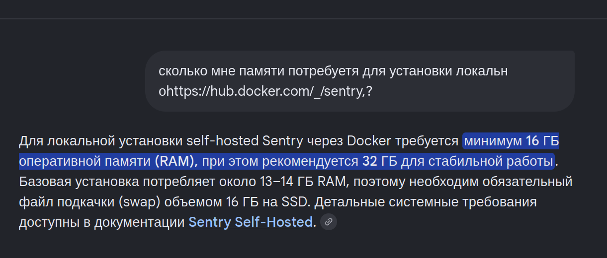

Таких ресурсов локально у меня нет, поэтому  я арендую сервер в ЯО. Описание арендованного сервера можно посмотреть в terraform main файле [sentry-terra/main.tf](./sentry-terra/main.tf):


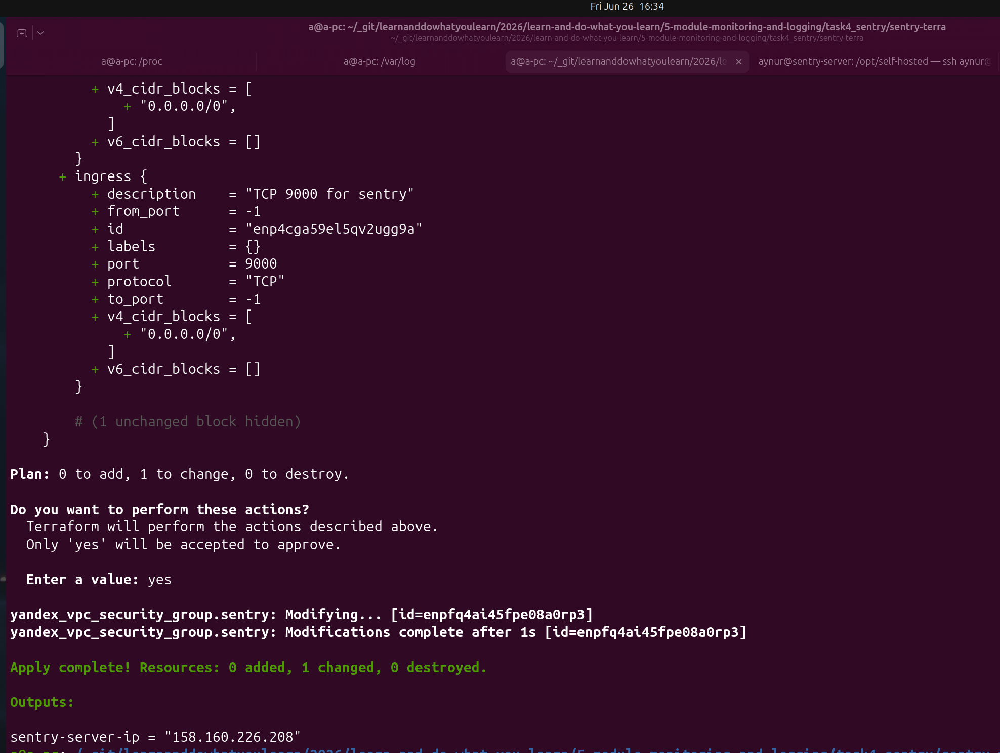
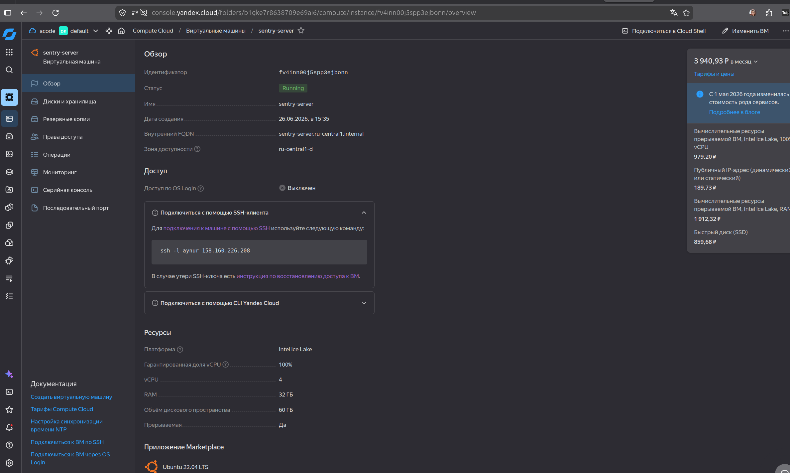


Необходимо, чтобы было настроено:
* `группы безопасности` для порта 9000 - веб интерфейса `sentry`
* [`cloud-config`](./sentry-terra/server-cloud-init.tftpl) - в нём прописала установку `self-hosted sentry`

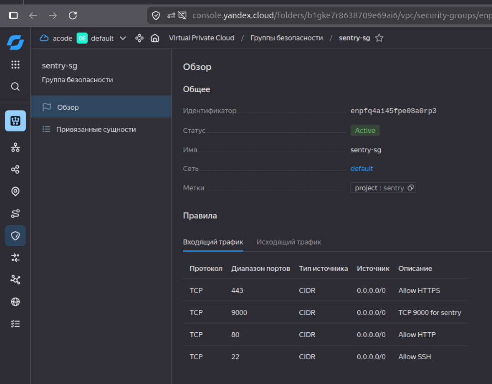

Устанавливаю на этот сервер `self-hosted` версию sentry [https://github.com/getsentry/self-hosted](https://github.com/getsentry/self-hosted)

Пришлось тут немножко потрудится с настройками:

* `/opt/self-hosted/sentry/config.yml`:

      system.url-prefix: "http://158.160.226.208:9000"

* `/opt/self-hosted/sentry/sentry.conf.py`:

      CSRF_TRUSTED_ORIGINS = ["http://158.160.226.208:9000"]

* Ещё нужно было создать админа в кoнсоли сервера:
```
docker compose run --rm web createuser
```

-->

```
Email: aykuli@ya.com
Password: <Type Your New Password Here>
Repeat for confirmation: <Type It Again>
Should this user be a superuser? [y/N]: y
User created successfully.
```

Моё приложение - это простое go-приложение отправляющее на DNS sentry текст - [error-btn/main.go](./error-btn/main.go):


В sentry сгенерировала проект и скопировала в свой приложение DNS sentry.

ПОтом запускала свой голанг скрипт меняя текст и релизы, и смотрела, что я могу смотреть в sentry.

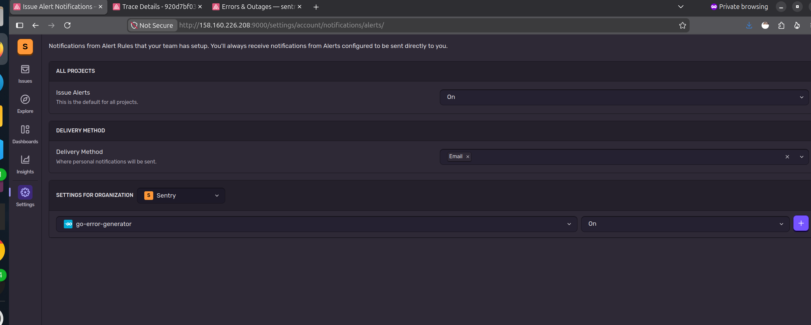
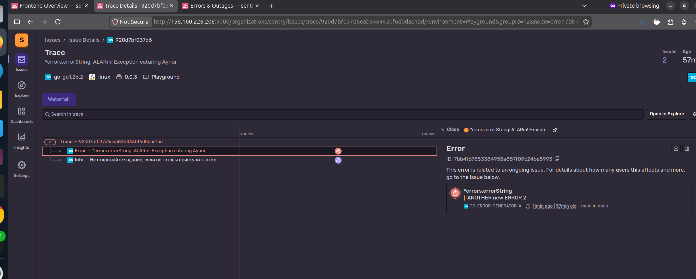
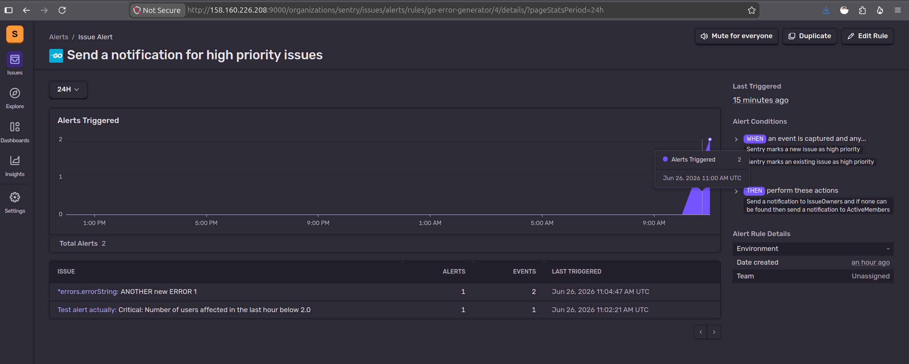
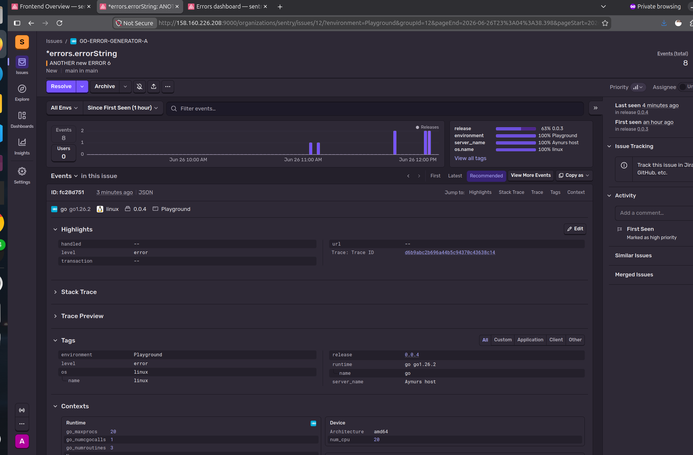
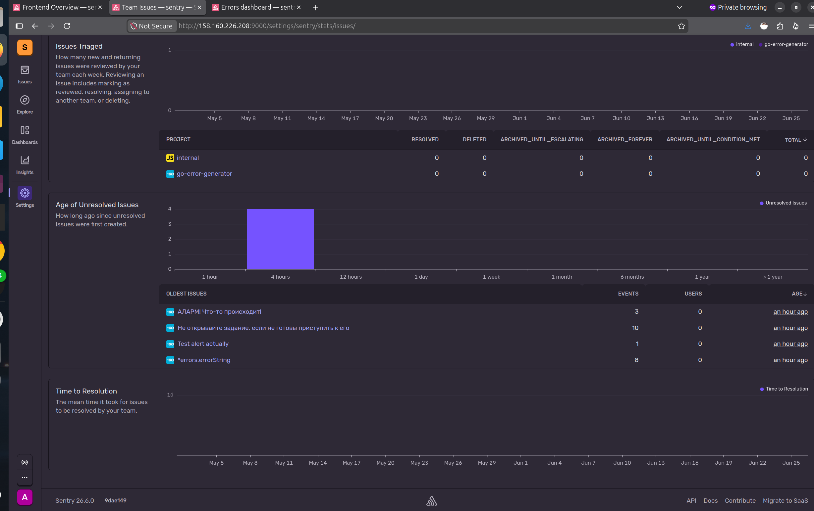
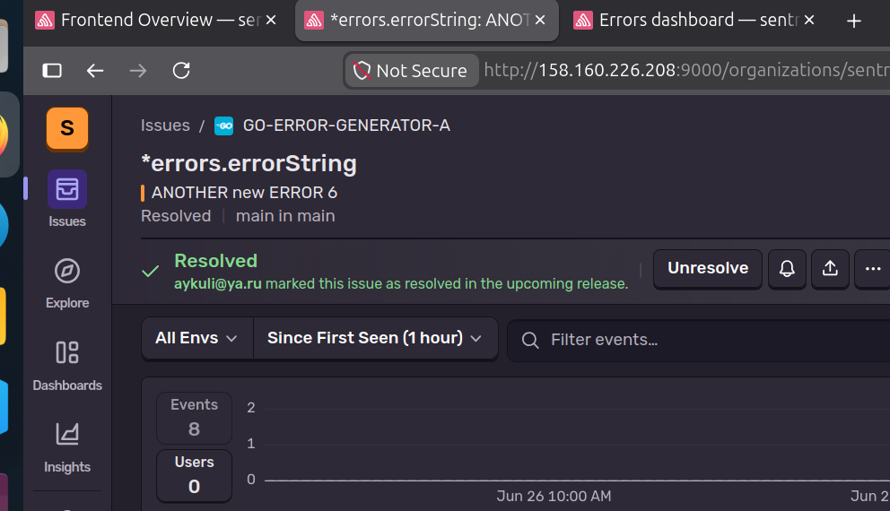

В итоге тоже можно настроить дашборд с разными метриками (issues, errors, по пользоватеям - там всякие шаблоны есть)

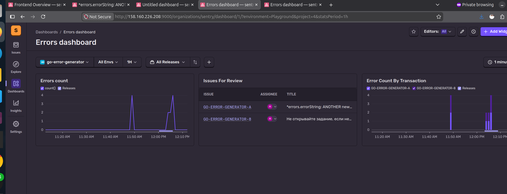

Итого: стек мне показался слишком тяжёлым в смысле потребления ресурсов. Но, как и в любом инструменте, и тут есть документация и др ресурсы, что можно разобраться для разноё функциональности и настройки.
