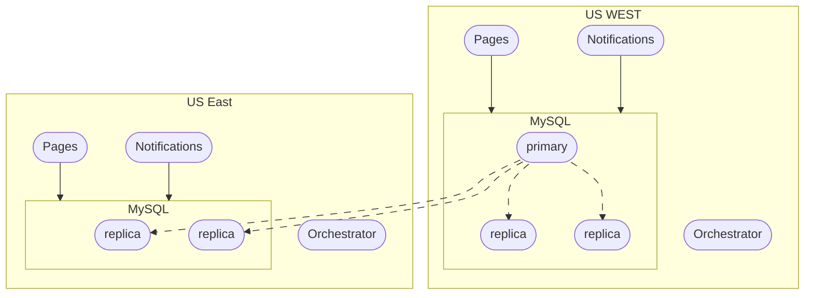

# [Домашнее задание к занятию 17 «Инцидент-менеджмент»](https://github.com/netology-code/mnt-homeworks/blob/MNT-video/10-monitoring-06-incident-management/README.md)

## Краткое резюме (Summary)

[21-го октября 2018 года](https://github.blog/news-insights/company-news/october21-incident-report/) в GitHub произошёл инцидент.
**Начало**: 22:52 21 октября 2018 года
**Полное окончание**: 23:03 22 октября 2018 года
**Общая продолжительность**: 24 часа 11 минут

Масштаб последствий:
* все пользовательские данные сохранены

Что происходило:
* пользователи не могли создать:
  * GitHub Pages
  * Issues

Про деньги в отчёт не написано, но написано, что получили дальше инвестиции для развития системы безопасности и управления инцидентами.

## Хронология (Timeline)

[Источник](https://github.blog/news-insights/company-news/oct21-post-incident-analysis/)

**Архитектура**, которая была затронута во время инцидента.

### Timeline

```mermaid
timeline TD
    title История развития событий в день инцидента
    21 октября в 22-52 UTC : плановое техническое обслуживание по замене вышедшего из строя оптического оборудования 100G
    : потеря связи между сетевым хабом  US East и основным центром обработки данных на Восточном побережье США
    через 43 секунды : эта связь восстановлена
    : Оркестратор в US WEST потерял мастер ноду MySQL и записывал новые данные в БД US East

    21 октября в 22-54 UTC : Внутренний мониторинг наал генерировать уведомления
    : Инженеры поняли, что топология изменилась. Что  US East стал автономным от  US WEST

    21 октября в 23-07 UTC : инженеры поддержки перевели инцидент в жёлтый
    21 октября в 23-11 UTC : координатор пришёл и перевел инцидент в красный
    : Было множество записей в US East не реплицированных в US WEST
    : Были вызваны дополнительные инженеры из команды разработчиков баз данных GitHub
    : начали делать переадресацию, и 30 минут синхронизировали данные, в течении 30 минут
    21 октября в 23-19 UTC : Вручную прекратили выполнение заданий, которые записывают метаданные о таких вещах, как `pushs`.
    22 октября в 00-05 UTC : Разработка плана устранения
    22 октября в 00-41 UTC : Запущен процесс резервного копирования для всех затронутых кластеров MySQ
    22 октября в 06-51 UTC : Несколько кластеров завершили восстановление из резервных копий в нашем центре обработки данных на US East и приступили к репликации новых данных с US West.
    22 октября в 07-46 UTC : GitHub опубликовал сообщение в блоге https://blog.github.com/2018-10-21-october21-incident-report
    22 октября в 11-12 UTC : Все основные базы данных снова были синхронизированы в US East.
    22 октября в 13-15 UTC : Инженеры приближались к пиковой нагрузке на трафик на GitHub.com
    22 октября в 16-24 UTC : Как только реплики были синхронизированы, инженеры выполнили переход на исходную топологию, чтобы устранить проблемы с задержкой и доступностью. 
    22 октября в 16-45 UTC : Балансировали возросшую нагрузку
    22 октября в 23-03 UTC : Система воостановлена.
```

## Корневая причина (Root Cause Analysis)

Недоступность связи между US East и US WEST центрами, что привело к несогласованности данных.

## План действий (Action Items)

За несколько недель до этого инцидента Github запустили общекорпоративную инженерную инициативу по поддержке обслуживания трафика GitHub из нескольких центров обработки данных в режиме "активный/неактивный/неактивная работа". Целью этого проекта являлась поддержка резервирования N+1 на уровне предприятия. Цель этой работы было - избежать полного сбоя в работе одного центра обработки данных без ущерба для пользователей. Этот инцидент придал инициативе еще большую актуальность.

## Уроки и выводы (Lessons Learned)

Этот инцидент привел к пониманию, что ужесточение операционного контроля или увеличение времени реагирования не являются достаточными гарантиями надежности сайта в сложной системе обслуживания. 
Благодаря этому инциденту инженеры получили инвестиции в разработку инструментов для устранения неисправностей и создания управляемого хаоса на GitHub.