# [Домашнее задание к занятию «Микросервисы: подходы»](https://github.com/netology-code/micros-homeworks/blob/main/11-microservices-03-approaches.md)

## Задача 1: Обеспечить разработку

<details>
<summary>текст задачи
</summary>
Предложите решение для обеспечения процесса разработки: хранение исходного кода, непрерывная интеграция и непрерывная поставка. Решение может состоять из одного или нескольких программных продуктов и должно описывать способы и принципы их взаимодействия.

Решение должно соответствовать следующим требованиям:

* облачная система;
* система контроля версий Git;
* репозиторий на каждый сервис;
* запуск сборки по событию из системы контроля версий;
* запуск сборки по кнопке с указанием параметров;
* возможность привязать настройки к каждой сборке;
* возможность создания шаблонов для различных конфигураций сборок;
* возможность безопасного хранения секретных данных (пароли, ключи доступа);
* несколько конфигураций для сборки из одного репозитория;
* кастомные шаги при сборке;
* собственные докер-образы для сборки проектов;
* возможность развернуть агентов сборки на собственных серверах;
* возможность параллельного запуска нескольких сборок;
* возможность параллельного запуска тестов.

Обоснуйте свой выбор.
</details>

Для реализации требований подходят:
! если добавляется ограничение - разработка происходит в России, то надо искать Облачные Провайдеры с GitLab. Gitlab Имеет открытый исходный код, в отличие от GitHub:
* [Gitlab в YandexCloud](https://yandex.cloud/ru/docs/managed-gitlab/) от 6,5 тыс руб в месяц
* [Yandex SourceCraft ](https://sourcecraft.dev/portal/docs/ru/) от 400 руб за пользователя в месяц + отдельно сервер надо брать.
* [GitVerse от Сбера](https://gitverse.ru/home/pricing/)
* GitLab CE (Self-Hosted) у любого облачного провайдера в России, например, Selectel.

Если нет требований местонахожения в России:
* [GitHub Cloud (GitHub Enterprise Cloud) в связке с инструментами автоматизации GitHub Actions](https://docs.github.com/en/get-started/onboarding/getting-started-with-github-enterprise-cloud)
* [GitLab в партнёрстве  AWS](https://docs.gitlab.com/solutions/cloud/aws/)
и др.

## Задача 2: Логи

<details>
<summary>текст задачи
</summary>
Предложите решение для обеспечения сбора и анализа логов сервисов в микросервисной архитектуре. Решение может состоять из одного или нескольких программных продуктов и должно описывать способы и принципы их взаимодействия.

Решение должно соответствовать следующим требованиям:

* сбор логов в центральное хранилище со всех хостов, обслуживающих систему;
* минимальные требования к приложениям, сбор логов из stdout;
* гарантированная доставка логов до центрального хранилища;
* обеспечение поиска и фильтрации по записям логов;
* обеспечение пользовательского интерфейса с возможностью предоставления доступа разработчикам для поиска по записям логов;
* возможность дать ссылку на сохранённый поиск по записям логов.

Обоснуйте свой выбор.
</details>

Для реализации централизованного сбора и анализа логов в микросервисной архитектуре с учетом требований надежности и доступности в РФ предлагается современный стек на базе Vector + OpenSearch + OpenSearch Dashboards.


* [vector](https://vector.dev/) - агент сбора метрик устанавливается на каждую машну с сервисом. Он напрямую читает файлы логов с диска хоста. Если центральное хранилище временно недоступно, Vector складывает логи в свой локальный дисковый буфер, предотвращая потерю данных.

В настройках вектора можно настроить `sources`, `transforms`, `sinks`.
`sources` судя по документации настчитывается 47 видов, от `stdin`, `docker logs`, файлов до `mqtt`.

Например:
```yaml
sources:
  journal_logs:
    type: journald

transforms:
  parse_logs:
    type: remap
    inputs:
      - journal_logs
    source: |
      . = {
        "timestamp": .timestamp,
        "message": string!(.message)
      }


sinks:
  clickhouse_output:
    type: clickhouse
    inputs:
      - parse_logs 
    endpoint: "http://<log_host>:<log_port>"
    database: logs
    table: logging
    skip_unknown_fields: true
    encoding:
      timestamp_format: unix 
```

* [Opensearch](https://opensearch.org/) - опенсорсный форк ElasticSearch принимает данные, разбивает текстовые сообщения на токены, строит инвертированные индексы и сохраняет логи на диски. За счет репликации между узлами хранилища обеспечивается высокая отказоустойчивость.
* OpenSearch Dashboards, в нём разработчики, devops-ы проходят авторизацию и ведут поиск по логам в реальном времени.

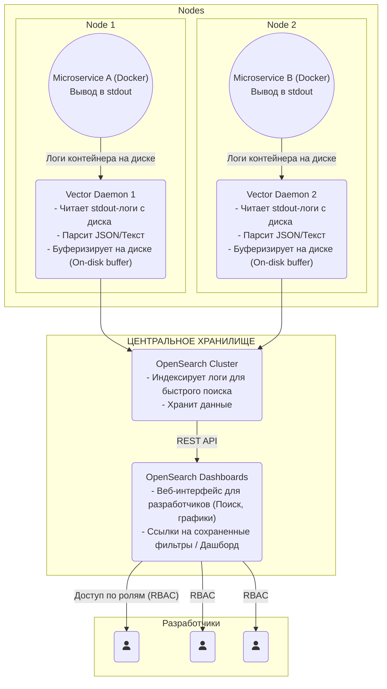

### Обоснование соответствия требованиям

**Сбор данных и требования к коду**

* **Сбор логов со всех хостов**: Обеспечивается установкой легковесного агента Vector на каждый физический сервер или виртуальную машину.
* **Минимальные требования к приложениям (stdout)**: Разработчикам микросервисов вообще не нужно настраивать сетевую отправку логов в коде, подключать тяжелые библиотеки или управлять буферами внутри приложений. Достаточно писать логи в stdout. Формат логов желательно выбрать структурированный (JSON), чтобы упростить их последующий разбор.
**Гарантия доставки (Reliability)**

* **Гарантированная доставка до хранилища**: `Vector` обладает встроенным механизмом On-disk buffering (дисковое буферизированное хранение). Если сеть упадет или `OpenSearch` уйдет на перезагрузку, `Vector` зафиксирует текущую позицию чтения логов (`checkpoint`) и начнет копить новые логи в выделенной папке на диске хоста. Как только связь восстановится, `Vector` продолжит отправку ровно с того места, где остановился, используя алгоритм экспоненциального отката (exponential backoff) при повторных попытках отправки, чтобы не перегрузить хранилище.

**Поиск, фильтрация и интерфейс**

* **Обеспечение поиска и фильтрации**: OpenSearch построен на базе движка Lucene, что дает мощный полнотекстовый поиск. Вы можете искать как точные совпадения (например, status: 500), так и использовать регулярные выражения, подстановочные знаки (*), логические операторы (AND/OR) и нечеткий поиск по тексту ошибок.
* **Пользовательский интерфейс для разработчиков**: Веб-приложение OpenSearch Dashboards предоставляет вкладку Discover. Разработчики могут выбирать временные интервалы, настраивать автообновление, выводить только нужные столбцы (например, `service_name`, `level`, `message`) и мгновенно видеть результаты. Инструмент поддерживает ролевую модель (`RBAC`): вы можете дать разработчикам доступ только к логам их микросервисов, скрыв логи системных или финансовых компонентов.
* **Возможность дать ссылку на сохранённый поиск**: В OpenSearch Dashboards (раздел Discover) при изменении любого фильтра, поискового запроса или масштаба времени вся конфигурация автоматически кодируется прямо в URL-адрес браузера. Нажав кнопку Share -> Copy URL, разработчик получает уникальную ссылку. Любой другой коллега, перейдя по ней, откроет в точности ту же выборку логов, на тот же самый момент времени, что критически важно при разборе межсервисных инцидентов.


## Задача 3: Мониторинг

<details>
<summary>текст задачи
</summary>
Предложите решение для обеспечения сбора и анализа состояния хостов и сервисов в микросервисной архитектуре. Решение может состоять из одного или нескольких программных продуктов и должно описывать способы и принципы их взаимодействия.

Решение должно соответствовать следующим требованиям:

* сбор метрик со всех хостов, обслуживающих систему;
* сбор метрик состояния ресурсов хостов: CPU, RAM, HDD, Network;
* сбор метрик потребляемых ресурсов для каждого сервиса: CPU, RAM, HDD, Network;
* сбор метрик, специфичных для каждого сервиса;
* пользовательский интерфейс с возможностью делать запросы и агрегировать информацию;
* пользовательский интерфейс с возможностью настраивать различные панели для отслеживания состояния системы.

Обоснуйте свой выбор.
</details>

Cвязка Prometheus + VictoriaMetrics + Grafana думаю хорошо подойдёт для любой системы:

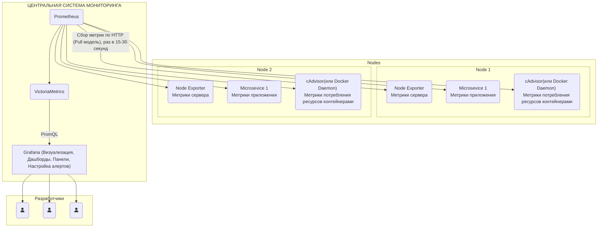

### Принцип взаимодействия:

* **Генерация данных:** На каждом хосте специализированные агенты и сами микросервисы открывают HTTP-порты, отдавая метрики в текстовом формате Prometheus (например, http://host:9100/metrics).
* **Сбор (Scraping)**: Облегченный агент Prometheus (или встроенный компонент vmagent) по расписанию опрашивает все цели (хосты и сервисы), забирая актуальные показатели.
* **Хранение**: Собранные данные Prometheus мгновенно пересылает по протоколу Remote Write в центральный кластер VictoriaMetrics. VictoriaMetrics сжимает временные ряды на диске (в несколько раз эффективнее стандартного Prometheus) и обеспечивает их долгосрочное хранение (Retention), высокую скорость чтения и горизонтальное масштабирование.
* **Визуализация**: Инструмент Grafana подключается к VictoriaMetrics как к источнику данных (Data Source) и отправляет аналитические запросы для построения графиков.

### Обоснование соответствия требованиям

**Сбор метрик хостов и контейнеров**

* **Сбор метрик со всех хостов**: На каждый физический сервер или виртуальную машину устанавливается легковесный агент Node Exporter. Он собирает данные напрямую из ядра ОС (`/proc`,` /sys`).
* **Метрики ресурсов хостов (CPU, RAM, HDD, Network)**: Node Exporter из коробки поставляет глубокие метрики: загрузку ядер процессора (User, System, IOWait), утилизацию оперативной памяти (с учетом кэша и буферов), свободное/занятое место на дисках и IOPS, а также скорость и объем сетевого трафика по каждому интерфейсу.
* **Mетрики ресурсов для каждого сервиса (контейнера)**: Если микросервисы запущены в Docker, на хостах разворачивается демон cAdvisor (от Google). Он собирает статистику использования CPU, RAM, дискового ввода-вывода и сети изолированно для каждого запущенного контейнера. Можно видеть, какой именно экземпляр микросервиса потребляет ресурсы хоста.

**Специфичные метрики приложений**
* **Сбор метрик, специфичных для каждого сервиса**: В код микросервисов интегрируется официальная библиотека Prometheus Client (доступна для Go, Python, Java, Node.js, .NET и др.). Разработчики могут создавать кастомные метрики четырех типов:
  * ё (Счетчик): например, общее количество обработанных HTTP-запросов (http_requests_total).
  * `Gauge` (Датчик): например, количество активных пользовательских сессий прямо сейчас (active_users).
  * `Histogram / Summary` (Гистограммы): для замера времени ответа сервиса (Latency) и перцентилей (95-й, 99-й перцентили скорости ответов).
  
**Анализ и интерфейс пользователя**
* *Пользовательский интерфейс, запросы и агрегация*: Реализуется в Grafana через панель Explore и встроенный язык запросов PromQL / MetricsQL. Можно агрегировать данные на лету: например, посчитать сумму CPU по всем репликам конкретного сервиса `(sum(rate(container_cpu_usage_seconds_total[5m])) by (service_name))` или найти среднее время ответа базы данных.
* **Настройка различных панелей (Дашбордов)**: Grafana является мировым лидером в визуализации данных. Она позволяет создавать гибкие интерактивные дашборды, состоящие из множества панелей (графики, круговые диаграммы, тепловые карты, таблицы, статус-индикаторы). Панели поддерживают динамические переменные (`Variables`): вы можете сделать выпадающий список вверху экрана с выбором хоста или микросервиса, и все графики на дашборде мгновенно перестроятся под выбранный объект.

**Почему именно этот стек (Обоснование выбора)**
* **Технологическая независимость и безопасность в РФ**: Весь предложенный стек распространяется под открытыми лицензиями (Apache 2.0 / MIT). `VictoriaMetrics` — это проект с российскими корнями (основан бывшими инженерами Яндекса). Нет никаких рисков внезапного отзыва лицензий.
* **Экономия ресурсов**: `VictoriaMetrics` потребляет до 10 раз меньше оперативной памяти по сравнению с решением `Thanos` или `Cortex` и в несколько раз лучше сжимает данные на диске, чем стандартный Prometheus, что снижает затраты на серверную инфраструктуру.
* **Огромная экосистема готовых решений**: Для `Node Exporter` и `cAdvisor` в официальном репозитории `Grafana` доступны тысячи бесплатных, выверенных годами дашбордов (например, знаменитый` Node Exporter Full`). Hе придется рисовать графики процессора или сети с нуля — достаточно импортировать готовый ID дашборда за 2 клика.

## Задача 4: Логи * (необязательная)

<details>
<summary>текст задачи
</summary>
Продолжить работу по задаче API Gateway: сервисы, используемые в задаче, пишут логи в `stdout`.

Добавить в систему сервисы для сбора логов `Vector + ElasticSearch + Kibana` со всех сервисов, обеспечивающих работу API.
Результат выполнения:

`docker compose` файл, запустив который можно перейти по адресу http://localhost:8081, по которому доступна `Kibana`. Логин в Kibana должен быть admin, пароль qwerty123456.
</details>

**Решение**

* МикроСервисы те же, что и в прошлом задании без изменений.
* [compose.yml](./compose.yml)
  Добавила сервисы:
  - elasticsearch
  - es-init - создаёт запрошенного пользователя admin, созда1т 
  ему нужную роль
  - kibana
  - vector
* [vector.yaml](./vector.yaml)
  - sources - docker_logs, так как сервисы у меня в докер контейнерах
  - transforms - необходимо делать тренсформацию. Если отправлять напрямую логи докера, выходит сообщение: 

```
2026-08-01T18:11:34.185607Z ERROR sink{component_kind="sink" component_id=elasticsearch_out component_type=elasticsearch}:request{request_id=1}: vector::sinks::elasticsearch::service: Response contained errors. error_code="http_response_200" response=Response { status: 200, version: HTTP/1.1, headers: {"x-elastic-product": "Elasticsearch", "content-type": "application/json", "transfer-encoding": "chunked"}, body: b"{\"errors\":true,\"took\":26756234,\"items\":[{\"index\":{\"_index\":\"vector-2026.08.01\",\"_id\":\"lpOGvp8BY1dSVdQeNBGj\",\"status\":400,\"error\":{\"type\":\"illegal_argument_exception\",\"reason\":\"can't merge a non object mapping [label.com.docker.compose.project] with an object mapping\"}}}]}" }
2026-08-01T18:11:34.185730Z ERROR sink{component_kind="sink" component_id=elasticsearch_out component_type=elasticsearch}:request{request_id=1}: vector::sinks::util::retries: Not retriable; dropping the request. reason="error type: illegal_argument_exception, reason: can't merge a non object mapping [label.com.docker.compose.project] with an object mapping" internal_log_rate_limit=true
2026-08-01T18:11:34.185757Z ERROR sink{component_kind="sink" component_id=elasticsearch_out component_type=elasticsearch}:request{request_id=1}: vector_common::internal_event::service: Service call failed. No retries or retries exhausted. error=None request_id=1 error_type="request_failed" stage="sending" internal_log_rate_limit=true
2026-08-01T18:11:34.185787Z ERROR sink{component_kind="sink" component_id=elasticsearch_out component_type=elasticsearch}:request{request_id=1}: vector_common::internal_event::component_events_dropped: Events dropped intentional=false count=1 reason="Service call failed. No retries or retries exhausted." internal_log_rate_limit=true
a@a-pc: $ docker exec -t vector cat /etc/vector/vector.yaml
```
Vector передал в Elasticsearch внутренние метаданные Docker (лейблы контейнеров):
* Сначала Elasticsearch увидел поле label.com.docker.compose.project как обычную строку (текст) и зафиксировал этот тип в схеме (mapping).
* Следующий лог пришел от контейнера, где Docker Compose передал label.com.docker.compose.project как объект с вложенными свойствами.
* Elasticsearch выдал ошибку: «can't merge a non object mapping with an object mapping» и сбросил лог.

Чтобы логи воспринимались строго как строки и метаданные `Docker` не ломали базу данных, использован легковесный трансформ `remap`. Происходит очистка структуры, превращающая точки в названиях лейблов в безопасный формат или удаляем проблемные метаданные Docker Compose, оставив только саму текстовую строку лога и имя контейнера.
После этих изменений, надо почистить испорченные индексы Кибаны:

```
curl -u elastic:${ELASTICSEARCH_PASSWORD} -X DELETE "http://localhost:9200/vector-2026.08.01"
```

и надо сдлеать

```
docker compose restart vector
```

Отправляя какие-то запросы в моимикросервисы:
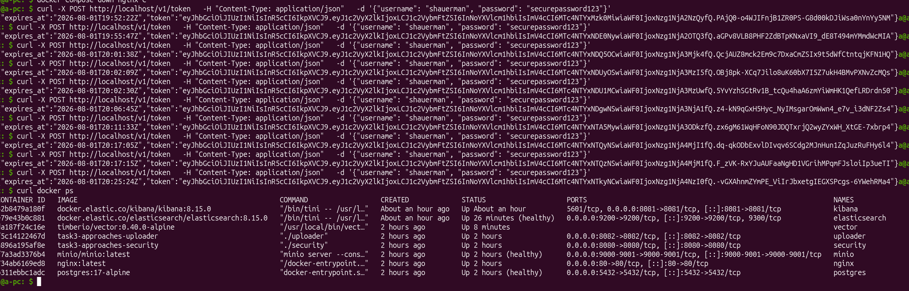

Чтобы появились логи в Кибане:

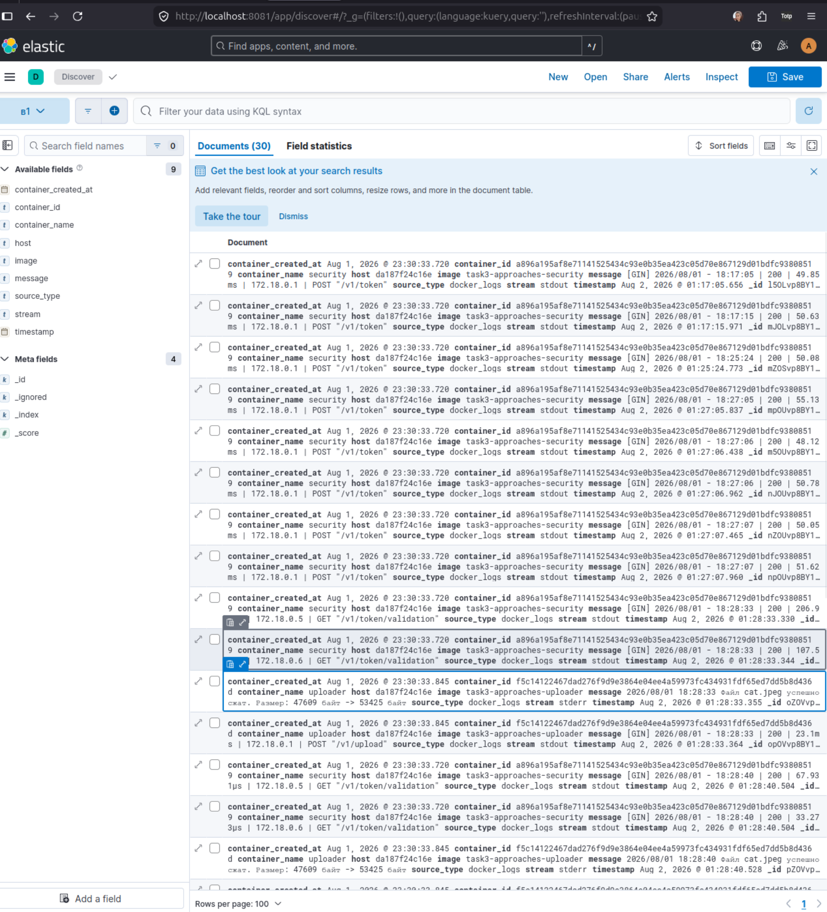

Логи контейнеров:

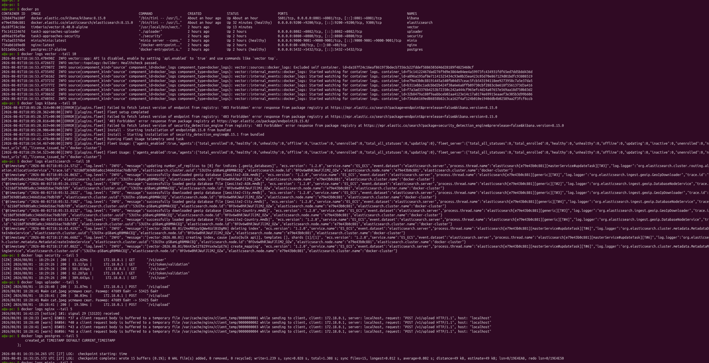

## Задача 5: Мониторинг * (необязательная)

<details>
<summary>текст задачи
</summary>
Продолжить работу по задаче API Gateway: сервисы, используемые в задаче, предоставляют набор метрик в формате prometheus:

* сервис security по адресу /metrics,
* сервис uploader по адресу /metrics,
* сервис storage (minio) по адресу /minio/v2/metrics/cluster.

Добавить в систему сервисы для сбора метрик (Prometheus и Grafana) со всех сервисов, обеспечивающих работу API. Построить в Graphana dashboard, показывающий распределение запросов по сервисам.
Результат выполнения:

docker compose файл, запустив который можно перейти по адресу http://localhost:8081, по которому доступна Grafana с настроенным Dashboard. Логин в Grafana должен быть admin, пароль qwerty123456.
</details>


**Решение**

В предыдущий [compose.yml](./compose.yml) добавила сервисы (после коммента # --- СЕРВИСЫ МОНИТОРИНГА ---):
* node-exporter
* prometheus
* victoriametrics
* postgres-exporter
* grafana

* minio - `MINIO_PROMETHEUS_AUTH_TYPE: "public"` было добавлено, чтобы ендпоинт метрик стал доступен без токена.

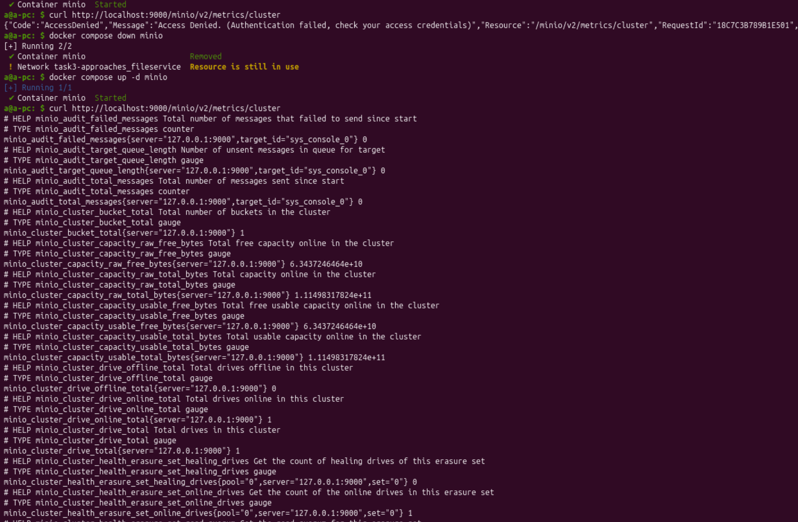

* добавила в сервисы ендпоинты `/metrics`:

  * в сервис [security/main.go#L82](./services/cmd/security/main.go#L82)
  * в сервис [uploader/main.go#L90](./services/cmd/uploader/main.go#L90)

Соответсвенно, в `prometheus` надо прописать точки скриппинга метрик [./prometheus/prometheus.yml](./prometheus/prometheus.yml#L34):

```yaml
  - job_name: uploader
    static_configs:
      - targets: ["host.docker.internal:8082"]
        labels:
          app: "uploader"
  - job_name: security
    static_configs:
      - targets: ["host.docker.internal:8080"]
        labels:
          app: "security"
  - job_name: 'minio'
    metrics_path: '/minio/v2/metrics/cluster'
    static_configs:
      - targets: ['minio:9000']
```

Пошаманив немножко, получила живые таргеты:

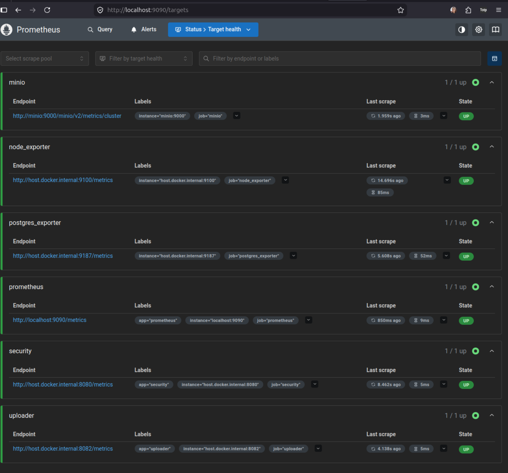

Grafana дащборды находятся в папке [./grafana/dashboards/](./grafana/dashboards/), все они скаченные из маркета графаны.

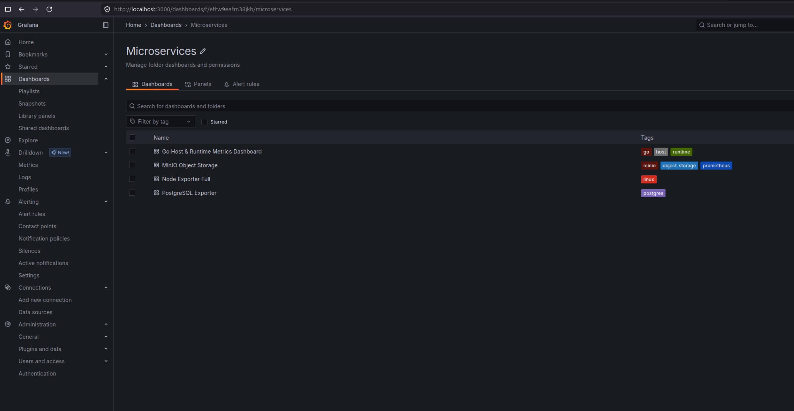

Но на этом обычно не кончается тюнинг. Надо отрывать каждый дашборд и смотреть, как создатель ашборда назвал перменные, подходят ли тебе запросы, и тюнить под себя.

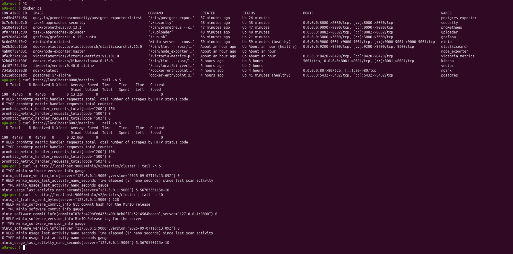

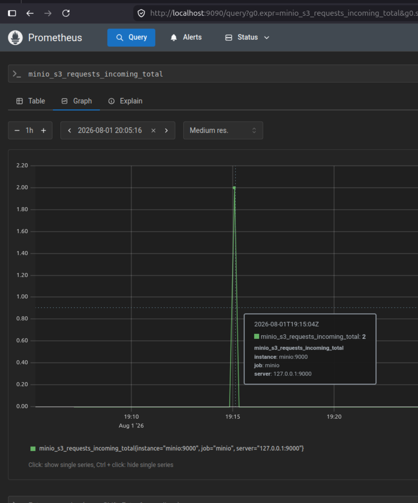
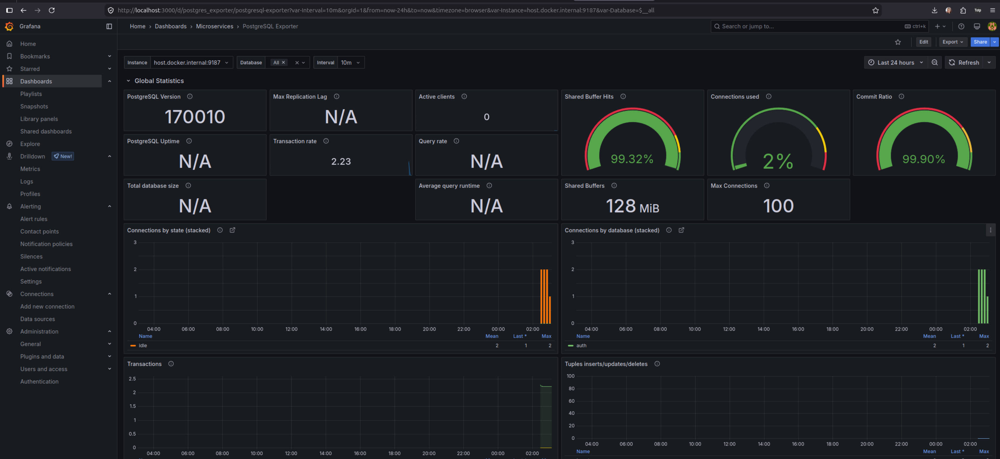
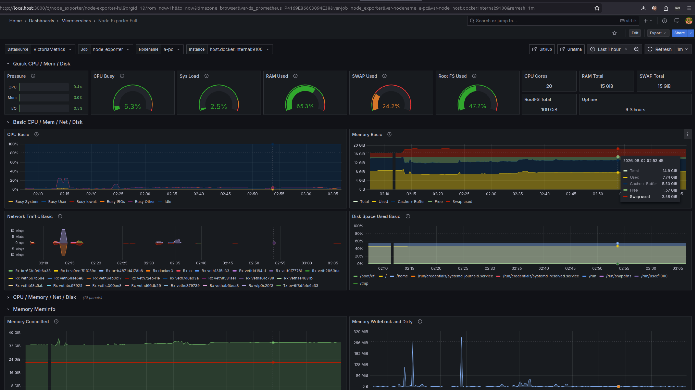
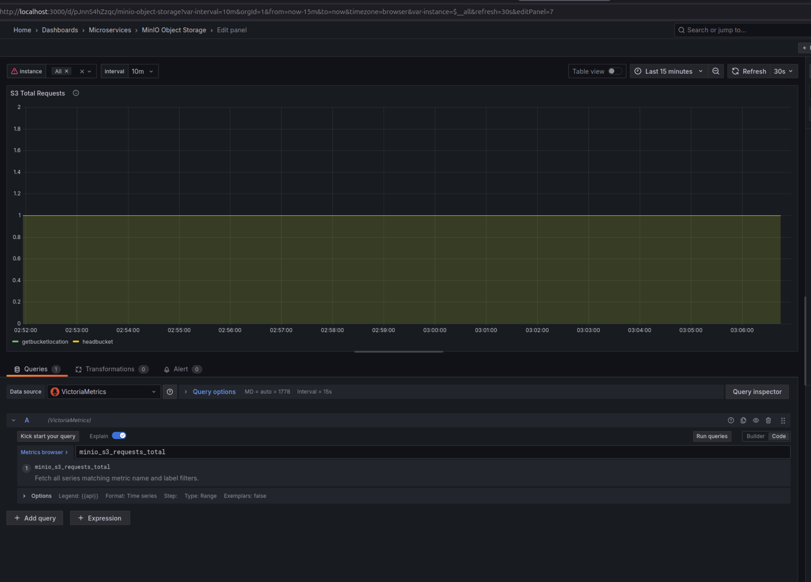
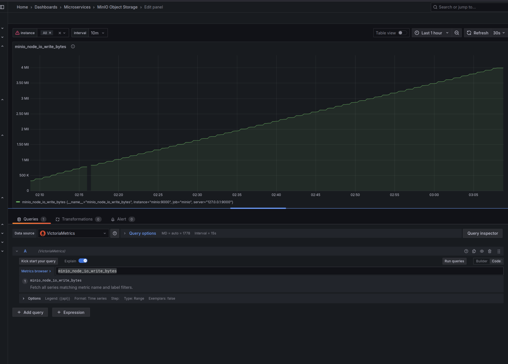
