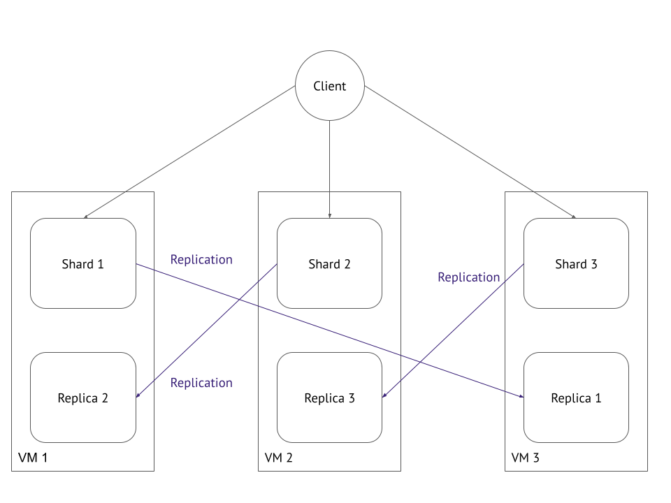
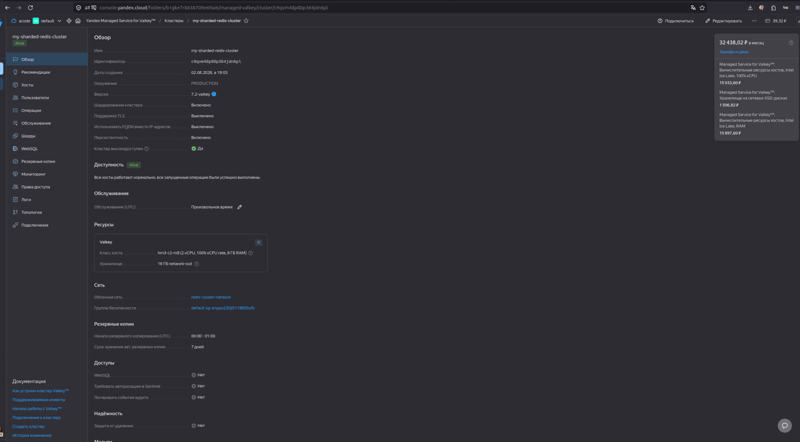

# [Домашнее задание к занятию «Микросервисы: масштабирование»](https://github.com/netology-code/micros-homeworks/blob/main/11-microservices-04-scaling.md)

## Задача 1: Кластеризация

<details>
<summary>текст задачи
</summary>

Предложите решение для обеспечения развёртывания, запуска и управления приложениями. Решение может состоять из одного или нескольких программных продуктов и должно описывать способы и принципы их взаимодействия.

Решение должно соответствовать следующим требованиям:

* поддержка контейнеров;
* обеспечивать обнаружение сервисов и маршрутизацию запросов;
* обеспечивать возможность горизонтального масштабирования;
* обеспечивать возможность автоматического масштабирования;
* обеспечивать явное разделение ресурсов, доступных извне и внутри системы;
* обеспечивать возможность конфигурировать приложения с помощью переменных среды, в том числе с возможностью безопасного хранения чувствительных данных таких как пароли, ключи доступа, ключи шифрования и т. п.

Обоснуйте свой выбор.
</details>

**Решение**

На вебинаре уже было сказано, то Kubernetes - это решение для удолетворения этих потрбеностей. Это будет следующий блок, поэтому на сейчас выберу решение из инструментов, пройденных в текущем курсе:
* Docker Swarm 
* Traefik (вместо Nginx)
* HashiCorp Vault

Стек технологий:
* `Docker Swarm` — это встроенный в Docker режим оркестрации. Он превращает несколько серверов в один виртуальный компьютер.
* `Traefik` — современный балансировщик и Edge-router. В отличие от стандартного Nginx, он автоматически видит появление новых контейнеров и сам настраивает маршрутизацию без правки конфигов.
* `HashiCorp Vault` — для безопасного хранения паролей и ключей.

### Соответствие требованиям:

* **Поддержка контейнеров**: `Docker Swarm` работает напрямую с `Docker`-образами.
* **Обнаружение сервисов и маршрутизация**:
`Traefik` подключается к Docker API. Как только вы запускаете новый контейнер, `Traefik` мгновенно узнает его IP и начинает отправлять на него трафик. Hе нужно вручную прописывать адреса серверов.
* **Горизонтальное масштабирование:** 
Делается одной командой: `docker service scale my_app=10`. Swarm сам распределит 10 копий приложения по серверам.
* **Автоматическое масштабирование:**
Для `Docker Swarm` есть простые внешние утилиты (например, `Docker-swarm-autoscaler`), которые следят за нагрузкой на `CPU` и добавляют/удаляют контейнеры.
* **Разделение ресурсов (Внутренние/Внешние)**:
В `Swarm` создаются изолированные сети (`overlay networks`). 
Например:
* сеть `frontend` (куда смотрит балансировщик и интернет)
* сеть `backend` (где живут БД и внутренняя логика). 
База данных из интернета будет физически недоступна.
* **Конфигурация и секреты:**
`Docker Swarm` имеет встроенный механизм `Docker Secrets`. Mожно пробросить пароль в контейнер так, что он будет виден только внутри оперативной памяти приложения в виде файла или переменной, и никогда не попадет в логи или в образ.

**Дополнительно:**

* *Минимум настройки*: `Traefik` сам выписывает SSL-сертификаты (HTTPS) от `Let's Encrypt` и сам находит приложения.
* *Легковесность:* Эта система потребляет в 10 раз меньше ресурсов сервера, чем полноценный Kubernetes.

**Обоснование выбора:** Данный стек является "золотой серединой" — он дает все возможности взрослой облачной инфраструктуры (автомасштабирование, безопасность, динамическая балансировка), но управляется простыми и понятными инструментами `Docker`.

Например, compose.yml:

```yaml
version: '3.8'

services:
  # 1. Балансировщик и маршрутизатор
  traefik:
    image: traefik:v2.10
    command:
      - "--providers.docker.swarm=true" # Включаем поддержку Swarm
      - "--api.insecure=true"           # Панель управления (для теста)
      - "--entrypoints.web.address=:80"
    ports:
      - "80:80"
      - "8080:8080" # Порт для дашборда Traefik
    volumes:
      - "/var/run/docker.sock:/var/run/docker.sock:ro" # Чтобы Traefik видел новые контейнеры
    networks:
      - public_net

  # 2. Хранилище секретов
  vault:
    image: hashicorp/vault:1.13
    environment:
      VAULT_DEV_ROOT_TOKEN_ID: ${VAULT_DEV_ROOT_TOKEN_ID}
      VAULT_ADDR: "http://127.0.0.1:8200"
    ports:
      - "8200:8200"
    cap_add:
      - IPC_LOCK
    networks:
      - private_net

  # 3. Мой микросервис
  my_app:
    image: my-app:latest
    deploy:
      replicas: 3 # Горизонтальное масштабирование
      labels:
        - "traefik.http.routers.myapp.rule=Host(`myapp.local`)" # Маршрутизация
        - "traefik.http.services.myapp.loadbalancer.server.port=8000"
    environment:
      # Нечувствительные данные
      APP_ENV: "production"
      # Секреты можно прокидывать через Docker Secrets или API Vault
      DB_PASSWORD_FILE: "/run/secrets/db_password"
    secrets:
      - db_password
    networks:
      - public_net
      - private_net

networks:
  public_net:
    driver: overlay # Сеть для внешнего трафика
  private_net:
    driver: overlay # Изолированная сеть для БД и Vault (не видна извне)

secrets:
  db_password:
    external: true # Секрет создается командой `docker secret create`
```

## Задача 2: Распределённый кеш * (необязательная)

<details open>
<summary>текст задачи
</summary>
Разработчикам вашей компании понадобился распределённый кеш для организации хранения временной информации по сессиям пользователей. Вам необходимо построить Redis Cluster, состоящий из трёх шард с тремя репликами.

**Схема**:



</details>


Судя по картинке, здесь происходит кросс-репликация: реплика каждого мастера находится на другой виртуальной машине (VM). Если любая из трех VM полностью выйдет из строя, кластер продолжит работу, так как активная реплика упавшего мастера останется доступна на другой машине.

Если воспользоваться [готовым решением от ЯндексОблака Yandex Managed Service for Valkey™](https://yandex.cloud/ru/docs/terraform/resources/mdb_redis_cluster_v2), то можно такое создать с помощью terraform
<details>
<summary>main.tf
</summary>

```hcl
terraform {
  required_providers {
    yandex = {
      source = "yandex-cloud/yandex"
    }
  }
  required_version = ">=1.12.0"
}

provider "yandex" {
  cloud_id  = var.cloud_id
  folder_id = var.folder_id
  zone      = var.default_zone
  service_account_key_file = file("authorized_key.json")
}

# 1. Создаем виртуальную сеть (VPC)
resource "yandex_vpc_network" "redis_network" {
  name = "redis-cluster-network"
}

# 2. Создаем подсети в трех разных зонах доступности (дата-центрах)
resource "yandex_vpc_subnet" "subnet_a" {
  name           = "redis-subnet-a"
  zone           = "ru-central1-a"
  network_id     = yandex_vpc_network.redis_network.id
  v4_cidr_blocks = ["10.1.0.0/24"]
}

resource "yandex_vpc_subnet" "subnet_b" {
  name           = "redis-subnet-b"
  zone           = "ru-central1-b"
  network_id     = yandex_vpc_network.redis_network.id
  v4_cidr_blocks = ["10.2.0.0/24"]
}

resource "yandex_vpc_subnet" "subnet_d" {
  name           = "redis-subnet-d"
  zone           = "ru-central1-d"
  network_id     = yandex_vpc_network.redis_network.id
  v4_cidr_blocks = ["10.3.0.0/24"]
}

# 3. Разворачиваем Шардированный Кластер Redis
resource "yandex_mdb_redis_cluster" "my_redis_cluster" {
  name        = "my-sharded-redis-cluster"
  environment = "PRODUCTION"
  network_id  = yandex_vpc_network.redis_network.id
  sharded     = true # ВКЛЮЧАЕТ ШАРДИРОВАНИЕ

  config {
    password = "SuperSecretPassword123!" # Замените на надежный пароль
    version  = "7.2-valkey"                      # Версия Redis
  }

  resources {
    resource_preset_id = "hm3-c2-m8" # Тип памяти и CPU (минимальный для Production)
    disk_size          = 16           # Размер диска в ГБ
    disk_type_id       = "network-ssd"
  }

  # --- ШАРД 1 ---
  # Мастер в зоне A
  host {
    zone      = "ru-central1-a"
    subnet_id = yandex_vpc_subnet.subnet_a.id
    shard_name = "shard1"
  }
  # Реплика в зоне B
  host {
    zone      = "ru-central1-b"
    subnet_id = yandex_vpc_subnet.subnet_b.id
    shard_name = "shard1"
  }

  # --- ШАРД 2 ---
  # Мастер в зоне B
  host {
    zone      = "ru-central1-b"
    subnet_id = yandex_vpc_subnet.subnet_b.id
    shard_name = "shard2"
  }
  # Реплика в зоне C
  host {
    zone      = "ru-central1-d"
    subnet_id = yandex_vpc_subnet.subnet_d.id
    shard_name = "shard2"
  }

  # --- ШАРД 3 ---
  # Мастер в зоне C
  host {
    zone      = "ru-central1-d"
    subnet_id = yandex_vpc_subnet.subnet_d.id
    shard_name = "shard3"
  }
  # Реплика в зоне A
  host {
    zone      = "ru-central1-a"
    subnet_id = yandex_vpc_subnet.subnet_a.id
    shard_name = "shard3"
  }
}
```
</details>

Цена выходит больше 32-х тыс рублей в месяц с этими натсройками:



**По другому:**
Развернуть такую конфигурацию можно с помощью Docker (или Docker Swarm) на трех виртуальных машинах:

1) **Сделать конфигурационные файлы**

На каждой VM необходимо создать конфигурационные файлы для запускаемых инстансов Redis. Включите в них поддержку кластерного режима.Создайте файл redis.conf со следующим содержимым для каждого инстанса:

```bash
port 6379
cluster-enabled yes
cluster-config-file nodes.conf
cluster-node-timeout 5000
appendonly yes
protected-mode no
```

2) **Запуск контейнеров на виртуальных машинах**

Распределите запуск мастеров и реплик по виртуальным машинам строго в соответствии со схемой, используя Docker.

**На VM 1 (IP: 192.168.1.11)**

Запускаем Shard 1 и Replica 2:

```shell
# Запуск Shard 1 (Master)
docker run -d --name redis-shard-1 --net host -v /srv/redis/shard1:/data redis:7-alpine redis-server --port 6379 --cluster-enabled yes --protected-mode no

# Запуск Replica 2 (Слушает на порту 6380)
docker run -d --name redis-replica-2 --net host -v /srv/redis/replica2:/data redis:7-alpine redis-server --port 6380 --cluster-enabled yes --protected-mode no
```

**На VM 2 (IP: 192.168.1.12)**

Запускаем Shard 2 и Replica 3:

```shell
# Запуск Shard 2 (Master)
docker run -d --name redis-shard-2 --net host -v /srv/redis/shard2:/data redis:7-alpine redis-server --port 6379 --cluster-enabled yes --protected-mode no

# Запуск Replica 3 (Слушает на порту 6380)
docker run -d --name redis-replica-3 --net host -v /srv/redis/replica3:/data redis:7-alpine redis-server --port 6380 --cluster-enabled yes --protected-mode no
```

**На VM 3 (IP: 192.168.1.13)**

Запускаем Shard 3 и Replica 1:

```shell
# Запуск Shard 3 (Master)
docker run -d --name redis-shard-3 --net host -v /srv/redis/shard3:/data redis:7-alpine redis-server --port 6379 --cluster-enabled yes --protected-mode no

# Запуск Replica 1 (Слушает на порту 6380)
docker run -d --name redis-replica-1 --net host -v /srv/redis/replica1:/data redis:7-alpine redis-server --port 6380 --cluster-enabled yes --protected-mode no
```

* `--net host` нужно длятого, чтобы Redis могли легко общаться друг с другом через реальные IP-адреса машин

3) **Инициализация и объединение в кластер**

После того как все 6 контейнеров запущены, их нужно связать в единый кластер и указать, кто чей репликой является.
Выполните эту команду на любой из машин (IP-адреса вымышленные):

```shell
docker exec -it redis-shard-1 redis-cli --cluster create \
192.168.1.11:6379 \
192.168.1.12:6379 \
192.168.1.13:6379 \
192.168.1.13:6380 \
192.168.1.11:6380 \
192.168.1.12:6380 \
--cluster-replicas 1
```

Порядок IP-адресов важен в этой команде:
* Первые три адреса (192.168.1.11:6379, 192.168.1.12:6379, 192.168.1.13:6379) автоматически станут Мастерами (Shard 1, Shard 2, Shard 3).
* Следующие три адреса станут их Репликами по порядку.
* Флаг `--cluster-replicas 1` указывает, что у каждого мастера должна быть ровно одна реплика. Redis автоматически сопоставит их так, чтобы реплика не оказалась на той же физической машине, что и мастер, полностью воссоздавая вашу схему.

4) **Проверка статуса кластера**

Убедиться, что всё связалось правильно:

```shell
docker exec -it redis-shard-1 redis-cli cluster nodes
```