# [Домашнее задание к занятию «Kubernetes. Причины появления. Команда kubectl»](https://github.com/netology-code/kuber-homeworks_1.1_03.25/blob/main/README.md)

Установка MicroK8S:

* `sudo snap install microk8s --classic`
* `sudo usermod -a -G microk8s $USER`
* `sudo chown -f -R $USER ~/.kube`
* `sudo apt update`
* `microk8s status --wait-ready`


**Локальная машина**

## Задание 1. Установка MicroK8S

1) Установить MicroK8S на локальную машину или на удалённую виртуальную машину.

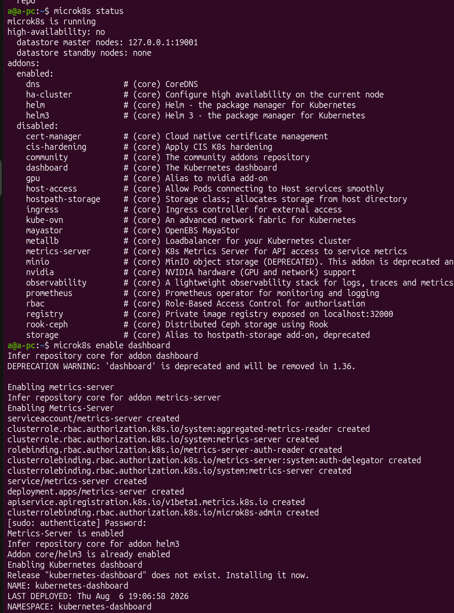

2) Установить dashboard.

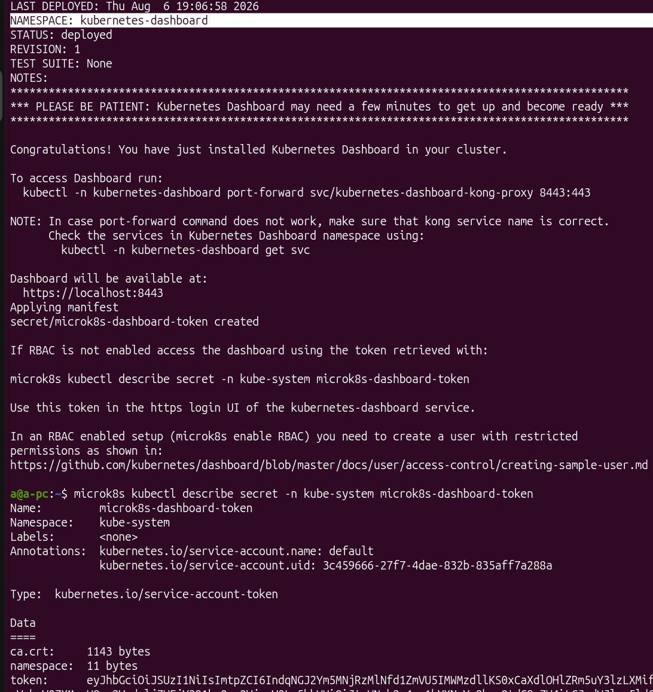

3) Сгенерировать сертификат для подключения к внешнему ip-адресу.

- Прописала свой внешний адрес в `/var/snap/microk8s/current/certs/csr.conf.template`:

```
...
[ alt_names ]
DNS.1 = kubernetes
DNS.2 = kubernetes.default
DNS.3 = kubernetes.default.svc
DNS.4 = kubernetes.default.svc.cluster
DNS.5 = kubernetes.default.svc.cluster.local
IP.1 = 127.0.0.1
IP.2 = 10.152.183.1
IP.3 = my_outer_ip_address
...
```


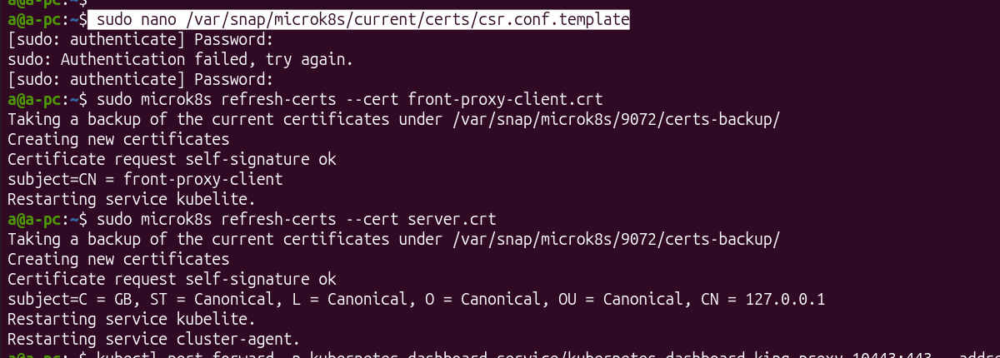

Запуск с `--adress 0.0.0.0` нужен для того, чтобы открыть доступ для всего интернета.
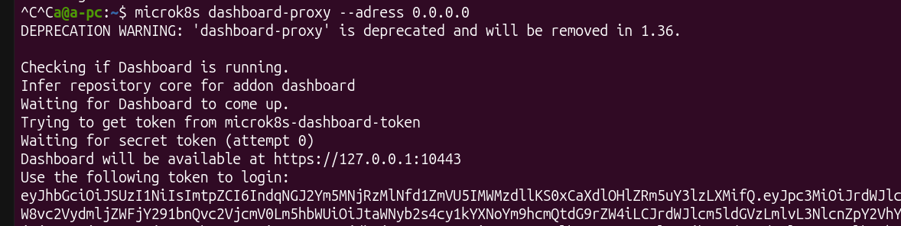


После пробороса порта в домашнем роутере на 192.168.0.1, и разрешения в `ufw` порта `10443`, попробовалв зайти с телефона (После все эти правила я удалила):
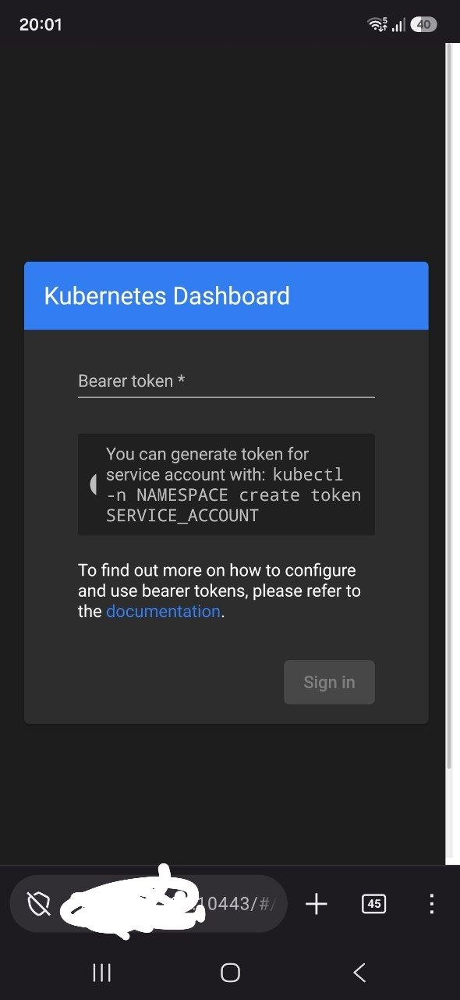
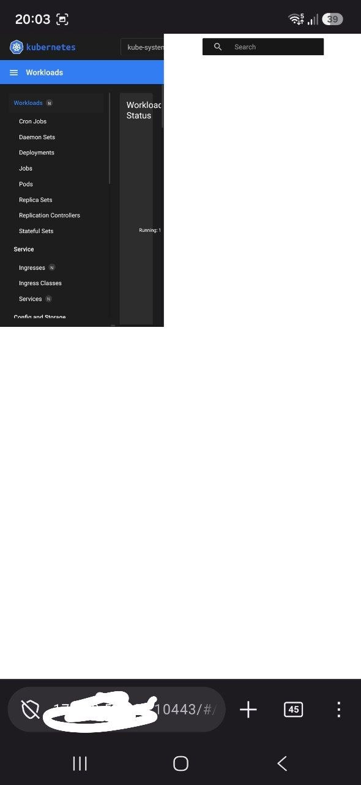


## Задание 2. Установка и настройка локального kubectl

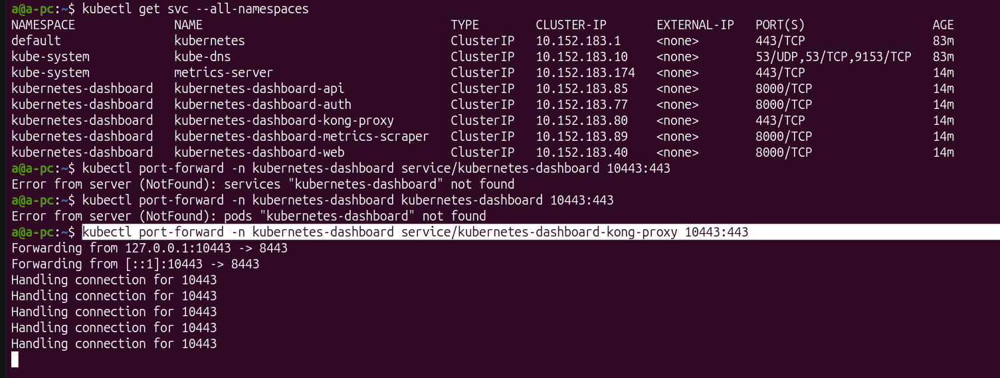
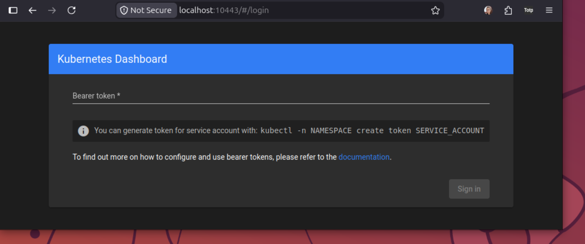
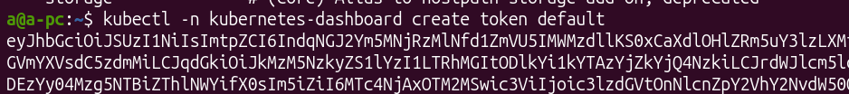
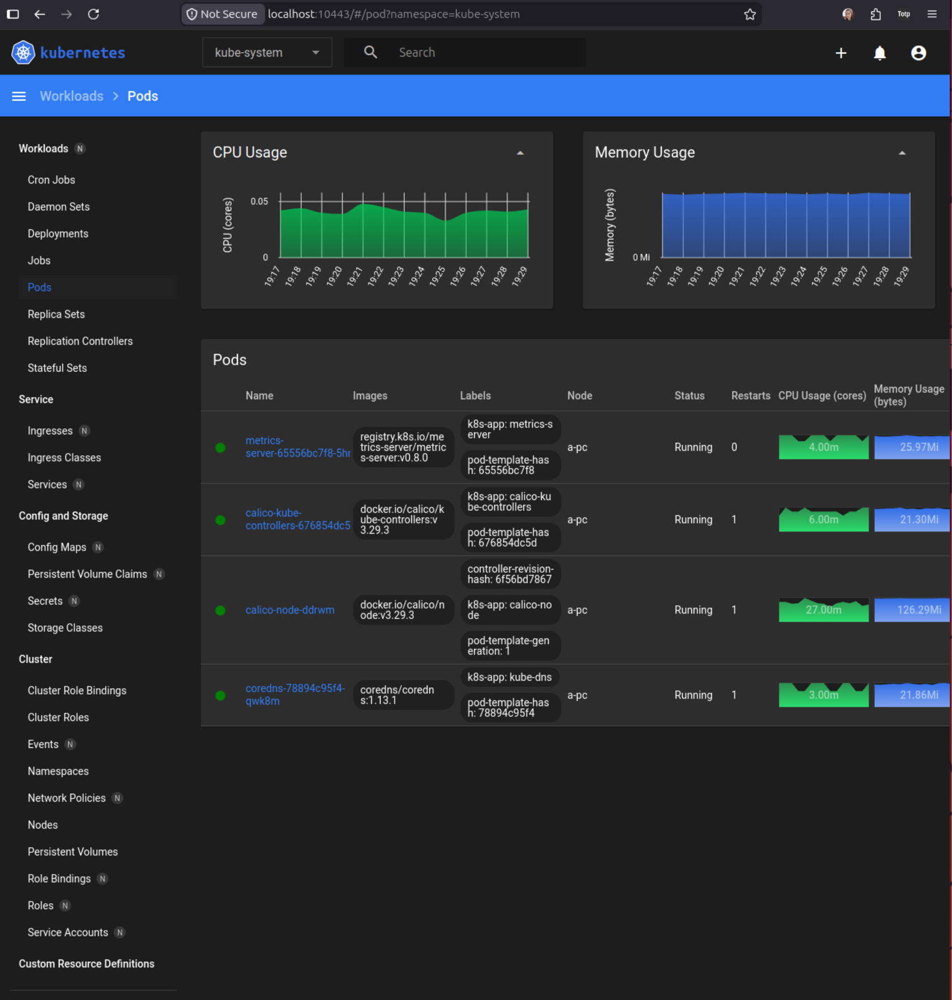
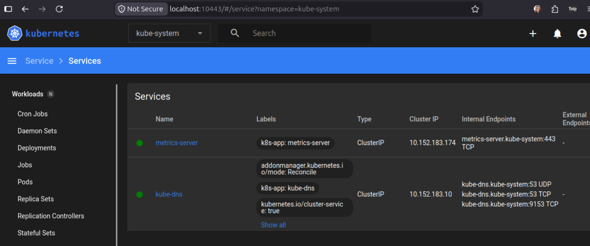
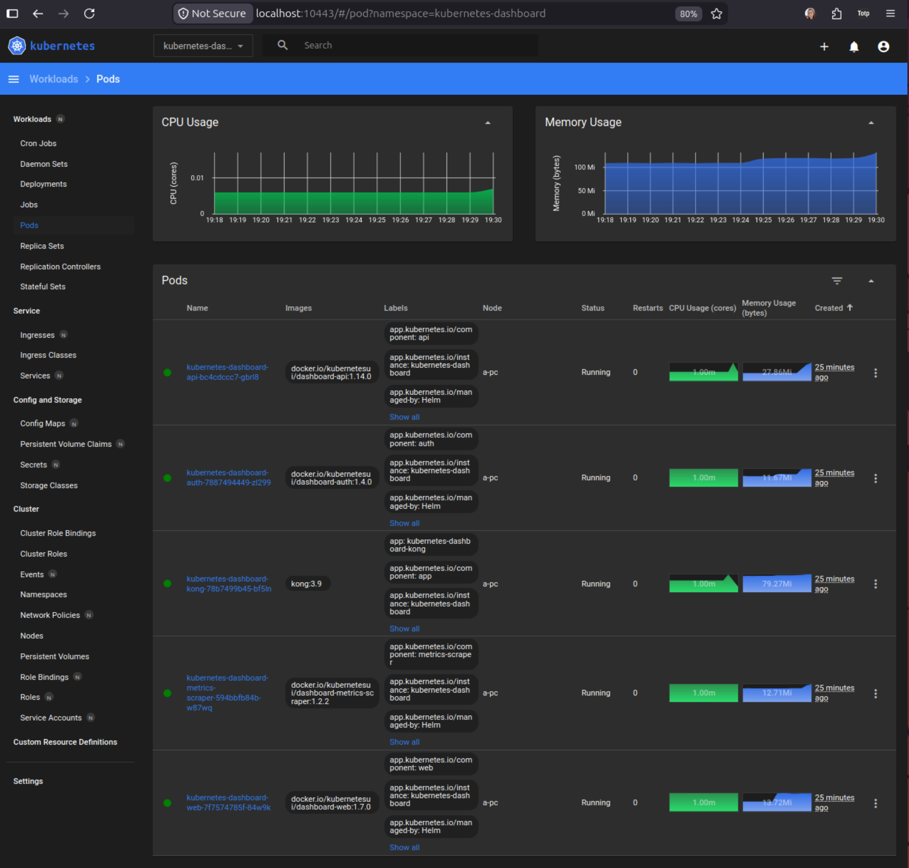
