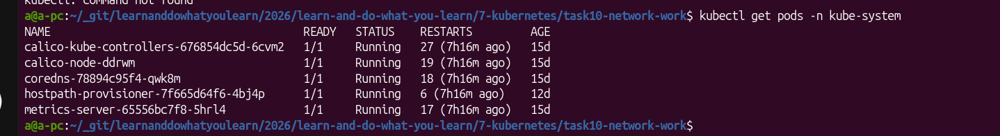
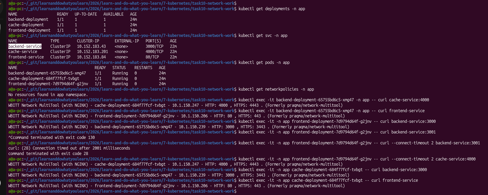
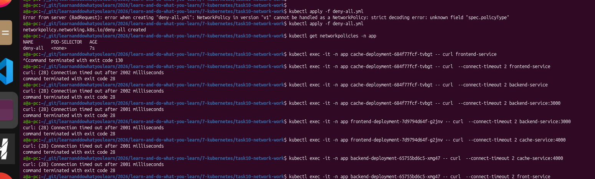
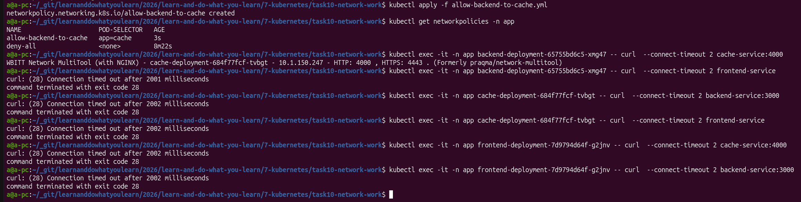
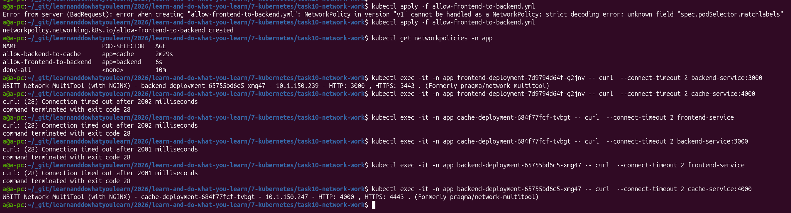

# [Домашнее задание к занятию «Как работает сеть в K8s»](https://github.com/netology-code/kuber-homeworks/blob/main/3.3/3.3.md)

## Задание 1. Создать сетевую политику или несколько политик для обеспечения доступа

Установленный сетевым плагин `Calico`:

1. Создать deployment'ы приложений frontend, backend и cache и соответсвующие сервисы:

* [deployment-backend.yaml](./deployment-backend.yaml)
* [service-backend.yaml](./service-backend.yaml)
* [deployment-frontend.yaml](./deployment-frontend.yaml)
* [service-frontend.yaml](./service-frontend.yaml)
* [deployment-cache.yaml](./deployment-cache.yaml)
* [service-cache.yaml](./service-cache.yaml)

2. Разместить поды в namespace App:

* [namespace.yml](./namespace.yml)

3. Проверим,что без политики всем всё разрешено:

4. Создать политики, чтобы обеспечить доступ `frontend` -> `backend` -> `cache`. Другие виды подключений должны быть запрещены.

Чтобы настроить такую изоляцию, пойду от Deny (запретить всё по умолчанию) и затем точечно разрешу нужный трафик.

* 

Проверим, что всем всё запрещено:

Создаю политику для разрешения цепочки `frontend` -> `backend` -> `cache`:
* [allow-frontend-to-backend.yml](./allow-frontend-to-backend.yml)
* [allow-backend-to-cache.yml](./allow-backend-to-cache.yml)

Применяю последовательно и проверяю на каждом шагу:

ПОлучилось ожидаемо.