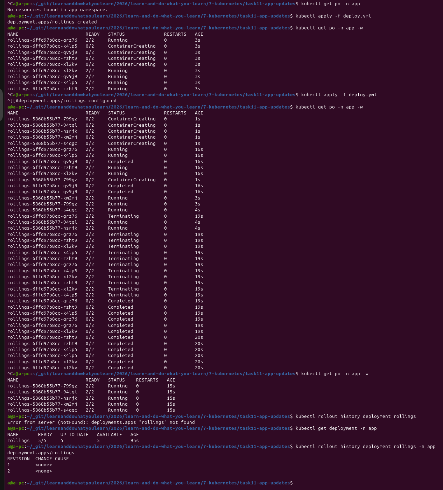
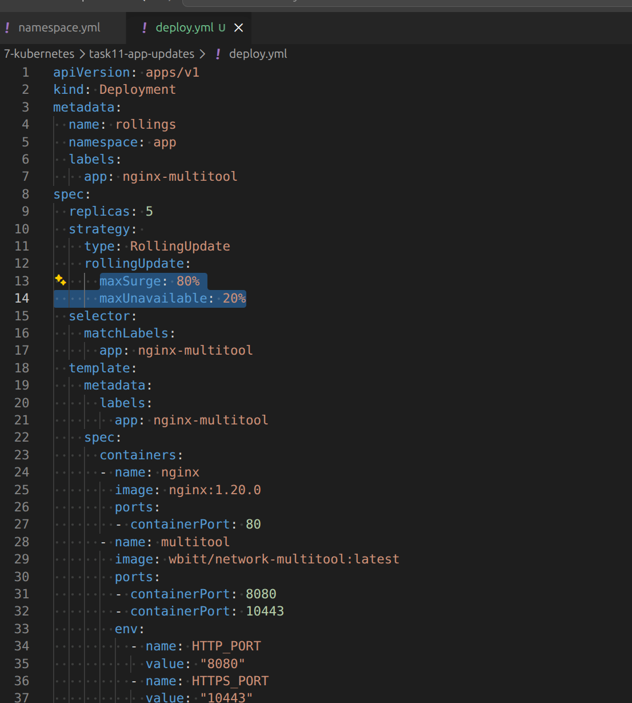
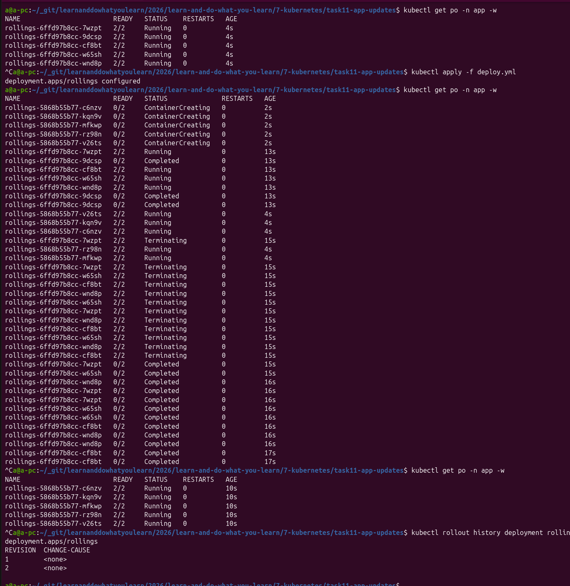
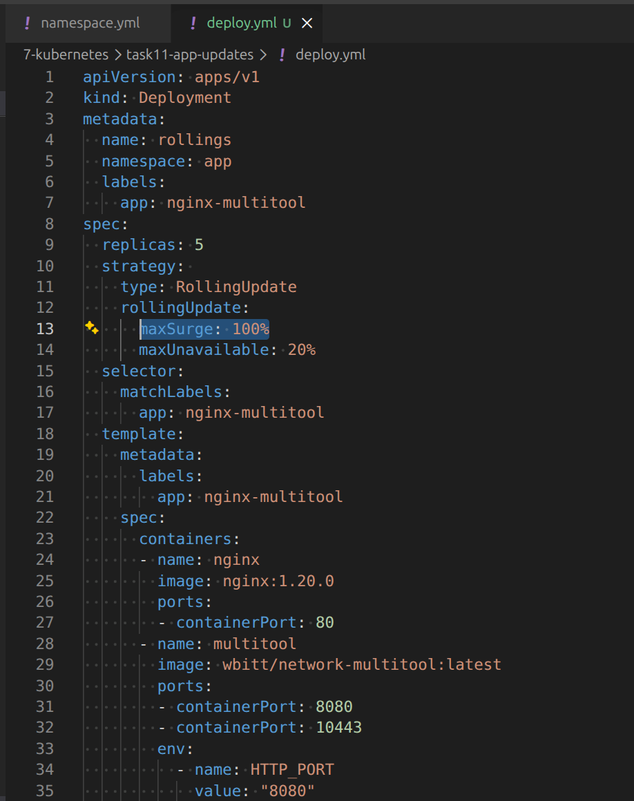
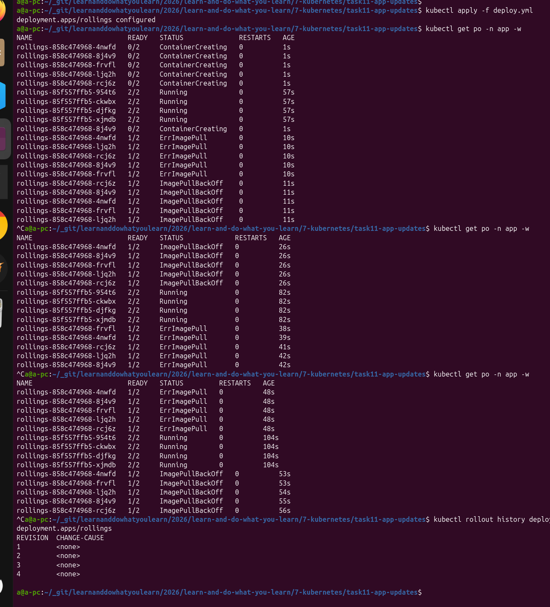
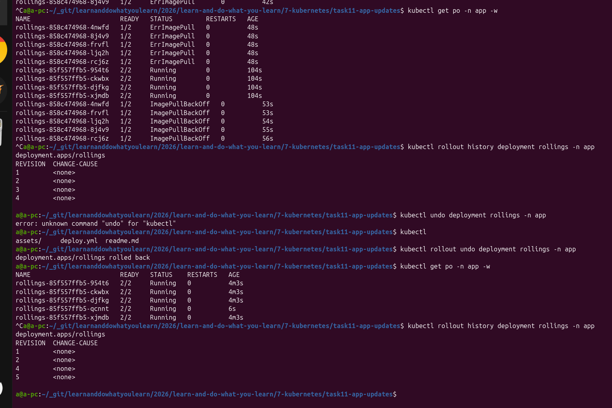
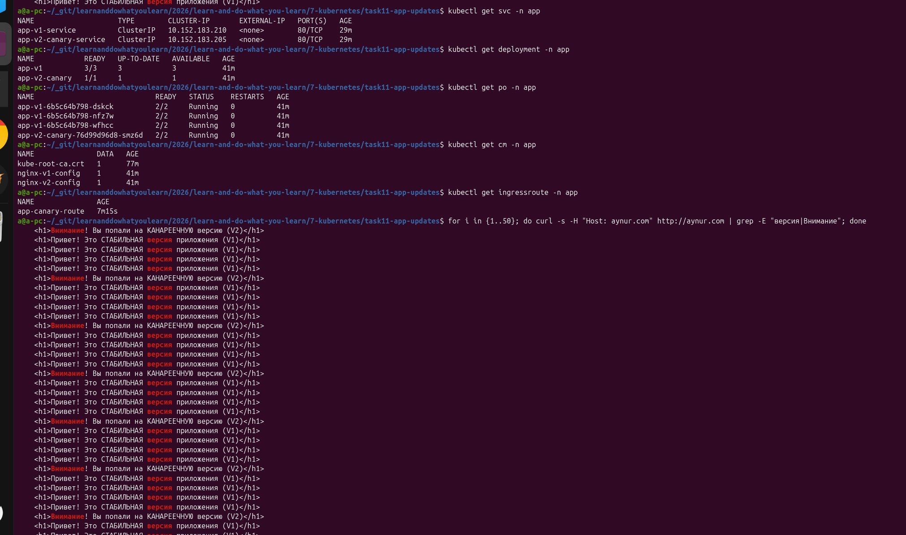

# [Домашнее задание к занятию «Обновление приложений»](https://github.com/netology-code/kuber-homeworks/blob/main/3.4/3.4.md)

## Задание 1. Выбрать стратегию обновления приложения и описать ваш выбор

Ответ:

Здесь следует обратить внимание на предложение - Обновление мажорное, новые версии приложения не умеют работать со старыми.
Значит, что одновременно новая и старая версии приложения работать не могут. Возможно это привело бы к порче данных, схема бд сильно изменилась, 
Для данного сценария единственным технически верным выбором является стратегия `Recreate` (Пересоздание).

Анализ ограничений и выбор стратегии

| Стратегия | Допустимость | Причина |
| --- | --- | --- |
| Rolling Update (Поочередная замена) | НЕТ | **Несовместимость версий**: Новая мажорная версия не умеет работать со старой. Если обновлять реплики по одной, в кластере одновременно будут запущены обе версии, что приведет к нарушению логики приложения, порче данных в БД или сетевым ошибкам. |
| Blue-Green / Canary | НЕТ | **Ограничение ресурсов**: Эти стратегии требуют поднятия параллельного контура (еще +100% или хотя бы +10-20% ресурсов для Canary). У вас запас составляет всего 20% в менее загруженный момент, а общий лимит жестко ограничен. | 
| Recreate (Пересоздание) | ДА | **Идеальное соответствие**: Старые реплики полностью останавливаются (ресурсы освобождаются до 0%), после чего сразу запускаются новые реплики. Нет конфликта версий и нет превышения лимитов по ресурсам. | 

**План проведения обновления (Минимизация рисков)**

Поскольку стратегия Recreate неизбежно влечет за собой downtime (кратковременную недоступность приложения), процесс нужно организовать по шагам:
* *Выбор тайм-слота*: Обновление должно выполняться строго в зафиксированный наименее загруженный момент времени (когда есть те самые 20% запаса).
* *Заглушка для пользователей (Maintenance page)*: На уровне балансировщика (Ingress / Reverse Proxy) перед стартом операции включается статическая страница «Ведутся технические работы».
* *Миграция данных:* В момент, когда старые реплики потушены и трафик перекрыт, выполняются мажорные миграции базы данных (если они есть).
* *Быстрый старт:* Запускаются реплики новой версии. Как только пробы доступности (Readiness probes) подтверждают успех, балансировщик переключает пользователей на новое приложение.

## Задание 2. Обновить приложение

1) Создать deployment приложения с контейнерами nginx и multitool. Версию nginx взять 1.19. Количество реплик — 5.

2) Cокращение времени обновления до минимума можно получить регулировкой значения `rollingUpdate: maxSurge`.
Приложение должно быть доступно - значит я не могу довести до нуля значение `rollingUpdate: maxUnavailable`.

* Для значения maxSurge: 80%, maxUnavailable: 20%

* Для значения maxSurge: 100%, maxUnavailable: 20%

Как видно, при значений `maxSurge: 100%` время пересоздания подо меньше - 19 сек против 15 сек.

3) Попытаться обновить nginx до версии 1.38, приложение должно оставаться доступным.

Ниже хорошо видно работу параметра `maxUnavailable: 20%`, что в этом случае равно одному поду. При получении ошибочного релиза, 80% нагручной способности приложения осталось на месте. если мы хотим, чтобы при ошибочном релизе все 5 подов были в доступе, нужно сделать значение `maxUnavailable = 0%`

4) Откатиться после неудачного обновления.

## Задание 3*. Создать Canary deployment

1) Создать два deployment'а приложения nginx:

* [deploy-v1.yml](./deploy-v1.yml)
* [canary-deploy-v1.yml](./canary-deploy-v1.yml)

2) При помощи разных ConfigMap сделать две версии приложения — веб-страницы:

* [configmap-nginx-v1.yml](./configmap-nginx-v1.yml)
* [configmap-nginx-v1.yml](./configmap-nginx-v1.yml)

3) С помощью ingress создать канареечный деплоймент, чтобы можно было часть трафика перебросить на разные версии приложения:

У меня уже локально был устаноленный traefik. С помощью [алгоритма взвешенного РоундРобина ](https://doc.traefik.io/traefik/reference/routing-configuration/kubernetes/crd/http/traefikservice/) можно отбалансировать траффик:

* [service-v1.yml](./service-v1.yml)
* [service-v2.yml](./service-v2.yml)
* [canary-route.yml](./canary-route.yml)
* [ingress.yml](./ingress.yml)

И получилось:

