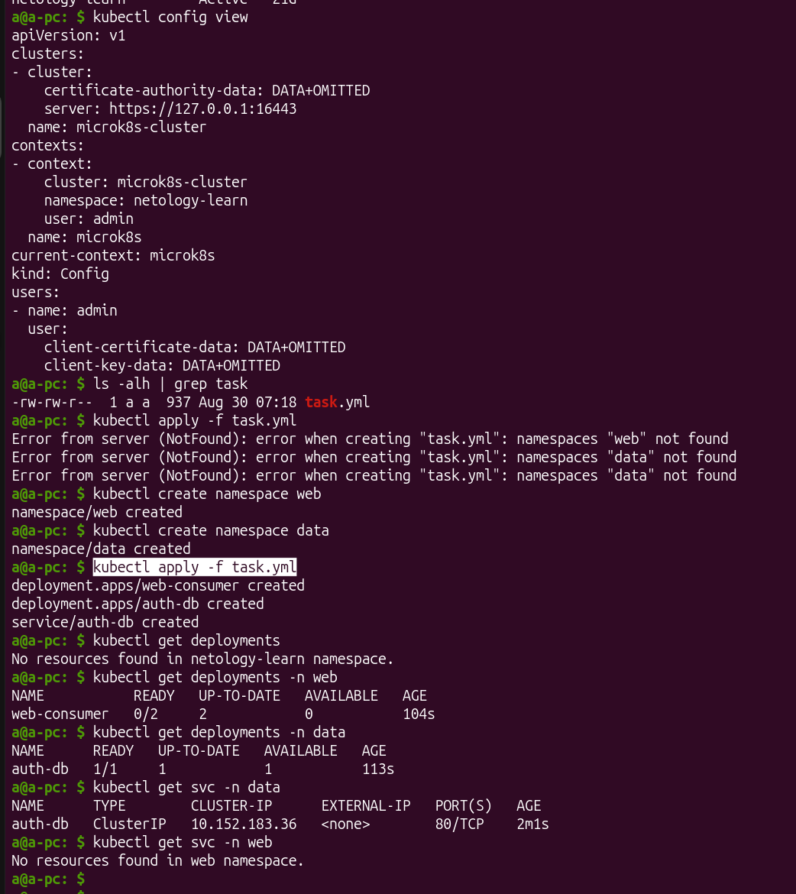
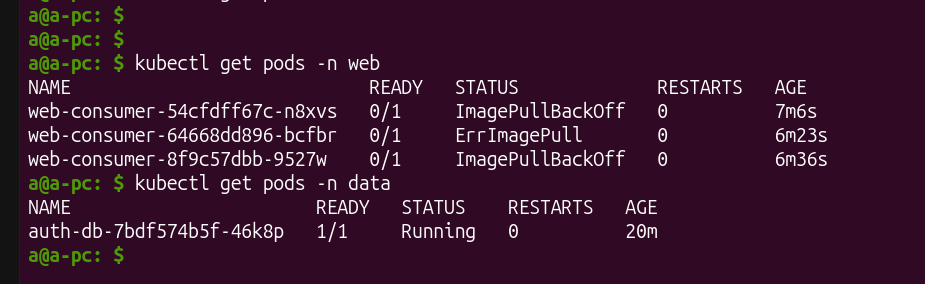
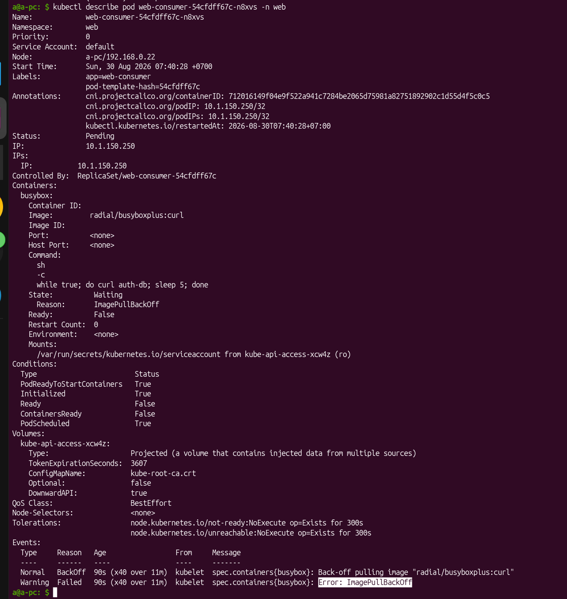
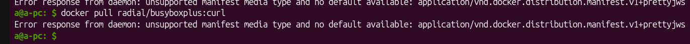
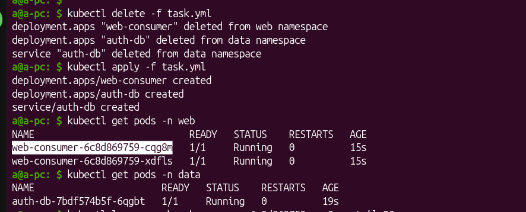
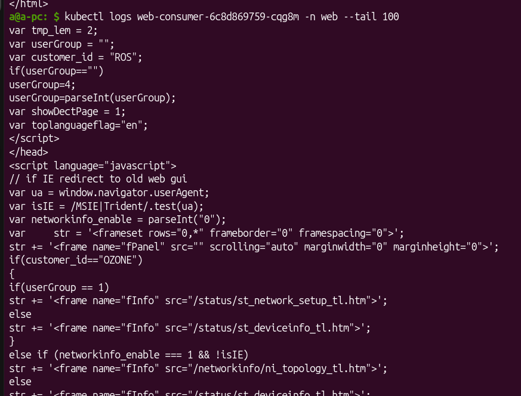
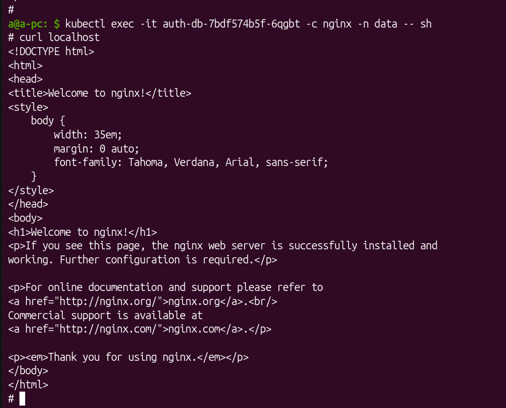
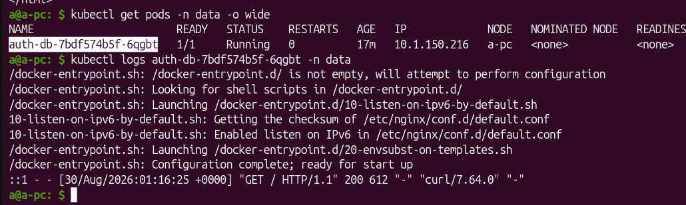
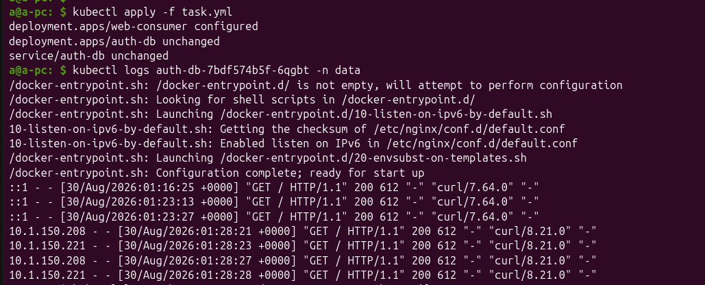
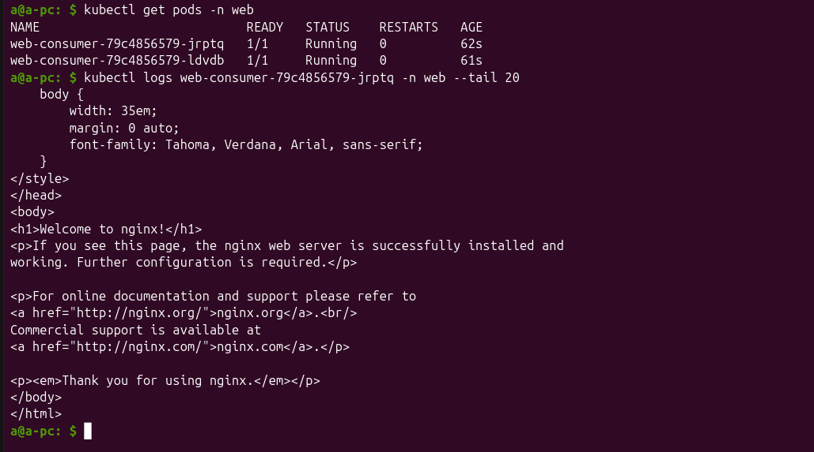

# [Домашнее задание к занятию Troubleshooting](https://github.com/netology-code/kuber-homeworks/blob/main/3.5/3.5.md)

## Задание. При деплое приложение web-consumer не может подключиться к auth-db. Необходимо это исправить

* Установить приложение по манифесту task.yaml

* Выявить проблему и описать.
* Исправить проблему, описать, что сделано.
* Продемонстрировать, что проблема решена.

Решение:

1. Сразу бросается в глаза то, что deployment-ы находятся в разных namespace.
В `web-consumer` deployment контейнер делает запрос в `auth-db` так, как будто они находятся в одном namespace:
```yaml
     containers:
      - command:
        - sh
        - -c
        - while true; do curl auth-db; sleep 5; done
        image: radial/busyboxplus:curl
...
```

2. У web-consumer Deployment нет сервиса. Как он может соединиться с  auth-db Deployment.





### Проблема 1 - Не подгрузилось изображение для `web-consumer` `deployment`





Страница в https://hub.docker.com/r/radial/ есть, а изображения нет. Возможно устарел за 11 лет. Заменю на другое изображение, более новое с тем же функционалом: - `rapidfort/curl:8.21.0`:



Заработало. Эта проблема решена.


### Проблема 2 - `web-consumer` `deployment` не достучитя никак до `auth-db` `deployment`

Смотрю логи пода `web-consumer` - нет отвечта от nginx. Показывает внутреннюю заглушку.


Сходила в под `auth-db` `deployment` в контейнер `nginx`, проверила его - работает:



В логах этого пода я только свой запрос и вижу изнутри контейнера:



Значит,`web-consumer` не может достучатся до `auth-db`, так как команда написана так, как будто они находятся в одном  `namespace`. Необходимо прописать свой  `namespace` для `auth-db`, и команда будет такова:

```
while true; do curl auth-db.data; sleep 5; done
```

Перезапускаю деплойменты:



И вижу в логах `auth-db`, что он получал новые запросы.

,`web-consumer` изменился, поды тоже. Возьму названия новых подов и проверю его логи:



И вижу,что проблема решилась.

Итого, `web-consumer` достучался до `auth-db`.

Новый рабочий файл:  [task.yml](./task.yml)