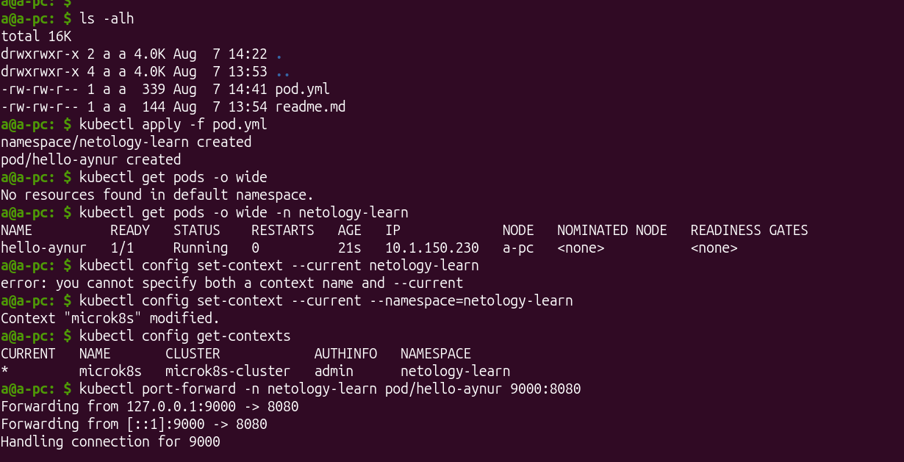
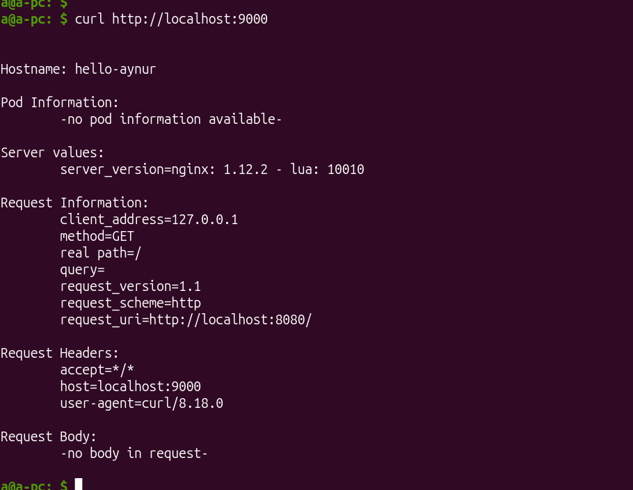
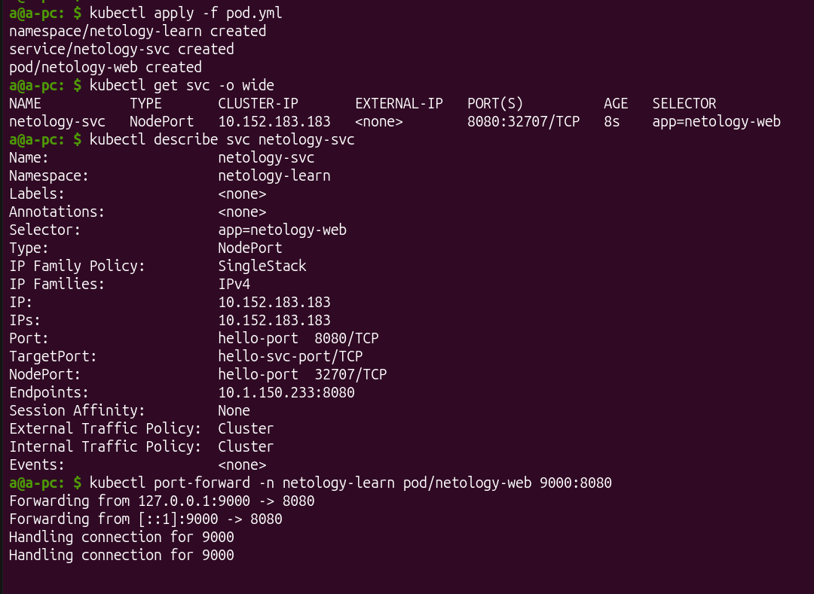
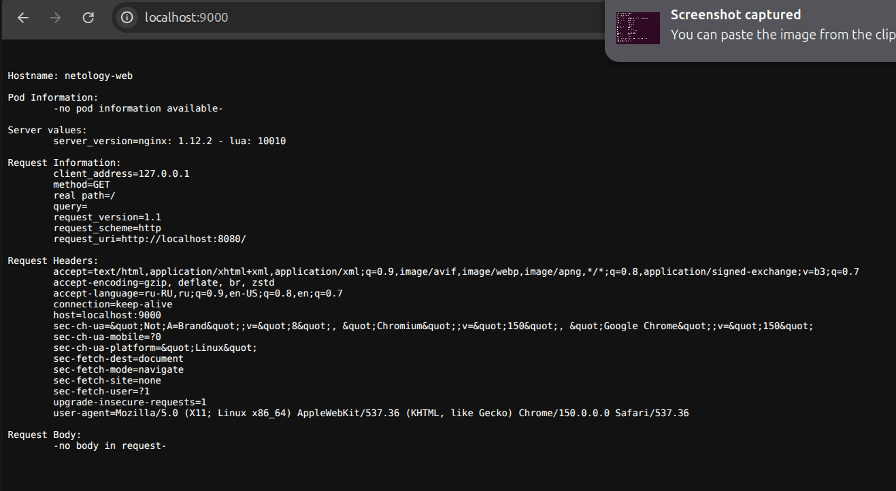

# Домашнее задание 2 «Базовые объекты K8S» 

## Задание 1. Создать Pod с именем hello-world

[pod.yml](./pod.yml):

```yaml
apiVersion: v1
kind: Namespace
metadata:
  name: netology-learn
---
apiVersion: v1
kind: Pod
metadata:
  name: hello-aynur
  namespace: netology-learn
  labels:
    app: hello-aynur
spec:
  containers:
    - name: aynur-hello-container
      image:  gcr.io/kubernetes-e2e-test-images/echoserver:2.2
      ports:
        - containerPort: 8080
```




## Задание 2. Создать Service и подключить его к Pod


[service.yml](./service.yml):

```yaml
apiVersion: v1
kind: Namespace
metadata:
  name: netology-learn
---
apiVersion: v1
kind: Service
metadata:
  name: netology-svc
  namespace: netology-learn
spec:
  type: NodePort
  selector:
    app: netology-web
  ports:
    - name: hello-port
      protocol: TCP
      port: 8080
      targetPort: hello-svc-port
---
apiVersion: v1
kind: Pod
metadata:
  name: netology-web
  namespace: netology-learn
  labels:
    app: netology-web
spec:
  containers:
    - name: aynur-hello-container
      image:  gcr.io/kubernetes-e2e-test-images/echoserver:2.2
      ports:
        - containerPort: 8080
          name: hello-svc-port
```


