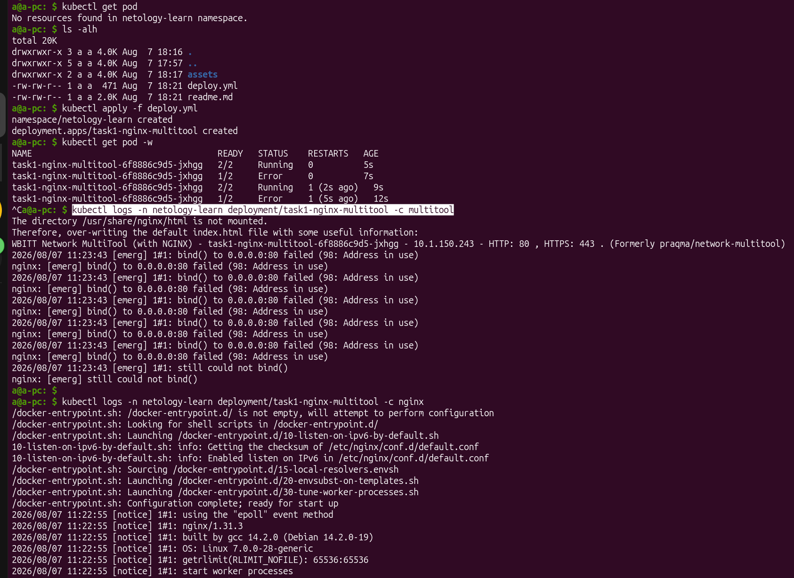
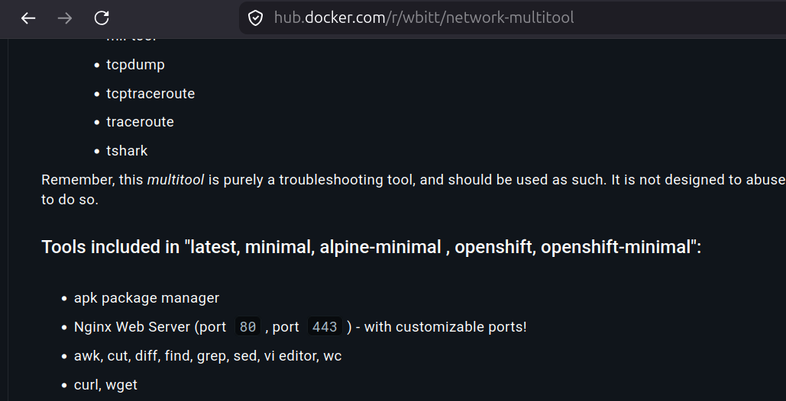
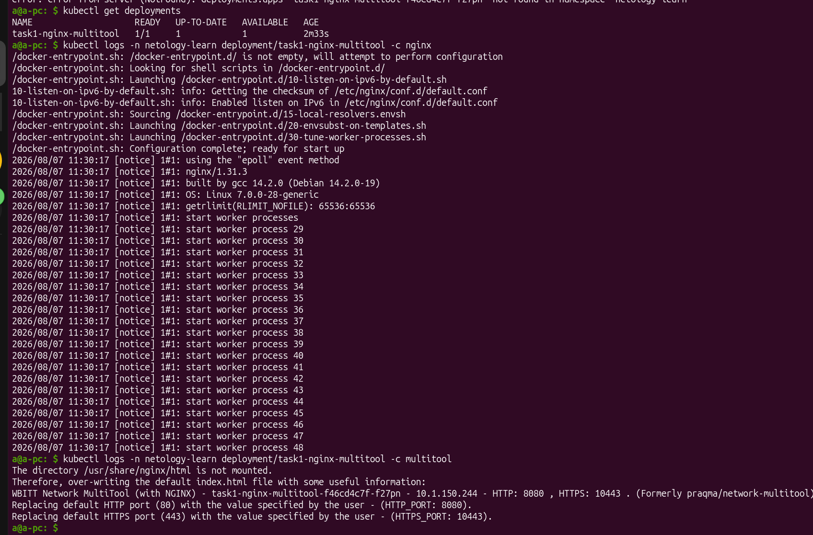
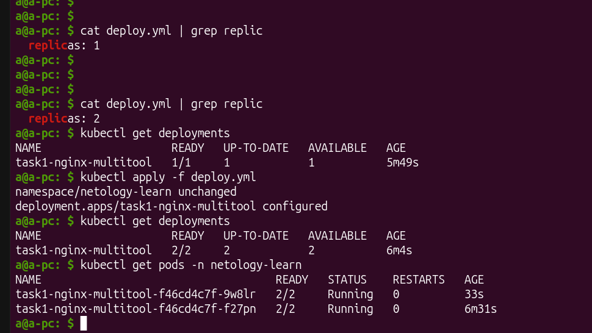
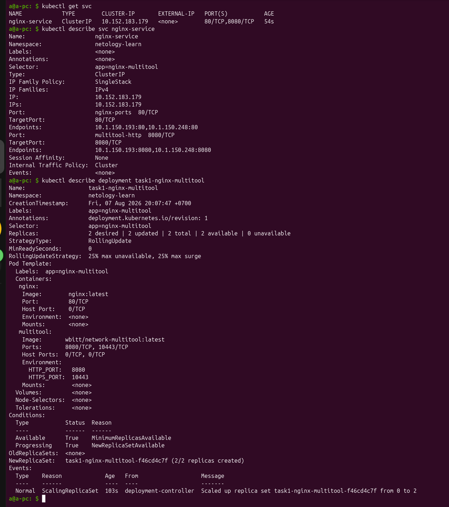
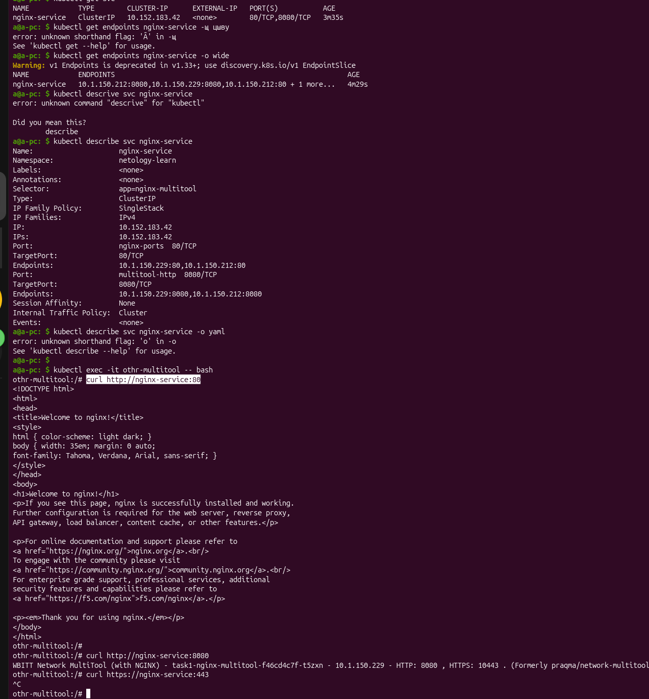
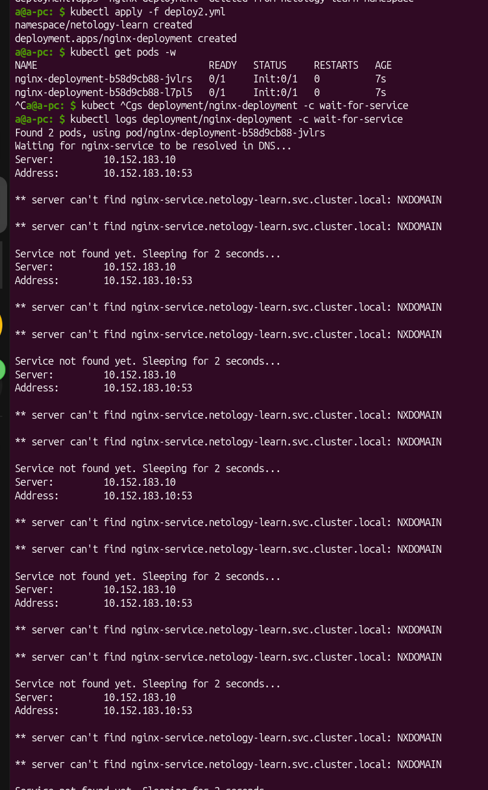
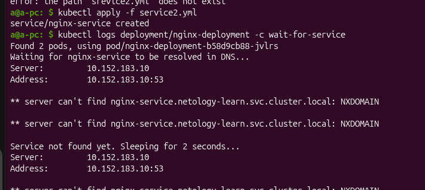

# [Домашнее задание к занятию «Запуск приложений в K8S»](github.com/netology-code/kuber-homeworks/blob/main/1.3/1.3.md)

## Задание 1. Создать Deployment и обеспечить доступ к репликам приложения из другого Pod

Первичный `deploy.yaml`:

```yaml
apiVersion: v1
kind: Namespace
metadata:
  name: netology-learn
---
apiVersion: apps/v1
kind: Deployment
metadata:
  name: task1-nginx-multitool
  labels:
    app: nginx-multitool
spec:
  selector:
    matchLabels:
      app: nginx-multitool
  template:
    metadata:
      labels:
        app: nginx-multitool
    spec:
      containers:
      - name: nginx
        image: nginx:latest
      - name: multitool
        image: wbitt/network-multitool:latest
```

привёл к ошибке из-за конфликта сетевых портов между контейнерами:



В описании мультитула написано, что внутри есть `nginx`, который также expose на порт 80:



Перенаправляем порты 80 & 443 мультитула на соответственно 8080 & 10443:

```yaml
apiVersion: v1
kind: Namespace
metadata:
  name: netology-learn
---
apiVersion: apps/v1
kind: Deployment
metadata:
  name: task1-nginx-multitool
  labels:
    app: nginx-multitool
spec:
  replicas: 1
  selector:
    matchLabels:
      app: nginx-multitool
  template:
    metadata:
      labels:
        app: nginx-multitool
    spec:
      containers:
      - name: nginx
        image: nginx:latest
        ports:
        - containerPort: 80
      - name: multitool
        image: wbitt/network-multitool:latest
        ports:
        - containerPort: 8080
        - containerPort: 10443
        env:
          - name: HTTP_PORT
            value: "8080"
          - name: HTTPS_PORT
            value: "10443"
```

После удаления предыдущего деплоимента, и создания нового:



Увеличила количество реплик до 2-х:



[Service.yml](./service.yml):

```yml
apiVersion: v1
kind: Service
metadata:
  name: nginx-service
  namespace: netology-learn
spec:
  type: ClusterIP
  selector:
    app: nginx-multitool
  ports:
    - name: nginx-ports
      protocol: TCP
      port: 80
      targetPort: 80
    - name: multitool-http
      protocol: TCP
      port: 8080
      targetPort: 8080
```



Добавила ещё один под [other-pod.yml](./other-pod.yml):

```yaml
apiVersion: v1
kind: Pod
metadata:
  name: othr-multitool
  namespace: netology-learn
spec:
  containers:
    - name: multitool
      image: wbitt/network-multitool:latest
      ports:
        - containerPort: 8080
      env:
        - name: HTTP_PORT
          value: "8080"
        - name: HTTPS_PORT
          value: "10443"
```

Зашла внутрь этого пода и сделала запросы на ранее созданный сервис на порты 80(`nginx`) и 8080(`multitool`):




## Задание 2. Создать Deployment и обеспечить старт основного контейнера при выполнении условий

[deploy.yml](./deploy2.yml):

```yaml
apiVersion: v1
kind: Namespace
metadata:
  name: netology-learn
---
apiVersion: apps/v1
kind: Deployment
metadata:
  name: nginx-deployment
  namespace: netology-learn
  labels:
    app: aynur
spec:
  replicas: 2
  selector:
    matchLabels:
      app: aynur
  template:
    metadata:
      labels:
        app: aynur
    spec:
      initContainers:
      - name: wait-for-service
        image: busybox:latest
        command: 
        - sh
        - -c
        - |
          echo "Waiting for nginx-service to be resolved in DNS..."
          until nslookup nginx-service.netology-learn.svc.cluster.local; do 
            echo "Service not found yet. Sleeping for 2 seconds..."
            sleep 2
          done
          echo "Service found! Proceeding to launch Nginx app container."
      containers:
        - name: nginx
          image: nginx:latest
          ports:
          - containerPort: 80
```




[service.yml](./service2.yml):
```yaml
apiVersion: v1
kind: Service
metadata:
  name: nginx-service
  namespace: netology-learn
spec:
  type: ClusterIP
  selector:
    app: aynur
  ports:
    - protocol: TCP
      port: 80
      targetPort: 80
```

Смотрю логи контейнера `wait-for-service`, как присоединилось:



И поды поднялись.
