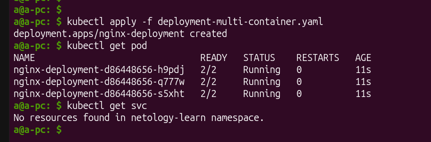
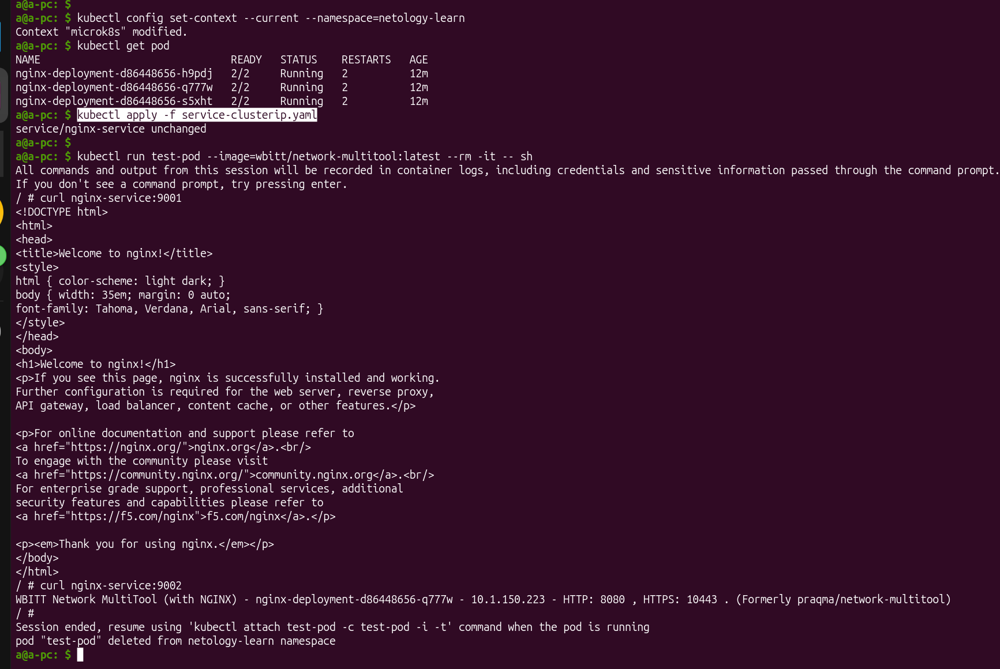
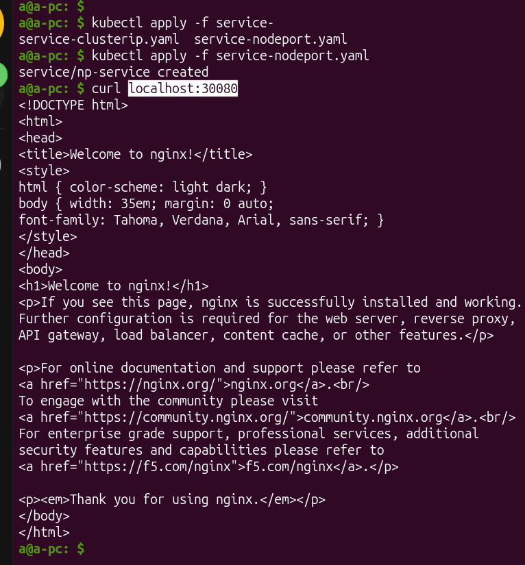
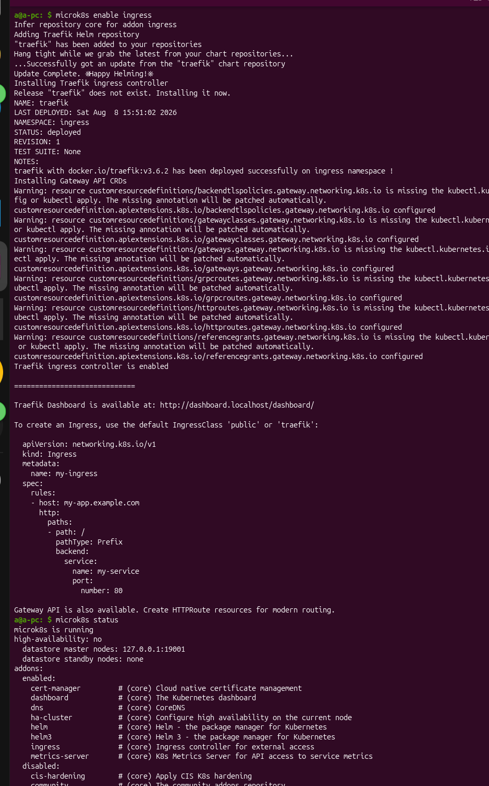
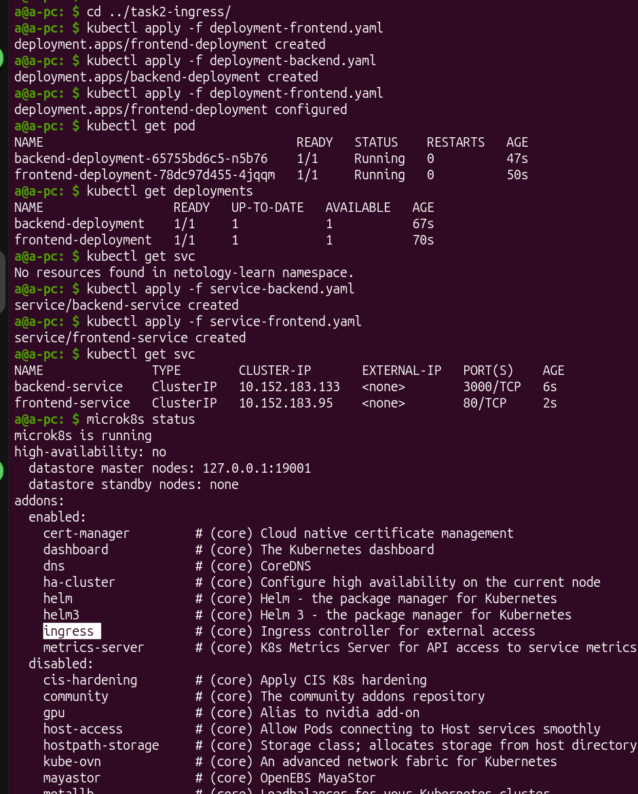
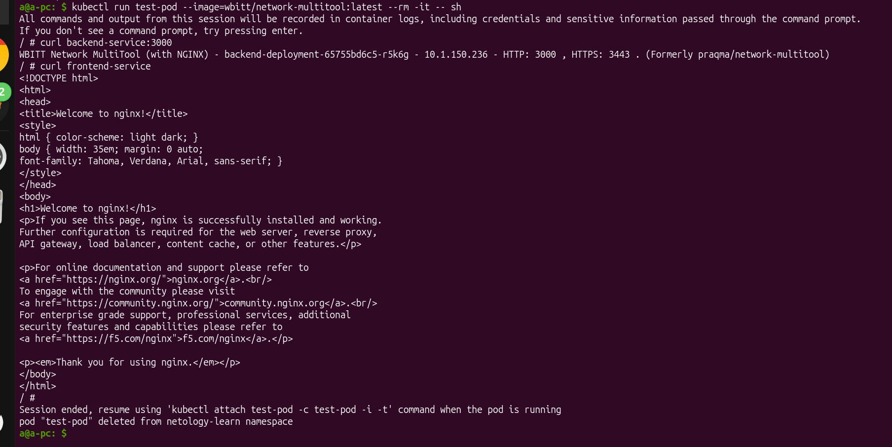
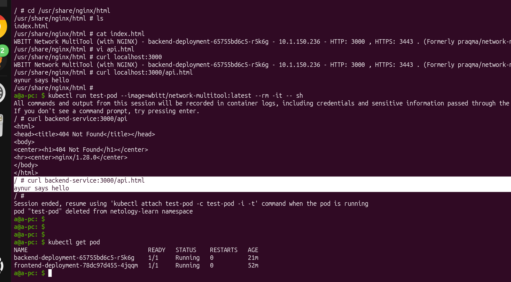
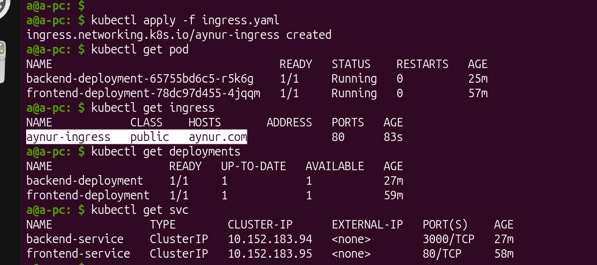
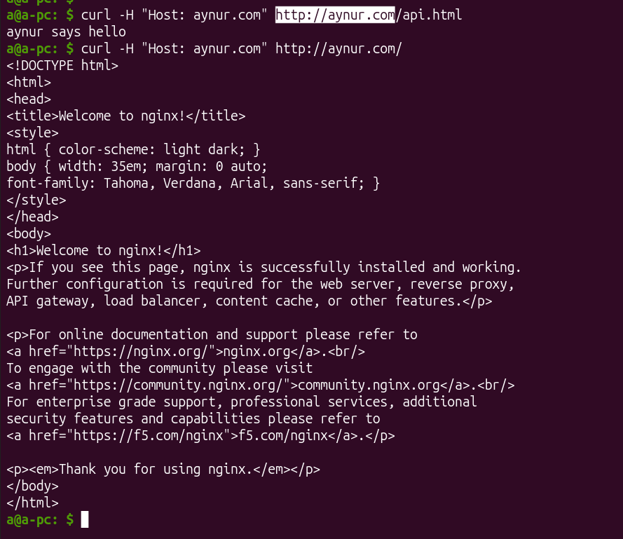

# [Домашнее задание к занятию «Сетевое взаимодействие в Kubernetes»](https://github.com/netology-code/kuber-homeworks/blob/shkuber-16/1.4/1.4.md)

## Задание 1: Настройка Service (ClusterIP и NodePort)

1) [deployment.yml](./task1-services/deployment-multi-container.yaml)

```yaml
apiVersion: apps/v1
kind: Deployment
metadata:
  name: nginx-deployment
  namespace: netology-learn
  labels:
    app: aynur
spec:
  replicas: 3
  selector:
    matchLabels:
      app: aynur
  template:
    metadata:
      labels:
        app: aynur
    spec:
      containers:
      - name: nginx
        image: nginx:latest
        ports:
        - containerPort: 80
      - name: multitool
        image: wbitt/network-multitool:latest
        ports:
        - containerPort: 8080
        - containerPort: 10443
        env:
          - name: HTTP_PORT
            value: "8080"
          - name: HTTPS_PORT
            value: "10443"
```



2) [service-clusterip.yaml](./task1-services/service-clusterip.yaml)

```yaml
apiVersion: v1
kind: Service
metadata:
  name: nginx-service
  namespace: netology-learn
spec:
  type: ClusterIP
  selector:
    app: aynur
  ports:
    - name: nginx
      protocol: TCP
      port: 9001
      targetPort: 80
    - name: multitool
      protocol: TCP
      port: 9002
      targetPort: 8080
```

3) доступность изнутри кластера:



4) Service типа NodePort для доступа к nginx снаружи:

[service-nodeport.yaml](./task1-services/service-nodeport.yaml):

```yaml
apiVersion: v1
kind: Service
metadata:
  name: np-service
  namespace: netology-learn
spec:
  type: NodePort
  selector:
    app: aynur
  ports:
    - name: nginx-nodeport
      protocol: TCP
      port: 80
      nodePort: 30080
```

5) Проверка доступа с локального компьютера:



# Задание 2: Настройка Ingress





Проверка работы сервиса через тест-под:



Так как внутри контейнеров нет пути `/api`, то возвращался 404 nginx-a. 

Я зашла внутрь контейнера в бекенд-поде, и создала для теста `api.html`,  путь кторый и написан в `ingress` для `backend`. А то сразу и не понятно было, действительно ли работает сервис бекенд, либо пробрасывается в фронтовой `nginx`, так как в обоих контейнерах лежит `nginx`.



Итого:




