# [Домашнее задание к занятию «Хранение в K8s»](https://github.com/netology-code/kuber-homeworks/blob/shkuber-16/2.1/2.1.md)

## Задание 1. Volume: обмен данными между контейнерами в поде

[containers-data-exchange.yaml](./task1-vol/containers-data-exchange.yaml):
<details>
<summary>
open content
</summary>

```yaml
apiVersion: apps/v1
kind: Deployment
metadata:
  name: task1-deploy
  namespace: netology-learn
spec:
  replicas: 1
  selector:
    matchLabels:
      aynur: learn
  template:
    metadata:
      labels:
        aynur: learn
    spec:
      containers:
        - name: busybox
          image: busybox:latest
          command:
            - sh
            - -c
            - |
              while true; do
                echo "$(date): привет от Айнур из busybox в multitool" >> /busybox/data/hello
                sleep 5
              done
          volumeMounts:
            - name: emptyvol
              mountPath: /busybox/data
        - name: multitool
          image: wbitt/network-multitool:latest
          volumeMounts:
            - name: emptyvol
              mountPath: /multitool/data
      volumes:
        - name: emptyvol
          emptyDir: {}
```
</details>


* Испольвала тип volume - `emptyDir`

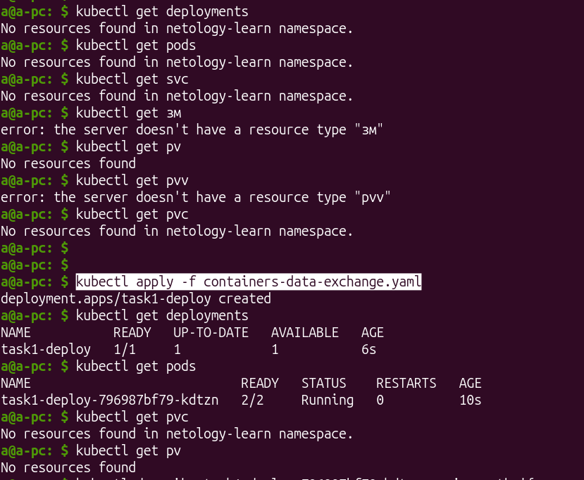

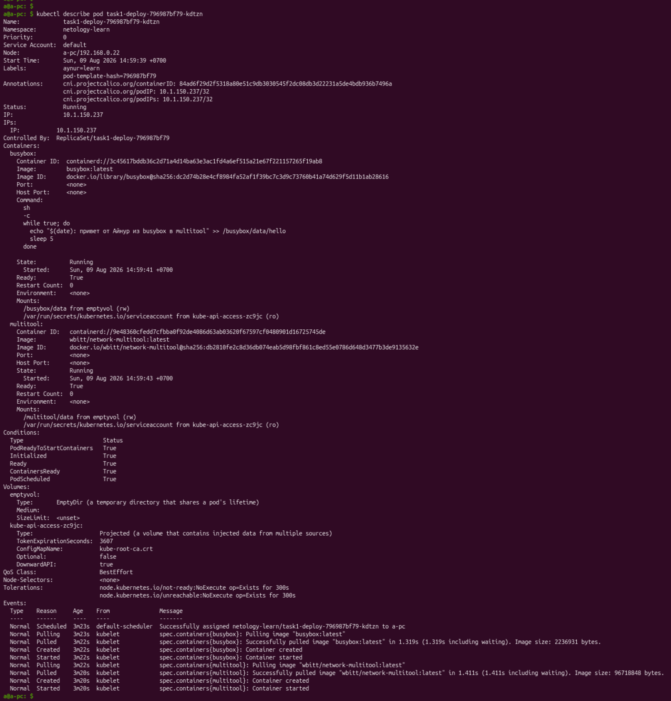

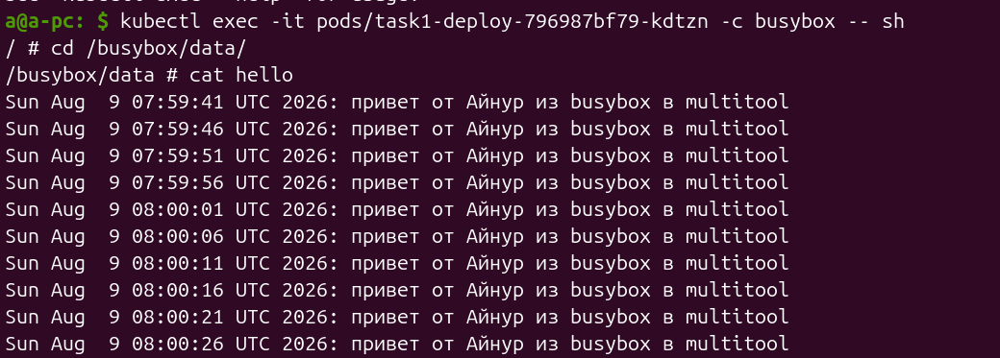

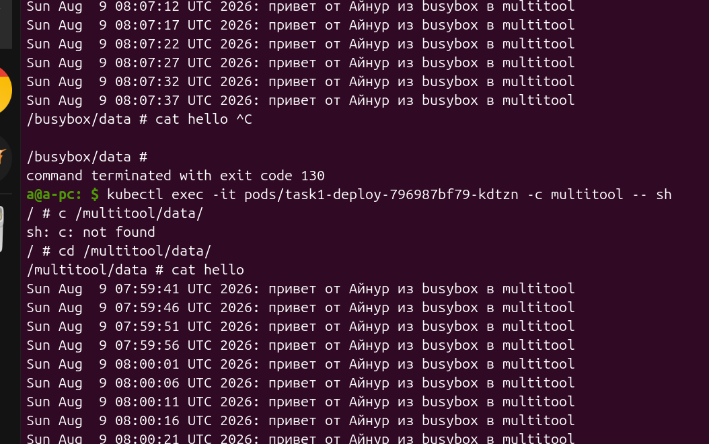


## Задание 2. PV, PVC

Шаги:

2) Созданные ресурсы

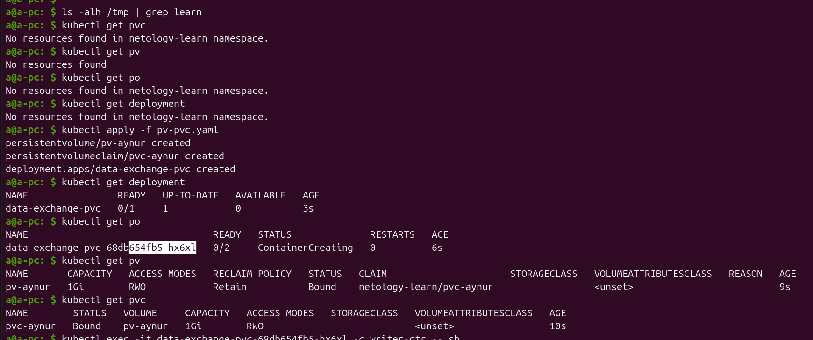

3) Общение между контейнерами есть:

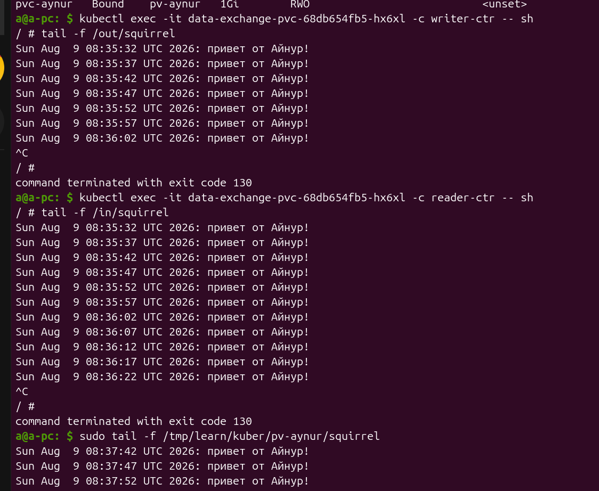

4) Удалила Deployment и PVC:

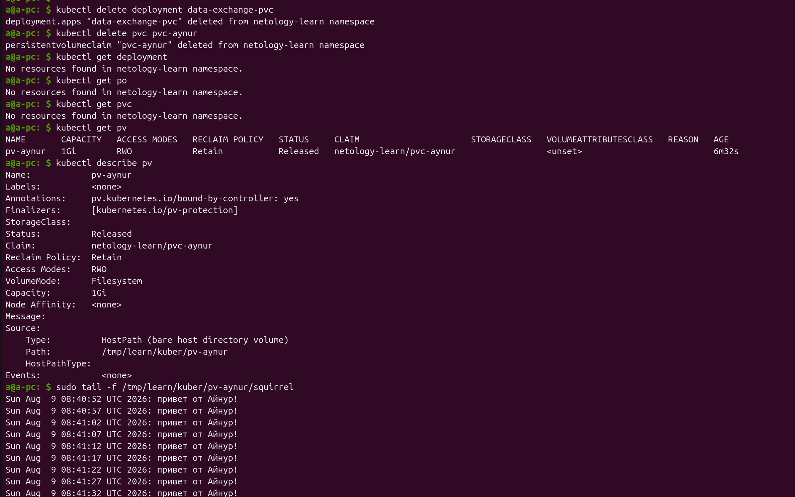

pv остался живой. Он остался живой, потому что PV для этого и была создана - быть независимым хранилищем от подов, deployment, cliems. Данные, как самые сокровенные и нужные штуки, осталоись не тронутыми.

5) Удалила PV:

но файл и его содержимое осталось на моём диске, потому что, как видно на рисункке выше(`kubectl describe pv`), `Reclaim Policy: Retain` стоит - то бишь оставлять файлы на лиске даже если удалена сущность `PersistentVolume`.

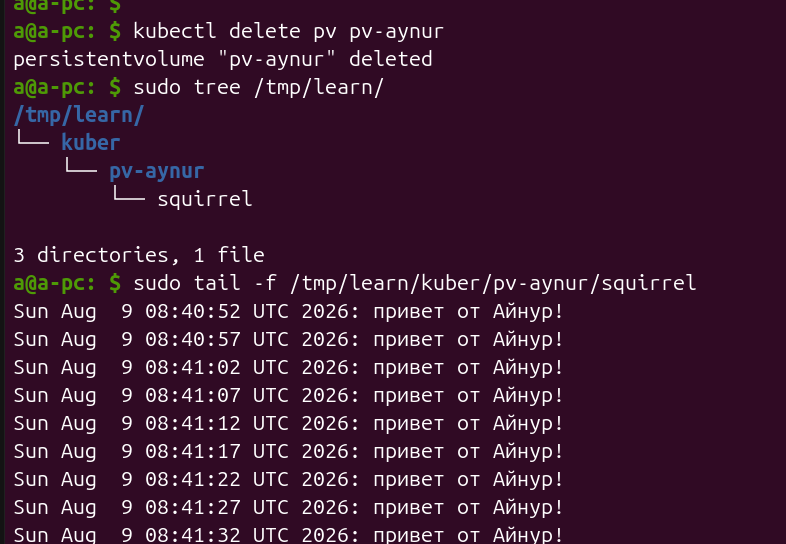

## Задание 3. StorageClass

1) Подключаю аддон `microk8s` `hostpath-storage:

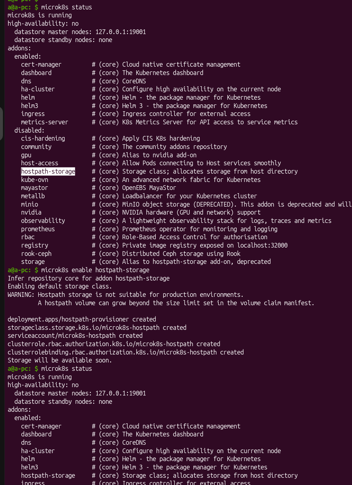

Provisioner для  своего класса microk8s.io/hostpath

2) Создала сущности `StorageClass`, `PersistentVolumeClaim`, `Deployment` и его поды:

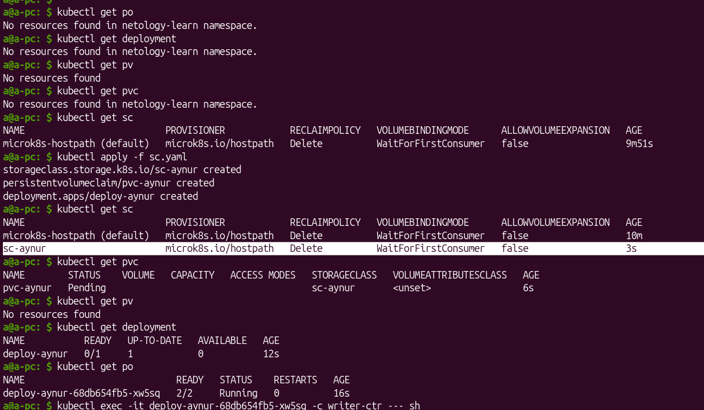

3) Продемонстрировать, что контейнер multitool может читать данные из файла в смонтированной директории, в который busybox записывает данные каждые 5 секунд.

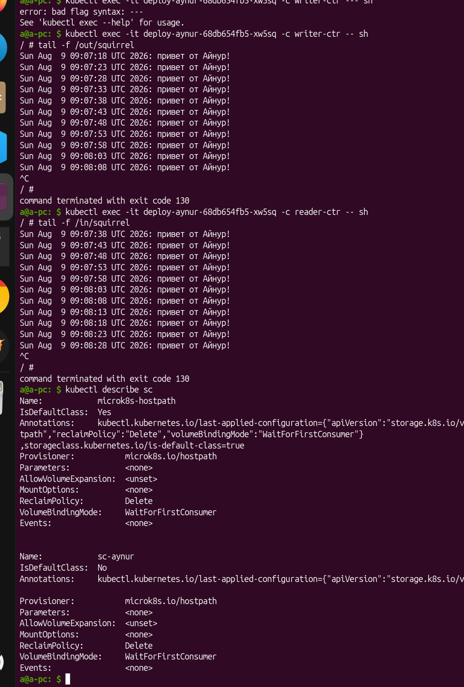

4) А это вот где именно Кубер хранит volume, созданный для текущего `namespace: netology-learn` у меня на диске:

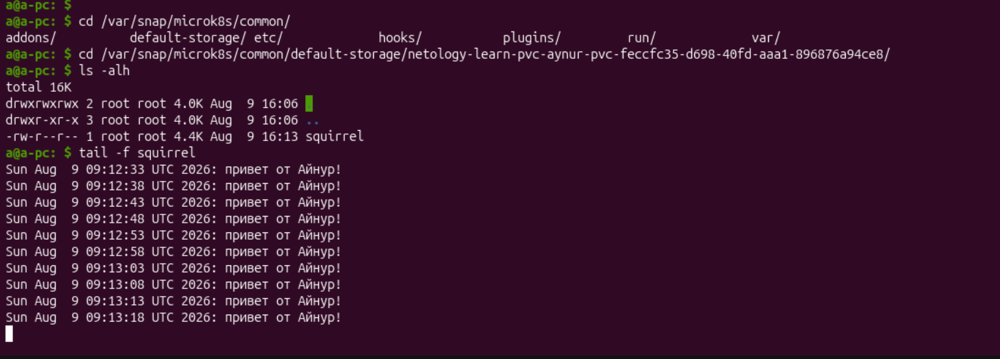


