# [Домашнее задание к занятию «Настройка приложений и управление доступом в Kubernetes»](https://github.com/netology-code/kuber-homeworks/blob/shkuber-16/2.3/2.3.md)

## Задание 1: Работа с ConfigMaps

Создала манифесты:

* [deployment.yaml](./deployment.yaml)
* [configmap-web.yaml](./configmap-web.yaml)

Содержимое для файла лучше всего смонтировать как `volume`.

Но для того, чтобы сделать curl, необходимо создать сервис. Я сделаал типа NodePort для демонстрации на локальной машине:

* [service.yaml](./service.yaml)

Итого, получилось:

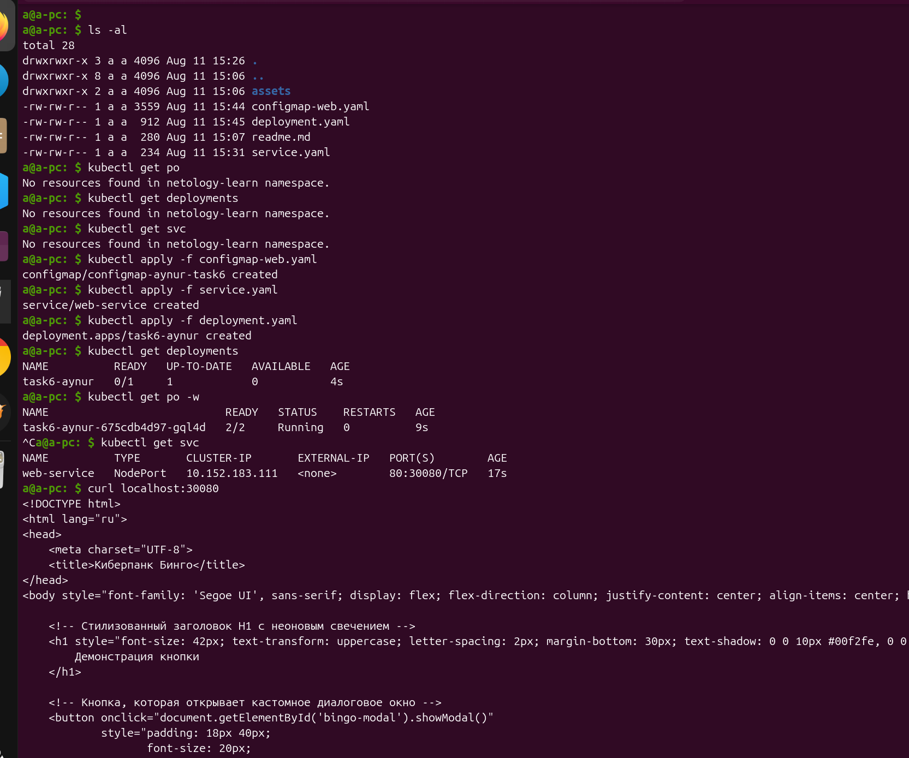
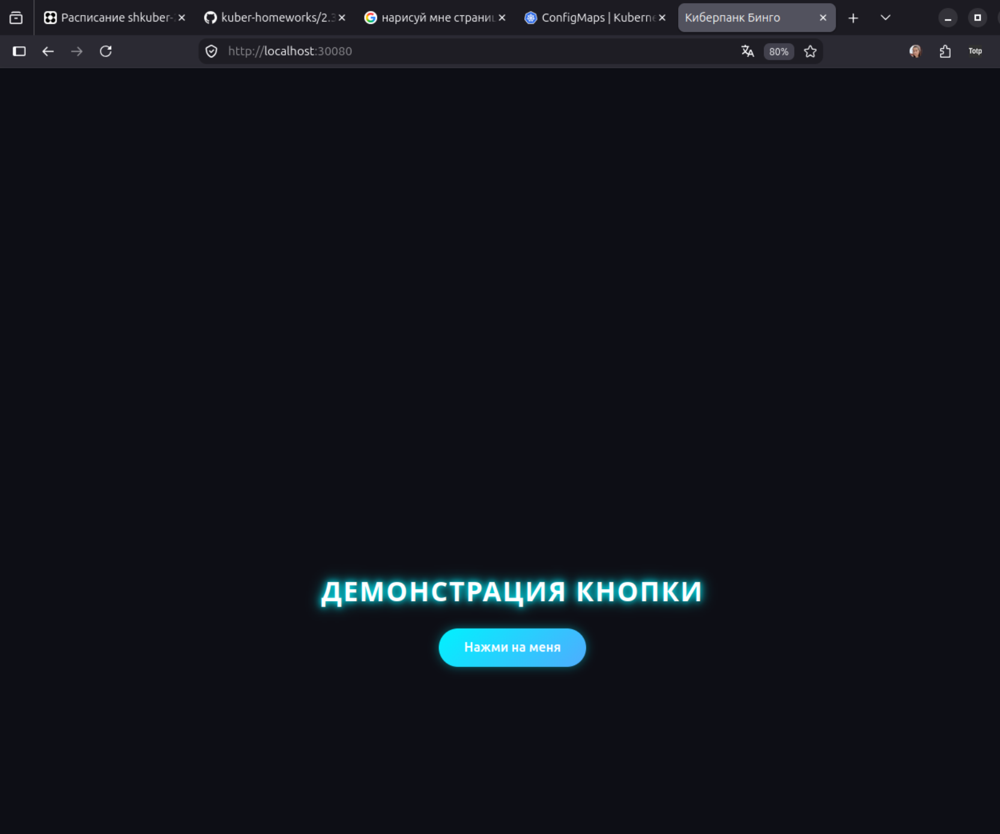
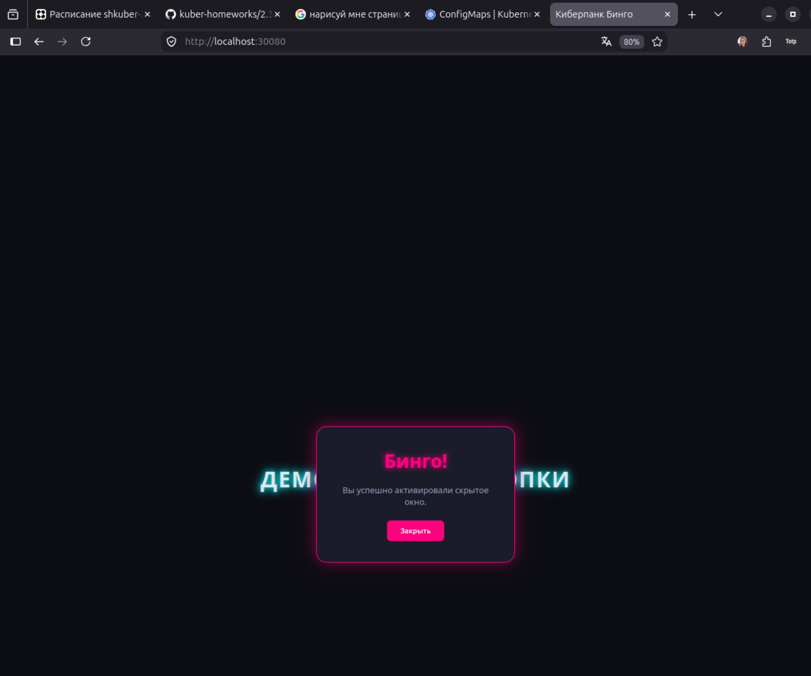

## Задание 2: Настройка HTTPS с Secrets

Ключ -nodes для `openssl req` deprecated, вместо него `-noenc`:

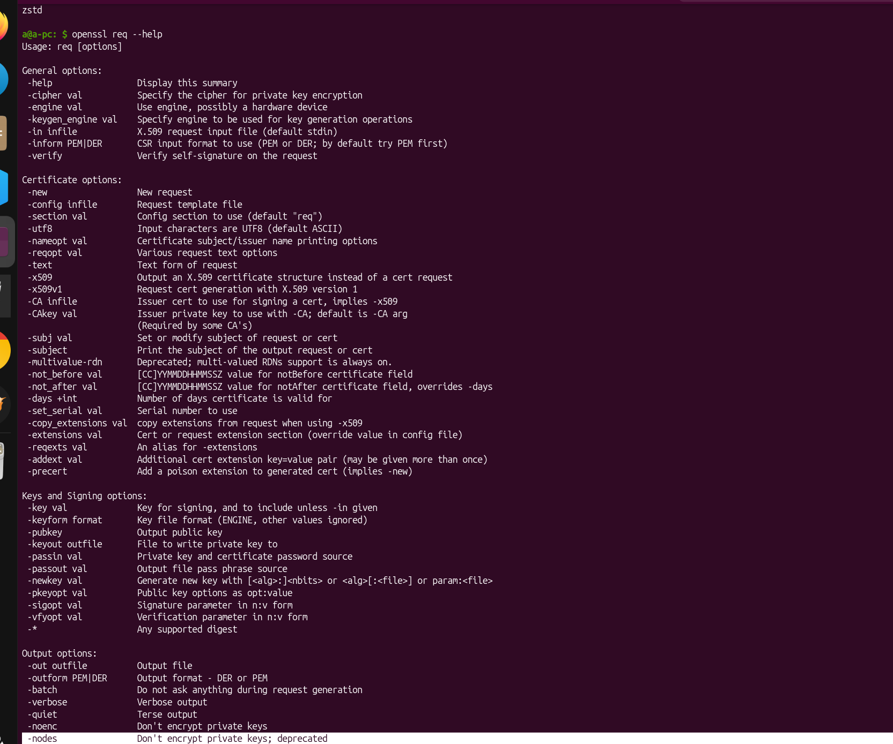

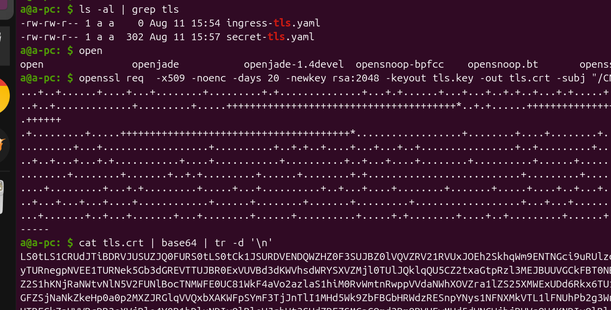
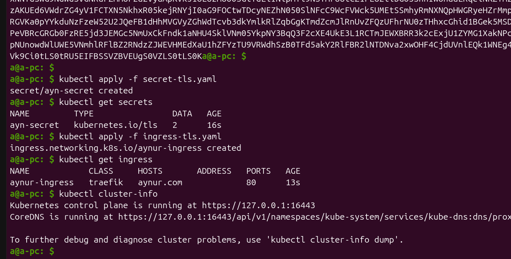

Сделала запрос на доменное имя, прописанное в Ингрессе (это доменное имя также прописано в /etc/hosts для 127,0,0,1)

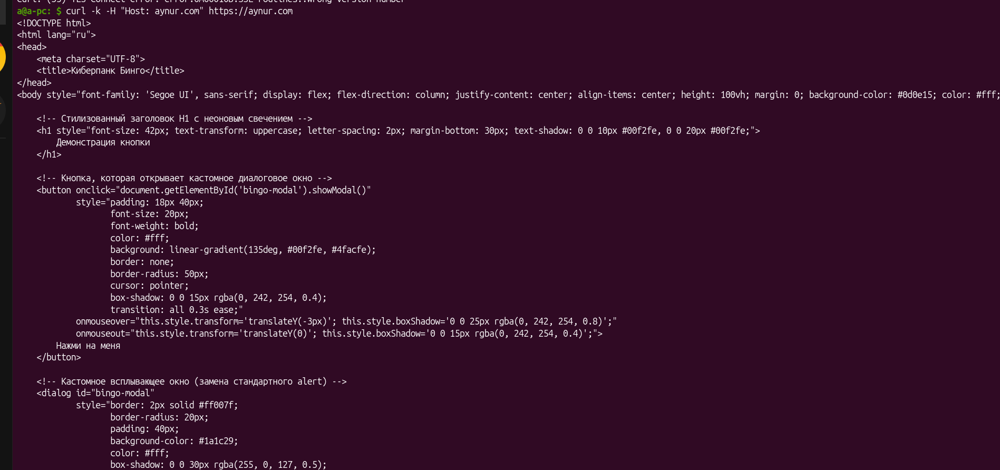

В браузере:

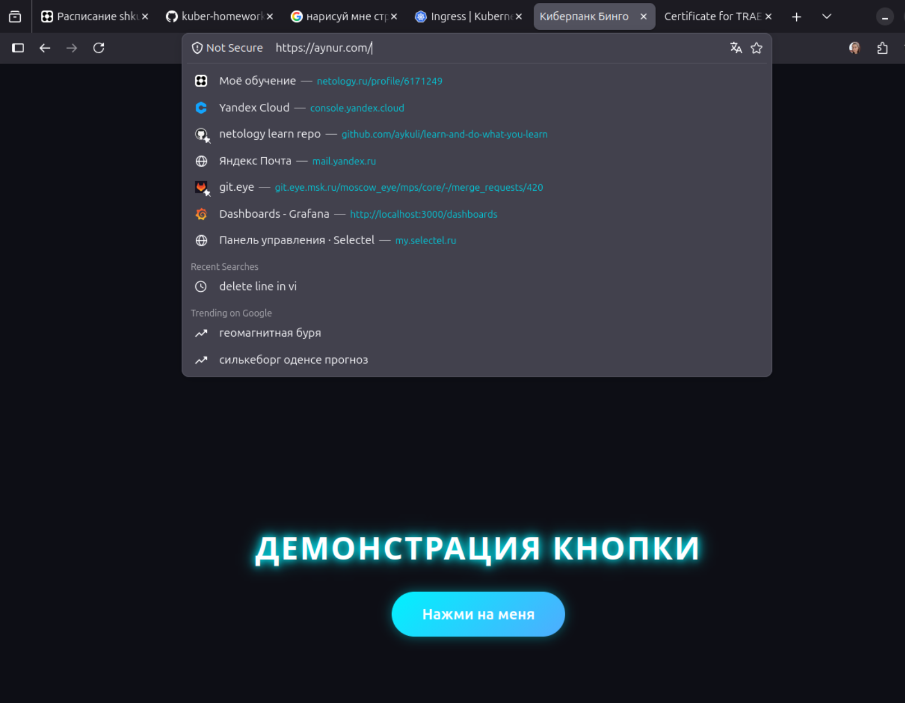

## Задание 3: Настройка RBAC

rbac enabled:

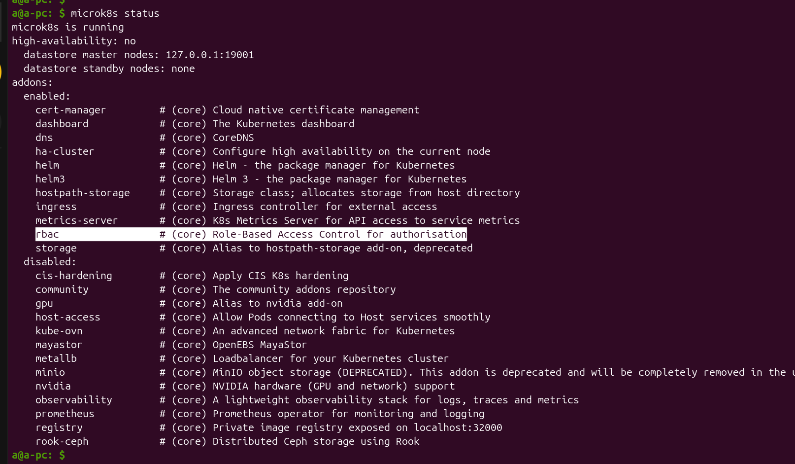

Создала пользователя - [service-account.yml](./service-account.yml) - `aynur`

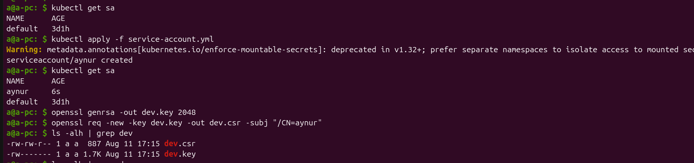
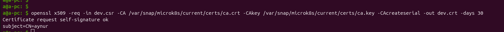

- Привязала сертификаты пользователю `aynur`
- Посмотрела, что `aynur` ещё нет в конфиге кластера
- Создала контек для пользователя `aynur`
- Поставила контест `aynur-context` по умолчанию
- Проверили, что пользователь пока не имеет никаких прав (пока я не запустила `Role`,`RoleBinding` manifests)

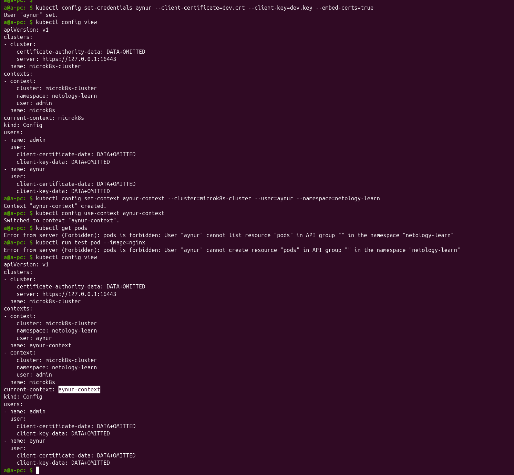

* Вышла обратно в контекст microk8s под админом,
* запустила создание роли `Role`,`RoleBinding` для `aynur`
* Вернулась в контекст пользователя `aynur` и проверила - приняли ли силу обязанности пользователя - успешно!

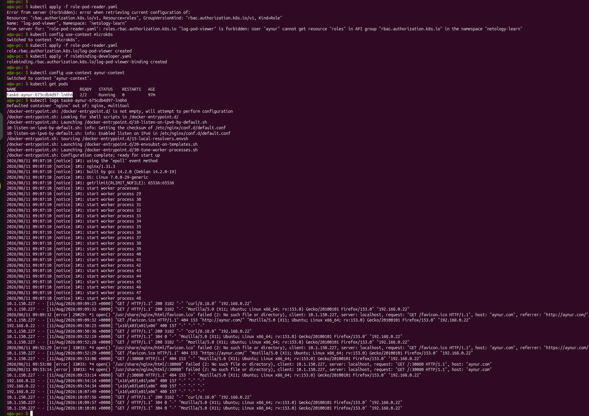
