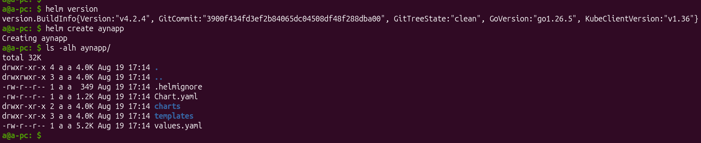
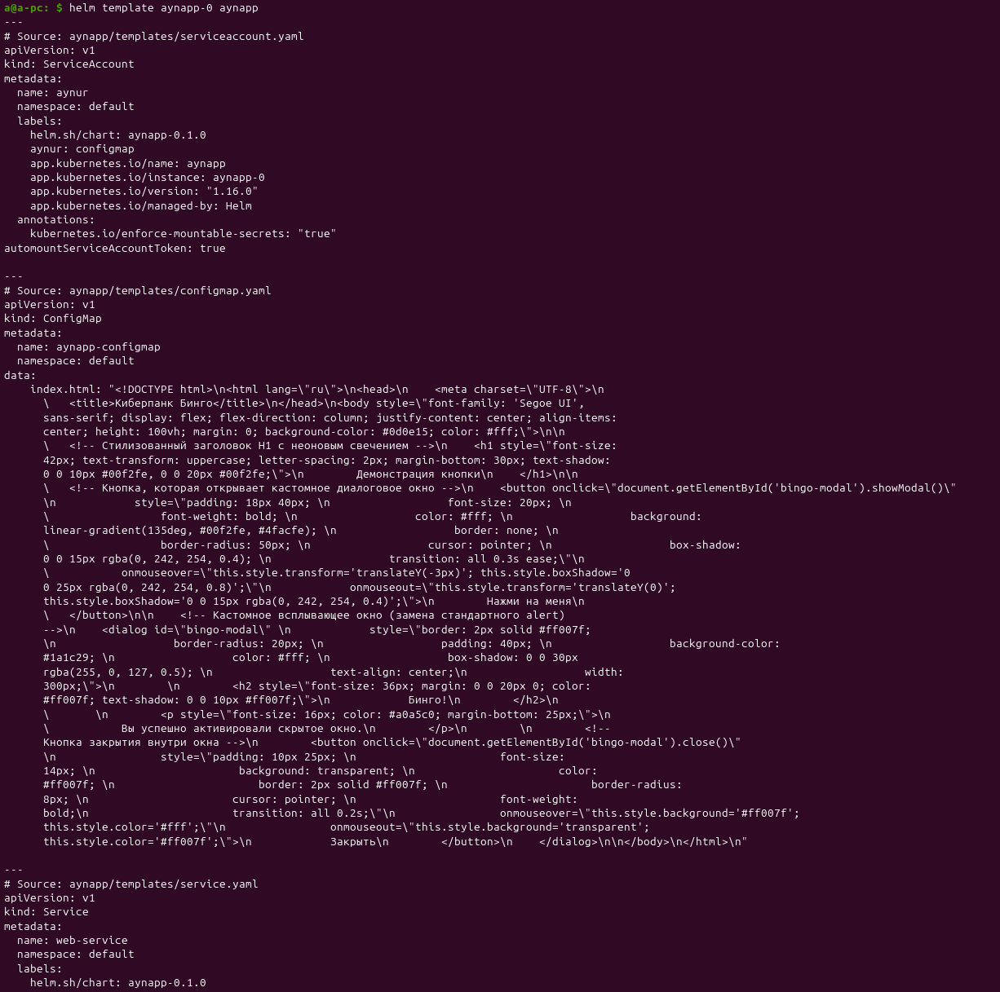
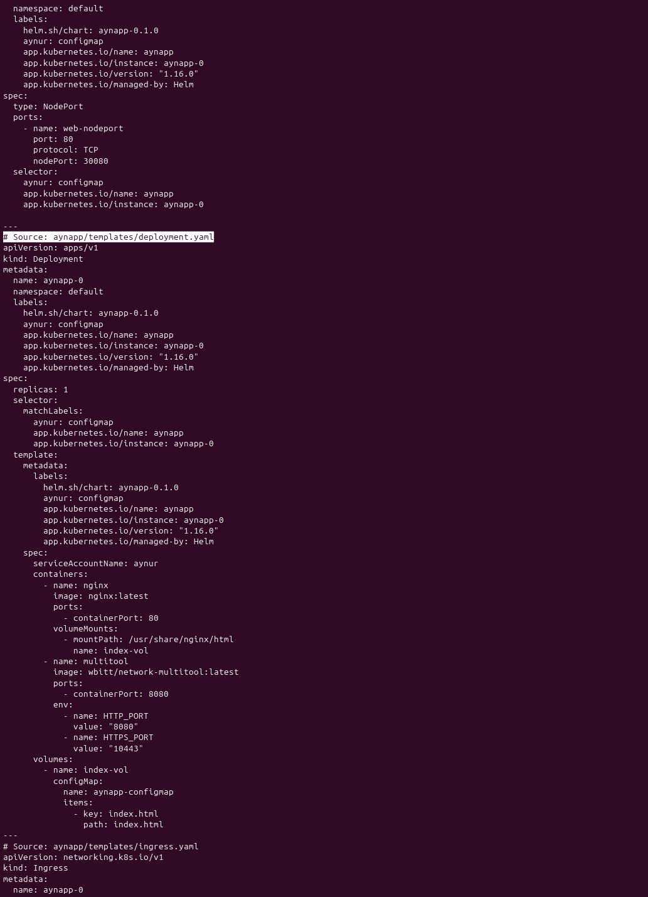
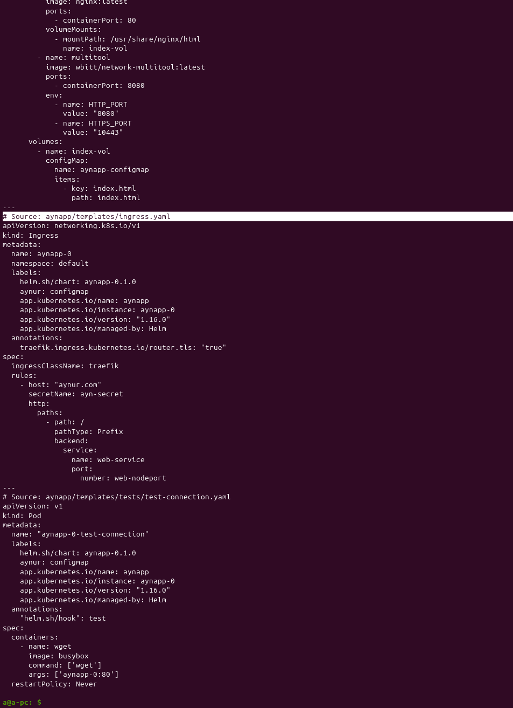
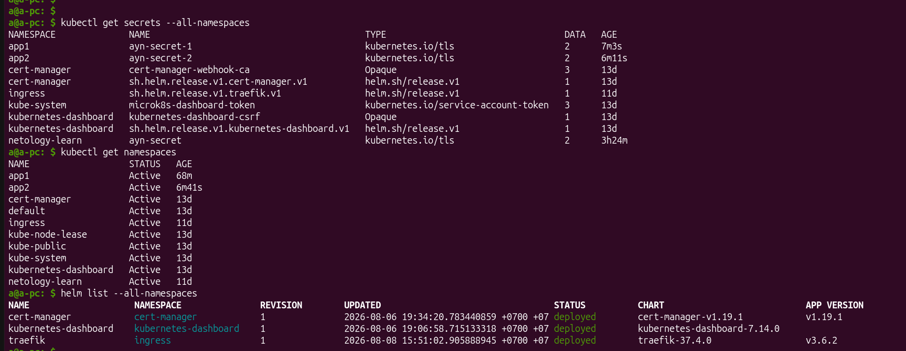
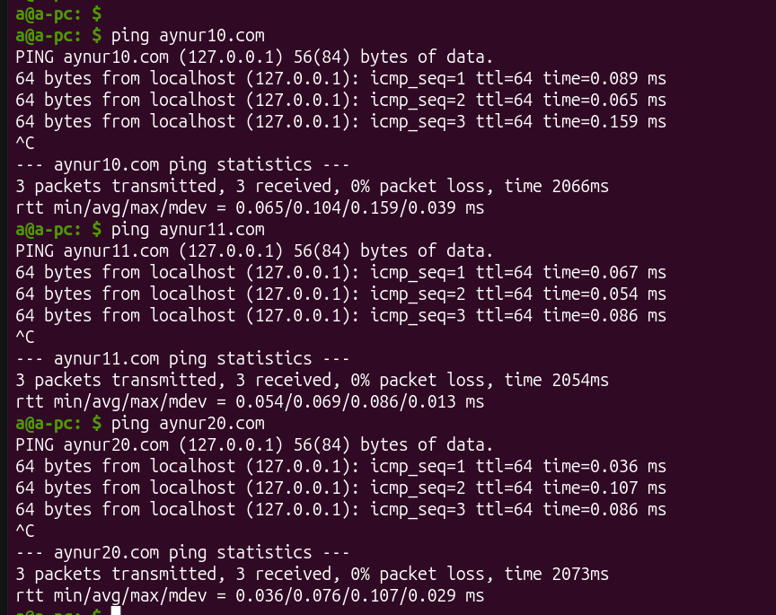
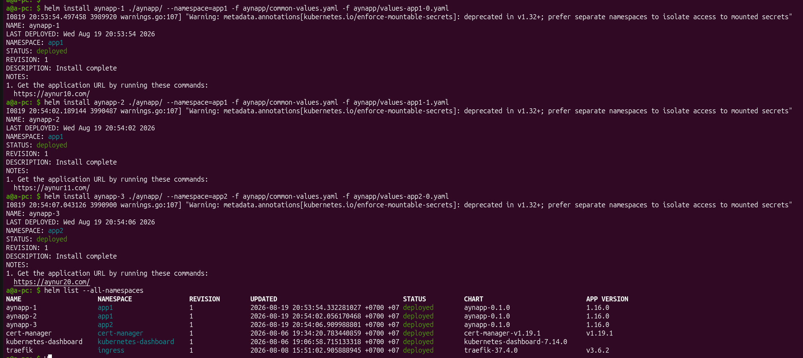
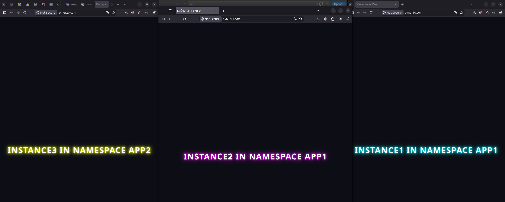

# [Домашнее задание к занятию «Helm»](https://github.com/netology-code/kuber-homeworks/blob/shkuber-16/2.4/2.4.md)

## Задание 1. Подготовить Helm-чарт для приложения



C helm я воссоздаю предыдущее задание в папке [aynapp](./aynapp/).






## Задание 2. Запустить две версии в разных неймспейсах

Создала секреты для каждого неймспейса с командой:

```bash
kubectl create secret tls ayn-secret-1 -n app1 --cert=./aynapp/tls.crt --key=./aynapp/tls.key
```



Добавила нужные `hostname` в мой локальный `/etc/hosts` для двух следующих копии приложения:




Для того, чтобы изменять только уникальные для каждого инстанса значения, тут я использзовала подход `композиция файлов значений (Values Composition)`:

- общие для каждого инстанса значения хранятся в [aynapp/common-values.yaml](./aynapp/common-values.yaml)
- значения для первого инстанса `namespace=app1` хранятся в [aynapp/values-app1-0.yaml](./aynapp/values-app1-0.yaml)
- значения для второго инстанса `namespace=app1` хранятся в [aynapp/values-app1-1.yaml](./aynapp/values-app1-1.yaml)
- значения для единственного инстанса `namespace=app2` хранятся в [aynapp/values-app2-0.yaml](./aynapp/values-app2-0.yaml)

Запустила приложения:




Работает ожидаемо.

