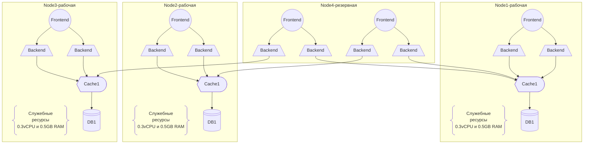
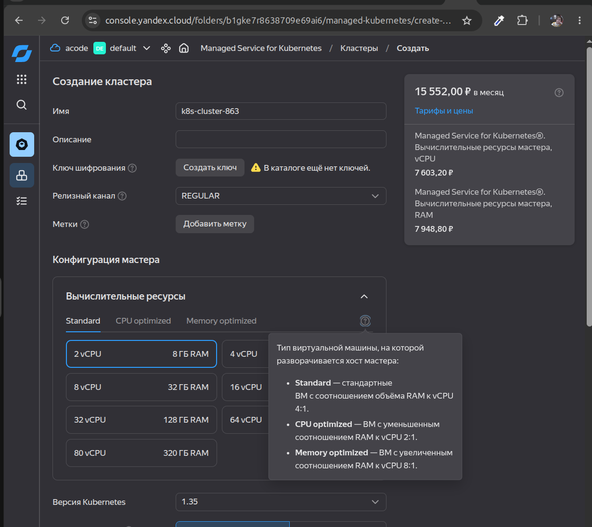

# [Домашнее задание к занятию «Компоненты Kubernetes»](https://github.com/netology-code/kuber-homeworks/blob/main/3.1/3.1.md)

## Задание. Необходимо определить требуемые ресурсы

 текст задачи

Известно, что проекту нужны база данных, система кеширования, а само приложение состоит из бекенда и фронтенда. Опишите, какие ресурсы нужны, если известно:

* Необходимо упаковать приложение в чарт для деплоя в разные окружения.
* База данных должна быть отказоустойчивой. Потребляет 4 ГБ ОЗУ в работе, 1 ядро. 3 копии.
* Кеш должен быть отказоустойчивый. Потребляет 4 ГБ ОЗУ в работе, 1 ядро. 3 копии.
* Фронтенд обрабатывает внешние запросы быстро, отдавая статику. Потребляет не более 50 МБ ОЗУ на каждый экземпляр, 0.2 ядра. 5 копий.
* Бекенд потребляет 600 МБ ОЗУ и по 1 ядру на копию. 10 копий.

### 1. Расчет вычислительных ресурсов

С учетом количества копий (реплик) чистая потребность приложения:

| Компонент | Тип манифеста | Реплики | CPU (на 1 шт) | RAM (на 1 шт) | Всего CPU | Всего RAM |
| --- | --- | --- | --- | --- | --- | --- |
|  База данных | StatefulSet | 3 | 1 ядро | 4 ГБ | 3 ядра | 12 ГБ |
| Кеш | StatefulSet | 3 | 1 ядро | 4 ГБ | 3 ядра | 12 ГБ | 
| Бекенд | Deployment | 10 | 1 ядро | 600 МБ | 10 ядер | 6000 МБ (~5.85 ГБ) |
| Фронтенд | Deployment | 5 | 0.2 ядра | 50 МБ | 1 ядро | 250 МБ (~0.24 ГБ) | 
| ИТОГО | | | | | 17 ядер | ~30.1 ГБ |

### 2. Расчет реального кластера

Необходимо, чтобы база данных и кеш были отказоустойчивыми, что означает - по 3 копии требуют распределения по разным физическим серверам.

Согласно [статье](https://learnkube.com/kubernetes-node-size), часть ресурсов любой ноды жестко резервируется под системные нужды и недоступна для пользовательских подов:
* `CPU`: 
    * резервируется 6% от 1-го ядра, 
    * 1% от 2-го ядра и т.д.
* `ОЗУ`: 
    * резервируется 25% от первых 4 ГБ,
    * 20% от следующих 4 ГБ, 
    * 10% от следующих 8 ГБ, 
    * плюс 100 МБ фиксированно под порог выселения подов (`eviction threshold`).

Также в статье опираются на выделяемые соотношения объёма RAM к vCPU, поэтому я глянула в соотношения,например, ЯО:

Считаю.
Вариант 1: Беру 3 ноды по 8vCPU 16GB RAM (CPU Optimized).
Из расчёта 17 ядер/3 ~= 5.6 vCPU, 30/3=10GB и + ресурсы для k8s компонентов
В одной ноде максимально может быть:
| сущность | потребление | кумулятивно |
| --- | --- | --- |
| БД | 4 ГБ ОЗУ, 1 vCPU | 4 ГБ ОЗУ, 1 vCPU |
| Cache | 4 ГБ ОЗУ, 1 vCPU | 8GB 2vCPU |
| Back | 4*(600MB, 1vCPU)=2.4GB, 4vCPU | 10.4GB, 6vCPU |
| Front | 2*(50MB, 0.2vCPU)=100MB, 0.4vCPU | 10.5 GB, 6.4vCPU |
| kubelet + Eviction threshold | 100MB + (0.25*4+0.2*4+0.1*8)GB=2.7GB, (0.06*1+0.01*1+0,005*2+0,0025*4)=0,09vCPU | 13.2GB, 6.5vCPU |

### 4. Cлужебные ресурсы к нодам

Если рассчитывать от потреблени ресурсов kubelet + Eviction threshold+операционки:
3 * (2.7GB, 0.09vCPU) = 8.1GB, 0.27vCPU
Для подов доступно: 16*3 - 8.1 =39.9GB, 8*3-0.27 = 23.73vCPU
Чего достаточно для покрытия потребности в 30.1GB, 17vCPU,
По расчётам, без учёта выхода из строя ни одной ноды, должно хватить **3 ноды по 8vCPU 16GB RAM** (CPU Optimized в ЯО например).

### 3. Устойчивость и репликация

Давайте посмотрим, что получится, если выйдет из строя как минимум одна нода:
у нас останется 2 ноды по  8vCPU, 16GB RAM = 16vCPU, 32GB
Как видно, этого не достаточно для удержания систмеы в полноценнос состоянии, поэтому необходим добавить ещё одну ноду для устойчивости.
На этот момент расчёта: **4 ноды по 8vCPU 16GB RAM** (CPU Optimized в ЯО например)

Итого: **4 ноды по 8vCPU 16GB RAM** (CPU Optimized в ЯО например)