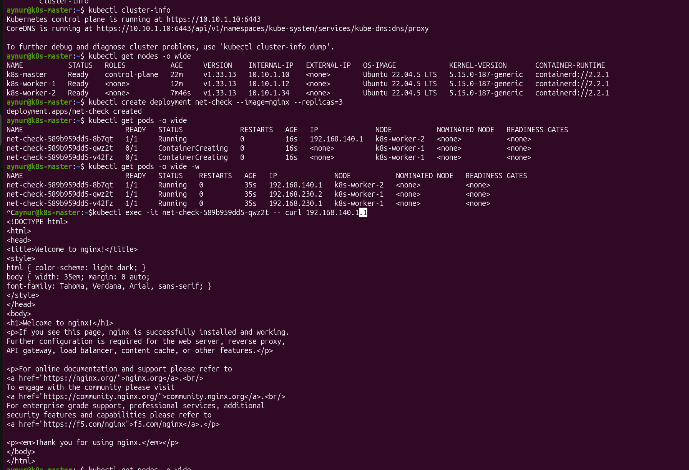

# [Домашнее задание к занятию «Установка Kubernetes»](https://github.com/netology-code/kuber-homeworks/blob/main/3.2/3.2.md)

## Задание 1. Установить кластер k8s с 1 master node

* Подготовка работы кластера из 5 нод: 1 мастер и 4 рабочие ноды.
* В качестве CRI — containerd.
* Запуск etcd производить на мастере.
* Способ установки выбрать самостоятельно.

Способ установки выбрала - `kubeadm`.
Кластер я решила создавать на ЯО, с помощью terraform:
  * [master-node.tf](./vms/master-node.tf)
  * [worker-nodes.tf](./vms/worker-nodes.tf)

Сначала создала 2 ноды - мастер и воркер, для экономии денег (count=1 в файле  [worker-nodes.tf](./vms/worker-nodes.tf)).

Сделала шаги п устанвке нужных пакетов и настройки, инициировала мастера:

Курлом скачала calico.yml манифест, и утановила плагин:

Присоединила воркера:

и плучила положительный результат - кластер из 2-х нод, мастера и воркера:

После положительного эффекта, увеличила count=4 для получения 4-х нод.

Но смогла подключить только ещё одного воркера, на остальные ВМ я что-то даже ни в ssh, ни через последовательный порт ` metadata = { serial-port-enable = 1 }` не смогла зайти на ЯО. Хотя все ноды созданы по одному и тому же шаблону terraform манифеста [vms/worker-nodes.tf](./vms/worker-nodes.tf)
По логам как будто не смог зайти на security.ubuntu.com. Пыталась пересоздать ноды, нов итоге упёрлась на блок со стороны ЯО.

Итого получила кластер из 3-х нод: мастера и 2-х воркеров.

