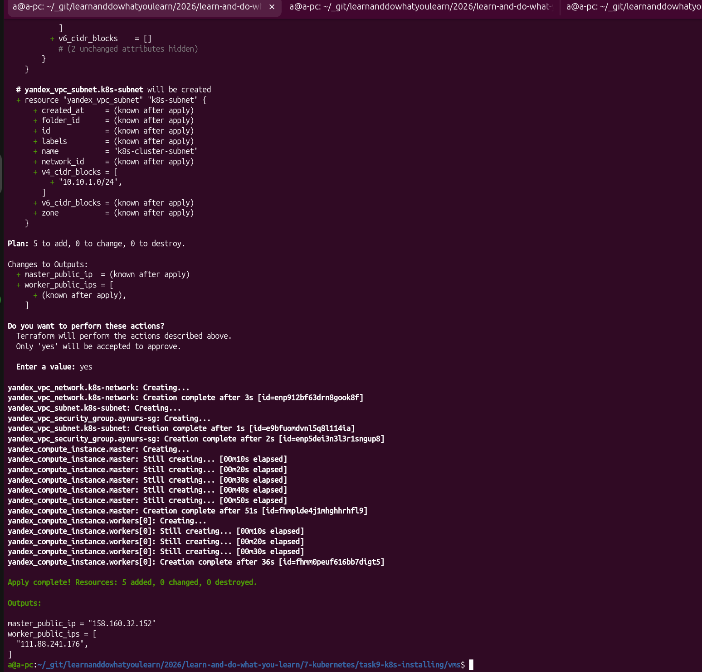
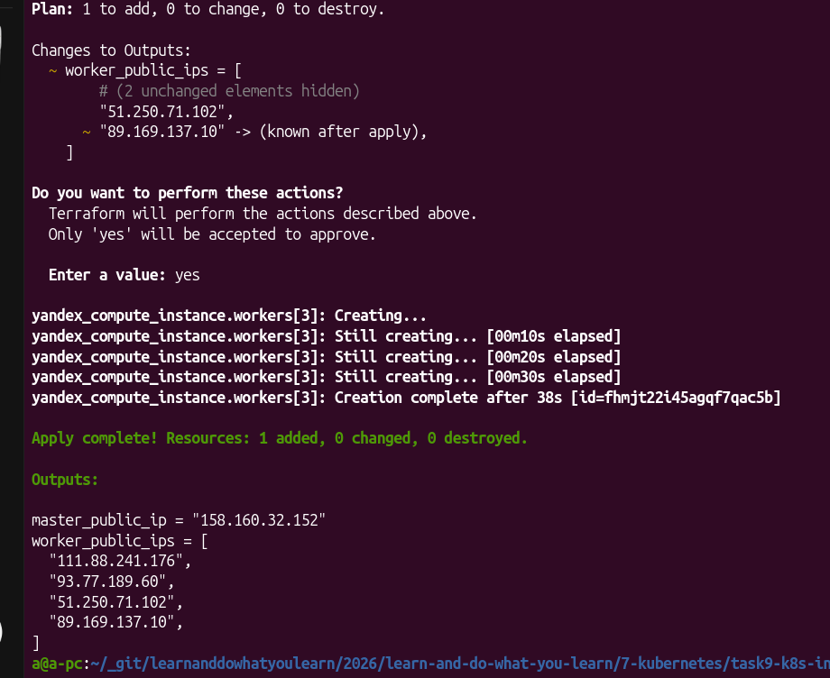
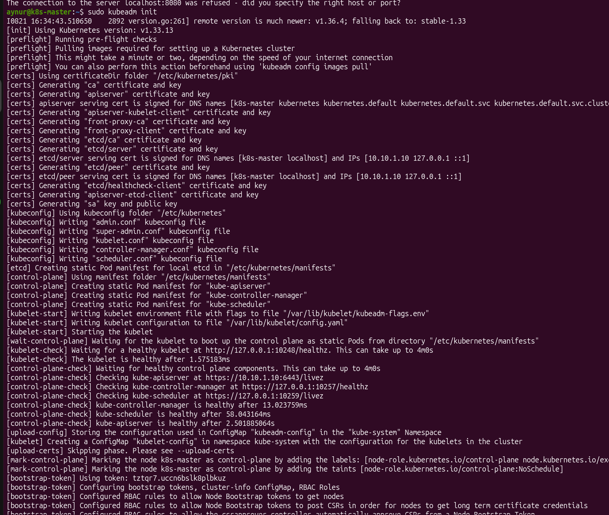
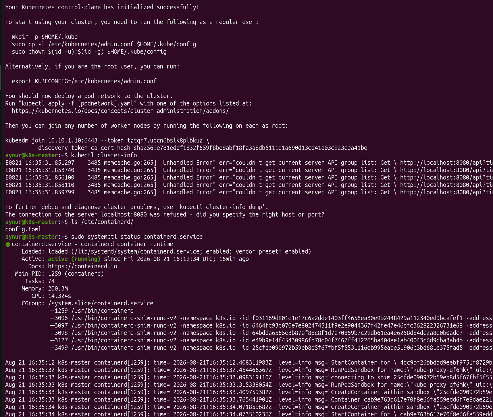
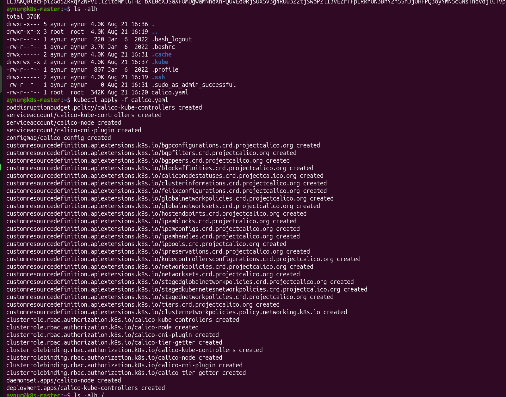
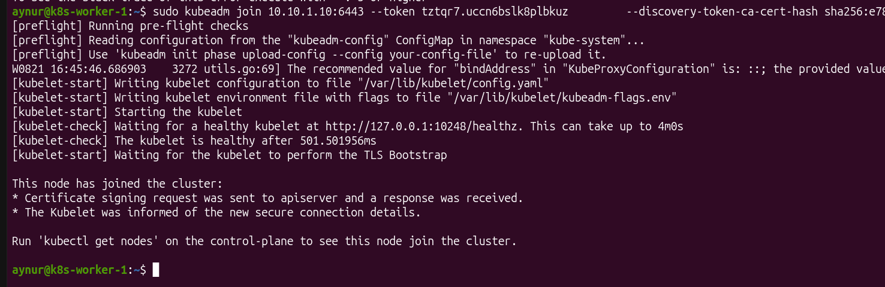
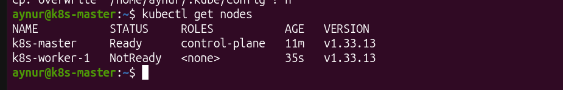
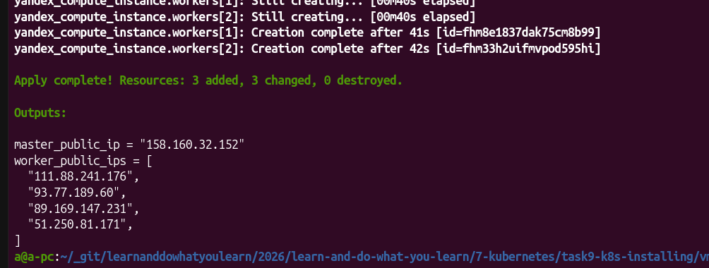

# [Домашнее задание к занятию «Установка Kubernetes»](https://github.com/netology-code/kuber-homeworks/blob/main/3.2/3.2.md)

## Задание 1. Установить кластер k8s с 1 master node

* Подготовка работы кластера из 5 нод: 1 мастер и 4 рабочие ноды.
* В качестве CRI — containerd.
* Запуск etcd производить на мастере.
* Способ установки выбрать самостоятельно.

Способ установки выбрала - `kubeadm`.
Кластер я решила создавать на ЯО, с помощью terraform:
  * [master-node.tf](./vms/master-node.tf)
  * [worker-nodes.tf](./vms/worker-nodes.tf)

Сначала создала 2 ноды - мастер и воркер, для экономии денег (count=1 в файле  [worker-nodes.tf](./vms/worker-nodes.tf)).

Затем полчив положительный эффект, увеличила count=4 для получения 4-х нод.

## Задание 2*. Установить HA кластер

### conspect
runcmd:
  # 0. Полное отключение swap (на случай, если он есть в образе)
  - swapoff -a
  - sed -i '/swap/d' /etc/fstab

  # 1. Настройка сети и sysctl
  - modprobe overlay # для containerd
  - modprobe br_netfilter # для Calico
  - sysctl --system
  
  # 2. Установка containerd
  - apt-get update && apt-get install -y containerd
  - mkdir -p /etc/containerd
  - containerd config default > /etc/containerd/config.toml
  - sed -i 's/SystemdCgroup = false/SystemdCgroup = true/g' /etc/containerd/config.toml
  - systemctl restart containerd
  
  # 3. Добавление репозитория Kubernetes (v1.30+)
  - apt-get update && apt-get install -y apt-transport-https ca-certificates curl gpg
  - mkdir -p -m 755 /etc/apt/keyrings
  - curl -fsSL https://pkgs.k8s.io/core:/stable:/v1.33/deb/Release.key | sudo gpg --dearmor -o /etc/apt/keyrings/kubernetes-apt-keyring.gpg
  - echo 'deb [signed-by=/etc/apt/keyrings/kubernetes-apt-keyring.gpg] https://pkgs.k8s.io/core:/stable:/v1.33/deb/ /' | sudo tee /etc/apt/sources.list.d/kubernetes.list
  
  # 4. Установка компонентов
  - apt-get update
  - apt-get install -y kubelet kubeadm kubectl
  - apt-mark hold kubelet kubeadm kubectl # замораживает текущие версии компонентов Kubernetes.
  - systemctl enable --now kubelet

  # 7. Установка CNI (Calico)
  - curl https://raw.githubusercontent.com/projectcalico/calico/v3.32.1/manifests/calico.yaml -o /tmp/calico.yaml
  - kubectl apply -f /tmp/calico.yaml

  - kubeadm join 10.10.1.10:6443 --token tztqr7.uccn6bslk8plbkuz --discovery-token-ca-cert-hash sha256:e781eddf1832f659f8be8abf18fa3a8db5111d1a690d13cd41a03c923eea41be 
