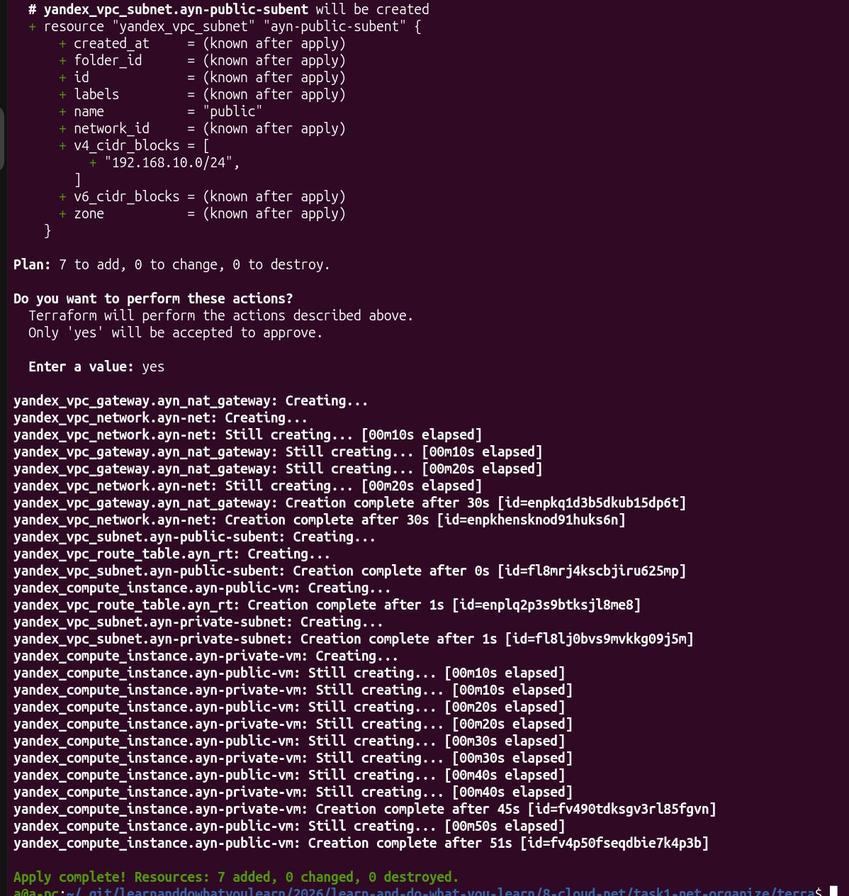
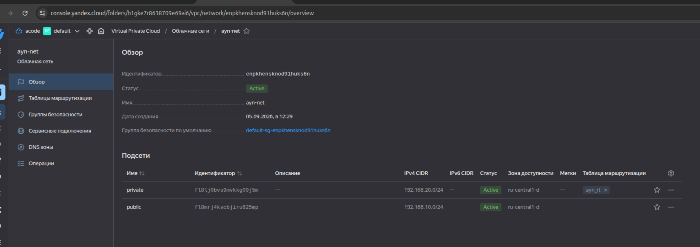
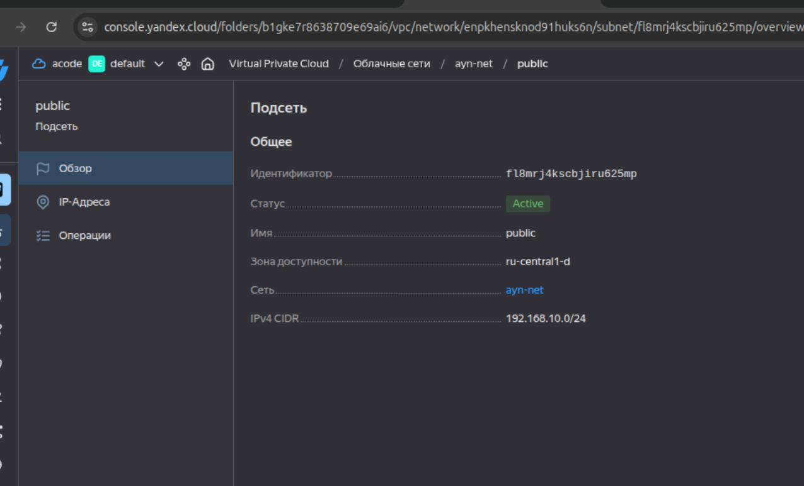
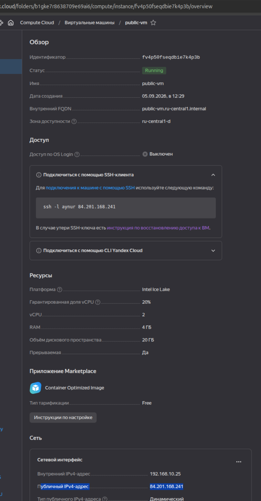
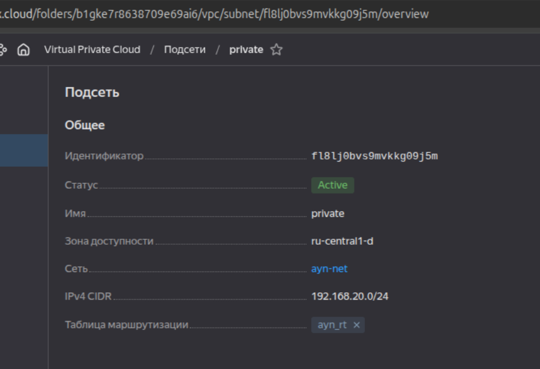
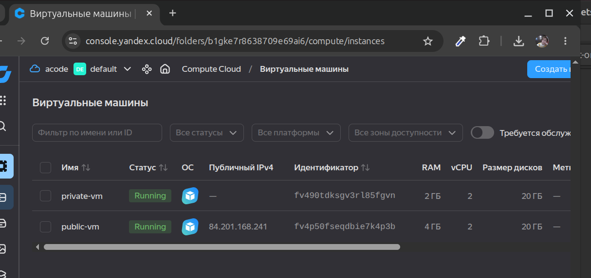
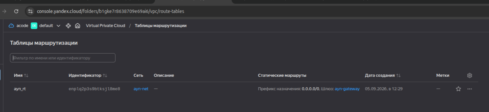
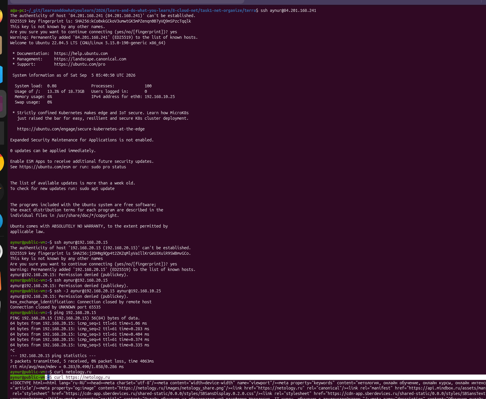
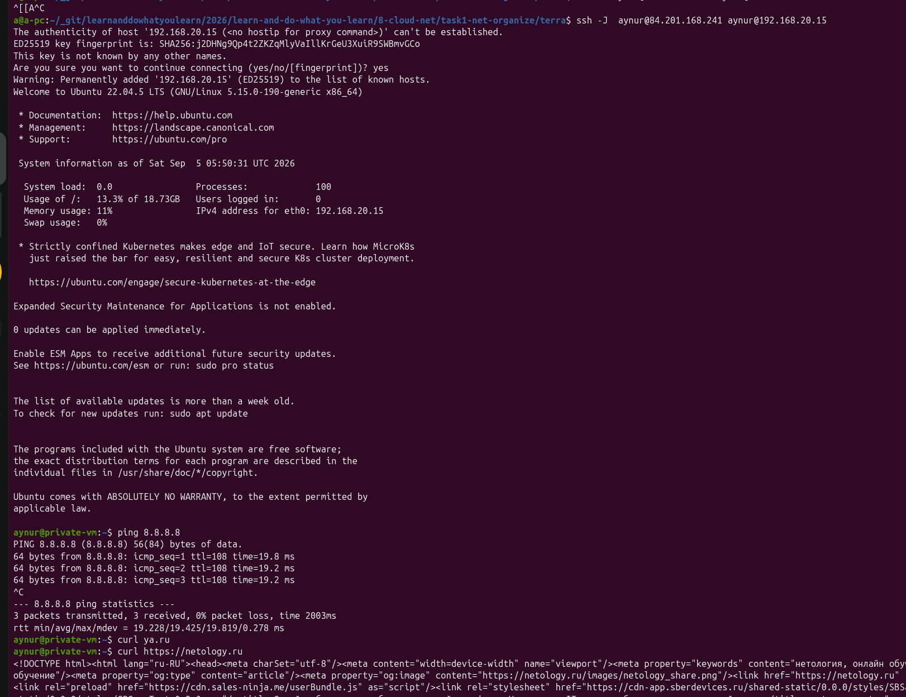

# [Домашнее задание к занятию «Организация сети»](https://github.com/netology-code/clopro-homeworks/blob/main/15.1.md)

## Задание 1. Yandex Cloud

* Создать пустую VPC. Выбрать зону.

* Публичная подсеть.

* Создать в VPC subnet с названием public, сетью 192.168.10.0/24.

* Создать в этой публичной подсети виртуалку с публичным IP, подключиться к ней и убедиться, что есть доступ к интернету.

* Приватная подсеть.

* Создать в VPC subnet с названием private, сетью 192.168.20.0/24.

* Создать route table. Добавить статический маршрут, направляющий весь исходящий трафик private сети в NAT-инстанс.

* Создать в этой приватной подсети виртуалку с внутренним IP, подключиться к ней через виртуалку, созданную ранее, и убедиться, что есть доступ к интернету.

