# [Домашнее задание к занятию «Вычислительные мощности. Балансировщики нагрузки»](https://github.com/netology-code/clopro-homeworks/blob/main/15.2.md)

# Задание 1. Yandex Cloud

Что нужно сделать

1. Создать бакет Object Storage и разместить в нём файл с картинкой:

* Создать бакет в Object Storage с произвольным именем (например, имя_студента_дата).
* Положить в бакет файл с картинкой.
* Сделать файл доступным из интернета.

2. Создать группу ВМ в public подсети фиксированного размера с шаблоном LAMP и веб-страницей, содержащей ссылку на картинку из бакета:

* Создать Instance Group с тремя ВМ и шаблоном LAMP. Для LAMP рекомендуется использовать image_id = fd827b91d99psvq5fjit.
* Для создания стартовой веб-страницы рекомендуется использовать раздел user_data в meta_data.
* Разместить в стартовой веб-странице шаблонной ВМ ссылку на картинку из бакета.
* Настроить проверку состояния ВМ.

3. Подключить группу к сетевому балансировщику:

* Создать сетевой балансировщик.
* Проверить работоспособность, удалив одну или несколько ВМ.

* (дополнительно)* Создать Application Load Balancer с использованием Instance group и проверкой состояния.

## Решение 

1) бакет создаётся здесь - [./terra/storage.tf](./terra/storage.tf)

и сразу туда кладу нужные файлы.

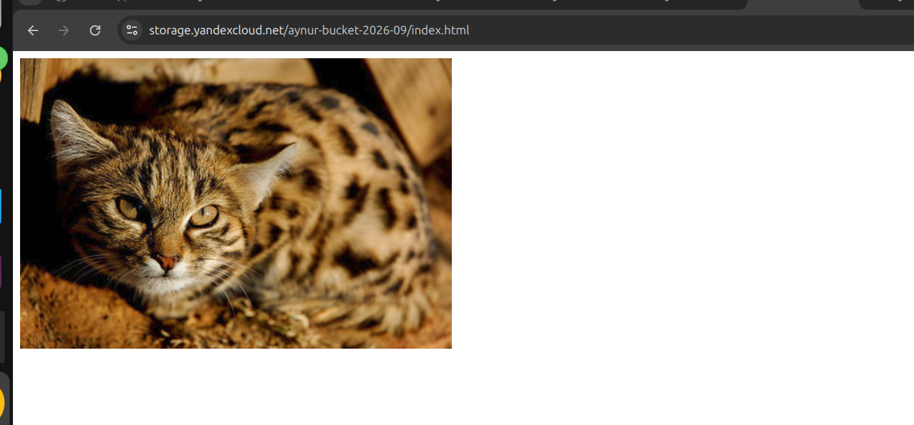

2)
Instance Group с тремя ВМ и шаблоном LAMP создаётся здесь - 

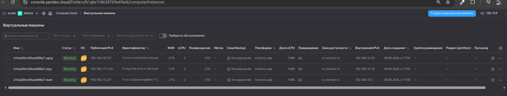
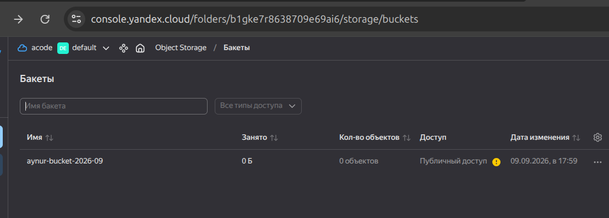
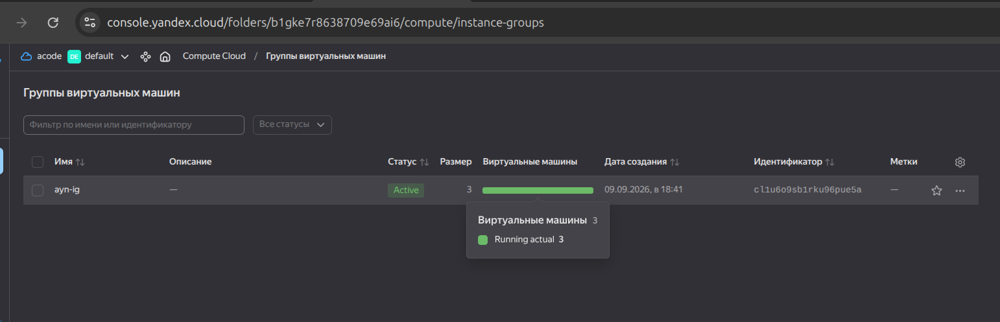

Стартовая страница находится в [./terra/config.yml](./terra/config.yml)

3) Сетевой балансировщик находится здесь - 
Балансировщик:

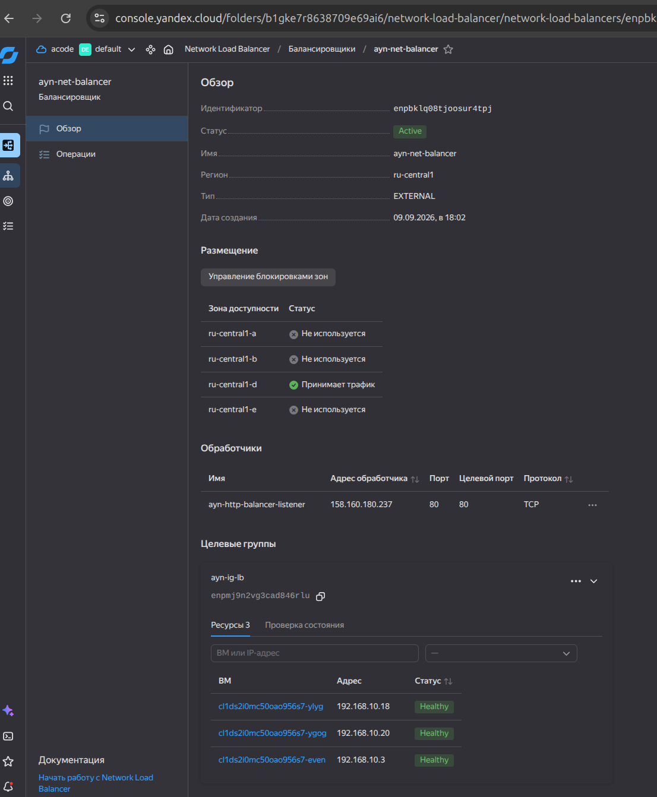
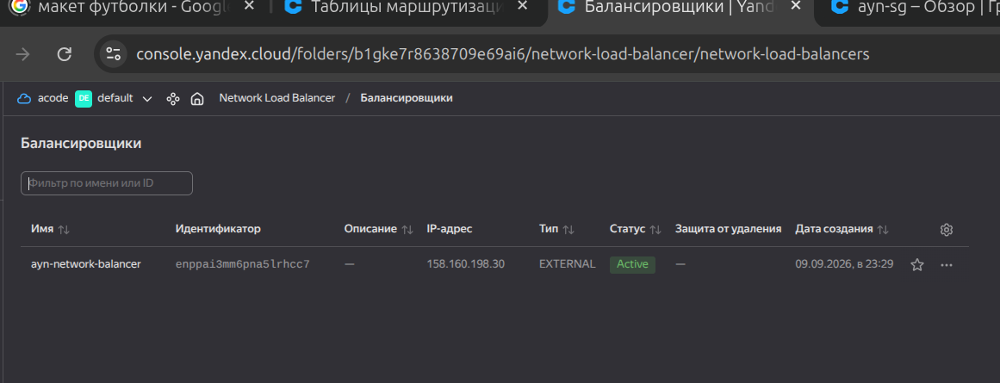

Целевая группа:

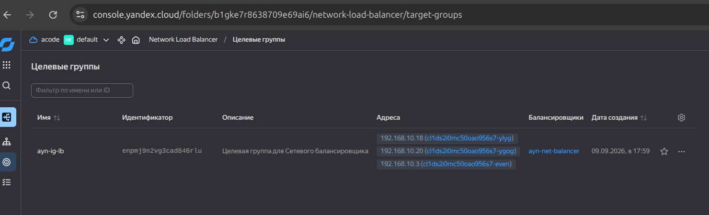

Проверяю работу балансировщика - удаляю ВМ:

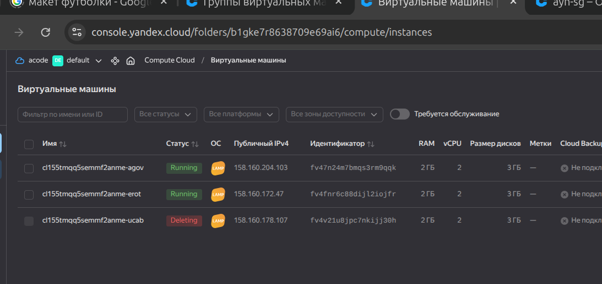

ВИжу, что балансировщик начал работать:

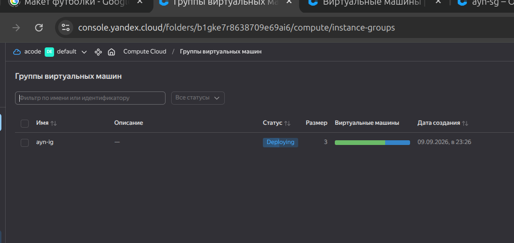

и появляется новая ВМ:

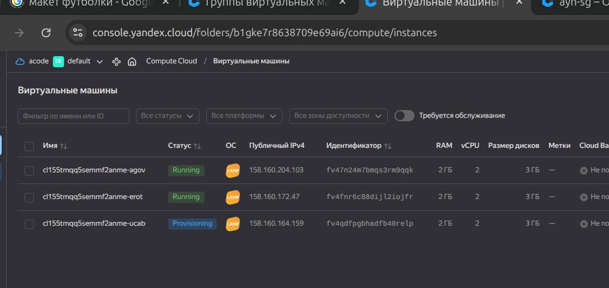

Иду по даресу балансировщика, и открываю страницу http://158.160.198.30/:

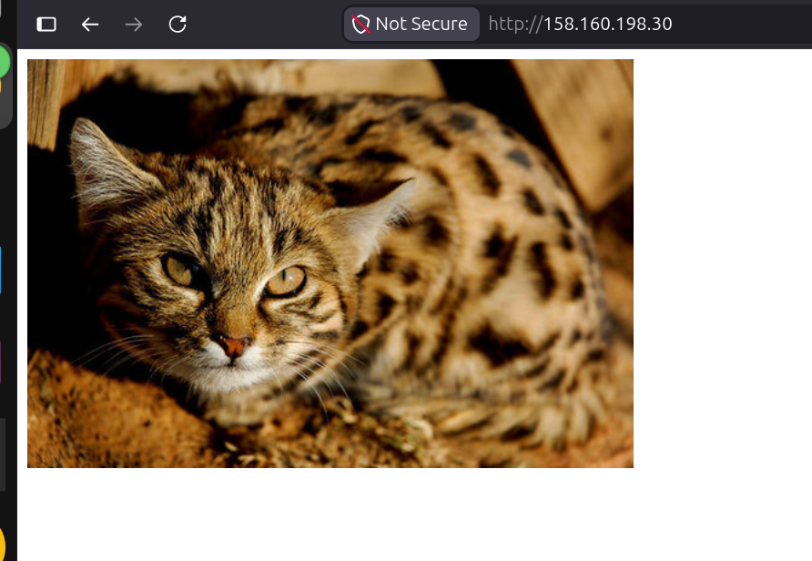
