# [Домашнее задание к занятию «Безопасность в облачных провайдерах»](https://github.com/netology-code/clopro-homeworks/blob/main/15.3.md)

## Задание 1. Yandex Cloud

1. С помощью ключа в KMS необходимо зашифровать содержимое бакета:

* создать ключ в KMS;
* с помощью ключа зашифровать содержимое бакета, созданного ранее.

2. (Выполняется не в Terraform)* Создать статический сайт в Object Storage c собственным публичным адресом и сделать доступным по HTTPS:

* создать сертификат;
* создать статическую страницу в Object Storage и применить сертификат HTTPS;
* в качестве результата предоставить скриншот на страницу с сертификатом в заголовке (замочек).

##Решение:

1. Ключ здесь - [./terra/kms.tf](./terra/kms.tf)
 
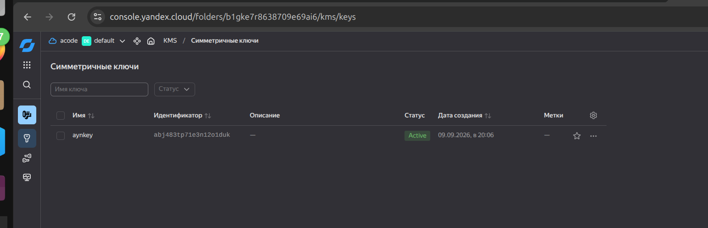
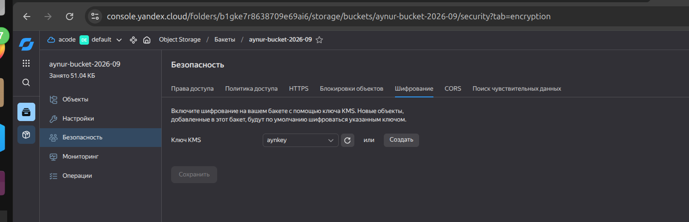
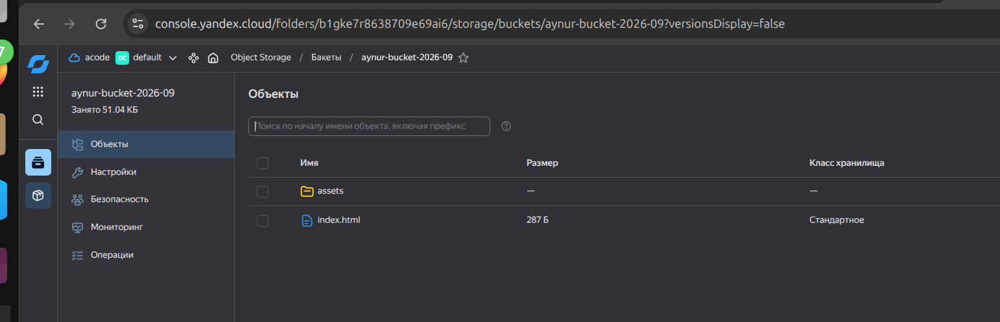

Зашифрованное фото в браузере:

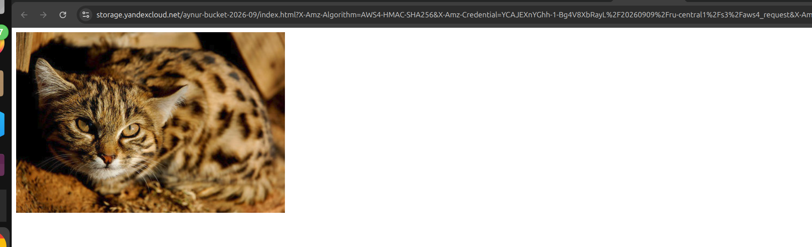 

2. Статический сайт

Мои DNS зоны:

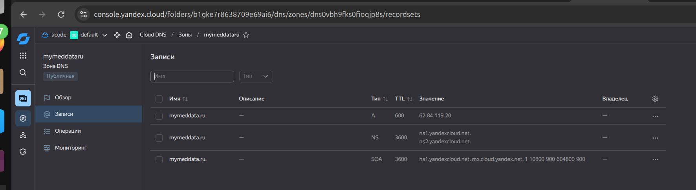 

Создала сертификат здесь [./terra/certificate.tf](./terra/certificate.tf). Возможно, когда писаловь задание, этот ресурс в ЯО не был ещё написан.

Посмотрела логи создания - ошибка:

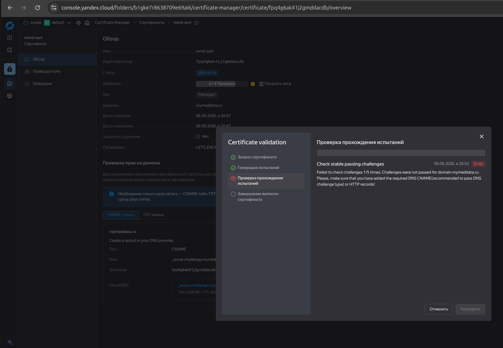 

Создала предлагаемый сертификат:

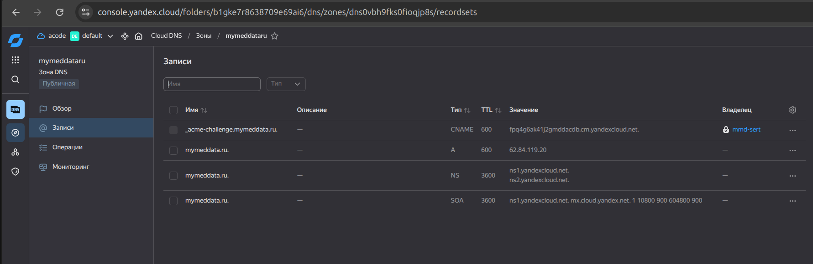 

Still pending:

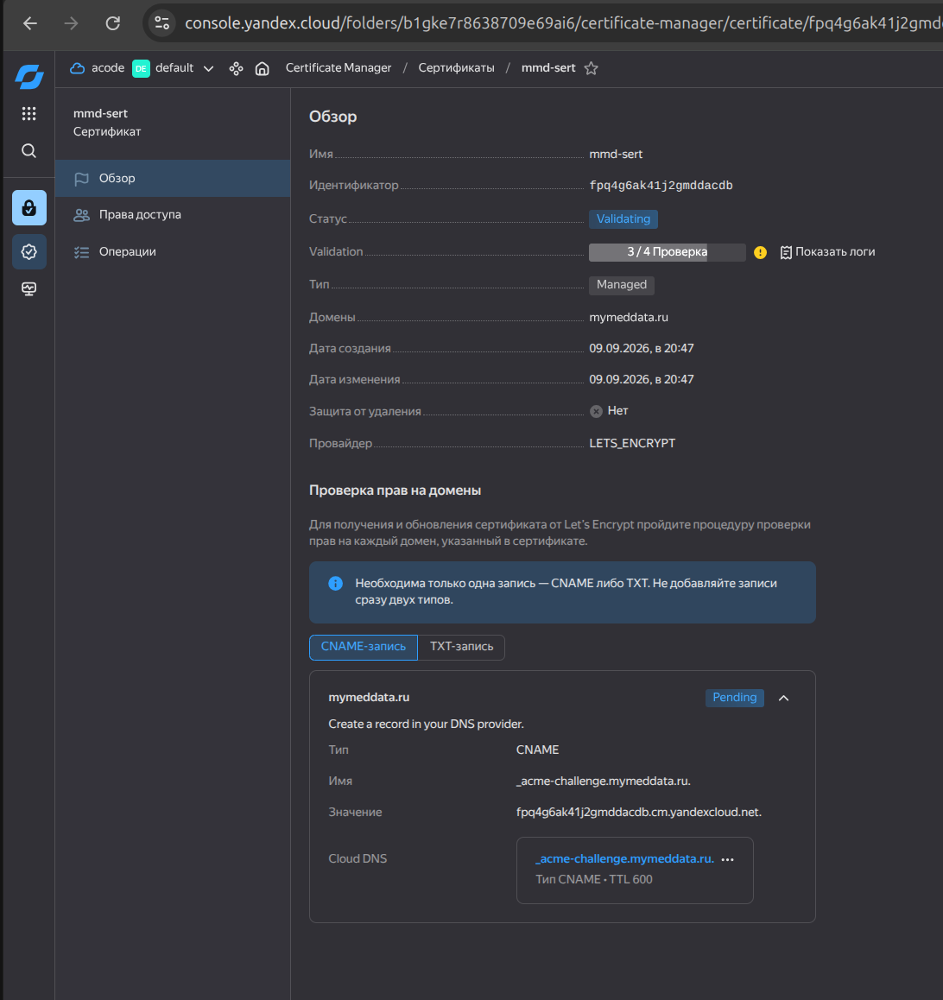 

Наконец валидно всё:

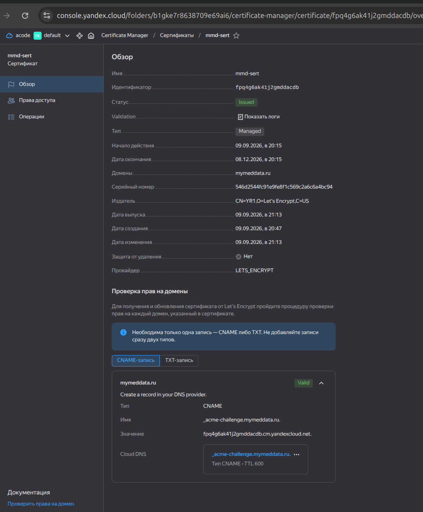

Создала бакет одноимённый с доменным именем - [./terra/kms.tf#L38](./terra/kms.tf#L38):

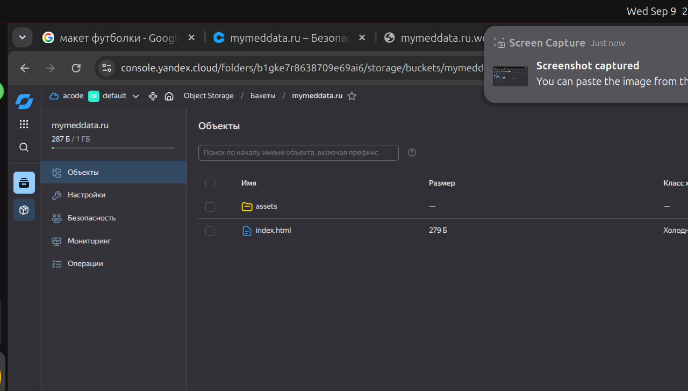

Приявязала сертификаты, которые прошли проверку:

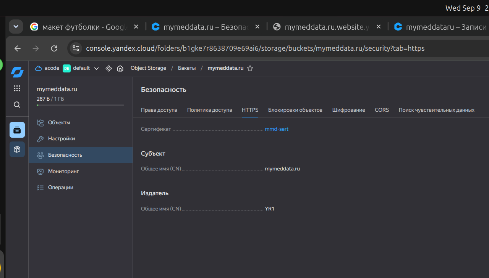

Поулчился сертифицированный сайт:

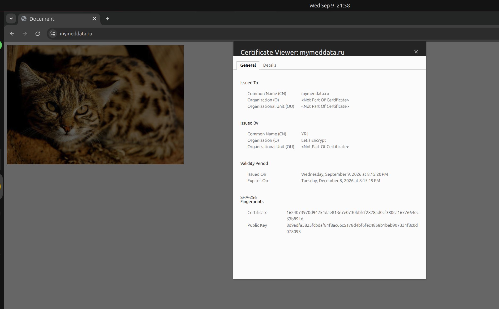

ДНС прописаны у моего хостера:

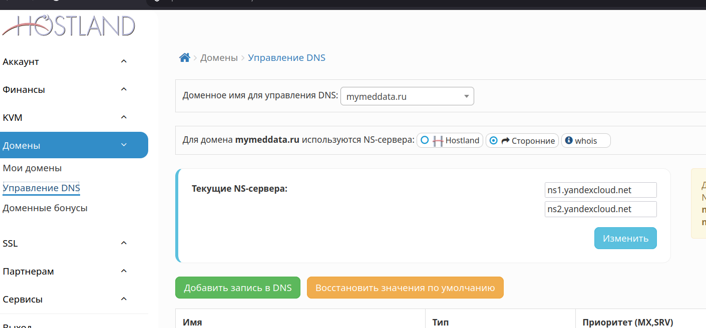
