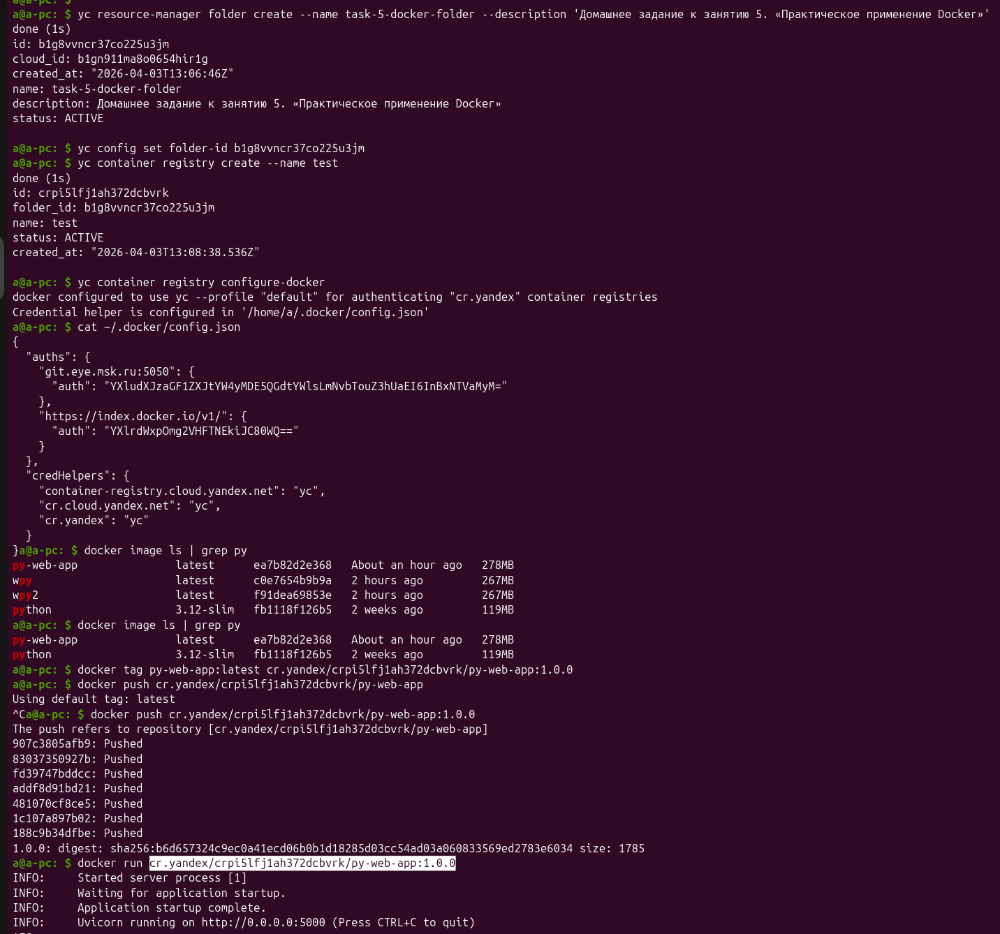
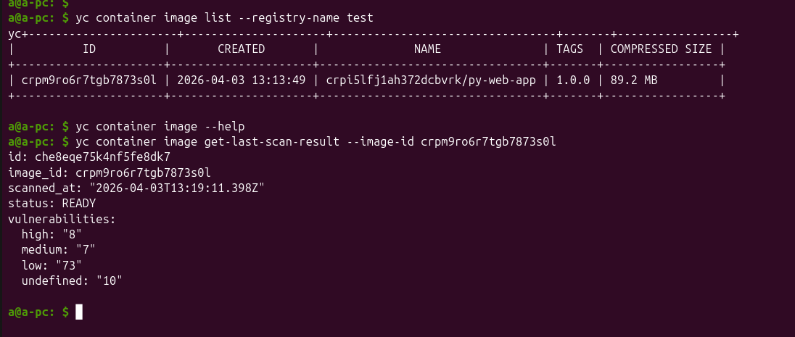
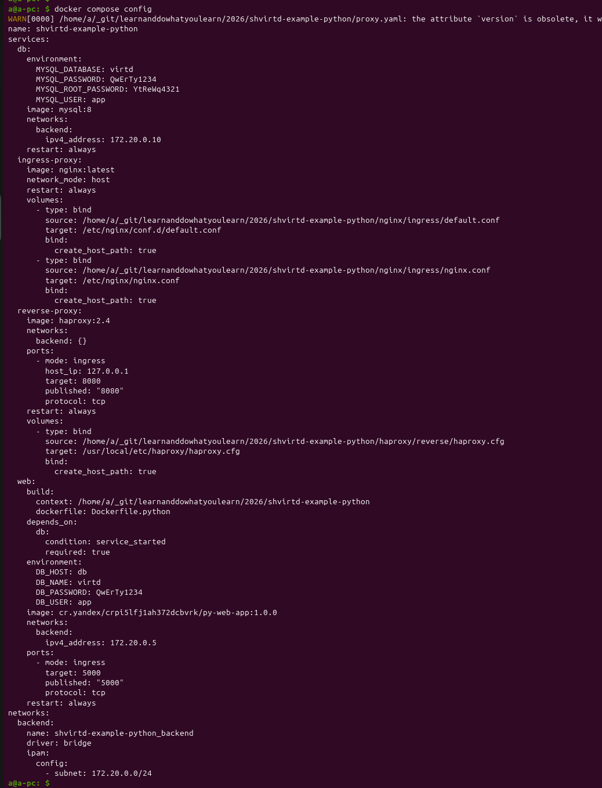
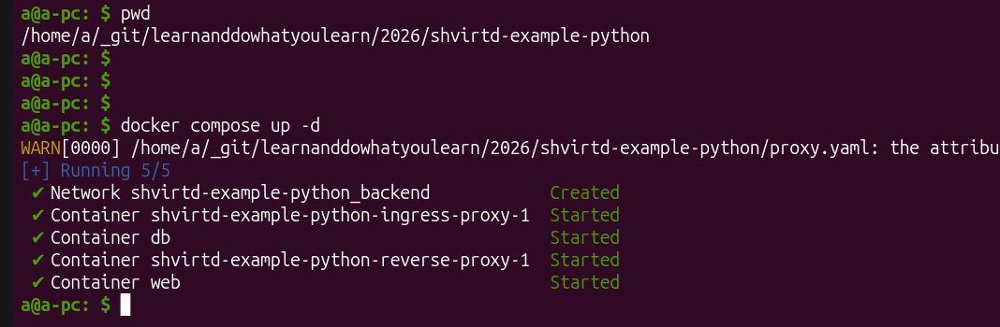
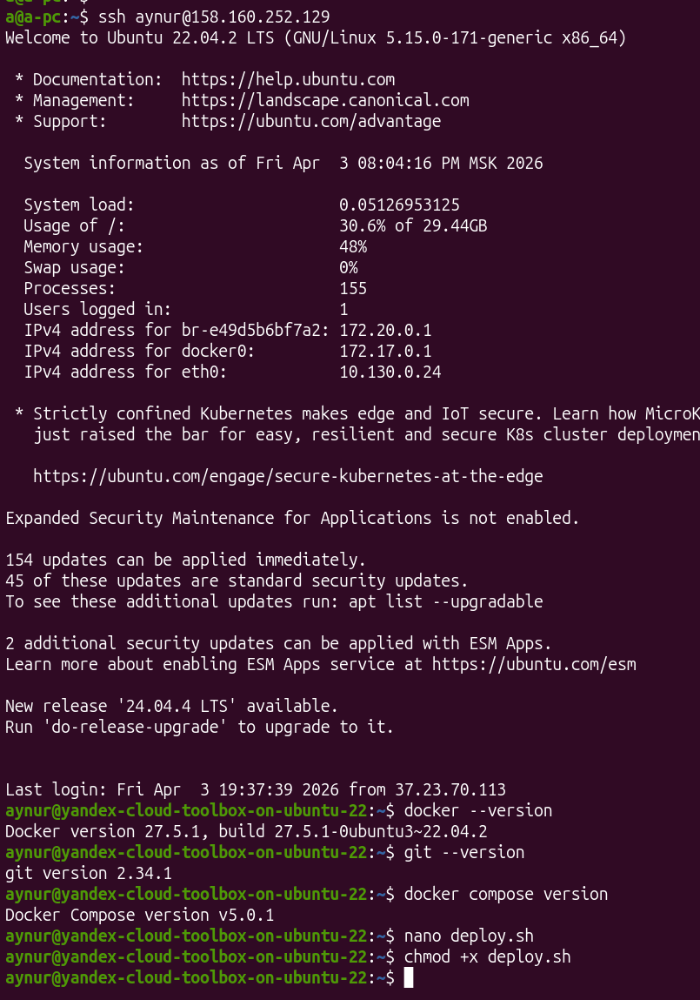
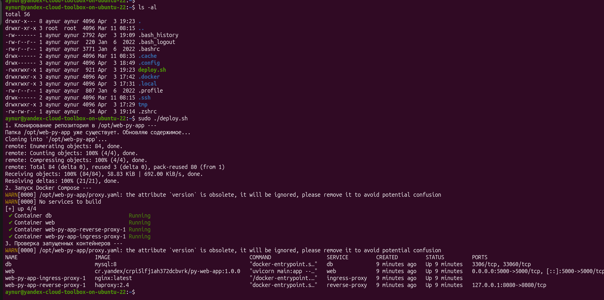
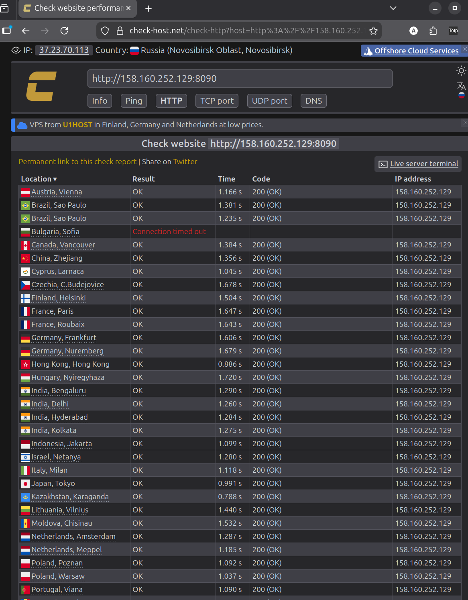
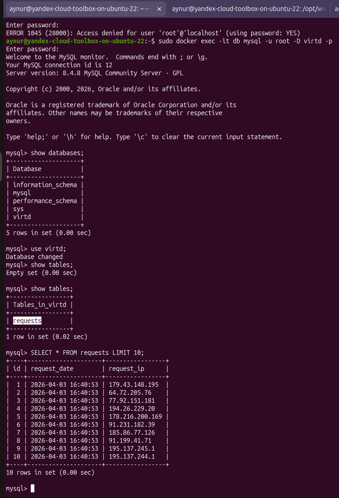
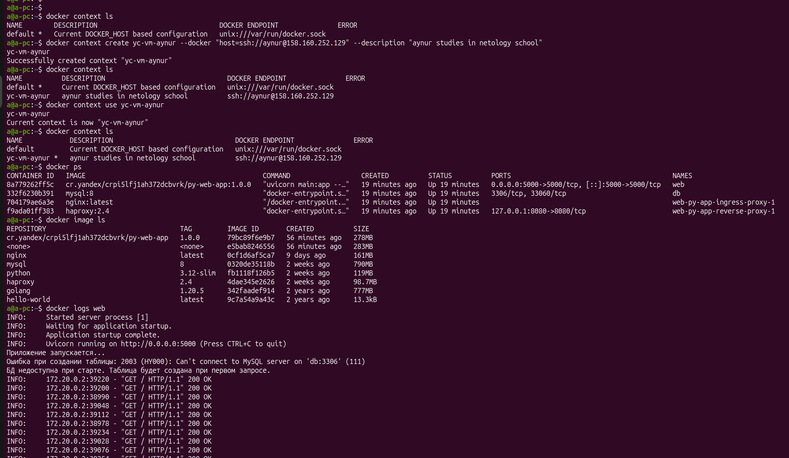

# Домашнее задание к занятию 5. «Практическое применение Docker»

## Задача 0


## Задача 1

[Dockerfile.python](https://github.com/aykuli/shvirtd-example-python/blob/main/Dockerfile.python)

```docker
# stage 1
FROM python:3.12-slim AS builder

#  Ваш код здесь #
WORKDIR /app
COPY . .
RUN pip install --no-cache-dir --prefix=/install -r requirements.txt

# stage 2
FROM python:3.12-slim
WORKDIR /app
COPY --from=builder /install /usr/local

EXPOSE 5000

# Запускаем приложение с помощью uvicorn, делая его доступным по сети
CMD ["uvicorn", "main:app", "--host", "0.0.0.0", "--port", "5000"] 
```
### Создание докер образа из файла Dockerfile.python


## Задача 2



Результат сканирования запуленного образа в консоли:



Посмотреть в web ui yandex cloud:


## Задача 3

1. Создание `compose.yml` файла

<details>
<summary>compose.yml</summary>

```yml

include:
  - proxy.yaml

services:
  web:
    image: cr.yandex/crpi5lfj1ah372dcbvrk/py-web-app:1.0.0
    build:
      context: .
      dockerfile: Dockerfile.python
    restart: always
    depends_on:
      - db
    ports:
      - 5000:5000
    environment:
      - DB_HOST=db
      - DB_USER=${MYSQL_USER}
      - DB_PASSWORD=${MYSQL_PASSWORD}
      - DB_NAME=${MYSQL_DATABASE}
    networks:
      backend:
        ipv4_address: 172.20.0.5

  db:
    image: mysql:8
    restart: always
    env_file:
      - .env
    networks:
      backend:
        ipv4_address: 172.20.0.10
```
</details>


`docker compose config`


2. Запуск сервисов



3. Подключение к локальной БД mysql


4. Остановка сервисов


## Задача 4

1. Моя машинка


2. Docker, git, compose на месте:



Добавила адрес ВМ как разрешённый в test registry in yc:


Пришлось делать ещё телодвижения, такие как:
* Docker compose всё никак не запускался. Оказалось root пользователь не знат про docker-compose плагин. Скопировала плагин от пользователя, под которым захожу в  `/usr/local/lib/`, и нанконец заработало.

```bash
sudo mkdir -p /usr/local/lib/docker/cli-plugins
sudo cp ~/.docker/cli-plugins/docker-compose /usr/local/lib/docker/cli-plugins/
```

* Почему-то не с первого раза завелась бд. Со второго - да. Так и не поняла, в чём было дело.

3. bash-скрипт запуска приложения:

see [deploy.sh](./deploy.sh)

Запуск deploy.sh скрипта:


4. Проверка http подключений к приложению через https://check-host.net/check-http

Куча запросов отовсюду - проверяю работу приложения и инфраструктуры:


Записи об этом в бд в табличке:


5. Docker remote ssh context



Можно даже внутрь контейнеров заходить н удлаённом сервере, так классно, эх кабы знать раньше:
